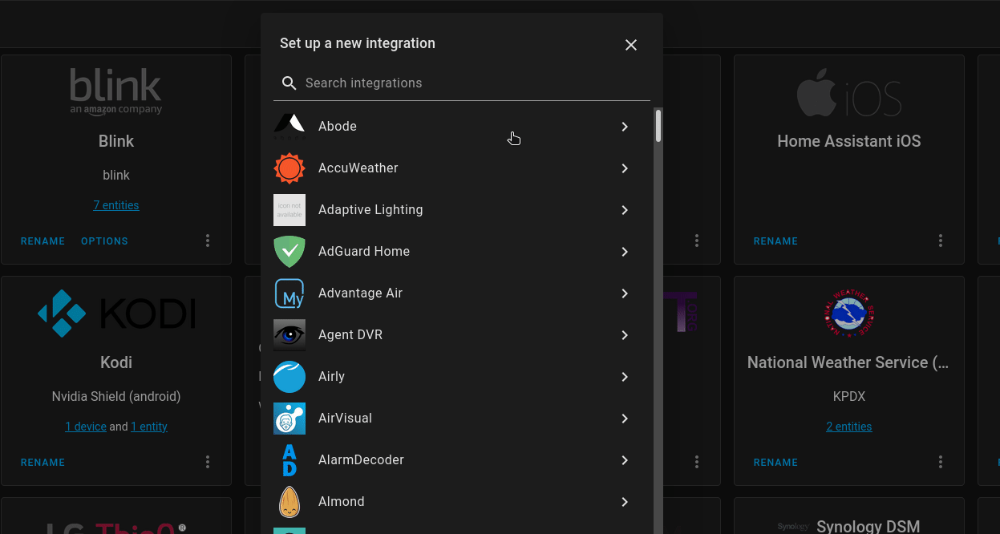

## 一、插件结构

### 1、`__init__.py`（必需）

- `__init__.py`：集成的主要文件。
- 它包含了继承的设置和初始化逻辑。
- HomeAssistant在加载集成时首先执行此文件中的代码。


### 2、`manifest.json` (必需)

- `manifest.json`：包含集成的元数据，比如作者、版本、所需的外部库等。
- 这是必需的，因为HomeAssistant使用这些信息来管理集成及其依赖。


### 3、`config_flow.py` (必需)

- 如果你的集成需要通过HomeAssistant的用户界面进行配置，那么这个文件是必需的。
- 它包含了处理配置流程的代码，使用户能够通过图形界面添加和配置集成。


### 4、`const.py` (可选)

- 定了继承中使用的常量，例如域名、配置选项的键名等。
- 虽然不是必需的，但推荐使用以增加代码的清晰度。


### 5、`sensor.py`、`light.py`、`switch.py` 等 (根据需要)

- 这些文件包含了处理特定设备或服务的逻辑。
- 文件的名称应该反映它们管理的设备类型（例如，`sensor` 对应传感器设备）


### 6、**`services.yaml`**（可选）

- 如果你的集成提供了自定义服务，这个文件用于描述这些服务及其参数，以供 Home Assistant 的前端使用。


### 7、**`.translations/`** (可选)

- 用于存放集成的翻译文件，支持多语言界面。


## 二、重点文件理解 - config_flow.py

### 1、如何开启config_flow配置？

- 在 `manifest.json` 中，将 `config_flow` key 设置为 `true` 。
- 这将让 HomeAssistant 知道可以通过配置 UI 添加此组件。

```
{
   "codeowners": ["@carrot"],
-  "config_flow": false,
+  "config_flow": true,
   "dependencies": [],
...
}
```


### 2、在 `config_flow.py` 中需要扩展哪个类？

- 在此文件中，我们将扩展该 ConfigFlow类，并定义用户**首次**设置组件时应显示在UI中的不同步骤。




### 3、如上图，用户点击添加按钮并选择 Github Custom集成时，将会自动调用什么方法？

- 将会调用 `Config_flow.py` 中的 `async_step_user` 方法


## 三、代码核心概念

> from homeassistant import config_entries, core
>
> 这句代码是在引入 Home Assistant开发框架中的一些特定模块


### 1、`config_entries` 模块主要是什么作用？

- `config_entries`：这个模块是用来处理集成的配置入口。
- 在HomeAssistant中，一个配置入口代表了一个实例化的集成配置。
- 这允许用户通过HomeAssistant的用户界面来添加、更新或删除集成，而不需要直接编辑配置文件。
- `config_entries`模块提供了一套API，使得开发者可以编程管理这些配置入口，例如自动化地添加新的设备或服务。


### 2、`core` 模块主要是什么作用？

- `core`：这个模块提供了HomeAssistant的核心功能，比如启动、停止事件循环、注册回调函数，以及访问HomeAssistant的状态机等。
- 它是构建HomeAssistant集成的基石，使得开发者可以访问和操作HomeAssistant的核心功能和状态信息。


## 3、`asyncio` 模块主要是什么作用？

- `asyncio` 是Python用于编写并发代码的库，特别适用于创建异步应用程序。
- 在 HomeAssistant的环境中，几乎所有的操作和集成都是基于异步和事件循环的，这样可以提高效率，使得同时处理成千上万个连接成为可能，不会阻塞主线程。
- 在 HomeAssistant 插件开发中，你会使用 `asyncio` 来编写异步函数，这些函数通常以`async def` 关键字开始。这允许你的插件在等待外部数据（例如，从互联网的API获取数据）时，让出控制权，以便HomeAssistant可以继续处理其他任务。


