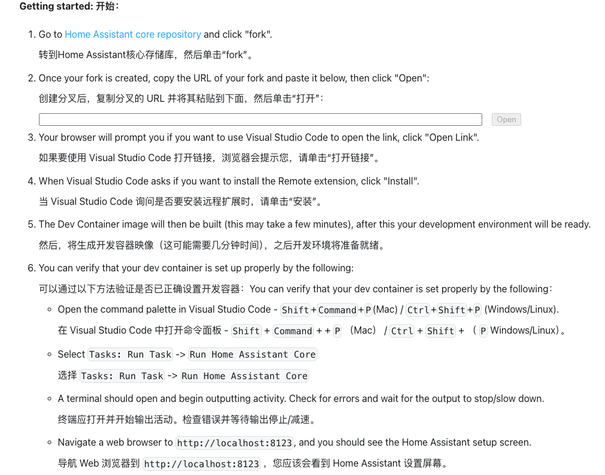
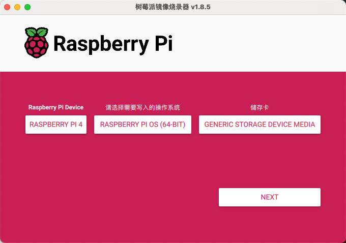
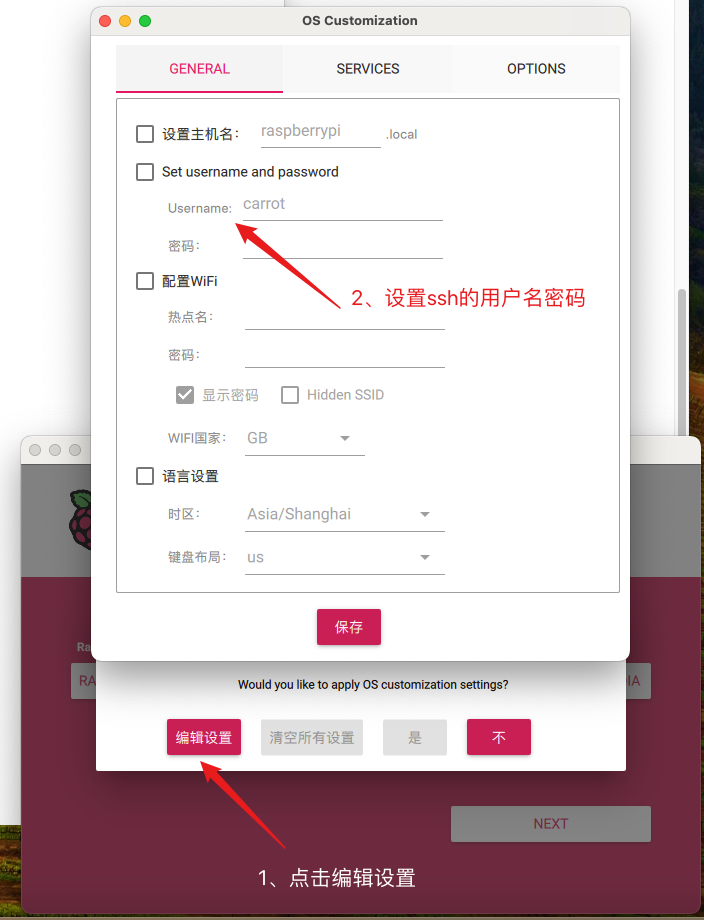
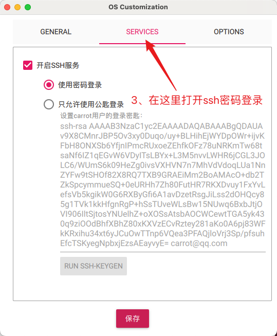
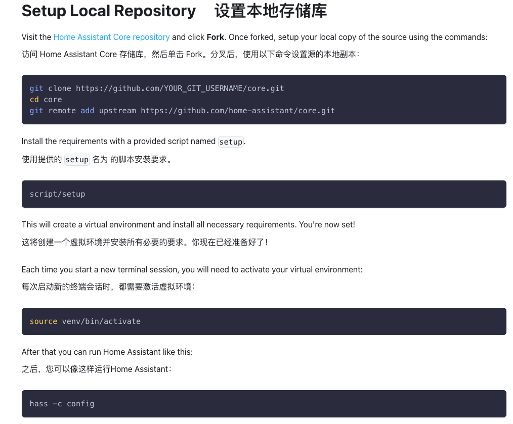

> 背景：由于公司是属于智能家居行业，需要给HomeAssistant开发一款插件，以供用户使用，从而实现跨平台智能产品的联动。
>
> 试错体验：一切以官方文档为主（HA更新太快了，很多博客都过时了）
>
> 重要前提：要有一个良好的**网络**情况

- 树莓派官网：https://www.raspberrypi.com/software/
- HomeAssistant官网：https://developers.home-assistant.io/docs/development_environment

## 一、Mac上搭建HomeAssistant的开发环境

> 参考官方链接：https://developers.home-assistant.io/docs/development_environment
>
> 使用 Visual Studio Code + devcontainer 进行开发，搭建非常简单。
>
> **缺点：存在docker上的HA使用UDP广播的时候，无法广播出来。**

## 二、树莓派上搭建HomeAssistant的开发环境

> HA有提供HAOS，是一套专门为HomeAssistant设计的HA系统镜像，如果是普通用户，用这个镜像安装是最方便的。
>
> 但是我需要调试插件，这种方式就不适合了。
>
> **开发环境：独立的Linux系统 + HA的core代码安装。**

#### 1、给树莓派安装系统

- 下载树莓派镜像烧录器：https://www.raspberrypi.com/software/
- 电脑插入MacroSD卡，打开烧录器，选择对应的版本信息，进行系统镜像烧录

- 注意需要配置SSH的用户名、密码、并且打开SSH功能

- 烧录完成，给树莓派插入SD卡，插上网线，从路由器上获取树莓派的ip地址，就可以通过ssh控制树莓派了。

## 2、给树莓派安装HA的core代码

> https://developers.home-assistant.io/docs/development_environment

- 可以发现安装的树莓派系统，python3和git都很新，符合安装HA的调节。

- 按照下面的流程，即可完成HA的开发环境安装。（网络一定要好）

## 3、给树莓派的HA植入自定义组件

- 通过ssh找到树莓派上的 `core/homeassistant/components` 目录，直接把自定义组件丢进去。
- 然后进入 `core/homeassistant/generated` 目录，配置 `config_flows.py` 和 `integrations.json` ，告诉HA我添加了自定义组件，启动的时候，需要帮我载入。
- 重启HA，就可以在HA中找到自定义组件了。

