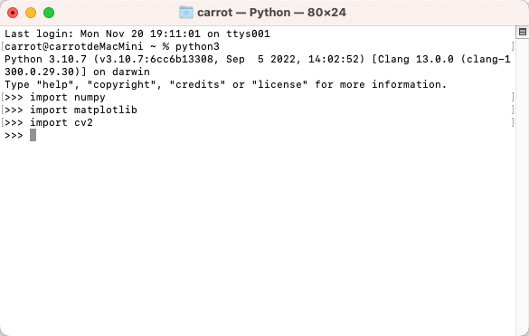
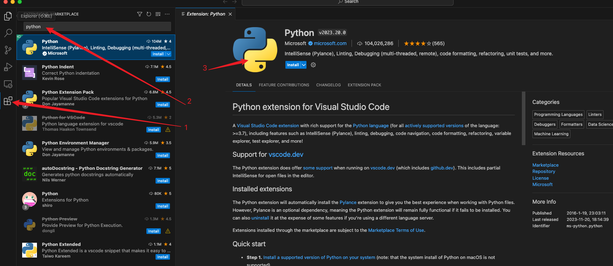
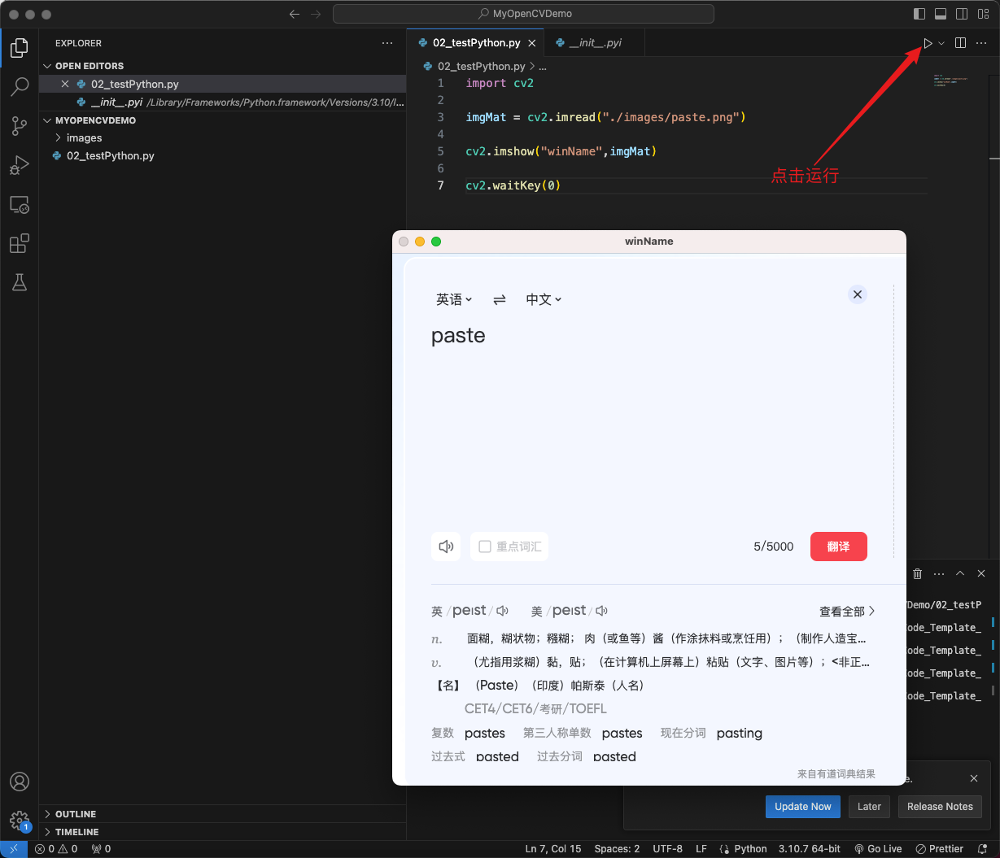

## 2-1、Mac上搭建OpenCV环境

```bash
brew install python@3.9
pip3 install numpy matplotlib opencv_python
```

- 问：如何验证 `python3` 安装是否成功呢？
- 答：输入 `python3` 能进入 python 指令模式即为成功。
- 问：如何验证 `numpy matplotlib opencv_python` 是否安装成功呢？
- 答：进入python模式后，分别输入 `import numpy`、`import matplotlib`、`import cv2` 不会报错，即安装成功。





## 2-2、VSCode搭建python环境

- 在VSCode上查找并安装下图的 python 插件



- 编写如下代码，调用OpenCV读取本地图片并进行展示

```python
import cv2

imgMat = cv2.imread("./images/paste.png")

cv2.imshow("winName",imgMat)

cv2.waitKey(0)
```

- 能得到下图效果即证明vscode也能正常编写相关代码了


