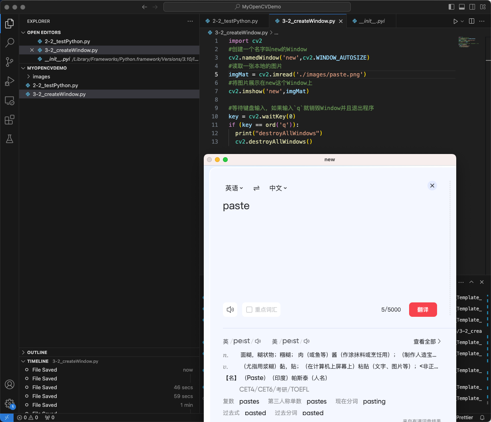
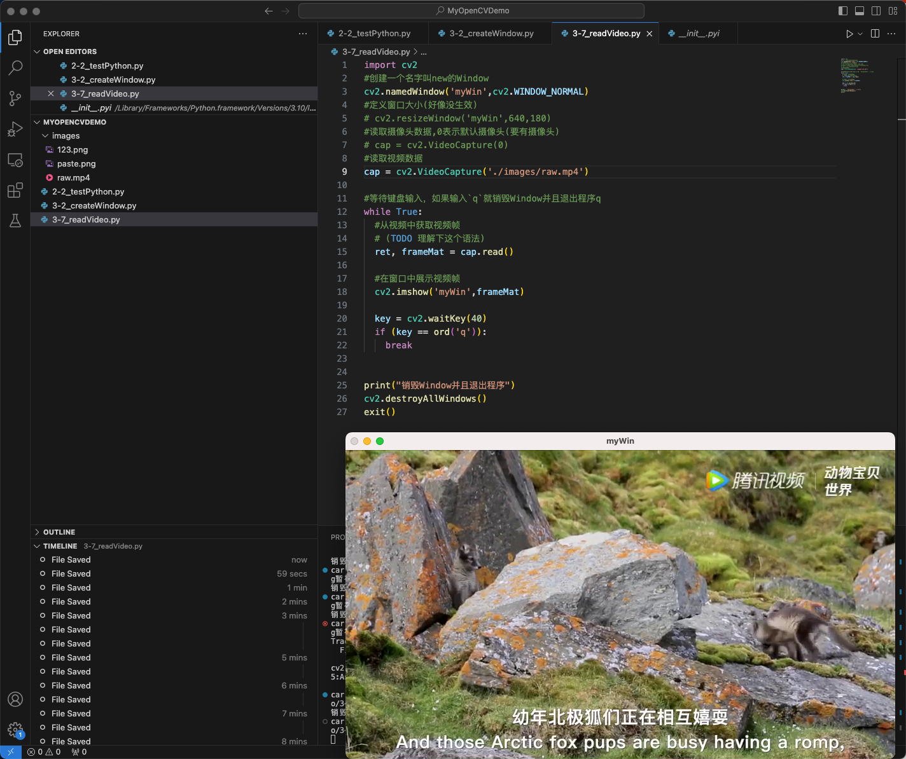
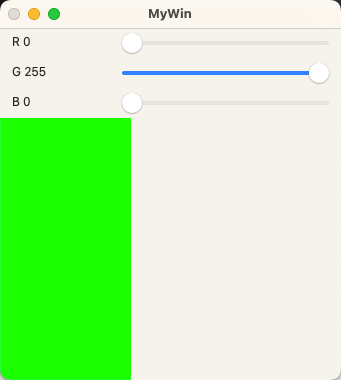

## 3-2、如何通过OpenCV创建显示窗口、读取图片、保存图片

```python
import cv2
#创建一个名字叫new的Window
cv2.namedWindow('new',cv2.WINDOW_AUTOSIZE)
#读取一张本地的图片
imgMat = cv2.imread('./images/paste.png')
#将图片展示在new这个Window上
cv2.imshow('new',imgMat)

#等待键盘输入，如果输入`q`就销毁Window并且退出程序
while True:
  key = cv2.waitKey(0)
  if (key == ord('q')):
    print("销毁Window并且退出程序")
    cv2.destroyAllWindows()
    exit()
  elif (key == ord('s')):
    print("借助OpenCV进行-保存图片")
    cv2.imwrite('./images/123.png', imgMat)
  else:
    print("非法输入")
```




## 3-7、如何通过OpenCV获取摄像头、本地视频的数据

 ```python
 import cv2
 #创建一个名字叫new的Window
 cv2.namedWindow('new',cv2.WINDOW_NORMAL)
 #定义窗口大小(好像没生效)
 # cv2.resizeWindow('myWin',640,180)
 #读取摄像头数据,0表示默认摄像头(要有摄像头)
 # cap = cv2.VideoCapture(0)
 #读取视频数据
 cap = cv2.VideoCapture('./images/raw.mp4')
 
 #等待键盘输入，如果输入`q`就销毁Window并且退出程序
 while True:
   #从视频中获取视频帧
   # (TODO 理解下这个语法)
   ret, frameMat = cap.read()
 
   #在窗口中展示视频帧
   cv2.imshow('myWin',frameMat)
 
   key = cv2.waitKey(40)
   if (key == ord('q')):
     break
 
 #释放videoCapture
 cap.release()
 print("销毁Window并且退出程序")
 cv2.destroyAllWindows()
 exit()
 ```





- #定义窗口大小(好像没生效)
- 因为调用 `cv2.imshow('myWin',frameMat)` 会让窗口大小根据图片重新布局，所以在imshow之后，需要再次调用 `cv2.resizeWindow('myWin',640,180)`

## 3-8、如何通过OpenCV将视频数据录制成多媒体文件

```python
import cv2

#创建视频录制的句柄
fourcc = cv2.VideoWriter_fourcc(*'mp4v')
videoWriter = cv2.VideoWriter('./images/out.mp4',fourcc,25,(864,486))


#创建一个名字叫new的Window
cv2.namedWindow('myWin',cv2.WINDOW_NORMAL)
#读取摄像头数据,0表示默认摄像头(要有摄像头)
# cap = cv2.VideoCapture(0)
#读取视频数据
cap = cv2.VideoCapture('./images/raw.mp4')

#等待键盘输入，如果输入`q`就销毁Window并且退出程序q
while True:
  #从视频中获取视频帧
  # (TODO 理解下这个语法)
  ret, frameMat = cap.read()

  #在窗口中展示视频帧
  cv2.imshow('myWin',frameMat)
  #定义窗口大小(在imshow后面才能生效)
  cv2.resizeWindow('myWin',640,180)

  #写数据到多媒体文件中
  videoWriter.write(frameMat)

  key = cv2.waitKey(40)
  if (key == ord('q')):
    break

#释放videoCapture
cap.release()
#释放VideoWriter
videoWriter.release()
print("销毁Window并且退出程序")
cv2.destroyAllWindows()
exit()
```

- ` cv2.VideoWriter` 函数解析
- 参数一：输出文件
- 参数二：多媒体文件格式  `cv2.VideoWriter_fourcc`
- 参数三：帧率
- 参数四：分辨率大小
- **注意：**VideoWriter函数里面的分辨率，需要与视频实际分辨率一致，否则可能导致录制的视频格式错误。


## 3-9、代码优化

- 需要使用 `isOpened()` 判断摄像头是否已经打开
- `cap.read()` 函数返回元组 ret, frame ，需要通过ret判断视频数据是否成功获取到了。


## 3-10、鼠标事件监听

```python
import cv2
import numpy as np

MyWinName = 'MyWin'

#定义回调函数
def mouseCallback(event, x, y, flags, userdata):
  print(event, x, y, flags, userdata)

#创建窗口
cv2.namedWindow(MyWinName,cv2.WINDOW_NORMAL)
cv2.resizeWindow(MyWinName,200,100)

#设置鼠标回调
cv2.setMouseCallback(MyWinName,mouseCallback, "123")

#显示窗口
img = np.zeros((100,200,3), np.uint8)

while True:
  cv2.imshow(MyWinName, img)
  key = cv2.waitKey(10)
  if key == ord('q'):
    break

cv2.destroyAllWindows()
```

- mouseCallback 函数参数解析
- event：鼠标移动、按下左键
- x,y：鼠标坐标
- flags：鼠标键以及组合键


## 3-11、TrackBar 控件（实现一个调色板）

```python
import cv2
import numpy as np

MyWinName = 'MyWin'

def callback(v):
  print(v)

#创建窗口
cv2.namedWindow(MyWinName,cv2.WINDOW_NORMAL)
cv2.resizeWindow(MyWinName, 200, 200)

#创建trackbar
cv2.createTrackbar('R', MyWinName,0,255,callback)
cv2.createTrackbar('G', MyWinName,0,255,callback)
cv2.createTrackbar('B', MyWinName,0,255,callback)

img = np.zeros((200,100,3), np.uint8)

while True:
  R = cv2.getTrackbarPos('R', MyWinName)
  G = cv2.getTrackbarPos('G', MyWinName)
  B = cv2.getTrackbarPos('B', MyWinName)

  img[:] = [B, G, R]
  cv2.imshow(MyWinName, img)
  
  key = cv2.waitKey(10)
  if key == ord('q'):
    break

cv2.destroyAllWindows()

```

- cv2.createTrackbar() 函数参数
- 第一个参数是滑动条的名字
- 第二个参数是滑动条被放置的窗口的名字，
- 第三个参数是滑动条默认值，
- 第四个参数时滑动条的最大值，
- 第五个参数时回调函数，每次滑动都会调用回调函数。




## 3-12、`img[:] = [B, G, R]` 切片语法

- 参考文章：https://zhuanlan.zhihu.com/p/134585484

```python
object[start_index : end_index : step]

start_index：切片的起始位置（包括该位置）
end_index：切片的结束位置(！！！且不包括该位置)
step，表示步长。可取正负数，正数表示从左往右，负数表示从右往左。缺省时取1
```


```python
a= [9,2,8,7,4,5,1,5,6,8]
print(a[:]) # [9,2,8,7,4,5,1,5,6,8]

a[3:5] = ['hello','world']  #序列变为[9, 2, 8, 'hello', 'world', 5, 1, 5, 6, 8]
```


