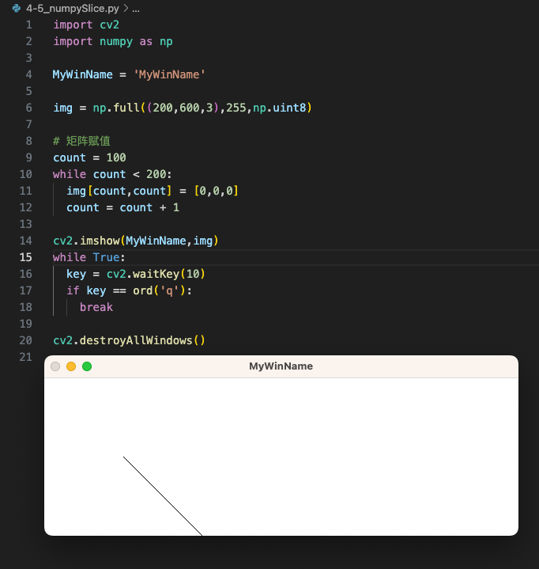
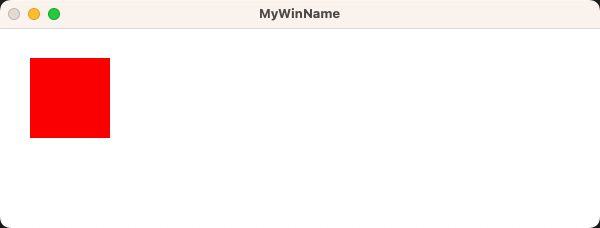
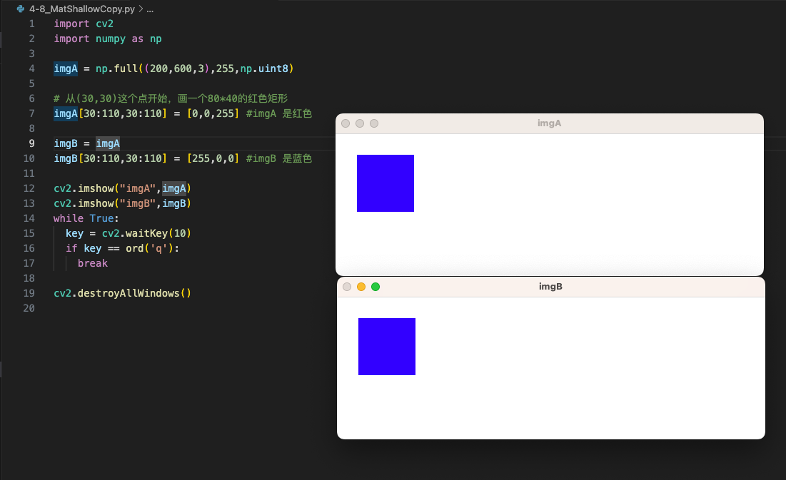
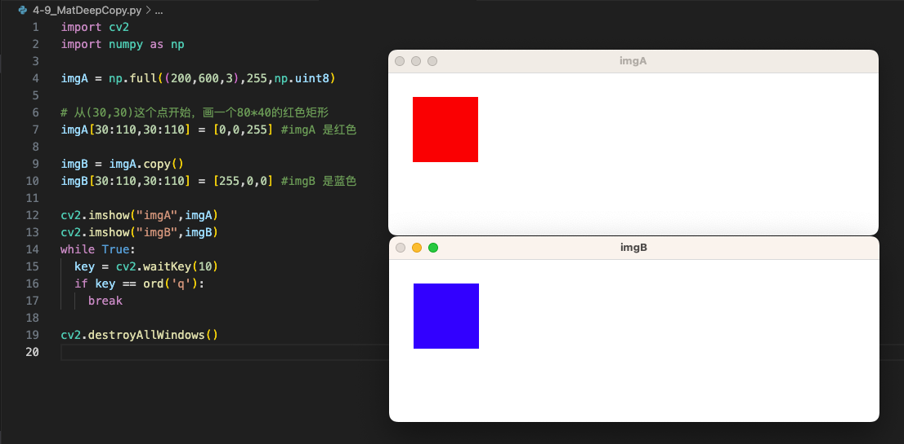
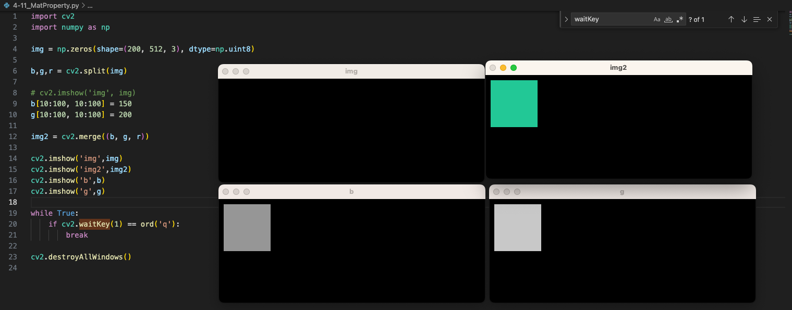

## 4-1、常见的色彩空间表示方法

- **RGB：**人眼的色彩空间
- **BGR：**OpenCV**默认使用的色彩空间**，因为BGR是Windows位图文件的默认颜色顺序
- **HSV**/HSB/HSL：OpenCV中只用到**HSV - Hue(色调、色相) Saturation(饱和度、色彩纯净度) Value(明度)**
- **YUV：**常用于视频编解码中


## 4-2、为什么图像处理通常使用HSV色彩空间

> **RGB颜色空间**：是图像处理中最基本、最常用、面向硬件的颜色空间，最容易理解。
>
> **RGB的局限性**：RGB颜色空间利用颜色三个分量的线性组合来表示颜色，任何颜色都与这三个分量有关系，而且这三个分量是高度相关的，所以连续变化颜色时并不直观。自然环境下获取的图像容易受自然光照、遮挡和阴影等情况的影响，即对亮度比较敏感。而RGB颜色空间的三个分量都与亮度密切相关，即只要亮度改变，三个分量都会随之相应地改变，而没有一种更直观的方式来表达。**所以RTB颜色空间适合于显示系统，却并不适合于图像系统。**


> **HSV颜色空间：**在图像处理中使用比较多的是HSV颜色空间，比RGB更容易跟踪某种颜色的物体，常用于分割指定颜色的物理。


## 4-3、实战OpenCV色彩空间转换

```python
import cv2
import numpy as np

MyWinName = 'MyWin'

def callback(v):
  print(v)

#创建窗口
cv2.namedWindow(MyWinName,cv2.WINDOW_NORMAL)
cv2.resizeWindow(MyWinName, 200, 200)

#创建trackbar
colorspaces = [cv2.COLOR_BGR2RGBA, cv2.COLOR_BGR2GRAY, cv2.COLOR_BGR2HSV_FULL,cv2.COLOR_BGR2YUV]
cv2.createTrackbar('colorBar', MyWinName,0,len(colorspaces) - 1,callback)

img = cv2.imread('./images/lenna.png')

while True:
  colorIndex = cv2.getTrackbarPos('colorBar', MyWinName)

  #颜色空间转换API
  cvt_img = cv2.cvtColor(img, colorspaces[colorIndex])
  cv2.imshow(MyWinName, cvt_img)
  cv2.resizeWindow(MyWinName, 200, 200)
  
  key = cv2.waitKey(10)
  if key == ord('q'):
    break

cv2.destroyAllWindows()

```

## 4-4、图像操作的基石 Numpy，常用的矩阵创建方式

- OpenCV 中用到的矩阵都要转换成 Numpy 数组
- Numpy 是一个经过高度优化的 Python 数值库

```python
import cv2
import numpy as np
c0 = np.zeros((2,4,3),np.uint8) #全0矩阵
c1 = np.ones((2,4,3),np.uint8)  #全1矩阵
c2 = np.full((2,4,3),255,np.uint8)   #自定义值都是'255'的矩阵
c3 = np.identity(5)   #对角线为1的，其他为0，5x5矩阵（正方形）
c4 = np.eye(3,5,k=1)   #从x=1的位置开始对角线为1的，其他为0，5x5矩阵
print(c4)
```


## 4-5、numpy矩阵的检索与赋值

- 实现画一个斜线

```python
import cv2
import numpy as np

MyWinName = 'MyWinName'

img = np.full((200,600,3),255,np.uint8)

# 矩阵赋值
count = 100
while count < 200:
  img[count,count] = [0,0,0]
  count = count + 1

cv2.imshow(MyWinName,img)
while True:
  key = cv2.waitKey(10)
  if key == ord('q'):
    break

cv2.destroyAllWindows()
```




## 4-6、numpy获取子矩阵ROI

- **ROI：Range Of Image**
- 从(30,30)这个点开始，画一个80*40的红色矩形

```python
import cv2
import numpy as np

MyWinName = 'MyWinName'

img = np.full((200,600,3),255,np.uint8)

# 从(30,30)这个点开始，画一个80*40的红色矩形
img[30:110,30:110] = [0,0,255]

cv2.imshow(MyWinName,img)
while True:
  key = cv2.waitKey(10)
  if key == ord('q'):
    break

cv2.destroyAllWindows()
```




## 4-7、OpenCV重要结构体Mat

- **Mat其实就是一个矩阵**，主要属性如下：
- **dims：**维度
- **rows：**行数
- **cols：**列数
- **depth：**像素的位深度
- **channels：**通道数，RBG是3
- **size：**矩阵大小
- **type：**是几个关键参数的集合 dep+dt+chs CV_8UC3
- **data：**存放的数据


## 4-8、Mat的深拷贝和浅拷贝

- `浅拷贝`：只拷贝了Mat的Header部分，共享了data指针指向的数据。【基本所有语言的默认拷贝都是浅拷贝】
- `深拷贝`：拷贝了Mat的Header和data部分，两个对象相互不影响。【深拷贝需要显示调用某些指定函数】

```
cv::Mat:clone()
cv::Mat::copyTo()
xxx.copy()
```

## 4-9、思考如何验证是深拷贝还是浅拷贝呢？

- 浅拷贝：改变B，但是A也受到影响了。



- 深拷贝：B的改变，不会影响A




## 4-11、Mat常用的属性

- Image.shape
- Image.size
- Image.dtype
- 发现在vscode中，`紫色立方体`：方法(function)，`扳手`：对象的属性(Property)。

```python
import cv2
import numpy as np

imgA = cv2.imread("./images/lenna.png")

#shapre属性中包括了三个信息
#高度、长度、通道数
print(imgA.shape) #(512, 512, 3)

#图像占用多大空间
#size = 高度 * 宽度 * 通道数
print(imgA.size) #786432

#图像中每个元素的位深度
print(imgA.dtype) #uint8

imgA.copy
```


## 4-12、通道的分割与合并

```python
import cv2
import numpy as np

img = np.zeros(shape=(200, 512, 3), dtype=np.uint8)

b,g,r = cv2.split(img)

# cv2.imshow('img', img)
b[10:100, 10:100] = 150
g[10:100, 10:100] = 200

img2 = cv2.merge((b, g, r))

cv2.imshow('img',img)
cv2.imshow('img2',img2)
cv2.imshow('b',b)
cv2.imshow('g',g)

while True:
    if cv2.waitKey(1) == ord('q'):
        break

cv2.destroyAllWindows()
	
```





## 4-13、TODO：Python 数据类型：序列（Sequence）


