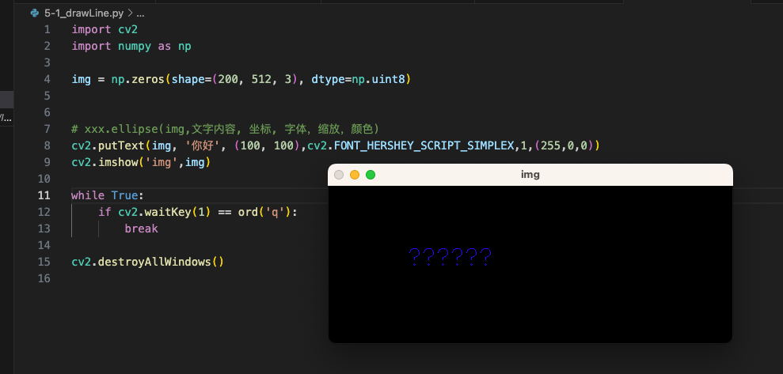

## 5-1、绘制直线

```python
import cv2
import numpy as np

img = np.zeros(shape=(200, 512, 3), dtype=np.uint8)

# xxx.line(img, 起始点, 结束点, 颜色, 线粗, 锯齿)
# 从 (0, 0) 画一条  (200, 200)的蓝色线段
cv2.line(img, (0, 0), (200, 200), (255, 0, 0), 1, 4)
cv2.imshow('img',img)

while True:
    if cv2.waitKey(1) == ord('q'):
        break

cv2.destroyAllWindows()

```


## 5-2、绘制矩形、圆形

```python
import cv2
import numpy as np

img = np.zeros(shape=(200, 512, 3), dtype=np.uint8)

# xxx.rectangle(img, 起始点, 结束点, 颜色, 线粗)
# 从 (10,10) 到(110,110) 画一个 矩形
cv2.rectangle(img, (0,0), (100,100),(255,0,0), 3)

# xxx.rectangle(img, 中心点, 半径, 颜色, 填充方式
# 以 (100,100) 为中心，画一个半径为50的红色圆
cv2.circle(img,(100,100),50,(0,0,255),1)
cv2.imshow('img',img)

while True:
    if cv2.waitKey(1) == ord('q'):
        break

cv2.destroyAllWindows()

```


## 5-3、绘制椭圆

```python
import cv2
import numpy as np

img = np.zeros(shape=(200, 512, 3), dtype=np.uint8)


# xxx.ellipse(img, 中心点, 椭圆对应的矩形, 角度, 起始角度, 结束角度, 颜色)
cv2.ellipse(img,(100,100),(100,50),0,0,360,(0,255,0),1)
cv2.imshow('img',img)

while True:
    if cv2.waitKey(1) == ord('q'):
        break

cv2.destroyAllWindows()

```


## 5-4、绘制多边型

```python
import cv2
import numpy as np

img = np.zeros(shape=(200, 512, 3), dtype=np.uint8)


# xxx.ellipse(img,点集, 是否闭合, 颜色)
cv2.polylines(img, np.array([[(20, 20), (200, 0), (180, 50), (200, 100), (0, 180)]], dtype=np.int32), True, (255, 0, 0))
cv2.imshow('img',img)

while True:
    if cv2.waitKey(1) == ord('q'):
        break

cv2.destroyAllWindows()

```

- 一定要注意，点集的数据类型一定要是 `np.int32` 类型


## 5-5、绘制文本

```python
import cv2
import numpy as np

img = np.zeros(shape=(200, 512, 3), dtype=np.uint8)


# xxx.ellipse(img,文字内容, 坐标, 字体，缩放，颜色)
cv2.putText(img, 'Hello World', (100, 100),cv2.FONT_HERSHEY_SCRIPT_SIMPLEX,1,(255,0,0))
cv2.imshow('img',img)

while True:
    if cv2.waitKey(1) == ord('q'):
        break

cv2.destroyAllWindows()

```

- 但是显示中文会有问题





## 5-6、有空TODO: 实现鼠标拖动绘制圆、矩形、线条


