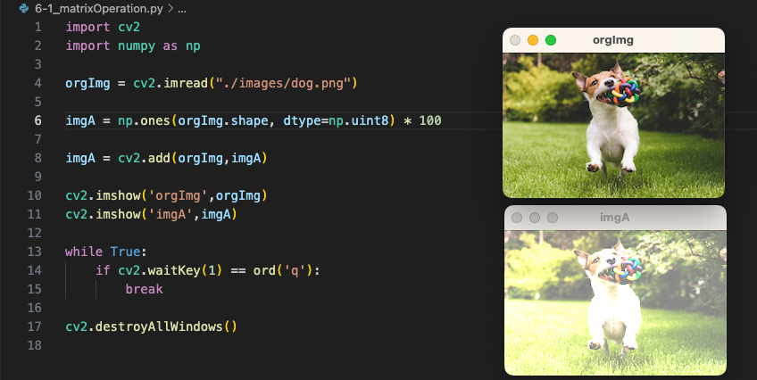
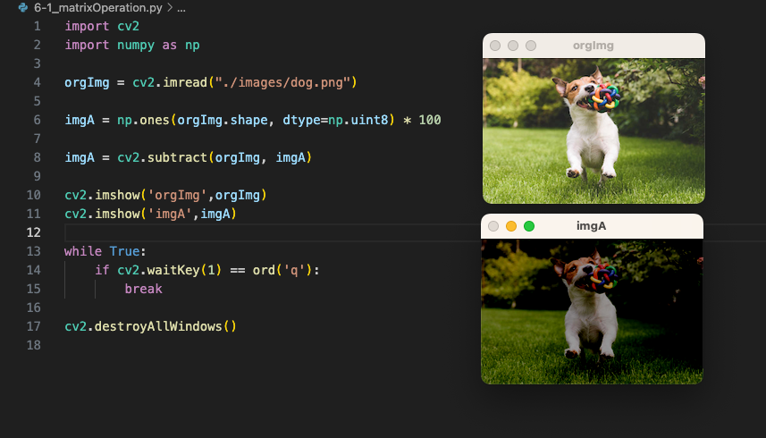
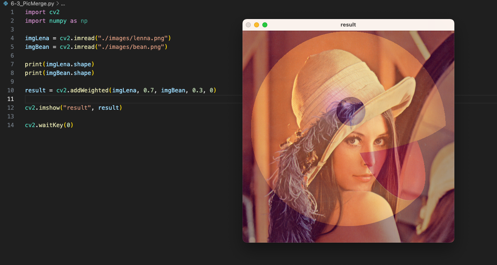
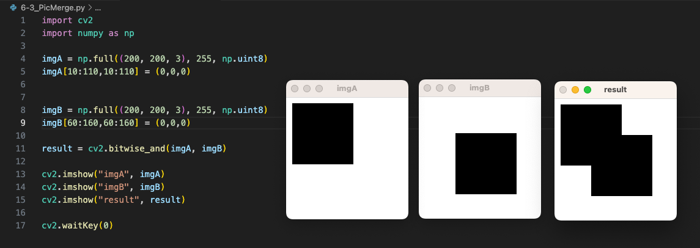
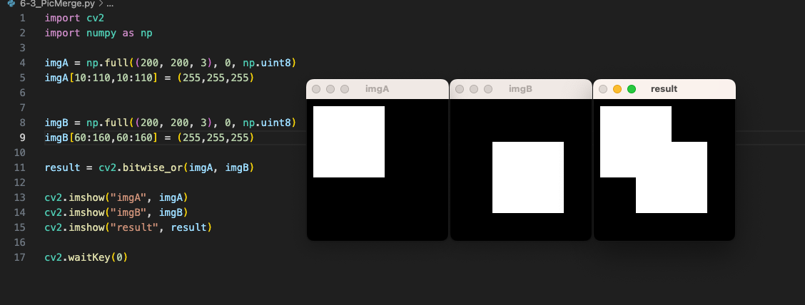
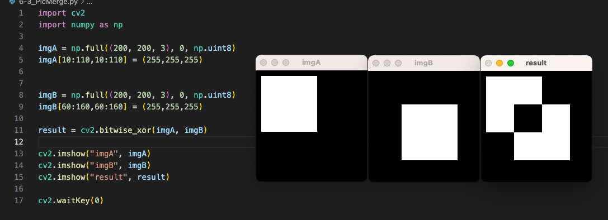

## 6-1、图像的加法运算

```python
import cv2
import numpy as np

orgImg = cv2.imread("./images/dog.png")

imgA = np.ones(orgImg.shape, dtype=np.uint8) * 50

imgA = cv2.add(orgImg,imgA)

cv2.imshow('orgImg',orgImg)
cv2.imshow('imgA',imgA)

while True:
    if cv2.waitKey(1) == ord('q'):
        break

cv2.destroyAllWindows()
```

- 如下图所示，加法之后，对图片有一种**提亮度**的效果




## 6-2、图像的减法运算/乘法/除法

```python
import cv2
import numpy as np

orgImg = cv2.imread("./images/dog.png")

imgA = np.ones(orgImg.shape, dtype=np.uint8) * 100

# 减法
imgA = cv2.subtract(orgImg, imgA)
# 乘法
# imgA = cv2.multiply(orgImg,imgA)
# 除法
# imgA = cv2.divide(orgImg,imgA)

cv2.imshow('orgImg',orgImg)
cv2.imshow('imgA',imgA)

while True:
    if cv2.waitKey(1) == ord('q'):
        break

cv2.destroyAllWindows()

```

- 如图所示，减法对图像有一种**加深加暗**的效果。
- 除法就是倍数的减法，乘法就是倍数的加法。




## 6-3、图像的熔合

```python
import cv2
import numpy as np

imgLena = cv2.imread("./images/lenna.png")
imgBean = cv2.imread("./images/bean.png")

print(imgLena.shape)
print(imgBean.shape)

result = cv2.addWeighted(imgLena, 0.7, imgBean, 0.3, 0)

cv2.imshow("result", result)

cv2.waitKey(0)
```





## 6-4、位运算 - 非操作

```python
import cv2
import numpy as np

img = np.full((2, 2, 3), 100, np.uint8)
result = cv2.bitwise_not(img)

print(img)
print(result)

cv2.imshow("img", img)
cv2.imshow("result", result)

cv2.waitKey(0)
```

- 输出结果如下：

```python
[[[100 100 100]
  [100 100 100]]

 [[100 100 100]
  [100 100 100]]]
[[[155 155 155]
  [155 155 155]]

 [[155 155 155]
  [155 155 155]]]
```

- 100的二进制位是 `0110 0100`

- 155的二进制位是 `1001 1011`


## 6-5、位运算 - 与操作

```python
import cv2
import numpy as np

imgA = np.full((200, 200, 3), 255, np.uint8)
imgA[10:110,10:110] = (0,0,0)


imgB = np.full((200, 200, 3), 255, np.uint8)
imgB[60:160,60:160] = (0,0,0)

result = cv2.bitwise_and(imgA, imgB)

cv2.imshow("imgA", imgA)
cv2.imshow("imgB", imgB)
cv2.imshow("result", result)

cv2.waitKey(0)
```




## 6-6、位运算 - 或操作、异或操作

- 或操作



- 异或操作




## 6-7、作业 - 为图片添加log水印

- 感觉下面的代码有点问题，mask如果能准确知道的话，我直接把水印画到原图上不就行了嘛

```python
# 1.引入一幅图片
# 2.要有一个LOGO，自己画
# 3.计算图片在什么地方添加，添加的地方变成黑色
# 4.利用add，将log与图叠加到一起

import cv2
import numpy as np

#先绘制logo
imgA = np.zeros(shape=(100,100,3),dtype=np.uint8)
imgA[20:60,20:60] = (255,0,0)
imgA[40:80,40:80] = (0,255,0)


maskImg = np.zeros(shape=(100,100,3),dtype=np.uint8)
print(maskImg)
maskImg[20:60,20:60] = (255,255,255)
maskImg[40:80,40:80] = (255,255,255)
maskImg = cv2.bitwise_not(maskImg)

orgImg = cv2.imread("./images/lenna.png")

captureImg = orgImg[200:300,200:300]

# print(captureImg.shape)
mergeImg = cv2.bitwise_and(maskImg,captureImg)

mergeImg = cv2.bitwise_or(mergeImg, imgA)

orgImg[200:300,200:300] = mergeImg

cv2.imshow("maskImg", orgImg)
# cv2.imshow("mergeImg", mergeImg)
cv2.waitKey(0)
```


