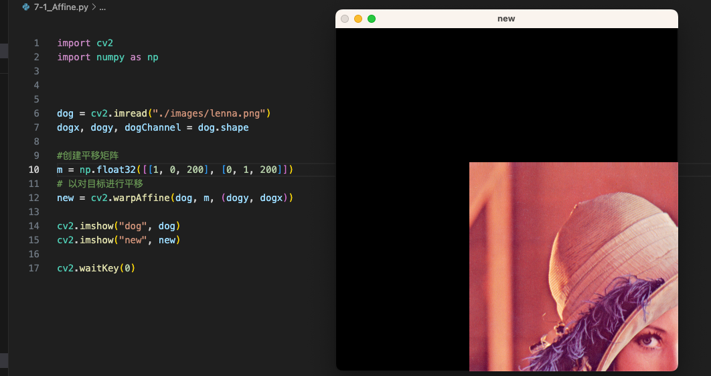
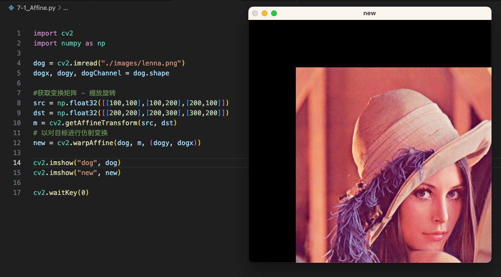
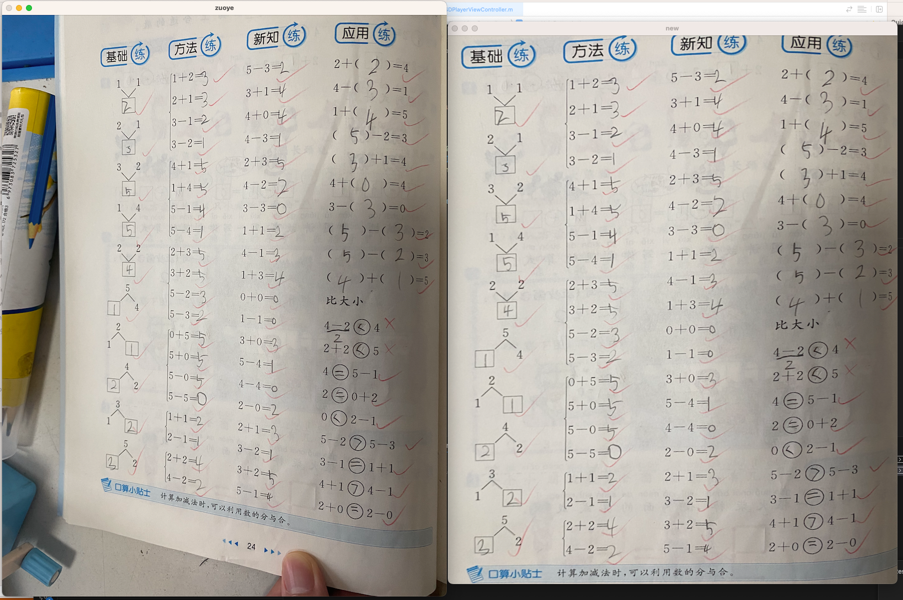

## 7-1、图像的放大与缩小

- `cv2.resize`，主要参数注意点如下
- `dsize` 和 `fx、fy`   选择一种缩放方式即可，两者互斥

```python
import cv2
import numpy as np

dog = cv2.imread("./images/lenna.png")
dogx, dogy, dogChannel = dog.shape

print(dog.shape)

# 以目标尺寸进行缩放
# new = cv2.resize(dog,(256,256))
# 以横纵坐标缩放比例进行缩放
new = cv2.resize(dog,None,None,fx=0.5,fy=0.2)

print(new.shape)

cv2.imshow("dog", dog)
cv2.imshow("new", new)

cv2.waitKey(0)
```


## 7-2、图像的翻转

- `cv2.flip()`
- `flipCode == 0` 上下翻转
- `flipCode < 0` 上下+左右翻转
- `flipCode > 0` 左右翻转

```python
import cv2
import numpy as np

dog = cv2.imread("./images/lenna.png")
dogx, dogy, dogChannel = dog.shape

print(dog.shape)

# 以对目标进行翻转
new = cv2.flip(dog,1)

print(new.shape)

cv2.imshow("dog", dog)
cv2.imshow("new", new)

cv2.waitKey(0)
```


## 7-3、图像的旋转

- `cv2.rotate(dog, cv2.ROTATE_90_CLOCKWISE)`

```
import cv2
import numpy as np

dog = cv2.imread("./images/lenna.png")
dogx, dogy, dogChannel = dog.shape

print(dog.shape)

# 以对目标进行旋转
new = cv2.rotate(dog, cv2.ROTATE_90_CLOCKWISE)

print(new.shape)

cv2.imshow("dog", dog)
cv2.imshow("new", new)

cv2.waitKey(0)
```


## 7-4、图像的仿射变换 - 平移

> **仿射变换：**就是对图像的平移、缩放、旋转的总称

```python
import cv2
import numpy as np

dog = cv2.imread("./images/lenna.png")
dogx, dogy, dogChannel = dog.shape

#创建平移矩阵
m = np.float32([[1, 0, 200], [0, 1, 200]])
# 以对目标进行平移
new = cv2.warpAffine(dog, m, (dogy, dogx))

cv2.imshow("dog", dog)
cv2.imshow("new", new)

cv2.waitKey(0)
```





## 7-5、图像的仿射变换 - 获取变换矩阵方式一

- 在知道 `中心点、角度、缩放比例` 这些参数的情况下，使用 `cv2.getRotationMatrix2D()` 进行获取变换矩阵

```python
import cv2
import numpy as np

dog = cv2.imread("./images/lenna.png")
dogx, dogy, dogChannel = dog.shape

#获取变换矩阵 - 缩放旋转
m = cv2.getRotationMatrix2D((dogx / 2, dogy/2),15,0.5)
# 以对目标进行仿射变换
new = cv2.warpAffine(dog, m, (dogy, dogx))

cv2.imshow("dog", dog)
cv2.imshow("new", new)

cv2.waitKey(0)
```


## 7-6、图像的仿射变换 - 获取变换矩阵方式二

- 在知道某些点，变换到另外一些点的情况下，用`cv2.getAffineTransform(src, dst)`获取变换矩阵

```python
import cv2
import numpy as np

dog = cv2.imread("./images/lenna.png")
dogx, dogy, dogChannel = dog.shape

#获取变换矩阵 - 缩放旋转
src = np.float32([[100,100],[100,200],[200,100]])
dst = np.float32([[200,200],[200,300],[300,200]])
m = cv2.getAffineTransform(src, dst)
# 以对目标进行仿射变换
new = cv2.warpAffine(dog, m, (dogy, dogx))

cv2.imshow("dog", dog)
cv2.imshow("new", new)

cv2.waitKey(0)
```





## 7-7、图像的透视变换

- 感觉透视变换，就是截取图中部分区域，将其展开，有点像改变一个角度看待。

```python
import cv2
import numpy as np

zuoye = cv2.imread("./images/zuoye.png")
x, y, channel = zuoye.shape

#获取透视变换矩阵（需要有四个角落的点） 
src = np.float32([[180,50],[870,14],[174,950],[854,1100]])
dst = np.float32([[0,0],[900,0],[0,1100],[900,1100]])
m = cv2.getPerspectiveTransform(src, dst)

# 以对目标进行透视变换
new = cv2.warpPerspective(zuoye, m, (900,1100))

cv2.imshow("zuoye", zuoye)
cv2.imshow("new", new)

cv2.waitKey(0)
```


- 就像下图，用户拍摄角度可能导致图片上面的数学算式不整齐，经过透视变换，就可以变得整齐了
- 后续可以通过分列分行处理，将这些算式进行切割





