## 8-1、初识滤波器

> 滤波的作用：一幅图像通过**滤波器**得到另一幅图像。其中**滤波**的过程又称为**卷积**，**滤波器**又称为**卷积核**。
>
> 大白话解释：其实无非就是一个二维小窗口，对图像进行扫描，扫描过程中进行一个乘法操作，这个过程就是**卷积**。

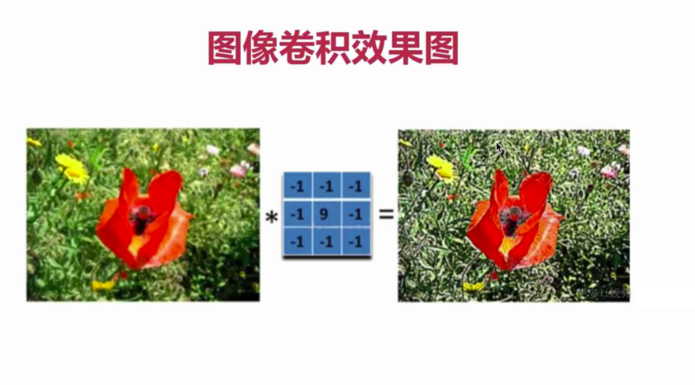


## 8-2、卷积相关概念

> **卷积核：**通常为奇数，比如3x3、 5x5、 7x7等
>
> 原因一：是因为增加padding的原因
>
> 原因二：保证锚点在中间，防止位置发生偏移的原因


> **卷积核大小的影响：**
>
> 在深度学习中，卷积核越大，看到的信息（感受野）越多，
>
> 提取的特征越好，同时计算量也就越大。


> **边界扩展：**当卷积核大于1且不进行边界扩充，输出尺寸将相应缩小，
>
> 当卷积核以标准方式进行边界扩充，则输出数据的空间尺寸将与输出相等。


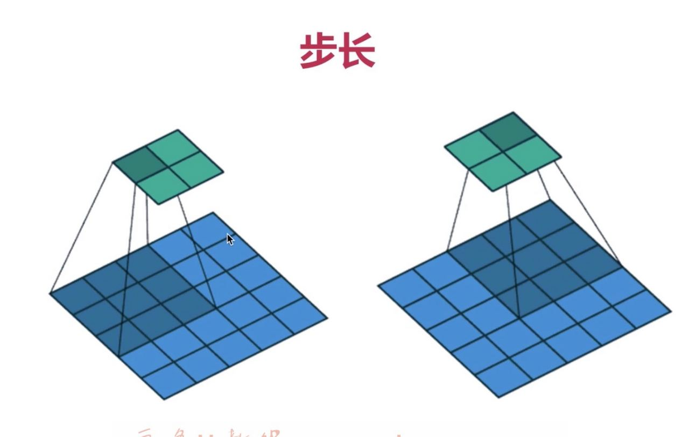

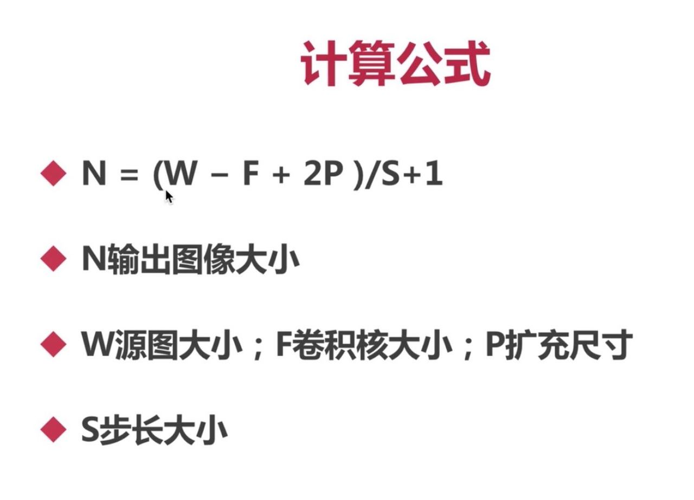


## 8-3、高通滤波VS低通滤波


> **低通滤波(Low-pass Filtering)：**运行低频信号通过并减少高频信号。他们消除或减弱图像中的高频噪声或细节，从而模糊图像并平滑图像中的细节。
>
> **低通滤波作用：**通常用于降低图像噪声、模糊化图像或进行图像压缩。
>
> **低频信号：**指的是变化率慢的部分，对应图像中较为平缓或缓慢变化的部分，比如大块的色彩、平滑区域。


> **高通滤波(High-pass Filtering)：**允许高频信号通过并减少低频信号。它们消除或减弱图像中的低频分量，强调或增强图像中的边缘、细节或高频细节。
>
> **高通滤波作用：**通常用于图像增加、边缘检测和去除图像中的基准分量。
>
> **高频信号：**指的是变化率快的部分，他们对图像中急剧变化的细节、边缘或纹理。


## 8-4、方盒滤波与均值滤波

```python
import cv2
import numpy as np

dog = cv2.imread("./images/opencv/00/dog.jpeg")
# 均值滤波
dst = cv2.blur(dog, (3, 3))

cv2.imshow("dog", dog)
cv2.imshow("dst", dst)

cv2.waitKey(0)
```

- 对比原图，可以发现经过均值滤波之后，图片的细节更加模糊了。

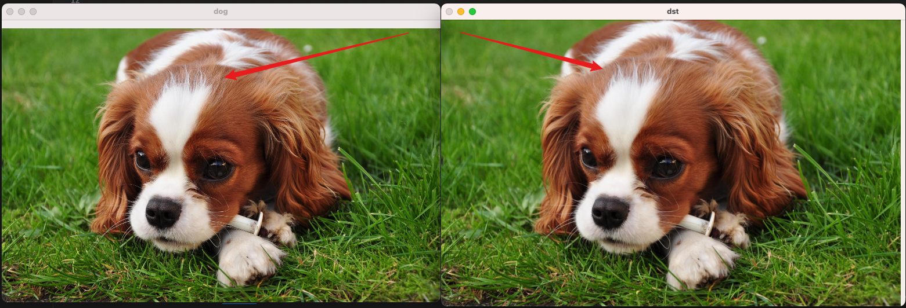


## 8-5、高斯滤波

> **高斯滤波：** 又称为中型滤波，都是中间高两边低。中心点的值不是最大，但是权重最大的滤波。
>
> **作用：**主要用于解决**高斯噪点**问题

```python
import cv2
import numpy as np

dog = cv2.imread("./images/opencv/08/gaussian.png")

# 高斯滤波，sigmaX表示模糊度
dst = cv2.GaussianBlur(dog, (5, 5), 10)

cv2.imshow("dog", dog)
cv2.imshow("dst", dst)

cv2.waitKey(0)
```

- 从下图可以发现，经过高斯滤波之后，高斯噪点不见了，但是边缘也变得模糊了。

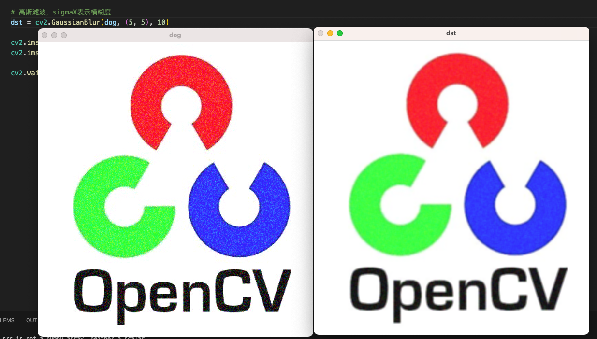


## 8-6、中值滤波

> **中值滤波：** 假设有一组数据[144 5 678]，取中间的5作为卷积后的结果，就是中值滤波。
>
> **作用：** 对胡椒噪音效果明显

```python
import cv2
import numpy as np

dog = cv2.imread("./images/opencv/08/papper.png")

# 中值滤波,处理胡椒噪音
dst = cv2.medianBlur(dog, 5)

cv2.imshow("dog", dog)
cv2.imshow("dst", dst)

cv2.waitKey(0)
```

- 可以看到下图的胡椒噪音都消失了，但是图的边缘部分，仍然被模糊了。

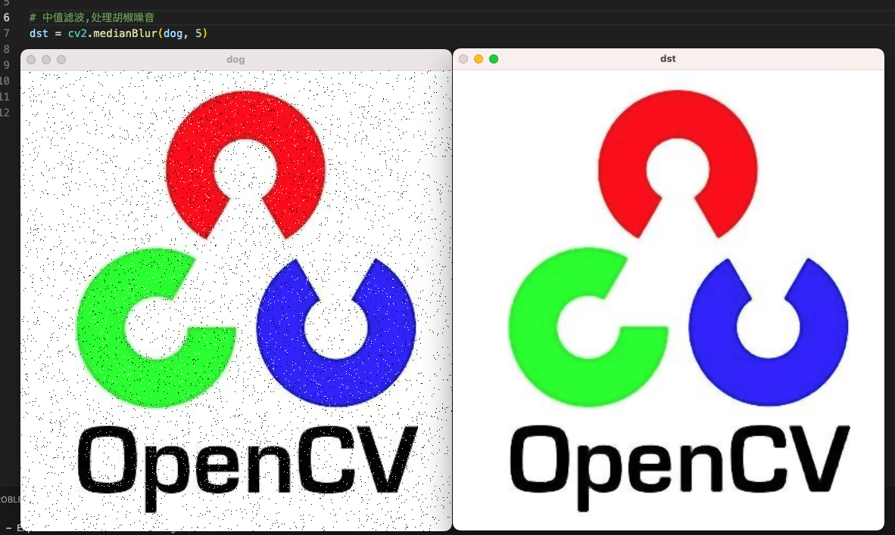


## 8-7、双边滤波

> **背景：**我们学习过高斯滤波和中值滤波，可以发现对图片的边缘部分，处理都不太好。
>
> **双边滤波：** ①可以保留边缘 ②同时可以对边缘内的前去与进行平滑处理。
>
> **作用：** 双边滤波最大的作用是进行**美颜**。

```python
import cv2
import numpy as np

dog = cv2.imread("./images/lenna.png")

# 双边滤波，进行美颜
dst = cv2.bilateralFilter(dog, 5, 40, 70)

cv2.imshow("dog", dog)
cv2.imshow("dst", dst)

cv2.waitKey(0)
```

- 可以看到 lena 的脸部变得更加平滑了，皮肤褶皱消失嘞，而且边缘部分并未变得模糊。

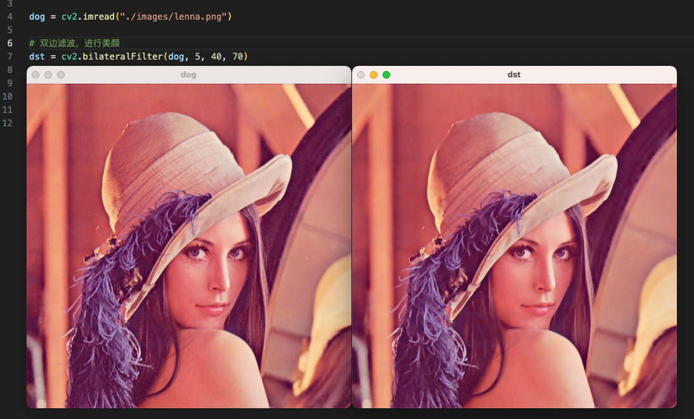


## 8-8、高通滤波

> **低通滤波：**前面介绍的**高斯滤波、中值滤波、双边滤波** 都是低通滤波
>
> **高通滤波：**后面的 **索贝尔算子、沙尔算子、拉普拉斯算子、Canny** 都是高通滤波，都是用于**边缘检测**。


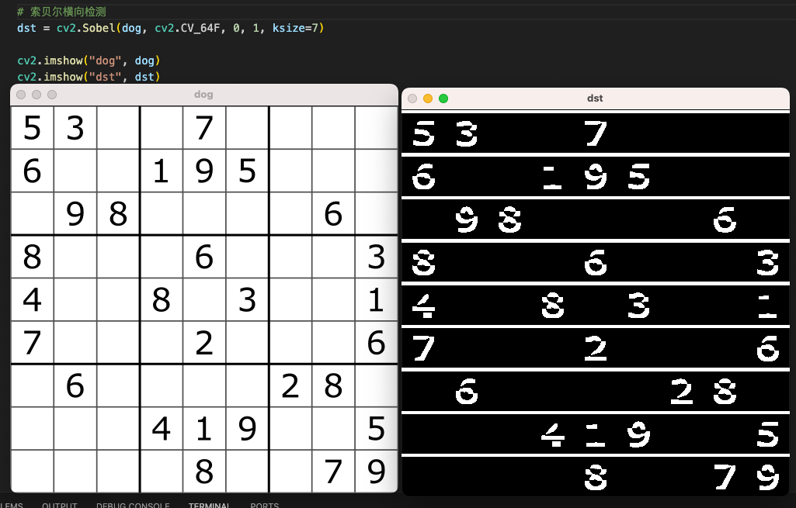


## 8-11、边缘检测终极大法 Canny【重点掌握】

> 索贝尔算子、沙尔算子、拉普拉斯算子 都有一些不足，**Canny是边缘检测的终极综合方案**。

```
import cv2
import numpy as np

dog = cv2.imread("./images/lenna.png")

# 边缘检测终极大法 Canny（前面两个数值越小，检测出来的边缘越多，也就是对边缘越敏感）
dst = cv2.Canny(dog, 50, 100)

cv2.imshow("dog", dog)
cv2.imshow("dst", dst)

cv2.waitKey(0)
```


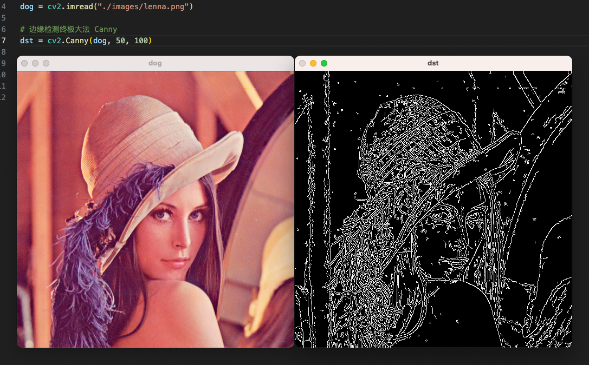


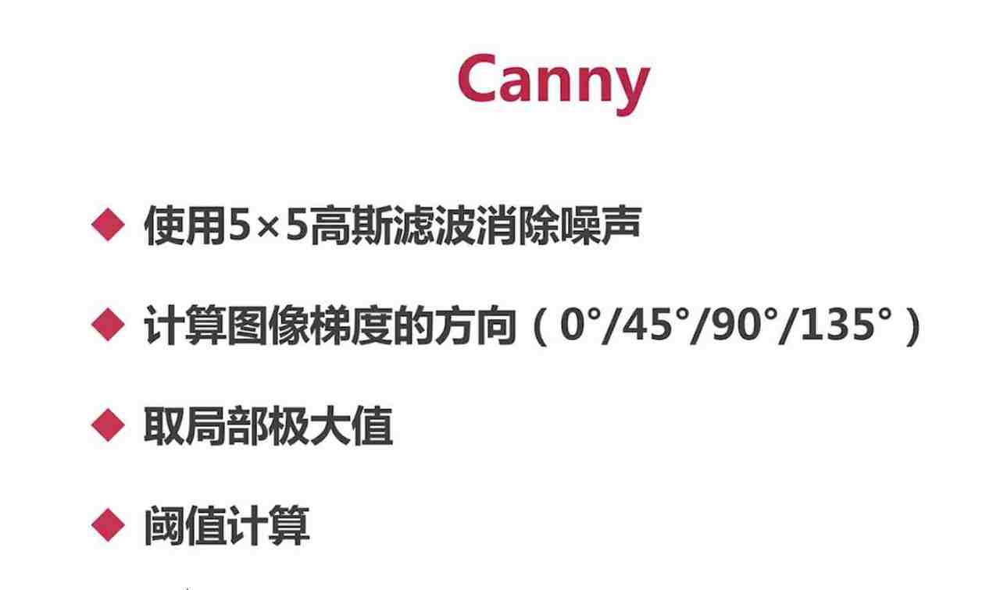


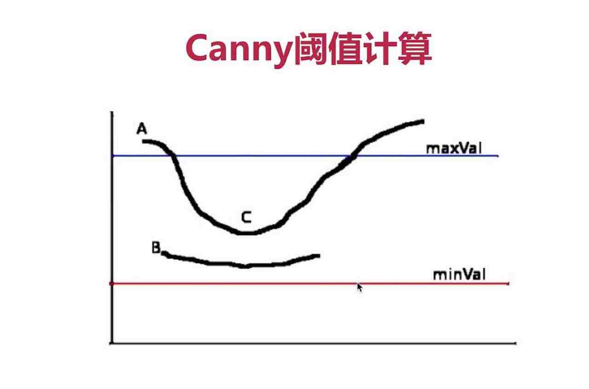


