## 9-1、形态学概述

> **形态学是干什么的：**是一种图像处理技术，主要用于处理图像中的形状和结构。
>
> **什么样的图片才能适用于形态学操作：**这些处理方法基本是对**二进制图像**进行处理


## 9-2、全局图像二值化

```python
import cv2
import numpy as np

img = cv2.imread("./images/lenna.png")
# 先将图片灰度处理
grayImg = cv2.cvtColor(img,cv2.COLOR_BGR2GRAY)

# 对灰度图像进行全局二值化处理
ret, dst = cv2.threshold(grayImg,127,255,cv2.THRESH_BINARY)


cv2.imshow("img", img)
cv2.imshow("grayImg", grayImg)
cv2.imshow("dst", dst)

cv2.waitKey(0)
```


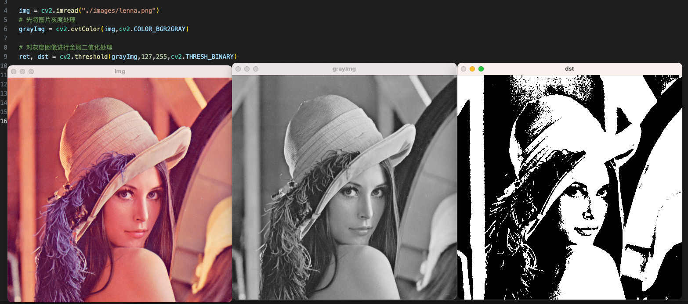


> 全局二值化的缺点：由于光照不均匀以及阴影的存在，只有一个阈值会使得在阴影处的白色被二值化成黑色。

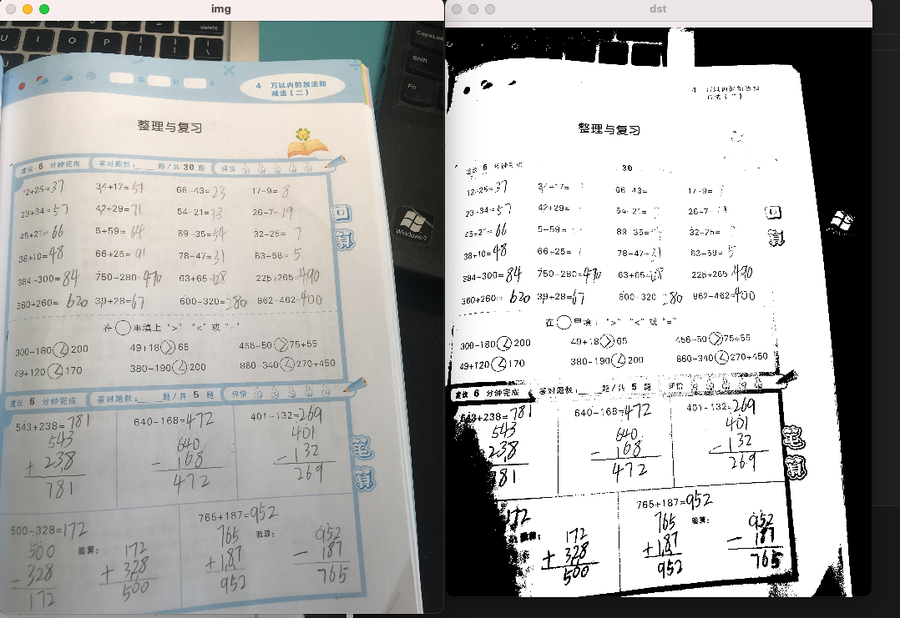


## 9-4、自适应阈值二值化

```python
import cv2
import numpy as np

img = cv2.imread("./images/opencv/00/perspective.jpeg")
# 先将图片灰度处理
grayImg = cv2.cvtColor(img,cv2.COLOR_BGR2GRAY)

# 对灰度图像进行自适应二值化处理
# adaptiveMethod:计算阈值的方法
# ADAPTIVE_THRESH_MEAN_C:计算临近区域的平均值
# ADAPTIVE_THRESH_GAUSSIAN_C：高斯窗口加权平均值
dst = cv2.adaptiveThreshold(grayImg,255,cv2.ADAPTIVE_THRESH_GAUSSIAN_C,cv2.THRESH_BINARY_INV,15,0)


cv2.imshow("img", img)
cv2.imshow("grayImg", grayImg)
cv2.imshow("dst", dst)

cv2.waitKey(0)
```

- 可以看到转出来的图片，噪点非常多

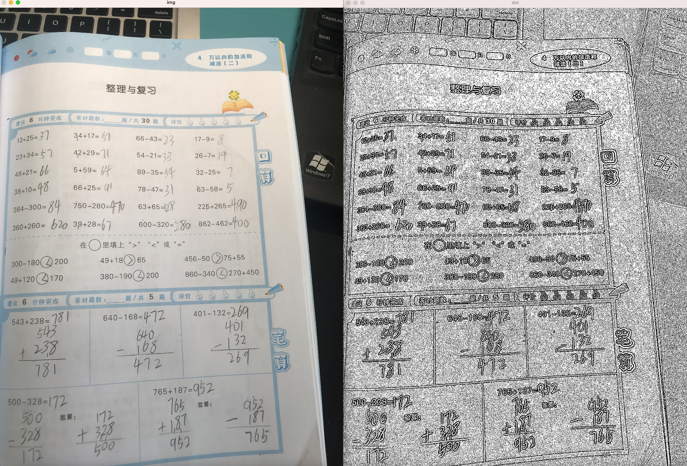


## 9-5、腐蚀

> **腐蚀(Erosion)：**腐蚀操作会使图像中物体的边界向内收缩。
>
> **原理：**它会通过在图像中滑动卷积核，将核的中心放在像素上，并检查与图像中对应区域的重叠。如果核下所有像素的值都是非零，则中心像素保持不变；否则，中心像素将被置位领。
>
> **用处：**腐蚀操作可以消除小物体，细化物体边界或分离物体。

```python
import cv2
import numpy as np

img = cv2.imread("./images/opencv/形态学/j.png")

#进行腐蚀操作
#iterations是进行腐蚀次数
kernel = np.ones((3,3), np.uint8)
dst = cv2.erode(img,kernel,iterations=1)

cv2.imshow("img", img)
cv2.imshow("dst", dst)

cv2.waitKey(0)
```

- 可以看到字变苗条了

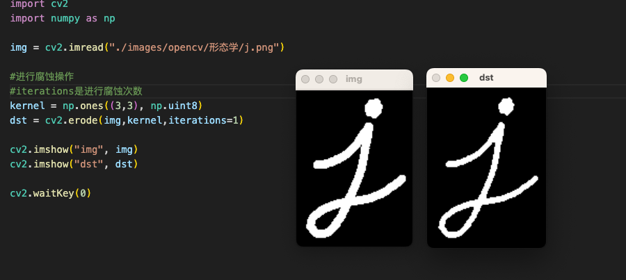

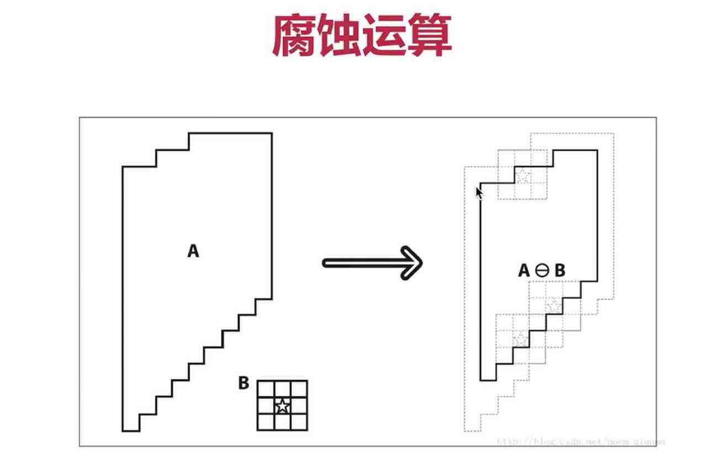


## 9-6、获取形态学卷积核

```python
# 获取形态学的卷积核
# cv2.MORPH_RECT: 矩形全1的卷积核
# cv2.MORPH_ELLIPSE: 椭圆形的卷积核
# cv2.MORPH_CROSS: 横竖中心交叉线都是1的卷积核
kernel = cv2.getStructuringElement(cv2.MORPH_CROSS, (7,7))
print(kernel)
```


## 9-7、膨胀

> **膨胀(Dilation)：**膨胀操作与腐蚀相反，它会扩张图像中物体的边界。
>
> **原理：**使用同样的卷积核，在图像中滑动核窗口，并根据核与图像重叠区域的像素值来更新中心像素。如果核下有至少一个前景像素，中心像素将被置位前景；否则，它保持不变。
>
> **作用：**膨胀操作有助于填充物体间的空隙、连接物体或增加物体大小。

```python
import cv2
import numpy as np

img = cv2.imread("./images/opencv/形态学/j.png")
# 获取形态学的卷积核
kernel = cv2.getStructuringElement(cv2.MORPH_RECT, (7,7))
# 进行膨胀操作
dst = cv2.dilate(img,kernel,iterations=1)
cv2.imshow("img", img)
cv2.imshow("dst", dst)

cv2.waitKey(0)
```

- 可以看到下图的J变胖了

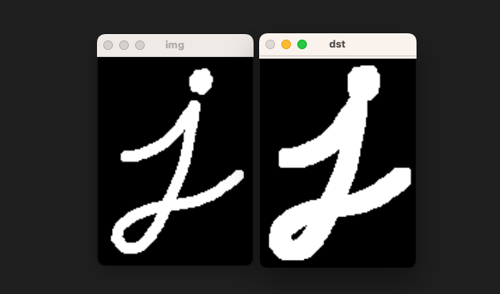


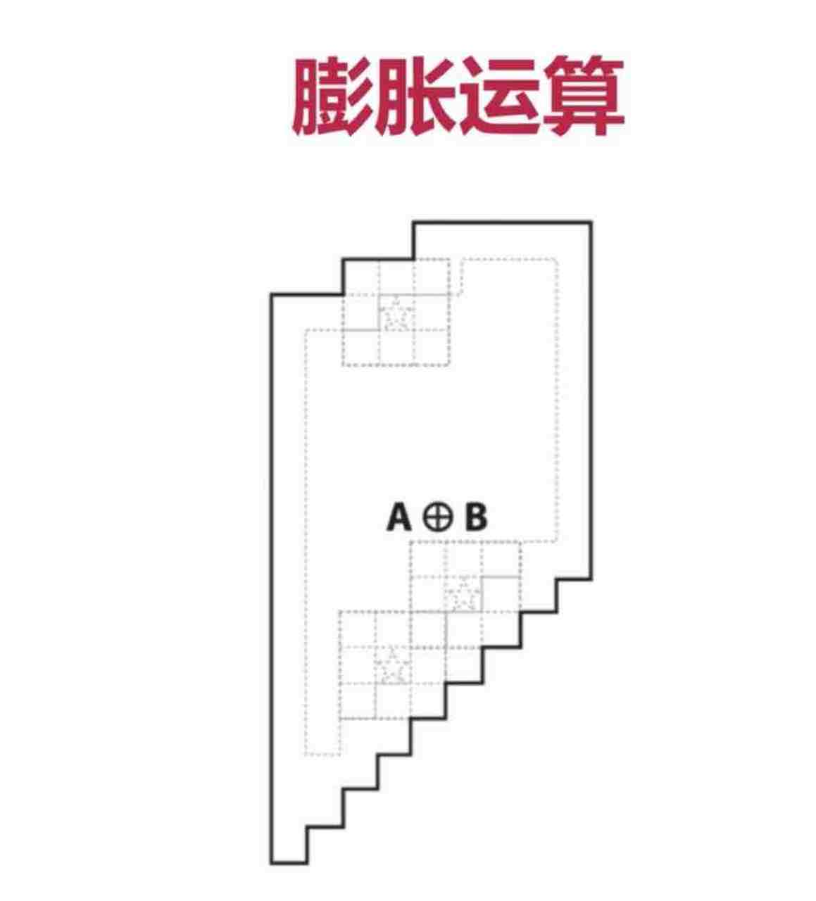

## 9-8、开运算

> **开运算：** 先腐蚀，后膨胀；先变小、后变大。
>
> **实际用法：**它可以用来消除小物体、平滑物体边界并打开物体之间的空隙。开运算能够去除噪声并保持整体的形状，对于去处较小的尖锐边缘或细小的物体非常有效。

```python
import cv2
import numpy as np

img = cv2.imread("./images/opencv/形态学/dotj.png")
# 获取形态学的卷积核
kernel = cv2.getStructuringElement(cv2.MORPH_RECT, (5,5))
dst2 = cv2.morphologyEx(img, cv2.MORPH_OPEN,kernel)
cv2.imshow("img", img)
cv2.imshow("dst2", dst2)

cv2.waitKey(0)
```

- 可以看到，周五的胡椒点被很好的去处了。

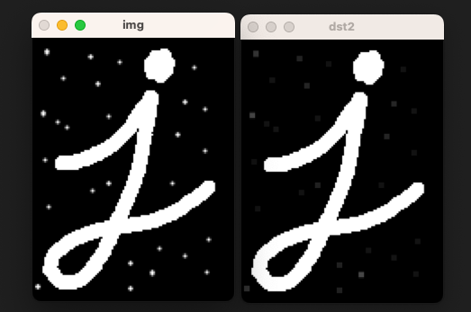

```python
import cv2
import numpy as np

img = cv2.imread("./images/opencv/形态学/dotinj.png")
# 获取形态学的卷积核
kernel = cv2.getStructuringElement(cv2.MORPH_RECT, (5,5))
dst2 = cv2.morphologyEx(img, cv2.MORPH_OPEN,kernel)
# # # 先进行腐蚀操作
erodeImg = cv2.erode(img,kernel,iterations=1)
# # # 后进行膨胀操作
# dst2 = cv2.dilate(dst1,kernel,iterations=1)
cv2.imshow("img", img)
cv2.imshow("erodeImg", erodeImg)
cv2.imshow("dst2", dst2)

cv2.waitKey(0)
```

- 思考为什么利用上面代码，处理下面这种图，进行先腐蚀后膨胀之后，噪点依然存在？
- 因为：腐蚀会把白色块缩小，黑色块变大，所以进行腐蚀后，里面的黑色块也变大了。

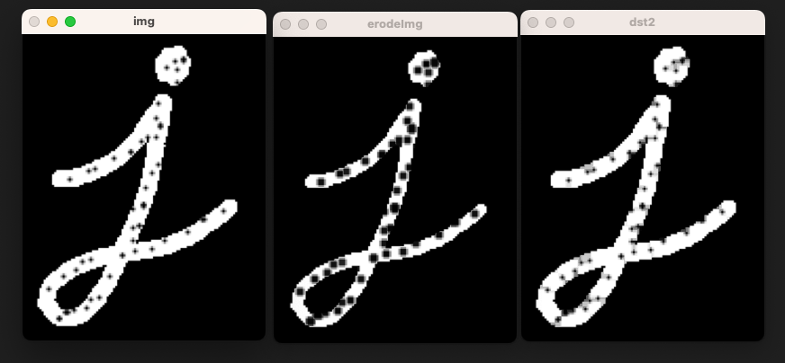

## 9-9、闭运算

> **闭运算：**先膨胀，后腐蚀；先变大，后变小。
>
> **实际用法：**它可以用来填充物体间的小空洞、平滑物体边界并闭合物体之间的断裂。闭运算有助于连接物体并保持其形状，对于填补小的空隙或连接中断的物体非常有用。

```python
import cv2
import numpy as np

img = cv2.imread("./images/opencv/形态学/dotinj.png")
# 获取形态学的卷积核
kernel = cv2.getStructuringElement(cv2.MORPH_RECT, (9,9))
dst2 = cv2.morphologyEx(img, cv2.MORPH_CLOSE,kernel)
# 先进行腐蚀操作
# erodeImg = cv2.erode(img,kernel,iterations=1)
# 后进行膨胀操作
dilateImg = cv2.dilate(img,kernel,iterations=1)
cv2.imshow("img", img)
cv2.imshow("dilateImg", dilateImg)
cv2.imshow("dst2", dst2)

cv2.waitKey(0)
```

- 先膨胀，让白色块变大，黑色块变小。如果卷积核比较大，那么黑色点将会彻底消失。这时候在进行腐蚀恢复原有大小，就可以得到下面的效果。

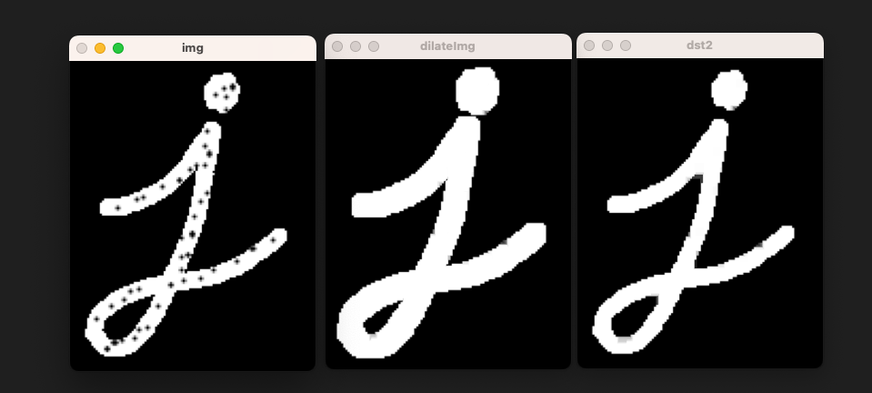


## 9-10、形态学梯度

> **梯度：**它可以帮助检测图像中的边缘或轮廓
>
> **原理：**形态学梯度 = 原图 - 腐蚀 

```python
import cv2
import numpy as np

img = cv2.imread("./images/opencv/形态学/j.png")
# 获取形态学的卷积核
kernel = cv2.getStructuringElement(cv2.MORPH_RECT, (3,3))
# 进行形态学梯度处理（获取物体轮廓新方法，之前有高通滤波、Canny等操作）
dst2 = cv2.morphologyEx(img, cv2.MORPH_GRADIENT, kernel=kernel)

cv2.imshow("img", img)
cv2.imshow("dst2", dst2)

cv2.waitKey(0)
```


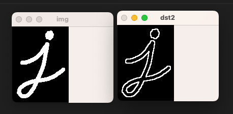


## 9-11、顶帽运算

> **顶帽(TopHat)作用：**用于突出图像中小细节或弱信号。例如在工业领域中用于检测游离表面上的微小缺陷。
>
> **原理：**顶帽 = 原图 - 开运算

```python
import cv2
import numpy as np

img = cv2.imread("./images/opencv/形态学/dotj.png")
# 获取形态学的卷积核
kernel = cv2.getStructuringElement(cv2.MORPH_RECT, (5,5))
#开运算：先腐蚀后膨胀（消除细小物体）
# 进行顶帽操作（原图 - 开运算 = 开运算屏蔽的细小物体）
dst2 = cv2.morphologyEx(img, cv2.MORPH_TOPHAT, kernel=kernel)

cv2.imshow("img", img)
cv2.imshow("dst2", dst2)

cv2.waitKey(0)
```

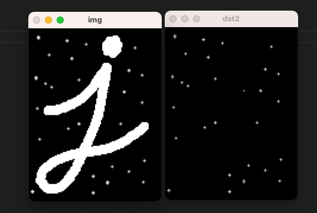


## 9-12、黑帽运算

> **黑帽作用：**突出物体内部的纹理、缺陷或小目标物体的定位。
>
> **原理：** 黑帽 = 原图 - 开运算；开运算 = 先膨胀，后腐蚀。

```python
import cv2
import numpy as np

img = cv2.imread("./images/opencv/形态学/dotinj.png")
# 获取形态学的卷积核
kernel = cv2.getStructuringElement(cv2.MORPH_RECT, (7,7))
#闭运算：先膨胀后腐蚀（消除物体内部小细节）
# 进行黑帽操作（原图 - 闭运算），获取物体内部的小细节
dst2 = cv2.morphologyEx(img, cv2.MORPH_BLACKHAT, kernel=kernel)

cv2.imshow("img", img)
cv2.imshow("dst2", dst2)

cv2.waitKey(0)
```


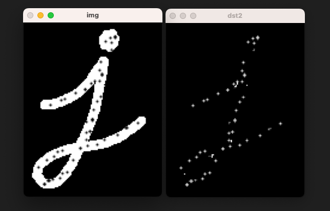


## 9-13、效果汇总【Important】

- 开运算：先腐蚀后膨胀，去除大图形外的小图形
- 闭运算：先膨胀后腐蚀，去除大图形内的小图形
- 梯度：求图形的边缘
- 顶帽：原图减开运算，得到大图形外的小图形
- 黑帽：原图减闭运算，得到大图形内的小图形


