## 10-1、什么是图像轮廓

> **图像轮廓：**具有相同<font color="red">颜色或强度</font>的<font color="red">连续点</font>的曲线

- 为了检测的准确性，需要先对图像进行二值化或Canny操作。

```python

# mode:检测模式
# RETR_EXTERNAL: 表示只检测外轮廓
# RETR_LIST: 检测轮廓不建立等级关系
# RETR_CCOMP: 每层最多2级
# RETR_TREE: 按树形存储轮廓【常用】

# method：返回点的数目
# CHAIN_APPROX_NONE：保存轮廓上的所有数据点
# CHAIN_APPROX_SIMPLE：返回轮廓的关键点，数据量较小
cv2.findContours(img, mode=cv2.RETR_TREE, method=cv2.CHAIN_APPROX_SIMPLE)
```

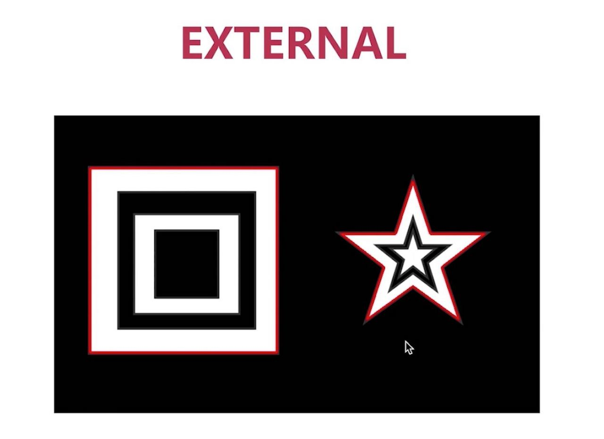

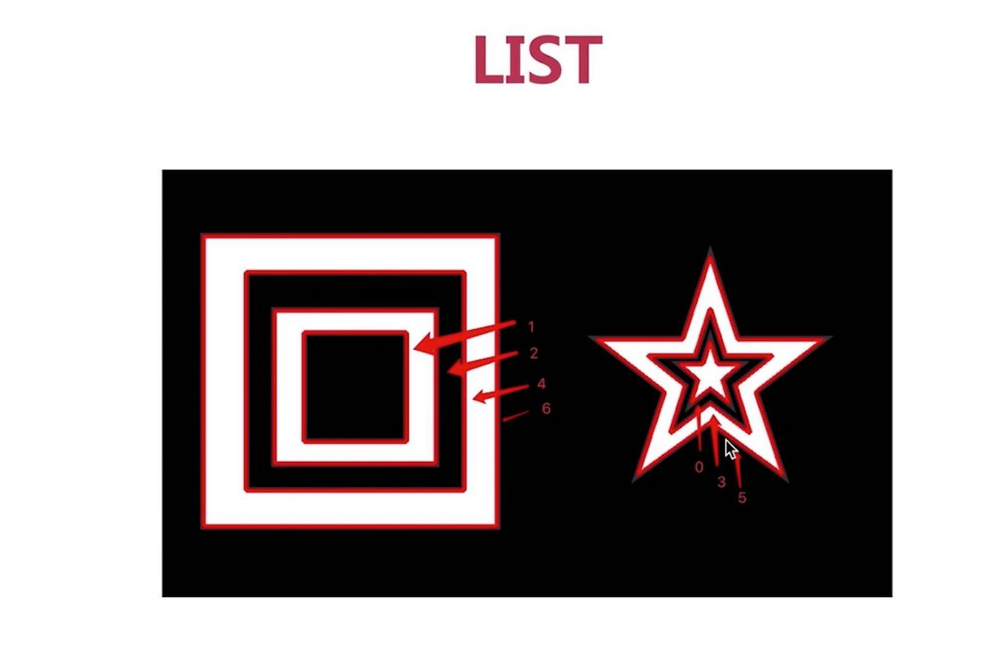

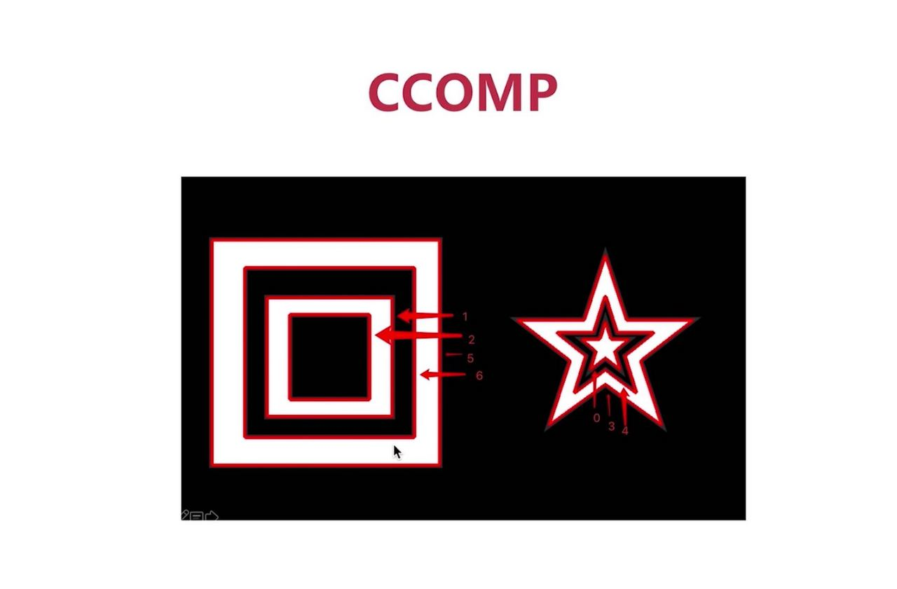

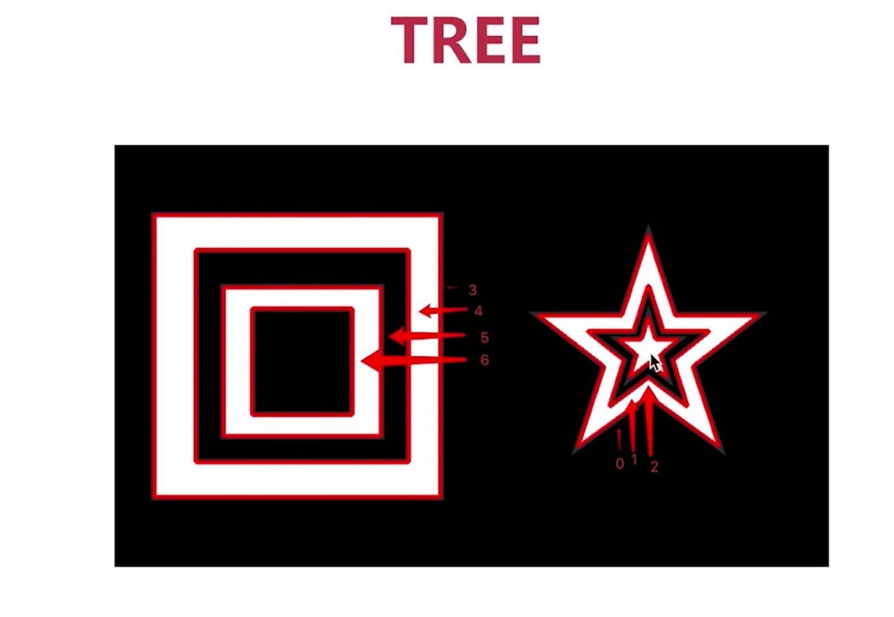

## 10-2、查找轮廓

```python
img = cv2.imread("./images/opencv/轮廓/contours1.jpeg");

grayImg = cv2.cvtColor(img, cv2.COLOR_BGR2GRAY)
ret, thresholdImg = cv2.threshold(grayImg, 127, 255, cv2.THRESH_BINARY)
contours, hierarchy = cv2.findContours(thresholdImg, mode=cv2.RETR_TREE, method=cv2.CHAIN_APPROX_SIMPLE)
print(contours)

cv2.waitKey(0)
```

- 上面代码就可以找出三个轮廓，并且标记出关键的坐标点。

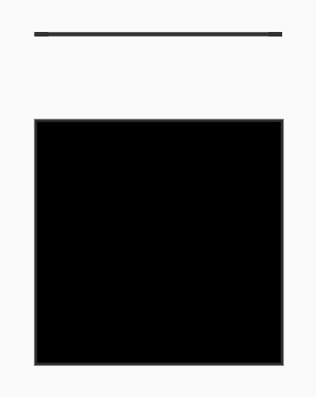


## 10-3、绘制轮廓

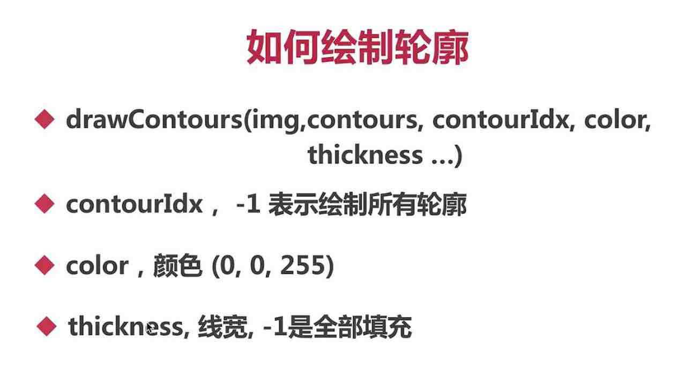

```python
import cv2
import numpy as np

img = cv2.imread("./images/opencv/轮廓/contours1.jpeg");
# 图片灰度化
grayImg = cv2.cvtColor(img, cv2.COLOR_BGR2GRAY)
# 图片二值化
ret, thresholdImg = cv2.threshold(grayImg, 127, 255, cv2.THRESH_BINARY)
# 找出图片所有轮廓
contours, hierarchy = cv2.findContours(thresholdImg, mode=cv2.RETR_TREE, method=cv2.CHAIN_APPROX_SIMPLE)
# 绘制轮廓
newImg = cv2.drawContours(img,contours,-1,(0,0,255),12)

cv2.imshow("thresholdImg", thresholdImg)
cv2.imshow("newImg", newImg)

cv2.waitKey(0)
```


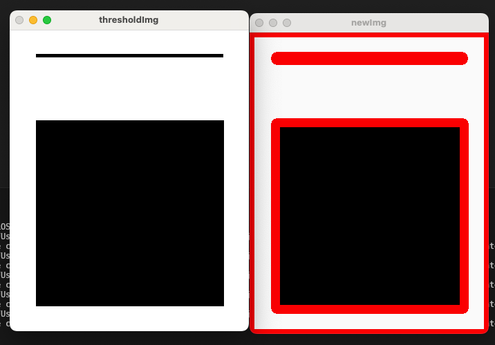


## 10-4、轮廓面积与周长计算

```python
#计算轮廓面积，图片原本尺寸 346 × 436
area = cv2.contourArea(contours[0])
print(area) #打印值 345 * 435 = 150075.0

#计算轮廓周长，图片原本尺寸 346 × 436
length = cv2.arcLength(contours[0],1)
print(length) #打印值 (345 + 435)*2 = 1560.0
```


## 10-5、多边形逼近与凸包

- 多边形逼近

```python
import cv2
import numpy as np

img1 = cv2.imread("./images/opencv/轮廓/hand.png");
img = cv2.imread("./images/opencv/轮廓/hand.png");
# 图片灰度化
grayImg = cv2.cvtColor(img, cv2.COLOR_BGR2GRAY)
# 图片二值化
ret, thresholdImg = cv2.threshold(grayImg, 127, 255, cv2.THRESH_BINARY)
# 查找轮廓
contours, hierarchy = cv2.findContours(thresholdImg, cv2.RETR_TREE, cv2.CHAIN_APPROX_SIMPLE)
# 原始路径
orignalContour = cv2.drawContours(img1, contours, 0, (0, 255, 0), 2)

# 多边形逼近
approxPolyImg = cv2.approxPolyDP(contours[0], 20,True)
# 绘制轮廓
approxPolyImg = cv2.drawContours(img, [approxPolyImg], -1, (0, 255, 0), 2)

cv2.imshow("img", img)

cv2.imshow("orignalContour", orignalContour)
cv2.imshow("approxPolyImg", approxPolyImg)

cv2.waitKey(0)
```

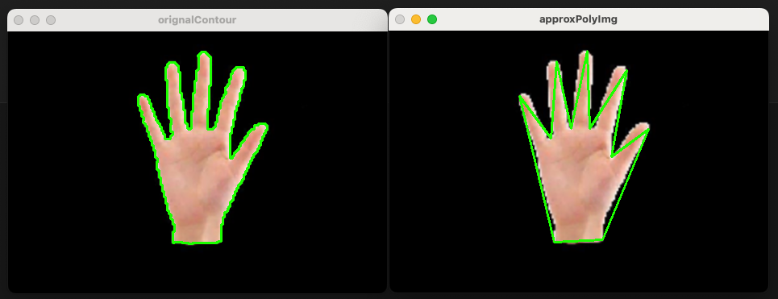

- 凸包

```python
import cv2
import numpy as np

img1 = cv2.imread("./images/opencv/轮廓/hand.png");
img = cv2.imread("./images/opencv/轮廓/hand.png");
# 图片灰度化
grayImg = cv2.cvtColor(img, cv2.COLOR_BGR2GRAY)
# 图片二值化
ret, thresholdImg = cv2.threshold(grayImg, 127, 255, cv2.THRESH_BINARY)
# 查找轮廓
contours, hierarchy = cv2.findContours(thresholdImg, cv2.RETR_TREE, cv2.CHAIN_APPROX_SIMPLE)
# 原始路径
orignalContour = cv2.drawContours(img1, contours, 0, (0, 255, 0), 2)

# 凸包
convexHullImg = cv2.convexHull(contours[0])
# 绘制轮廓
convexHullImg = cv2.drawContours(img, [convexHullImg], -1, (0, 255, 0), 2)

cv2.imshow("img", img)

cv2.imshow("orignalContour", orignalContour)
cv2.imshow("convexHullImg", convexHullImg)

cv2.waitKey(0)
```


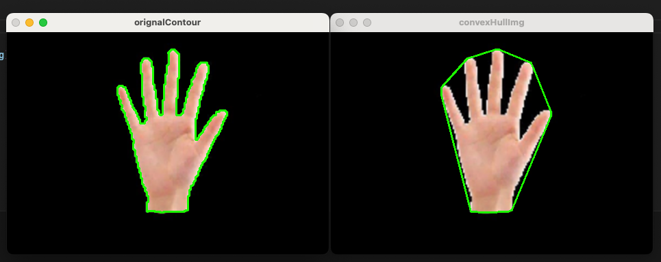


## 10-6、外接矩阵

- 最小外接矩阵【可以用于判断物体的旋转方向】
- 最大外接矩阵

```python
import cv2
import numpy as np

img = cv2.imread("./images/opencv/轮廓/hello.jpeg");
# 图片灰度化
grayImg = cv2.cvtColor(img, cv2.COLOR_BGR2GRAY)
# 图片二值化
ret, thresholdImg = cv2.threshold(grayImg, 127, 255, cv2.THRESH_BINARY)
# 查找轮廓
contours, hierarchy = cv2.findContours(thresholdImg, cv2.RETR_TREE, cv2.CHAIN_APPROX_SIMPLE)

#最小外接矩阵(获取的是带有旋转角度的矩阵)
minRotateRect = cv2.minAreaRect(contours[1])
#将带有旋转角度的矩阵转换成点坐标
minBox = cv2.boxPoints(minRotateRect)
#换算成整数
minBox = np.intp(minBox)
cv2.drawContours(img, [minBox], 0, (0, 0, 255), 2)

#最大外接矩阵(是x，y，w，h)的元组
x,y,w,h = cv2.boundingRect(contours[1])
cv2.rectangle(img, (x,y), (x+w,y+h), (0, 255, 0), 2)

cv2.imshow("img", img)
cv2.waitKey(0)
```

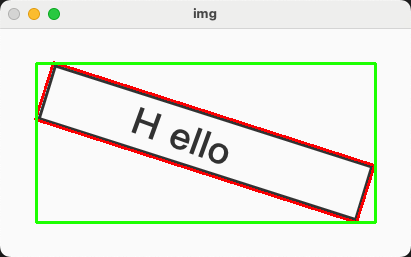


## 10-8、视频加载

```python
import cv2
import numpy as np 

cap = cv2.VideoCapture("./images/opencv/轮廓/video.mp4")
while True:
  ret , frame = cap.read()
  cv2.imshow("frame", frame)  
  key = cv2.waitKey(1)
  if key == ord('q'):
    break

cap.release()
cv2
	
```

## 10-9、高斯去噪 + 去背景

```python
import cv2
import numpy as np 

# 读取视频
cap = cv2.VideoCapture("./images/opencv/轮廓/video.mp4")

# 初始化背景减除器
background_subtractor = cv2.createBackgroundSubtractorMOG2()
background_subtractor2 = cv2.createBackgroundSubtractorMOG2()
while True:
  ret , frame = cap.read()
  if not ret :
    break
  # 背景灰度处理
  grayImg = cv2.cvtColor(frame, cv2.COLOR_BGR2GRAY)

  # 参照图
  grayImg1 = background_subtractor.apply(grayImg)
  cv2.imshow("grayImg1", grayImg1)

  #高斯去噪(去除高斯噪点)，使得大片物体更加平衡，内部噪点更少
  gausImg = cv2.GaussianBlur(grayImg,(3,3),5)

  gausMask = background_subtractor2.apply(gausImg)
  cv2.imshow("gausMask", gausMask)
  key = cv2.waitKey(1)
  if key == ord(' '):
    break

cap.release()
cv2

```

- 可以看到右图经过高斯模糊之后，更加平滑，去背景之后的视频也更少的噪点。

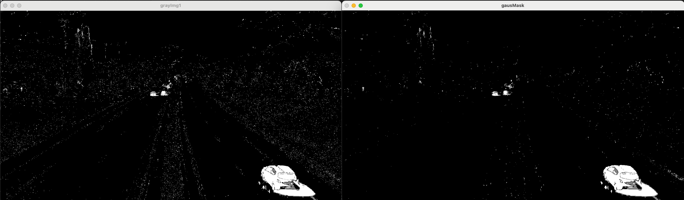


## 10-10、形态学处理


```python
import cv2
import numpy as np 

# 读取视频
cap = cv2.VideoCapture("./images/opencv/轮廓/video.mp4")
#形态学kernel
kernel = cv2.getStructuringElement(cv2.MORPH_RECT, (5,5))
# 初始化背景减除器
background_subtractor = cv2.createBackgroundSubtractorMOG2()
background_subtractor2 = cv2.createBackgroundSubtractorMOG2()
while True:
  ret , frame = cap.read()
  if not ret :
    break
  # 背景灰度处理
  grayImg = cv2.cvtColor(frame, cv2.COLOR_BGR2GRAY)
  #高斯去噪(去除高斯噪点)，使得大片物体更加平衡，内部噪点更少
  gausImg = cv2.GaussianBlur(grayImg,(3,3),5)

  # 参照图
  referMask = background_subtractor.apply(gausImg)
  cv2.imshow("referMask", referMask)

  # 腐蚀（去除大物体外的小物体）
  erodeImg = cv2.erode(gausImg, kernel, iterations=1)
  # 膨胀
  dilateImg = cv2.dilate(erodeImg, kernel, iterations=3)
  # 闭操作（去除大物体内的小物体）
  closingImg = cv2.morphologyEx(dilateImg, cv2.MORPH_CLOSE, kernel)

  gausMask = background_subtractor2.apply(closingImg)
  cv2.imshow("gausMask", gausMask)
  key = cv2.waitKey(1)
  if key == ord(' '):
    break

cap.release()
cv2

```

- 可以看到经过形态学（腐蚀、膨胀、闭操作）之后，噪点更少了

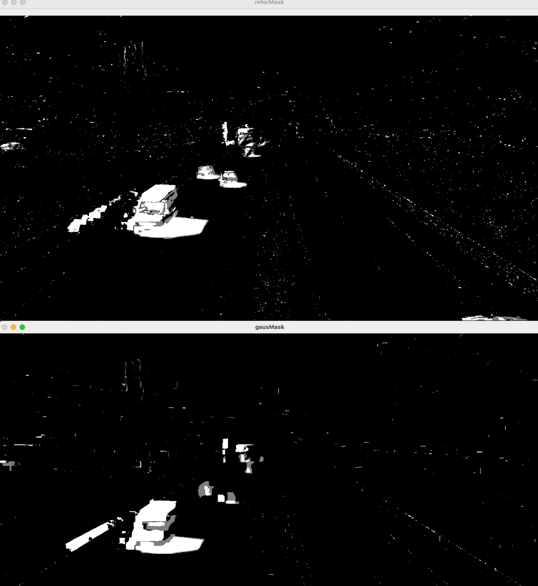


- 接下来可以进行轮廓查找了(感觉效果还可以啊)
- <font color="red">修正前面存在的问题，高斯滤波之后，就需要去背景了，不能最后去背景</font>
- 形态学操作，更适合对二值化以后的图像进行
- 但是依然存在①一些不是车的地方，被画上矩形了②有些并行的车辆被认为是一辆车了。

```python
import cv2
import numpy as np 

# 读取视频
cap = cv2.VideoCapture("./images/opencv/轮廓/video.mp4")
#形态学kernel
kernel = cv2.getStructuringElement(cv2.MORPH_RECT, (5,5))
# 初始化背景减除器
background_subtractor = cv2.createBackgroundSubtractorMOG2()
while True:
  ret , frame = cap.read()
  if not ret :
    break
  # 背景灰度处理
  grayImg = cv2.cvtColor(frame, cv2.COLOR_BGR2GRAY)
  #高斯去噪(去除高斯噪点)，使得大片物体更加平衡，内部噪点更少
  gausImg = cv2.GaussianBlur(grayImg,(3,3),5)
  # 去背景
  gausMask = background_subtractor.apply(gausImg)
  # 腐蚀（去除大物体外的小物体）
  erodeImg = cv2.erode(gausMask, kernel, iterations=1)
  # 膨胀
  dilateImg = cv2.dilate(erodeImg, kernel, iterations=3)
  # 闭操作（去除大物体内的小物体）
  closingImg = cv2.morphologyEx(dilateImg, cv2.MORPH_CLOSE, kernel)
  closingImg = cv2.morphologyEx(closingImg, cv2.MORPH_CLOSE, kernel)
  # 查找轮廓
  contours, hieract = cv2.findContours(closingImg,cv2.RETR_TREE,cv2.CHAIN_APPROX_SIMPLE)
  # 遍历轮廓
  for contour in contours:
    # 找出外接矩阵
    x,y,w,h = cv2.boundingRect(contour)
    # 画出矩形
    cv2.rectangle(frame, (x, y), (x+w, y+h), (0, 255, 0), 2)
  
  cv2.imshow("frame", frame)
  key = cv2.waitKey(1)
  if key == ord(' '):
    break

cap.release()
cv2

```

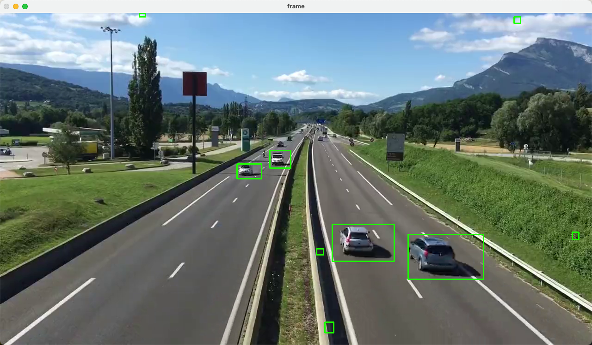


