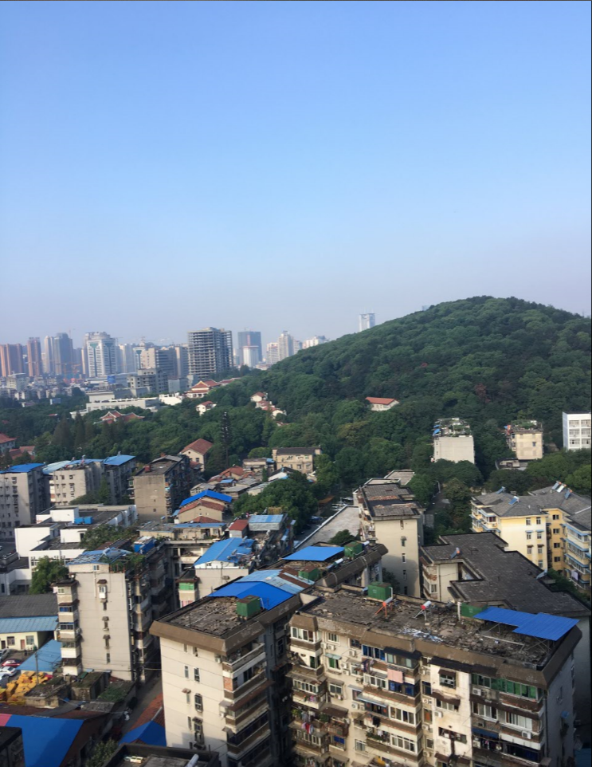
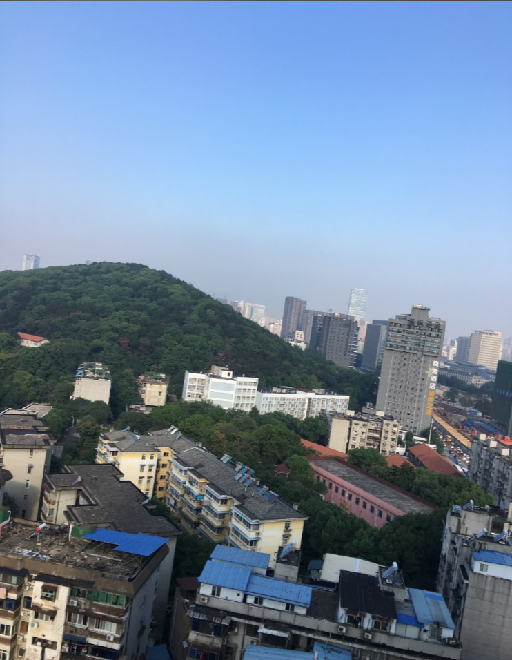
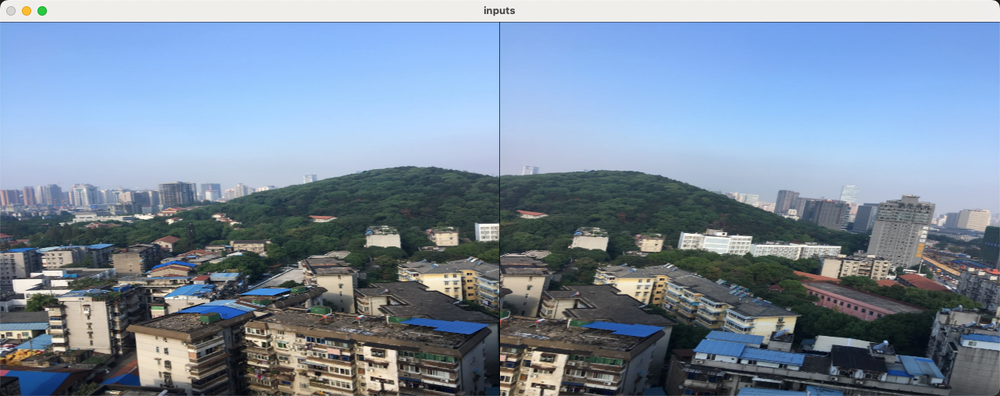
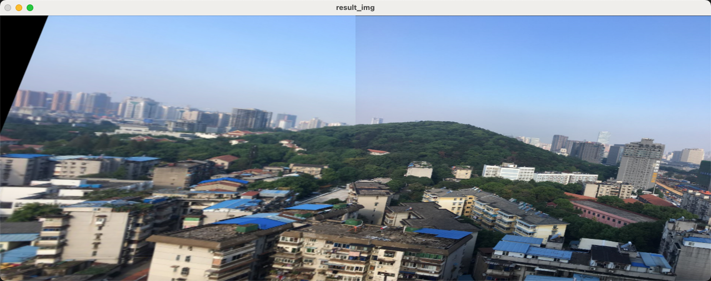

## 11-12、图像拼接 - 概述

- 主要将下面两图，进行拼接成一张图，核心步骤如下
- ① 读取文件并重置尺寸
- ②根据特征点和计算描述子，得到单应性矩阵
- ③图像变换
- ④图像拼接并输出图像







## 11-13、图像拼接 - 重设图片尺寸

```python
import cv2
import numpy as np 

img1 = cv2.imread("./images/opencv/特征匹配/map1.png")
img2 = cv2.imread("./images/opencv/特征匹配/map2.png")

# 将两张图片进行尺寸统一
img1 = cv2.resize(img1,(640,480))
img2 = cv2.resize(img2,(640,480))

# 借助hstack展示图片
inputs = np.hstack((img1,img2))
cv2.imshow("inputs", inputs)

cv2.waitKey(0)
```

- 将两张图片尺寸统一，并且合并在一张图片
- `np.hstack((img1,img2))` 将两张图片按水平方向（列顺序）堆叠数组构成一个新的数组




## 11-14、图像拼接 - 获取单应性矩阵

- ① 创建特征转换对象
- ② 通过特征转换对象获取特征点和描述子
- ③ 创建特征匹配器
- ④ 进行特征匹配
- ⑤ 过滤特征，找出有效的特征匹配点

```python
def get_homo(img1, img2):
  # ①创建特征提取器
  SIFT = cv2.SIFT_create()
  # ②用特征提取器计算特征点和描述子
  kp1, desc1 = SIFT.detectAndCompute(img1,None)
  kp2, desc2 = SIFT.detectAndCompute(img2,None)
  # ③创建暴力匹配器
  BF = cv2.BFMatcher()
  matches = BF.knnMatch(desc1, desc2,k=2)

  # ④过滤出优质的匹配点
  goodMatches = []
  for (m,n) in matches:
    if m.distance < 0.8 * n.distance:
      goodMatches.append(m)
    
  if len(goodMatches) < 8 :
    print("Errror Dot not enough!")
  # ⑤找到单应性矩阵
  img1_pts = []
  img2_pts = []
  for m in goodMatches:
    img1_pts.append(kp1[m.queryIdx].pt)
    img2_pts.append(kp2[m.trainIdx].pt)
  
  img1_pts = np.float32(img1_pts).reshape(-1,1,2)
  img2_pts = np.float32(img2_pts).reshape(-1,1,2)
  h , _ = cv2.findHomography(img1_pts,img2_pts,cv2.RANSAC, 5.0)
  # ⑥测试代码，测试匹配效果
#   mask_matches = [[0, 0] for i in range(len(matches))]
#   for i, (m,n) in enumerate(matches):
#     if m.distance < 0.8*n.distance:
#       mask_matches[i] = [1, 0]
#   ret = cv2.drawMatchesKnn(img1,kp1,img2,kp2,matches,None,
#                            matchColor=(0,255,0),singlePointColor=(255,0,0),
#                            matchesMask=mask_matches,flags=0)
#   cv2.imshow("ret", ret)
#   cv2.waitKey(0)

  return h
```

## 11-15、图像拼接 - 平移和拼接

```python
def stich_image(img1, img2, h):
  # ①获取每张图片的四个角点
  h1, w1, _ = img1.shape
  h2, w2, _ = img2.shape
  img1_corner = np.float32([[0,0], [0,h1], [w1,h1], [w1,0]]).reshape(-1,1,2)
  img2_corner = np.float32([[0,0], [0,h2], [w2,h2], [w2,0]]).reshape(-1,1,2)
  # ②对图片进行变换（单应性矩阵使图进行旋转，平移）
  img1_transform = cv2.perspectiveTransform(img1_corner,h)
  
  print(img1_transform)
  # ③获取平移矩阵平移的距离
  #[1, 0, dx]
  #[0, 1, dy]         
  #[0, 0, 1 ]
  transform_array = np.array([[1, 0, w1],
                                [0, 1, 0],
                                [0, 0, 1]])

  # ④创建一张大图，用平移矩阵+单应性矩阵,将两张图拼接到一起
  result_img = cv2.warpPerspective(img1, transform_array.dot(h), (w1*2,h1))  
  result_img[0:h1,w1:w1*2] = img2[0:h1,0:w1]

  return result_img
```


## 11-16、图像拼接 - 完整代码

```python
import cv2
import numpy as np 

def get_homo(img1, img2):
  # ①创建特征提取器
  SIFT = cv2.SIFT_create()
  # ②用特征提取器计算特征点和描述子
  kp1, desc1 = SIFT.detectAndCompute(img1,None)
  kp2, desc2 = SIFT.detectAndCompute(img2,None)
  # ③创建暴力匹配器
  BF = cv2.BFMatcher()
  matches = BF.knnMatch(desc1, desc2,k=2)

  # ④过滤出优质的匹配点
  goodMatches = []
  for (m,n) in matches:
    if m.distance < 0.8 * n.distance:
      goodMatches.append(m)
    
  if len(goodMatches) < 8 :
    print("Errror Dot not enough!")
  # ⑤找到单应性矩阵
  img1_pts = []
  img2_pts = []
  for m in goodMatches:
    img1_pts.append(kp1[m.queryIdx].pt)
    img2_pts.append(kp2[m.trainIdx].pt)
  
  img1_pts = np.float32(img1_pts).reshape(-1,1,2)
  img2_pts = np.float32(img2_pts).reshape(-1,1,2)
  h , _ = cv2.findHomography(img1_pts,img2_pts,cv2.RANSAC, 5.0)
  # ⑥测试代码，测试匹配效果
#   mask_matches = [[0, 0] for i in range(len(matches))]
#   for i, (m,n) in enumerate(matches):
#     if m.distance < 0.8*n.distance:
#       mask_matches[i] = [1, 0]
#   ret = cv2.drawMatchesKnn(img1,kp1,img2,kp2,matches,None,
#                            matchColor=(0,255,0),singlePointColor=(255,0,0),
#                            matchesMask=mask_matches,flags=0)
#   cv2.imshow("ret", ret)
#   cv2.waitKey(0)

  return h

def stich_image(img1, img2, h):
  # ①获取每张图片的四个角点
  h1, w1, _ = img1.shape
  h2, w2, _ = img2.shape
  img1_corner = np.float32([[0,0], [0,h1], [w1,h1], [w1,0]]).reshape(-1,1,2)
  img2_corner = np.float32([[0,0], [0,h2], [w2,h2], [w2,0]]).reshape(-1,1,2)
  # ②对图片进行变换（单应性矩阵使图进行旋转，平移）
  img1_transform = cv2.perspectiveTransform(img1_corner,h)
  
  print(img1_transform)
  # ③获取平移矩阵平移的距离
  #[1, 0, dx]
  #[0, 1, dy]         
  #[0, 0, 1 ]
  transform_array = np.array([[1, 0, w1],
                                [0, 1, 0],
                                [0, 0, 1]])

  # ④创建一张大图，用平移矩阵+单应性矩阵,将两张图拼接到一起
  result_img = cv2.warpPerspective(img1, transform_array.dot(h), (w1*2,h1))  
  result_img[0:h1,w1:w1*2] = img2[0:h1,0:w1]

  return result_img


img1 = cv2.imread("./images/opencv/特征匹配/map1.png")
img2 = cv2.imread("./images/opencv/特征匹配/map2.png")

# 将两张图片进行尺寸统一
img1 = cv2.resize(img1,(640,480))
img2 = cv2.resize(img2,(640,480))

# 获取两张图片的单应性矩阵
h = get_homo(img1, img2)
# 图像拼接
result_img = stich_image(img1, img2, h)

cv2.imshow("result_img",result_img)
cv2.waitKey(0)


```

- 拼接效果如下
- **中间那条缝可以用左右像素取平均值的办法，让它们看起来更协调**




