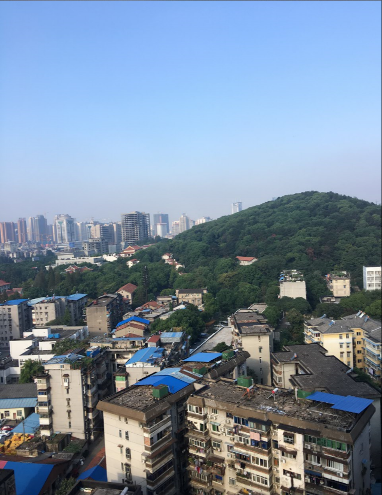

## 11-1、特征点检测与匹配

> **OpenCV的特征检测可以做哪些事情呢？**
>
> ①图像搜索，以图搜图
>
> ②拼图游戏
>
> ③图像拼接，将两长切有关联的图拼接到一起


> **什么是角点？**
>
> 在特征中最重要的是角点
>
> 灰度梯度最大值对应的像素
>
> 两条线的交点
>
> 极值点（一阶导数最大值，但二阶导数为0）


## 11-2、Harris角点检测


> **Harris角点检测逻辑**
>
> **光滑地区：**无论向哪里移动，衡量系数不变
>
> **边缘地址：**垂直边缘移动时，衡量系统变化剧烈
>
> **在角点处：**往哪个方向移动时，衡量系统都变化剧烈


```python
import cv2
import numpy as np 

blockSize = 2
ksize = 3
k = 0.04

img = cv2.imread('./images/opencv/08/chess.png')
oriImg = img.copy()

#灰度化
gray = cv2.cvtColor(img, cv2.COLOR_BGR2GRAY)
#Harris
dst = cv2.cornerHarris(gray,blockSize,ksize,k)
#角点展示
img[dst>0.01*dst.max()] = [0,0,255]

cv2.imshow("oriImg", oriImg)
cv2.imshow("img", img)
cv2.waitKey(0)
```

- 可以看到，很多角点都被检测出来了，并且画上了红点标记


## 11-3、Shi-Tomasi角点检测

> **Shi-Tomasi 是 Harris 角点检测的改进版；也是我们更常用的一种角点检测的方式**
>
> Harris角点检测算的稳定性和k有关，而 k 是个经验值，不好设定最佳值


```python
import cv2
import numpy as np 
#图片读取
img = cv2.imread('./images/opencv/08/chess.png')
oriImg = img.copy()
#灰度化
gray = cv2.cvtColor(img,cv2.COLOR_BGR2GRAY)
#Shi-Tomasi角点检测
corners = cv2.goodFeaturesToTrack(gray, 0, 0.01, 10)
corners = np.int0(corners)

print(corners[0])
for c in corners:
  x,y = c.ravel()
  cv2.circle(img,(x,y),3,(0,0,255),-1)

cv2.imshow("oriImg",oriImg)
cv2.imshow("img",img)
cv2.waitKey(0)
```


- 可以看到效果和Harris角点检测基本一致，但是调用更加简单


## 11-4、SIFT关键点检测

> **SIFT(Scale Invariant Feature Transform)：SIFT 被认为是一种稳健、尺度不变且对旋转、光照等变化具有较强鲁棒性的特征描述算法，原理较复杂。**
>
> Harris 主要基于局部梯度的变化来检测角点。
>
> SIFT 则更加复杂，结合了尺度空间和方向信息，生成了更具描述性的特征描述。

```python
import cv2
import numpy as np 
#图片读取
img = cv2.imread('./images/opencv/08/chess.png')
oriImg = img.copy()
#灰度化
gray = cv2.cvtColor(img,cv2.COLOR_BGR2GRAY)
#初始化SIFT
sift = cv2.SIFT_create()
#进行检测
kp = sift.detect(gray,None)
#绘制keypoints
cv2.drawKeypoints(gray, kp, img)
cv2.imshow("img", img)
cv2.imshow("oriImg",oriImg)
cv2.waitKey(0)	
```

- 可以看到SIFT检测结果更加复杂


## 11-5、计算SIFT描述子

> **关键点：**位置、大小和方向。
>
> **关键点描述子：**记录了关键点周围对其有贡献的像素点的一组向量值，其不受仿射变换、关照变换等影响。

```python
import cv2
import numpy as np 
#图片读取
img = cv2.imread('./images/opencv/08/chess.png')
oriImg = img.copy()
#灰度化
gray = cv2.cvtColor(img,cv2.COLOR_BGR2GRAY)
#初始化SIFT
sift = cv2.SIFT_create()
#进行检测、并且生成描述子
kp, des = sift.detectAndCompute(gray, None)
#打印描述子进行观察
print(des[0])
#绘制keypoints
cv2.drawKeypoints(gray, kp, img)
cv2.imshow("oriImg",oriImg)
cv2.imshow("img", img)
cv2.waitKey(0)
```

- 暂时不懂描述子拿来干啥的，后面再说吧。


## 11-6、SURF

> SURF(Speeded-Up Robust Features)：SIFT最大的问题就是速度慢，因此才有SUFR。

- 好像在我安装OpenCV版本上不支持

```python

#初始化SURF
SURF = cv2.SURF_create()
#进行检测、并且生成描述子
kp, des = SURF.detectAndCompute(gray, None)
```

## 11-7、ORB特征检测

> ORB最大的优点：可以做到实时检测

```python
import cv2
import numpy as np 
#图片读取
img = cv2.imread('./images/opencv/08/chess.png')
oriImg = img.copy()
#灰度化
gray = cv2.cvtColor(img,cv2.COLOR_BGR2GRAY)
#初始化 ORB
ORB = cv2.ORB_create()
#进行检测、并且生成描述子
kp, des = ORB.detectAndCompute(gray, None)
#打印描述子进行观察
print(des[0])
#绘制keypoints
cv2.drawKeypoints(gray, kp, img)
cv2.imshow("oriImg",oriImg)
cv2.imshow("img", img)
cv2.waitKey(0)
```

- 可以看到ORB检测出来的点极少


> 从检测质量来看：SIFT > SURF > ORB
>
> 从检测速度来看：ORB > SURF > SIFT


## 11-8、暴力特征匹配

> **BF (Brute-Force)**，暴力特征匹配，也就是两图所有的特征拿出，循环暴力匹配。

```python
import cv2
import numpy as np 
#图片读取
img1 = cv2.imread("./images/opencv/特征匹配/opencv_search.png")
img2 = cv2.imread("./images/opencv/特征匹配/opencv_orig.png")
#灰度化
gray1 = cv2.cvtColor(img1,cv2.COLOR_BGR2GRAY)
gray2 = cv2.cvtColor(img2,cv2.COLOR_BGR2GRAY)
#初始化 SIFT
SIFT = cv2.SIFT_create()
#进行检测、并且生成描述子
kp1, des1 = SIFT.detectAndCompute(gray1, None)
kp2, des2 = SIFT.detectAndCompute(gray2, None)
#进行暴力特征匹配
bf = cv2.BFMatcher(cv2.NORM_L1)
match = bf.match(des1, des2)
#绘图
img3 = cv2.drawMatches(img1, kp1, img2, kp2, match, None)

cv2.imshow("img3",img3)
cv2.waitKey(0)
```

- 下图可以很好的看到匹配结果


## 11-9、FLANN特征匹配

> **FLANN优势：**由于它使用的是邻近近似值匹配，所以速度非常快。
>
> **FLANN劣势：**精度不如暴力匹配法高。


## 11-10、实战FLANN特征匹配


```python
import cv2
import numpy as np 
#图片读取
img1 = cv2.imread("./images/opencv/特征匹配/opencv_search.png")
img2 = cv2.imread("./images/opencv/特征匹配/opencv_orig.png")
#灰度化
gray1 = cv2.cvtColor(img1,cv2.COLOR_BGR2GRAY)
gray2 = cv2.cvtColor(img2,cv2.COLOR_BGR2GRAY)
#初始化 SIFT
SIFT = cv2.SIFT_create()
#进行检测、并且生成描述子
kp1, des1 = SIFT.detectAndCompute(gray1, None)
kp2, des2 = SIFT.detectAndCompute(gray2, None)
#创建匹配器
index_params = dict(algorithm = 1, trees = 5)
search_params = dict(checks = 50)
flann = cv2.FlannBasedMatcher(index_params, search_params)
#进行匹配
matches = flann.knnMatch(des1, des2, k=2)
#准备一个空的掩膜来绘制好的匹配
mask_matches = [[0, 0] for i in range(len(matches))]

#向掩膜中添加数据
for i, (m,n) in enumerate(matches):
  if m.distance < 0.7*n.distance:
    mask_matches[i] = [1, 0]

#绘图
    
ret = cv2.drawMatchesKnn(img1, kp1, img2, kp2, matches, None,
                         matchColor=(0,255,0),singlePointColor=(255,0,0),
                         matchesMask=mask_matches,flags=0)
cv2.imshow('result', ret)
cv2.waitKey()
```

- 最终FLANN匹配效果如下：


## 11-11、图像查找 - 单应性矩阵

> **什么是单应性？**
>
> 一种理解：平面的单应性被定义为从一个平面到另一个平面的投影映射。
>
> 另一种理解：单应性是当一张图是另一张图的一个透视畸变时，在两张图中寻找彼此的一种情况。


```python
import cv2
import numpy as np 
#图片读取
img1 = cv2.imread("./images/opencv/特征匹配/opencv_search.png")
img2 = cv2.imread("./images/opencv/特征匹配/opencv_orig.png")
#灰度化
gray1 = cv2.cvtColor(img1,cv2.COLOR_BGR2GRAY)
gray2 = cv2.cvtColor(img2,cv2.COLOR_BGR2GRAY)
#初始化 SIFT
SIFT = cv2.SIFT_create()
#进行检测、并且生成描述子
kp1, des1 = SIFT.detectAndCompute(gray1, None)
kp2, des2 = SIFT.detectAndCompute(gray2, None)
#创建匹配器
index_params = dict(algorithm = 1, trees = 5)
search_params = dict(checks = 50)
flann = cv2.FlannBasedMatcher(index_params, search_params)
#进行匹配
matchs = flann.knnMatch(des1, des2, k=2)
#组建一个通过了劳氏比率验证的匹配列表
good = []
for i, (m, n) in enumerate(matchs):
    if m.distance < 0.7 * n.distance:
        good.append(m)


if len(good) >= 4:
    srcPts = np.float32([kp1[m.queryIdx].pt for m in good]).reshape(-1, 1, 2)
    dstPts = np.float32([kp2[m.trainIdx].pt for m in good]).reshape(-1, 1, 2)
    # 寻找单应性
    # cv2.findHomography参数：
    # srcPoints：源平面中点的坐标矩阵
    # dstPoints：目标平面中点的坐标矩阵
    # method：计算单应矩阵所使用的方法。不同的方法对应不同的参数，具体如下：RANSAC：基于RANSAC的鲁棒算法
    # ransacReprojThreshold：将点对视为内点的最大允许重投影错误阈值（仅用于RANSAC和RHO方法）
    H, _ = cv2.findHomography(srcPts, dstPts, cv2.RANSAC, 5.0)

    # 执行透射转换，取查询图像的矩形角点，并将其投影到场景中，从而画出边界
    h, w = img1.shape[:2]
    pts = np.float32([[0,0], [0, h-1], [w-1, h-1], [w-1, 0]]).reshape(-1, 1, 2)
    dst = cv2.perspectiveTransform(pts, H)

    cv2.polylines(img2, [np.int32(dst)], True, (0, 0, 255))
else:
    print('the number of good is less than 4.')
    exit()


    
ret = cv2.drawMatchesKnn(img1, kp1, img2, kp2, [good], None)
cv2.imshow('result', ret)
cv2.waitKey(0)	
```

- 上面的题目好难理解啊


## 11-12、图像查找 - 概述

- 主要将下面两图，进行拼接成一张图，核心步骤如下





