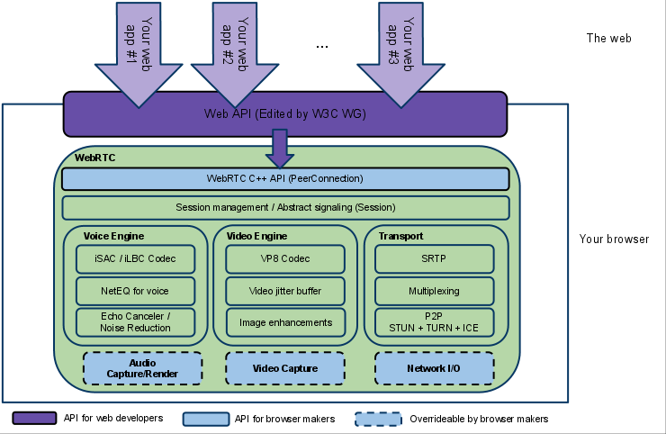
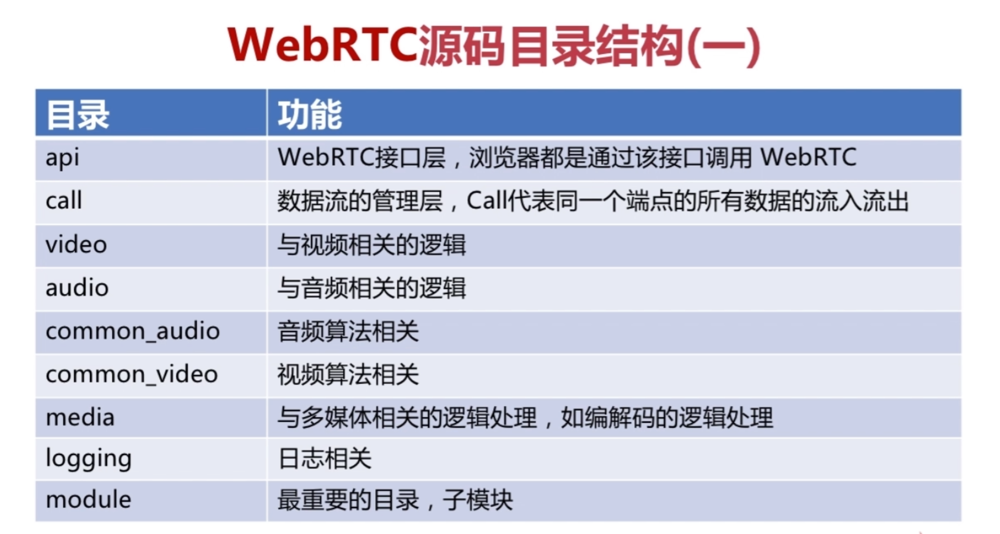
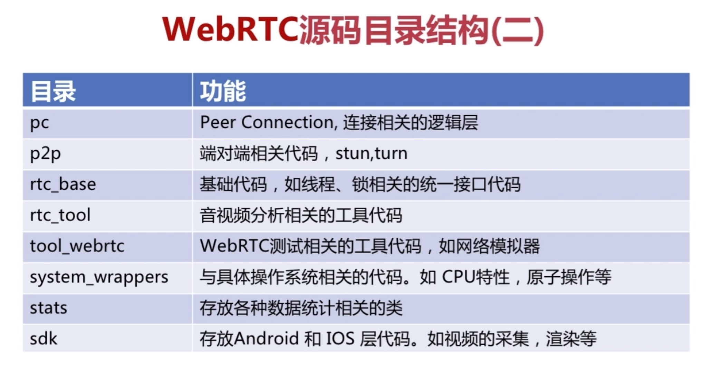
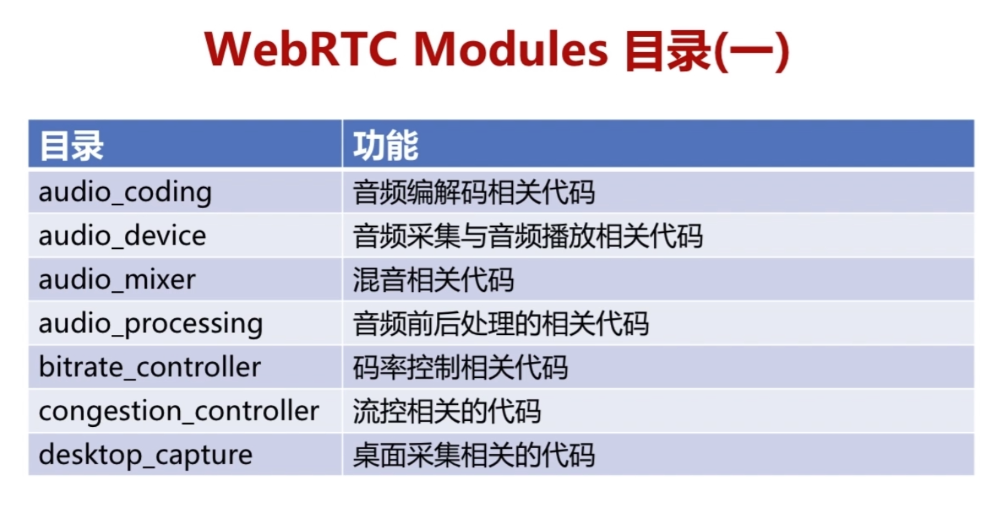
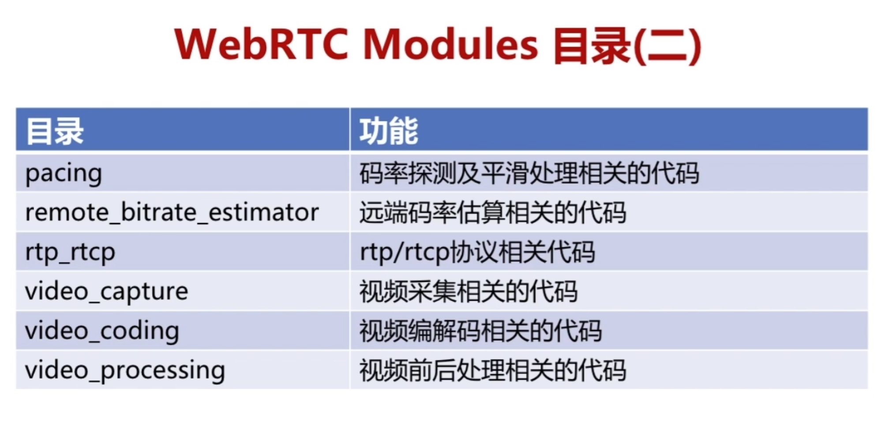
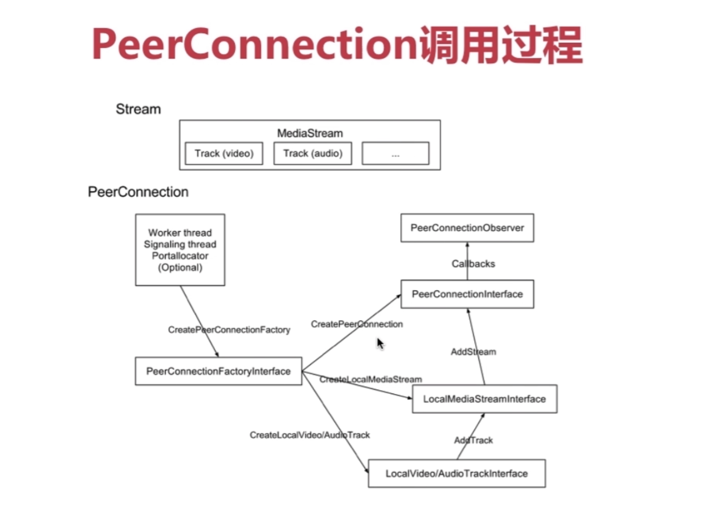
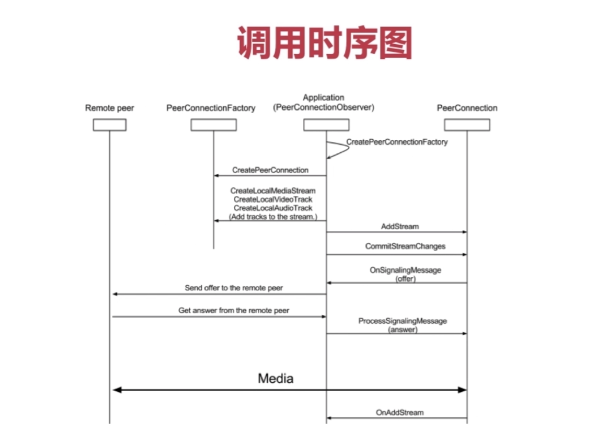

## 一、WebRTC基础概念

### 1、一句话介绍下WebRTC是什么？

- 音视频处理 + 即使通讯的开源库

### 2、WebRTC主要用于web吗？那主要应用于哪些领域呢？

- 一开始是为了web设计的
- 现在不仅仅适用于web，已经全平台通用（包括iOS、安卓）

### 3、那么FFMpeg和WebRTC之间是什么关系呢？

- 两个框架都是音视频领域的霸主。FFmpeg是基础，WebRTC也使用它

- FFMpeg：更多的用于音视频编辑与播放器
- WebRTC：更多的用于音视频实时通信，比如网络抖动、网络丢包、网络评估、回音消除、降噪、自动增益等。

## 二、WebRTC原理与架构

### 1、WebRTC的整体架构图？

- 紫色部分是Web开发者API层
- 蓝色实线部分是面向浏览器厂商的API层
- 蓝色虚线部分浏览器厂商可以自定义实现

### 2、WebRTC的目录结构(后面再回来看)

### 3、WebRTC重要的三个类理解？

- MediaStream：里面可以包含多个轨道，用于音视频传输
- RTCDataChannel：里面可以传输文本、二进制数据(非音视频数据)
- RTCPeerConnection：是一个大而全、最重要的类

### 4、RTCPeerConnection调用过程（后续，一定要能自己绘制，然后换成高清图）

