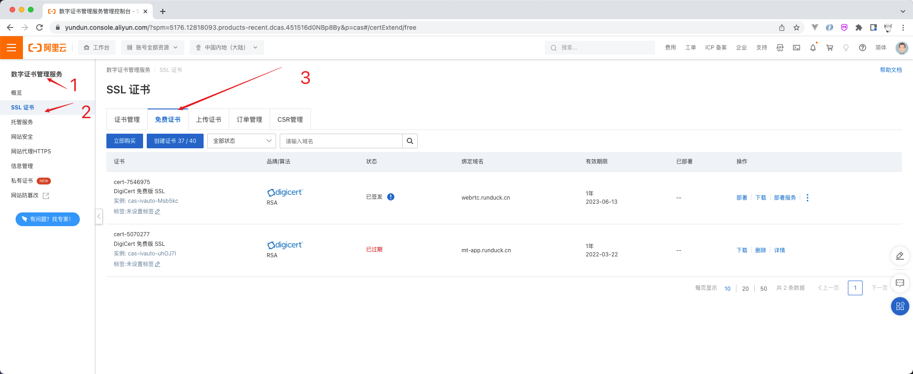
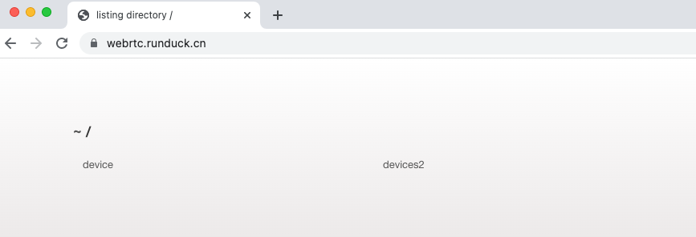
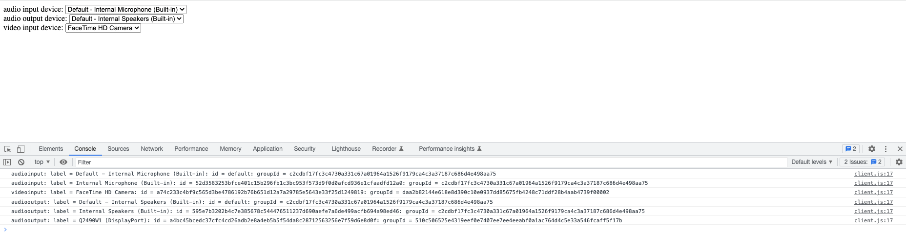

## 一、Nodejs服务器搭建

### 1、为什么要搭建HTTPS服务器？

- <font color="red">搭建服务器的原因</font>：web代码需要一个服务器，才能方便的被浏览器解析展示
- <font color="red">搭建HTTPS的原因</font>：访问用户的(隐私)音视频设备，需要通过HTTPS才能完全访问。


### 2、如何获取HTTPS证书？




- 然后在<font color="red">部署</font>中有各个平台的部署方案，还是非常详细的。


### 3、部署一个最简单的http服务器，代码如下：

```js
'use strict'

var http = require('http');

var serveIndex = require('serve-index');

var express = require('express');
var app = express();

//顺序不能换
app.use(serveIndex('./public'));
app.use(express.static('./public'));

var http_server = http.createServer(app);
http_server.listen(9980, '127.0.0.1');

console.log("webrtc服务启动成功");
```

- `express`：是nodejs的服务器框架
- `serve-index`：是让服务器的资源可以通过web展示出来


### 4、将该服务端挂载在HTTPS下，也就是nginx的https代理


```shell
server {
	listen 443 ssl;   #SSL协议访问端口号为443。此处如未添加ssl，可能会造成Nginx无法启动。
	server_name webrtc.runduck.cn;  #将localhost修改为您证书绑定的域名，例如：www.example.com。
	root html;
	index index.html index.htm;
	ssl_certificate webrtc_cert/7929948_webrtc.runduck.cn.pem;   #将domain name.pem替换成您证书的文件名。
	ssl_certificate_key webrtc_cert/7929948_webrtc.runduck.cn.key;   #将domain name.key替换成您证书的密钥文件名。
	ssl_session_timeout 5m;
	ssl_ciphers ECDHE-RSA-AES128-GCM-SHA256:ECDHE:ECDH:AES:HIGH:!NULL:!aNULL:!MD5:!ADH:!RC4;  #使用此加密套件。
	ssl_protocols TLSv1 TLSv1.1 TLSv1.2;   #使用该协议进行配置。
	ssl_prefer_server_ciphers on;   
	location / {
		  proxy_pass http://127.0.0.1:9980;
	}
}   

server {
    listen       80;
    server_name webrtc.runduck.cn;
    rewrite ^(.*)$ https://${server_name}$1 permanent; 
}

```

- 这样通过 `https://webrtc.runduck.cn/` 就可以访问我们部署好的服务器了。





### 二、获取用户的输入输出设备


### 1、认识 `MediaDevices`  的作用？

- `navigator.mediaDevices` 接口提供访问连接媒体输入的设备
- 比如：照相机、麦克风、屏幕共享等
- 它可以使你取得任何硬件资源的媒体数据


### 2、认识 `MediaDevices.enumerateDevices()` 的作用？

- 获取有关系统中可用的<font color="red">媒体输入和输出设备</font>的一系列信息

- 它的返回值是一个 `promise`


```js
'use strict'
var audioSource  = document.querySelector("select#audioSource");
var audioOutput  = document.querySelector("select#audioOutput");
var videoSource  = document.querySelector("select#videoSource");

if(!navigator.mediaDevices ||
	!navigator.mediaDevices.enumerateDevices){
	console.log('enumerateDevices is not supported!');
}else {
	navigator.mediaDevices.enumerateDevices()
		.then(gotDevices)
		.catch(handleError);
}

function gotDevices(deviceInfos){
	deviceInfos.forEach( function(deviceInfo){
		console.log(deviceInfo.kind + ": label = " 
				+ deviceInfo.label + ": id = "
				+ deviceInfo.deviceId + ": groupId = "
				+ deviceInfo.groupId);	
		var option = document.createElement('option');
		option.text = deviceInfo.label;
		option.value = deviceInfo.deviceId;
		if(deviceInfo.kind === 'audioinput'){
			audioSource.appendChild(option);
		}else if(deviceInfo.kind === 'audiooutput'){
			audioOutput.appendChild(option);
		}else if(deviceInfo.kind === 'videoinput'){
			videoSource.appendChild(option);
		}
	});

}

function handleError(err){
	console.log(err.name + " : " + err.message);
}

```

- 代码运行成功如下：



### 3、但是上述代码，在Safari中运行，却不能拿到设备信息，为什么呢？


- 因为Safari有更加严格的用户隐私权限保护协议
- 当调用 `navigator.mediaDevices.getUserMedia(constraints)` 时，可以获取用户权限弹窗，用户同意即可获取设备信息了。
