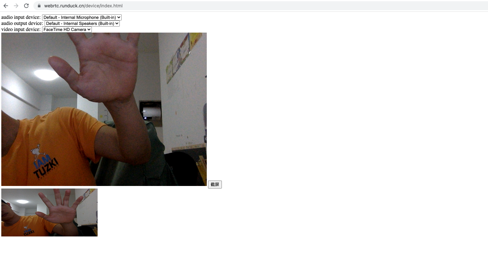
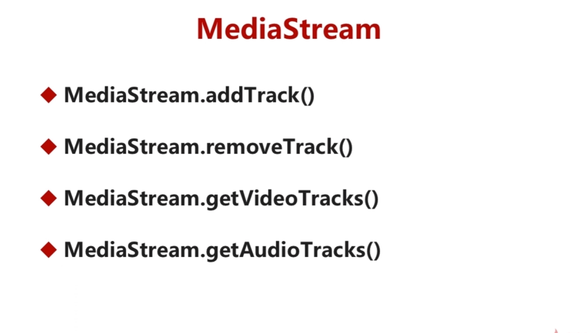
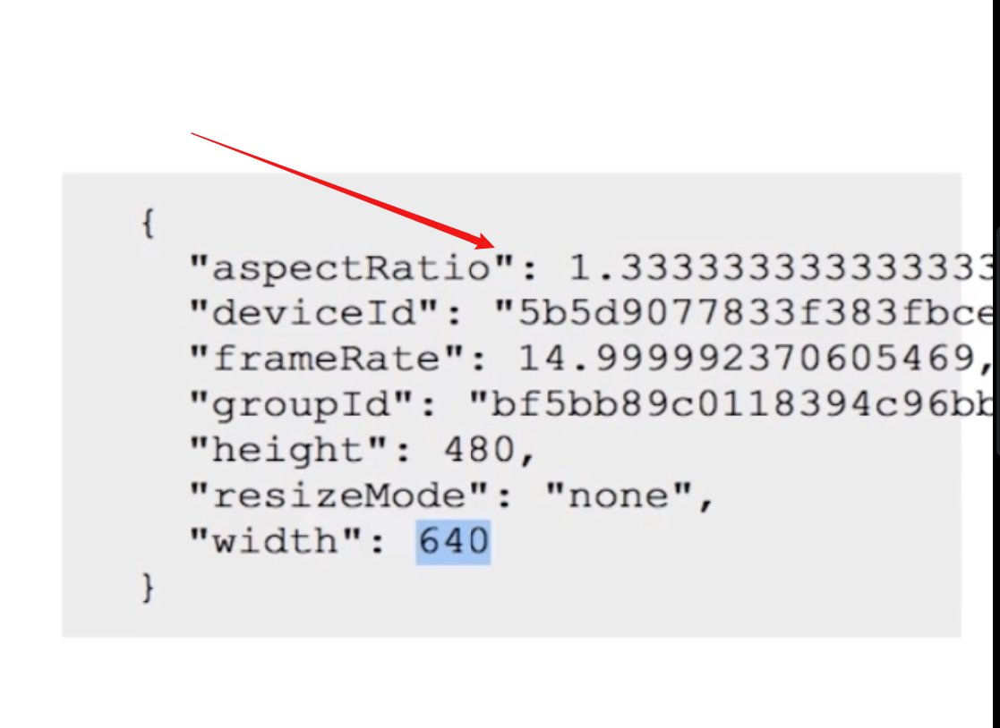

## 一、音视频数据采集

### 1、认识 `MediaDevices.getUserMedia()` 是什么的？

- 会提示用户给与使用媒体输入的许可，媒体输入会产生一个 `MediaStream`，里面包含了请求媒体类型的轨道
- 比如：视频轨道、音频轨道
- 它返回一个 `Promise` 对象，用户授权同意后，resolve回调一个 MediaStream对象。

- 详细用法： https://developer.mozilla.org/zh-CN/docs/Web/API/MediaDevices/getUserMedia


### 2、由于各个浏览器厂商对媒体设备的获取，以及音视频流的获取方法名称不同，如果适配呢？

- 通常借助一个 `adapter.js` 来做适配
- https://webrtc.github.io/adapter/adapter-latest.js


### 3、获取视频音频，以及展示的核心代码如下：

- html代码

```html
<video id="video" playsinline autoplay></video>
```


- js代码

```js
const videoElement = document.querySelector('video');
function start() {
	const constraints = { audio: true, video: true };
	navigator.mediaDevices.getUserMedia(constraints)
	.then((stream)=> {
		videoElement.srcObject = stream;
		getDevicesInfo();
	})
	.catch((err)=> {
		console.log("getUserMedia" + err);
	})
}
```

- 其中constraint 可以对音频和视频的参数进行适配
- 视频：宽高比例、帧率、前后摄像头...
- 音频：采样率、采样大小、音量、回音消除、自动增益、降噪...


### 4、如何获取视频流中的某一帧数据呢？

- html代码

```html
		<video id="video" autoplay playsinline></video>
		<button id="snapshot">截屏</button>
		<div>
			<canvas style="height: 200px; height: 150px;" id="picture"></canvas>
		</div>
```

- js代码

```javascript
snapshotElement.onclick = (event) => {
	pictureElement.getContext("2d").drawImage(videoElement,
		0,0,
		pictureElement.width, pictureElement.height);
}
```

- 思路：借助 `canvas` 标签，把 `video` 中数据绘制出来

### 5、如何仅仅采集和播放音频呢？

- html代码

```html
<audio id="audio" autoplay controls></audio>
```

- js代码

```js
const audioElement = document.querySelector("audio");

function start() {
	const constraints = { audio: true, video: false };
	navigator.mediaDevices.getUserMedia(constraints)
	.then((stream)=> {
		audioElement.srcObject = stream;
		getDevicesInfo();
	})
	.catch((err)=> {
		console.log("getUserMedia" + err);
	})
}
```




### 6、一些MediaStream的常用API（用到再说吧）






