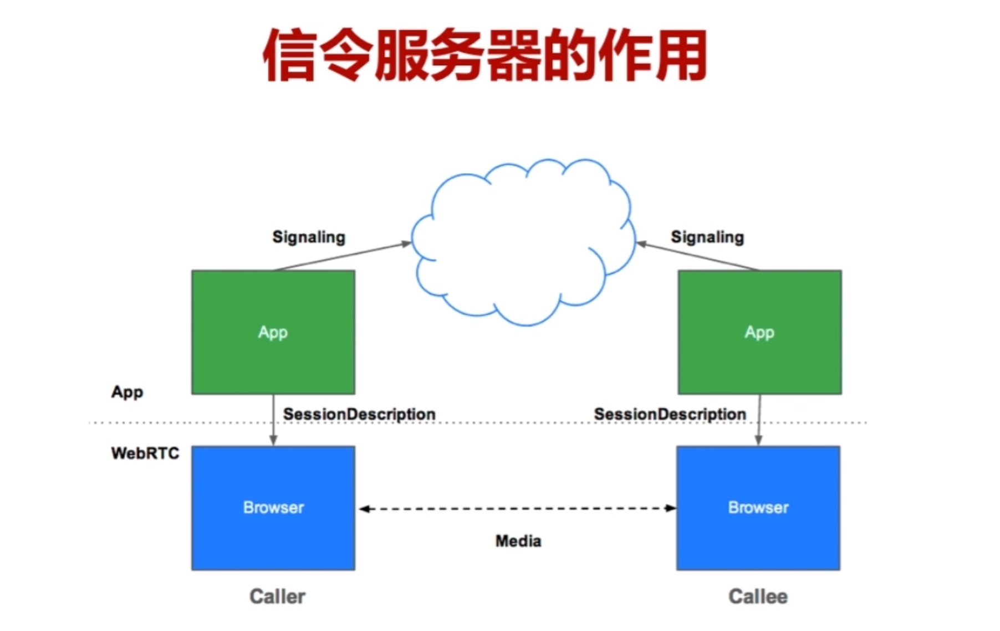
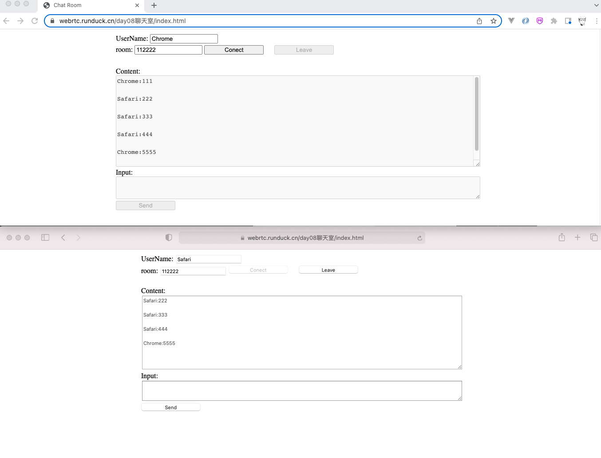

## 一、认识 socket.io

### 1、借助 socket.io 发送给某些对象的相关API？

```js
//给本次连接发消息
socket.emit()

//给某个房间内所有人发消息
io.in(room).emit()

//除本连接外，给某个房间内所有人发消息
socket.to(room).emit()

//除本连接外，给所有人发消息
socket.brocast.emit()
```


### 2、socket.io 监听和发送具体消息的格式？

```js
//发送action命令
S:	socket.emit('action');
C:	socket.on('action', function(){...});

//发送action命令，还有data数据
S:	socket.emit('action', data);
C:	socket.on('action', function(data){...});

//发送action命令，还有两个数据
S:	socket.emit('action', arg1, arg2);
C:	socket.on('action', function(arg1, arg2){...});
                                             
//发送action命令，还有回调函数
S:	socket.emit('action', data, function(arg1, arg2){...});
C:	socket.on('action', function(data, fn){...});
```


### 3、在WebRTC中信令服务器有什么作用？



- ①终端之间交换<font color="red">媒体相关信息</font>（比如编码格式、是否支持音频、是否支持视频等）
- ②终端之间交换<font color="red">网络相关信息</font>（比如ip地址、local地址、公网地址等）
- ③终端之间进行<font color="red">一些业务操作</font> （比如加入房间、退出房间等）


### 4、socket.io是基于TCP还是UDP呢？

- 对于音视频来讲可以使用UDP，丢了一两帧数据关系不大。
- 但是对于信令或业务请求来讲，一定要能拿到可靠结果，那就需要TCP来保证传输的可靠性。
- socket.io 是基于TCP的


## 二、代码借助 socket.io 实现简易版聊天室


### 1、安装依赖库

```shell
#这里进行指定版本，防止一些方法已经发送变化
npm install log4js@5.2.0
npm install socket.io@2.0.4  
```


### 2、代码实现聊天室(服务端部分)

- 服务端代码

```js
//服务端代码
'use strict'

var http = require('http');
var serveIndex = require('serve-index');
var express = require('express');
var socketIo = require('socket.io');
var log4js = require('log4js');

//log4js的基本配置（无须多做了解）
log4js.configure({
  appenders: {
      file: {
          type: 'file',
          filename: 'app.log',
          layout: {
              type: 'pattern',
              pattern: '%r %p - %m',
          }
      }
  },
  categories: {
     default: {
        appenders: ['file'],
        level: 'debug'
     }
  }
});

var logger = log4js.getLogger();
var app = express();

//顺序不能换
app.use(serveIndex('./public'));
app.use(express.static('./public'));

var http_server = http.createServer(app);
http_server.listen(9980, '127.0.0.1');

//绑定socket.io到http服务
var io = socketIo.listen(http_server)

io.sockets.on('connection', (socket)=> {
  console.log("有人发起了链接请求111");
  
  socket.on('message', (room, data)=> {
    console.log("message" + room + data);
    io.in(room).emit('message', room, socket.id, data); //房间内所有人，除了自己
  });

  socket.on('join', (room)=> {
		socket.join(room);
		var myRoom = io.sockets.adapter.rooms[room];
		var users = Object.keys(myRoom.sockets).length;
		logger.log('the number of user in room is: ' + users);
	 	socket.emit('joined', room, socket.id);	
  });

  socket.on('leave', (room)=> {
		var myRoom = io.sockets.adapter.rooms[room];
		var users = Object.keys(myRoom.sockets).length;
		logger.log('the number of user in room is: ' + (users-1));

		socket.leave(room);
		socket.to(room).emit('bye', room, socket.id)//房间内所有人,除自己外
	 	socket.emit('leaved', room, socket.id);	
	});
});

console.log("webrtc服务启动成功");


```


### 3、代码实现客户端部分

- index.html 代码部分

```html
<!-- index.html 代码部分 -->
<html>
	<head>
		<title>Chat Room</title>
		<link rel="stylesheet" href="./css/main.css"></link>
	</head>
	<body>
		<table align="center">
			<tr>
				<td>
					<label>UserName: </label>
					<input value="Chrome" type=text id="username"></input>
				</td>
			</tr>
			<tr>
				<td>
					<label>room: </label>
					<input value="112222" type=text id="room"></input>
					<button id="connect">Conect</button>
					<button id="leave" disabled>Leave</button>
				</td>
			</tr>
			<tr>
				<td>
					<label>Content: </label><br>
					<textarea disabled style="line-height: 1.5;" id="output" rows="10" cols="100"></textarea>
				</td>
			</tr>
			<tr>
				<td>
					<label>Input: </label><br>
					<textarea disabled id="input" rows="3" cols="100"></textarea>
				</td>
			</tr>
			<tr>
				<td>
					<button id="send">Send</button>
				</td>
			</tr>
		</table>

		<script src="https://cdnjs.cloudflare.com/ajax/libs/socket.io/2.0.3/socket.io.js"></script>
		<script src="./js/client.js"></script>
	</body>
</html>

```

-  ./js/client.js 代码实现

```js
// ./js/client.js 代码实现

'use strict'
var userName = document.querySelector('input#username');
var inputRoom = document.querySelector('input#room');
var btnConnect = document.querySelector('button#connect');
var btnLeave = document.querySelector('button#leave');
var outputArea = document.querySelector('textarea#output');
var inputArea = document.querySelector('textarea#input');
var btnSend = document.querySelector('button#send');

var socket;
var room;

btnConnect.onclick = ()=> {
	//connect
	socket = io.connect();

	//recieve message
	socket.on('joined', (room, id) => {
		btnConnect.disabled = true;
		btnLeave.disabled = false;
		inputArea.disabled = false;
		btnSend.disabled = false;
	});

	socket.on('leaved', (room, id) => {
		btnConnect.disabled = false;
		btnLeave.disabled = true;
		inputArea.disabled = true;
		btnSend.disabled = true;

		socket.disconnect();
	});

	socket.on('message', (room, id, data) => {
		console.log('message:' + room + id + data);
		outputArea.scrollTop = outputArea.scrollHeight; //窗口总是显示最后的内容
		outputArea.value = outputArea.value + data + "\n\r";
	})

	socket.on("disconnect", (socket) => {
    btnConnect.disabled = false;
    btnLeave.disabled = true;
    inputArea.disabled = true;
    btnSend.disabled = true;
  });

	//send message
	room = inputRoom.value;
	socket.emit('join', room);
	console.log(userName.value + "发送join信息");
}

btnSend.onclick = () => {
	var data = inputArea.value;
	data = userName.value + ":" + data;
	socket.emit('message', room, data);
	inputArea.value = '';
}

btnLeave.onclick = () => {
	room = inputRoom.value;
	socket.emit('leave', room);
}

inputArea.onkeypress = (event) => {
  //event = event || window.event;
  if (event.keyCode == 13) {
    //回车发送消息
    var data = inputArea.value;
    data = userName.value + ":" + data;
    socket.emit("message", room, data);
    inputArea.value = "";
    event.preventDefault(); //阻止默认行为
  }
};
```


### 4、简易聊天室最终效果图如下





### 5、附上packet.json文件内容

```js
{
  "name": "webserver",
  "version": "1.0.0",
  "description": "",
  "main": "server.js",
  "dependencies": {
    "express": "^4.18.1",
    "log4js": "^5.2.0",
    "serve-index": "^1.9.1",
    "socket.io": "^2.0.4"
  },
  "devDependencies": {},
  "scripts": {
    "test": "echo \"Error: no test specified\" && exit 1",
    "start": "node server.js"
  },
  "author": "",
  "license": "ISC"
}
```

