## 一、基本概念先认识

### 1、NAT的全称是什么？NAT是干什么的？

- NAT：Network Address Translation，即网络地址映射
- 作用：①解决IPV4地址不足的问题 ②保护NAT内部计算机的安全

### 2、STUN的全称是什么？STUN是干什么的？

- STUN：Simple Traversal of UDP Through NAT，即UDP对NAT的简单穿越方式（是一种协议）
- 功能：通过NAT穿越，内网的计算机与外网能够进行P2P连接通信（有点中介信息服务度的感觉）

- 缺陷：①STUN不适合支持TCP连接的穿越 ②STUN方式不支持对称NAT穿越
- STUN的存在目的就是进行NAT穿越
- STUN是典型的客户端/服务端模式，客户端发送请求，服务端进行响应。
- 本章对STUN协议、协议头、协议体都有详细描述，日后需要再回来看。

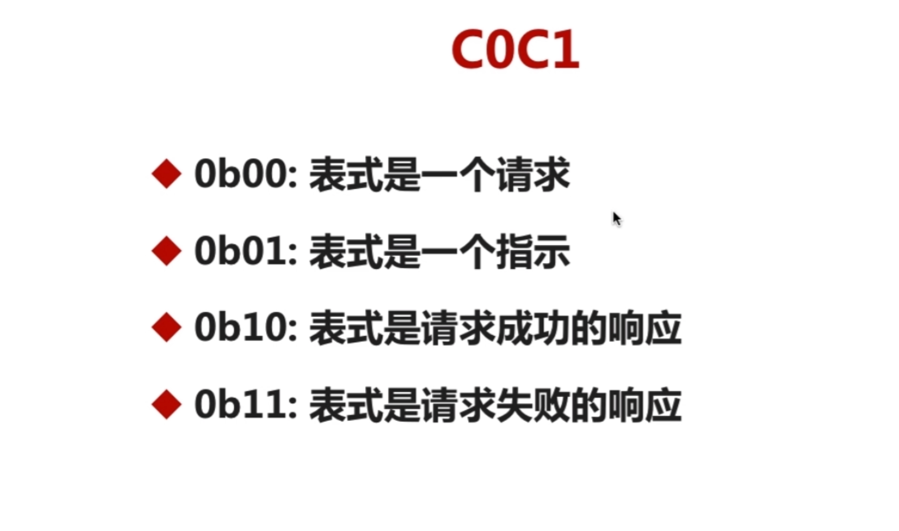

### 3、TURN的全称是什么？TURN是干什么的？

- TURN：Tranversal Using ReplayNAT，即通过Relay方式穿越NAT
- 功能：即私网用户发出的报文都要经过 TURNServer 进行 Relay 转发
- 优点：解决了STUN的无法穿越的问题
- TURN简历在STUN之上，消息格式使用STUN格式消息
- TURN Client 要求服务端分配一个公网IP和Port用户接收或发送数据。

### 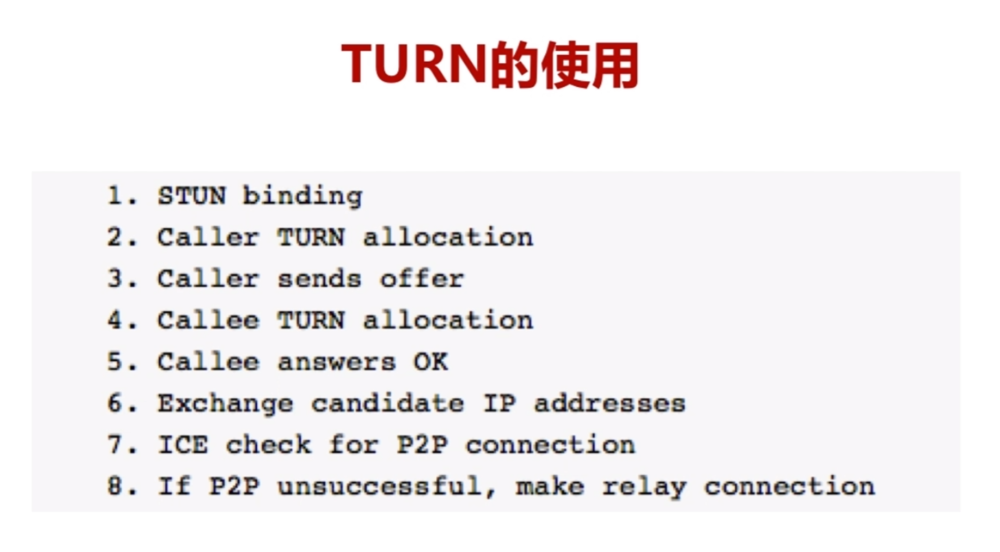4、ICE的全称是什么？ICE是干什么的？

- ICE：Interactive Connectivity EStablishment
- 功能：ICE不是一种协议，而是一个framework，它整合了STUN和TURN
- 举例：`从①局域网尝试、②NAT穿越尝试、③TRUN服务端中转 `这三种模式中，选一个最佳通信模式

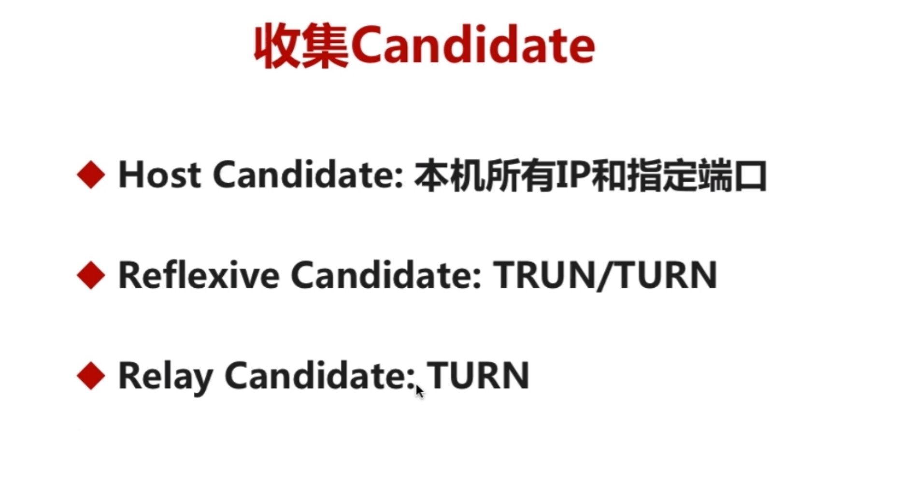

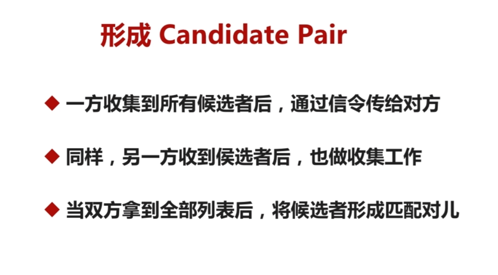

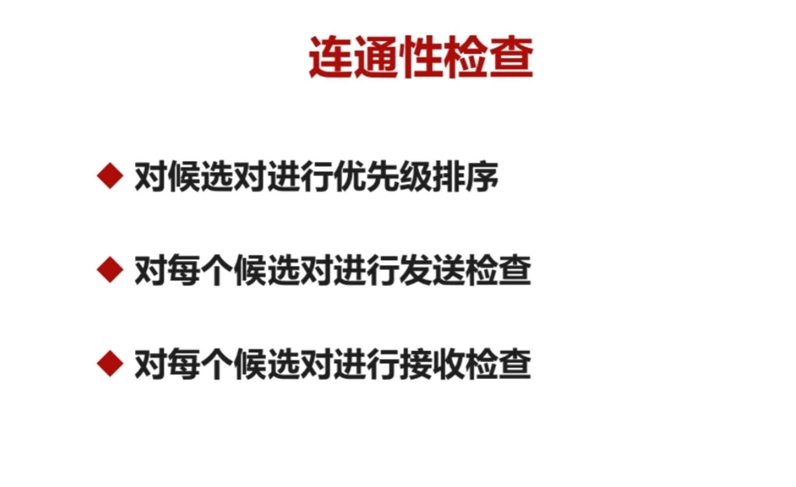

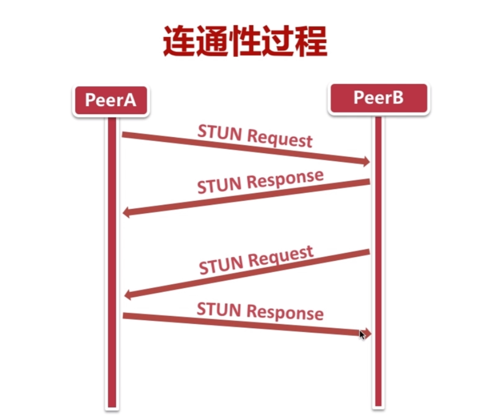

## 二、更深入认识NAT

### 1、再次认识NAT

- NAT就是内网地址转换到公网地址
- 简单来说就是一张地址`映射表`

### 2、NAT有哪四个种类？

- 完全锥型NAT
- 地址限制锥型NAT
- 端口限制锥型NAT
- 对称型NAT

### 3、什么是完全锥型NAT？

- Full cone NAT

- 内部机器A访问外网机器C，NAT打开一个端口，后面**外网的任意ip和任意port**都可以访问这个端口，也就是**任意ip+任意port**可以访问机器A

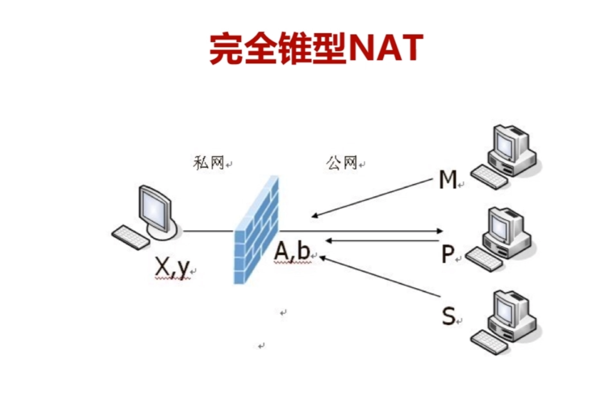

### 4、什么是地址限制锥型NAT？

- Address Restricted Cone
- 内部机器A访问外网机器C，NAT打开一个端口，后面**机器C的任意port**可以访问这个端口，就是只能**固定ip+任意port**访问A

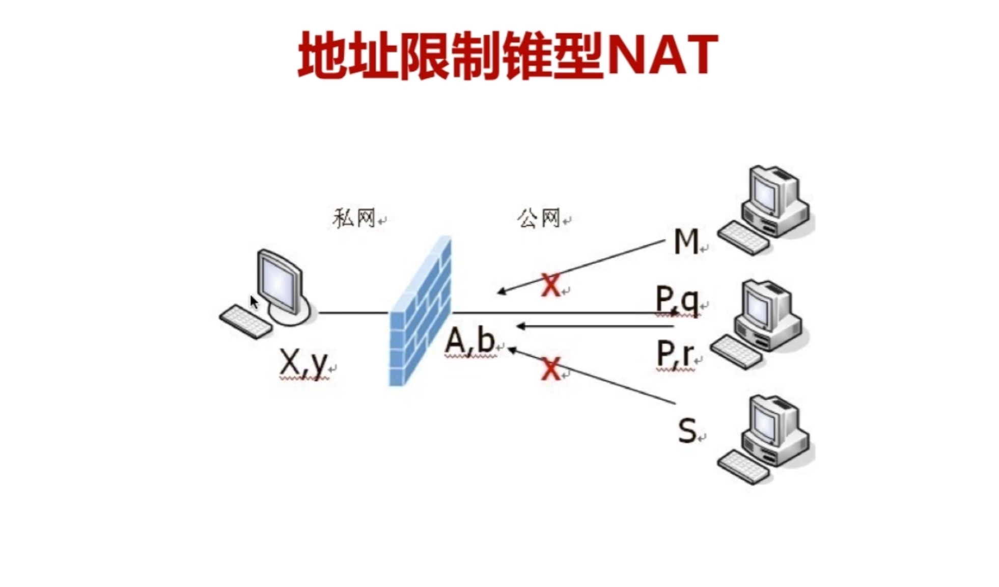

### 5、什么是端口限制锥型NAT？

- Port Restricted Cone
- 内部机器A访问外网机器C，NAT打开一个端口，后面**机器C的固定port**可以访问这个端口，就是只能**固定ip+固定port**访问A

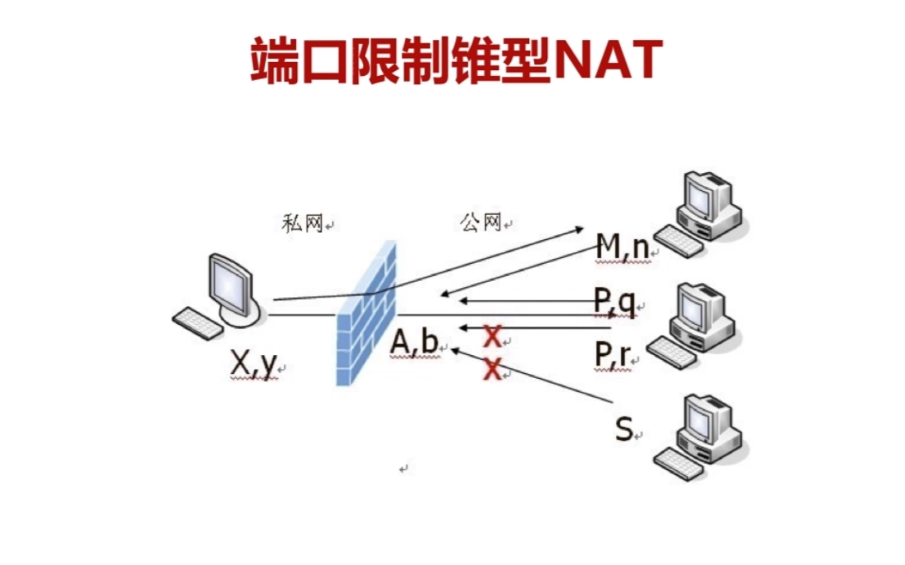

### 6、什么是对称型NAT？

- Symmetric
- 连接不同的外部Server，NAT打开的端口会变化。也就是内部机器A连接外网机器B时，NAT会打开一个端口，连接外网机器C时又会打开另外一个端口。

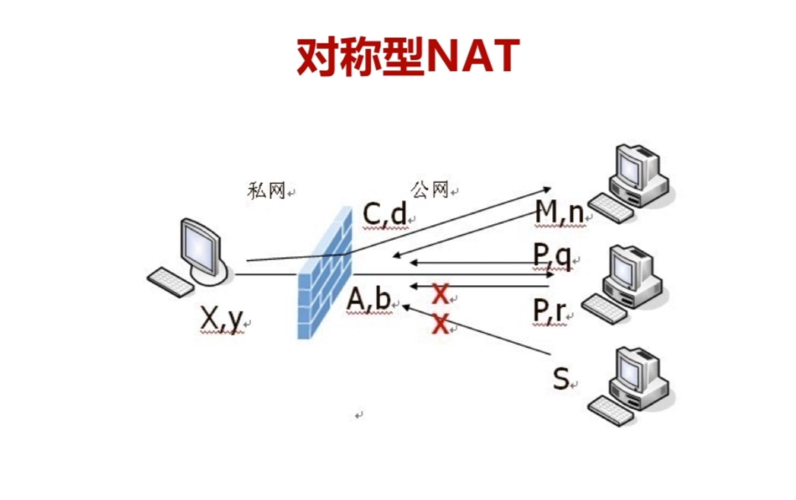

## 三、认识NAT穿越过程

### 1、NAT穿越原理是什么？

- 基于各种NAT特性，让两台私网机器能够p2p通信

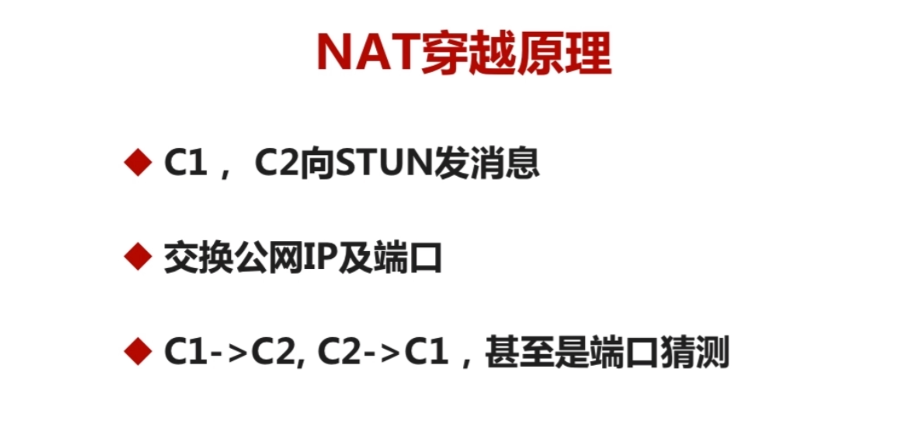

### 2、NAT能穿越成功的组合？（记住哪两种不可能打通即可）

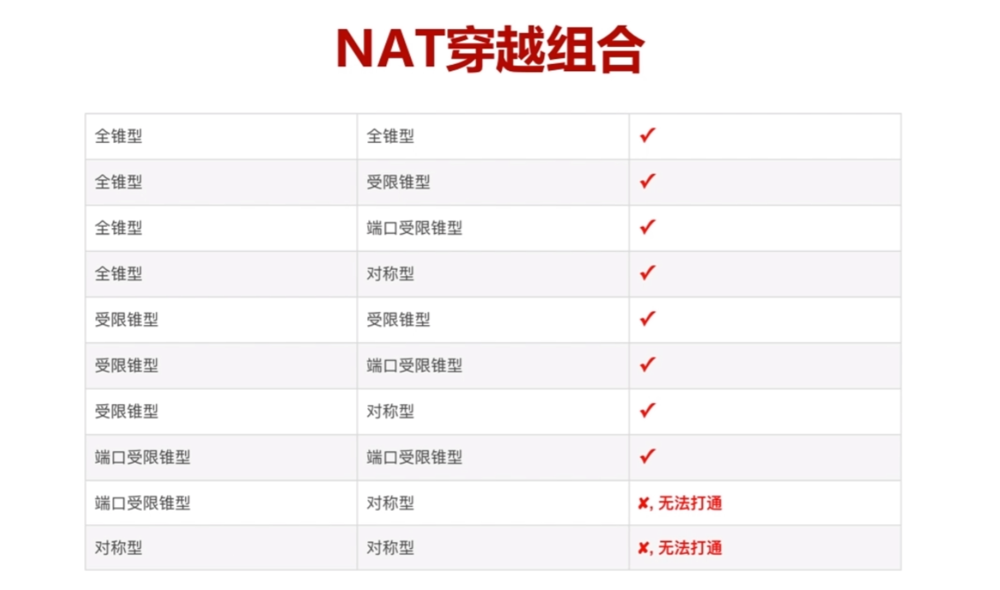

### 3、NAT类型判断过程？（这图很经典，后面不懂再回来看）

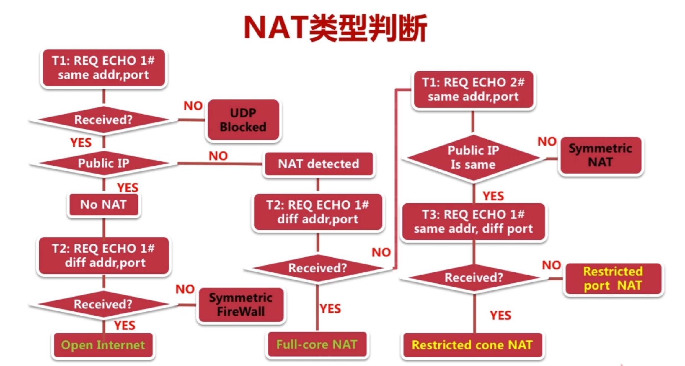
