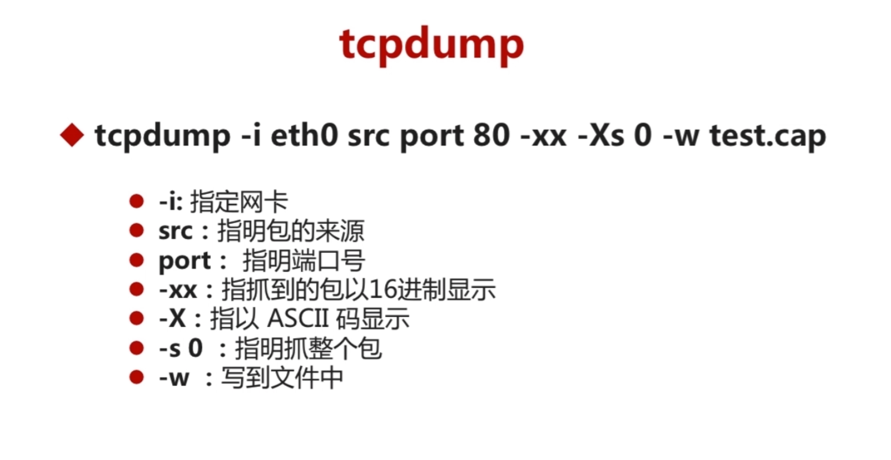
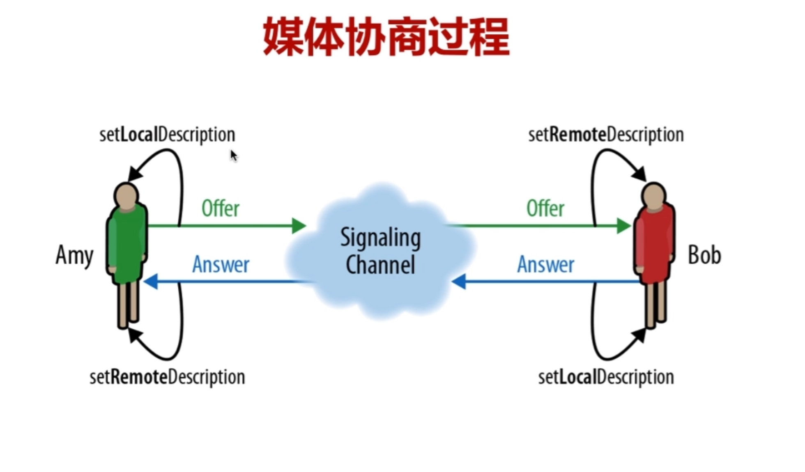
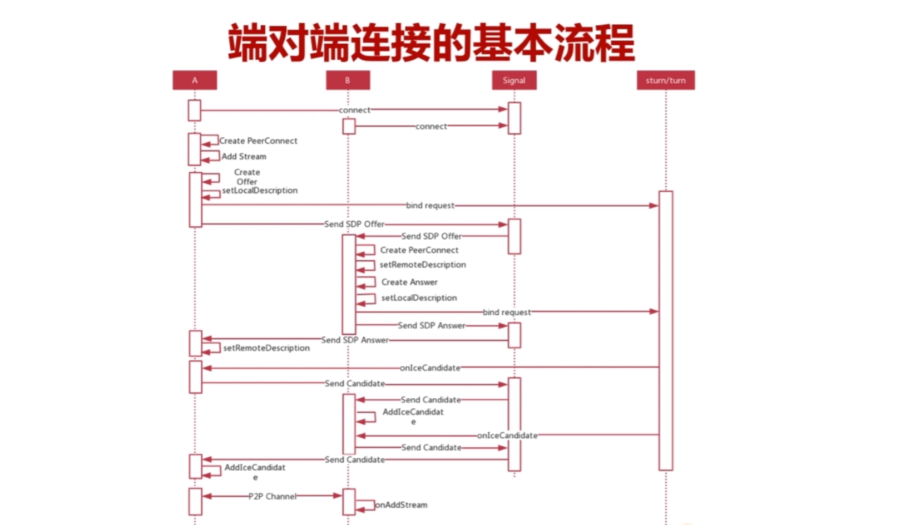
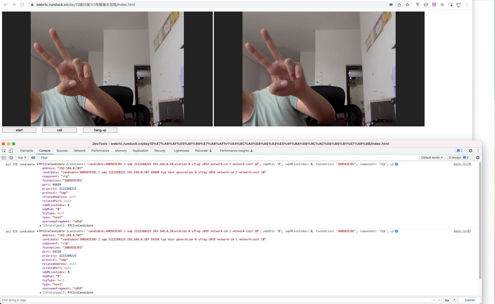

# 一、网络抓包

### 1、网络抓包工具常用的两个工具是哪两个？

- tcpdump
- WireShark


### 2、`tcpdump` 和 `WireShark` 两者有什么区别？

- <font color="red">tcpdump</font>：tcpdump在Linux服务端使用，对使用者的要求比较高，需要对网络很熟悉。（真正的高手专用）
- <font color="red">WireShark</font>：拥有各个平台的可视化界面，所以对使用者要求比较低。（分析辅助提示功能做得很棒）


### 3、tcpdump最常见的用法？（先记录一下，后续再看吧）



### 4、Mac下如何知道自己有哪些网卡？

- 在终端使用 `ifconfig` 命令即可查看


### 5、【掌握】WireShark的逻辑运算方式有哪些？

- 与： `and` 或 `&&`
- 或：`or` 或 `||`
- 非：`not` 或 `！`


### 6、【掌握】WireShark的判断语句有哪些？

- 等于：`eq` 或 `==`
- 小于：`lt` 或 `<`
- 大于：`gt` 或 `>`
- 小于等于：`le` 或 `<=`
- 大于等于：`ge` 或 `>=`
- 不等于：`ne` 或 `!=`


### 7、【掌握】WireShark如何按照协议进行过滤？

- stun
- tcp
- udp
- 注意都用小写


### 8、【掌握】WireShark 如何按照`ip地址`或`端口号`过滤？

- <font color="red">按ip地址过滤</font>：
  - ip.dst == 172.172.172.172（按目的地址过滤）
  - ip.src = 192.168.0.1 （按源地址过滤）
  - ip.addr = 192.168.0.1（源或目的地址中包含此ip即可）
- <font color="red">按端口号过滤</font>：
  - tcp.port == 8080
  - udp.port == 8080
  - udp.dstport == 3478
  - udp.srcport == 3478


## 二、端对端1V1传输基本流程


### 1、简述WebRTC`媒体协商`的核心过程？（4个）

- Amy：创建Offer，设置setLocalDescription
- Bob：收到Offer，设置setRemoteDescription
- Bob：创建Answer，设置setLocalDescription
- Amy：收到answer，设置setRemoteDescription



### 2、端对端链接完整流程？（画得太好了，有空自己画一画，一定要）

- ①媒体协商
- ②其次是交换Candidate，进行ICE过程
- ③流媒体传输





## 三、端对端1V1传输基本流程 - 代码实现

- html代码实现

```html
<html>
	<head>
		<title>RTCPeerConnection</title>
		<link rel="stylesheet" href="css/main.css"/>
	</head>
	<body>
		<div>
			<video id="localVideo" autoplay playsinline></video>
			<video id="remoteVideo" autoplay playsinline></video>
			<div>
				<button id="start">start</button>
				<button id="call">call</button>
				<button id="hangup">hang up</button>
			</div>
		</div>

		<script src="https://webrtc.github.io/adapter/adapter-latest.js"></script>
		<script src="./js/main.js"></script>

	</body>
</html>

```


- css代码实现

```css
/*
 *  Copyright (c) 2015 The WebRTC project authors. All Rights Reserved.
 *
 *  Use of this source code is governed by a BSD-style license
 *  that can be found in the LICENSE file in the root of the source
 *  tree.
 */
button {
  margin: 0 20px 25px 0;
  vertical-align: top;
  width: 134px;
}

div#getUserMedia {
  padding: 0 0 8px 0;
}

div.input {
  display: inline-block;
  margin: 0 4px 0 0;
  vertical-align: top;
  width: 310px;
}

div.input > div {
  margin: 0 0 20px 0;
  vertical-align: top;
}

div.output {
  background-color: #eee;
  display: inline-block;
  font-family: 'Inconsolata', 'Courier New', monospace;
  font-size: 0.9em;
  padding: 10px 10px 10px 25px;
  position: relative;
  top: 10px;
  white-space: pre;
  width: 270px;
}

section#statistics div {
  display: inline-block;
  font-family: 'Inconsolata', 'Courier New', monospace;
  vertical-align: top;
  width: 308px;
}

section#statistics div#senderStats {
  margin: 0 20px 0 0;
}

section#constraints > div {
  margin: 0 0 20px 0;
}

h2 {
  margin: 0 0 1em 0;
}

section#constraints label {
  display: inline-block;
  width: 156px;
}

section {
  margin: 0 0 20px 0;
  padding: 0 0 15px 0;
}

video {
  background: #222;
  margin: 0 0 0 0;
  --width: 45%;
  width: var(--width);
  height: var(--width);
}

@media screen and (max-width: 720px) {
  button {
    font-weight: 500;
    height: 56px;
    line-height: 1.3em;
    width: 90px;
  }

  div#getUserMedia {
    padding: 0 0 40px 0;
  }

  section#statistics div {
    width: calc(50% - 14px);
  }

}

```

- 核心js代码实现（其实就是上面时序图的实现流程，所以说掌握时序图很重要）


```js

var localVideo = document.querySelector('video#localVideo');
var remoteVideo = document.querySelector('video#remoteVideo');
var btnStart = document.querySelector('button#start');
var btnCall = document.querySelector('button#call');
var btnHangUp= document.querySelector('button#hangup');


var localStream;
var pc1; 
var pc2;

function gotMediaStream(stream) {
  localVideo.srcObject = stream;
  localStream = stream;
}

function handleError() {
  console.log("Failed to call getUserMedia", err);
}

function start() {
  var constraints = {
    video: true,
    audio:false
  }
  if(!navigator.mediaDevices || !navigator.mediaDevices.getUserMedia) {
    return;
  } else {
    navigator.mediaDevices.getUserMedia(constraints)
    .then(gotMediaStream)
    .catch(handleError);
  }
}

function gotAnswerDescription(desc) {
  pc2.setLocalDescription(desc);

  //send sdp to caller
  //recieve sdp from callee
  pc1.setRemoteDescription(desc);
}

function gotLocalDescription(desc) {
  pc1.setLocalDescription(desc);

  //send sdp to callee
  //receive sdp from caller
  pc2.setRemoteDescription(desc);
  pc2.createAnswer().then(gotAnswerDescription)
  .catch(handleError);
}

function gotRemoteStream(e) {
  if(remoteVideo.srcObject !== e.streams[0]) {
    remoteVideo.srcObject = e.streams[0];
  }
}

function call() {
  var offerOptions = {
		offerToReceiveAudio: 0,
		offerToReceiveVideo: 1 
  }
  pc1 = new RTCPeerConnection();
  pc1.onicecandidate = (e) => {
    //send candidate to peer
    //receive candidate from peer
    pc2.addIceCandidate(e.candidate).catch(handleError);
    console.log('pc1 ICE candidate', e.candidate);
  }

	pc1.iceconnectionstatechange = (e) => {
		console.log(`pc1 ICE state: ${pc.iceConnectionState}`);
		console.log('ICE state change event: ', e);
	}

  pc2 = new RTCPeerConnection();
  pc2.onicecandidate = (e) => {
    //send candidate to peer
    //receive candidate from peer
    pc1.addIceCandidate(e.candidate).catch(handleError);
    console.log('pc2 ICE candidate', e.candidate);
  }

	pc2.iceconnectionstatechange = (e) => {
		console.log(`pc2 ICE state: ${pc.iceConnectionState}`);
		console.log('ICE state change event: ', e);
	}

  pc2.ontrack = gotRemoteStream;

  //add Stream to caller
  localStream.getTracks().forEach((track)=>{
    pc1.addTrack(track, localStream);
  });

  pc1.createOffer(offerOptions)
  .then(gotLocalDescription)
  .catch(handleError);
}

function hangup() {
  pc1.close();
  pc2.close();
  pc1 = null;
  pc2 = null;
}

btnStart.onclick = start;
btnCall.onclick = call;
btnHangUp.onclick = hangup;
```


- 最终效果如下：


