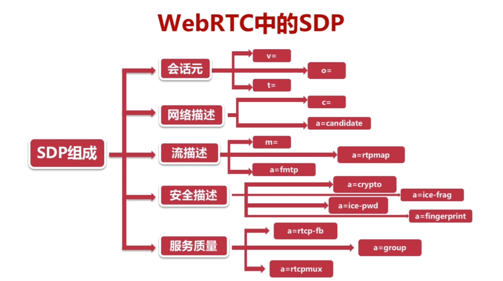
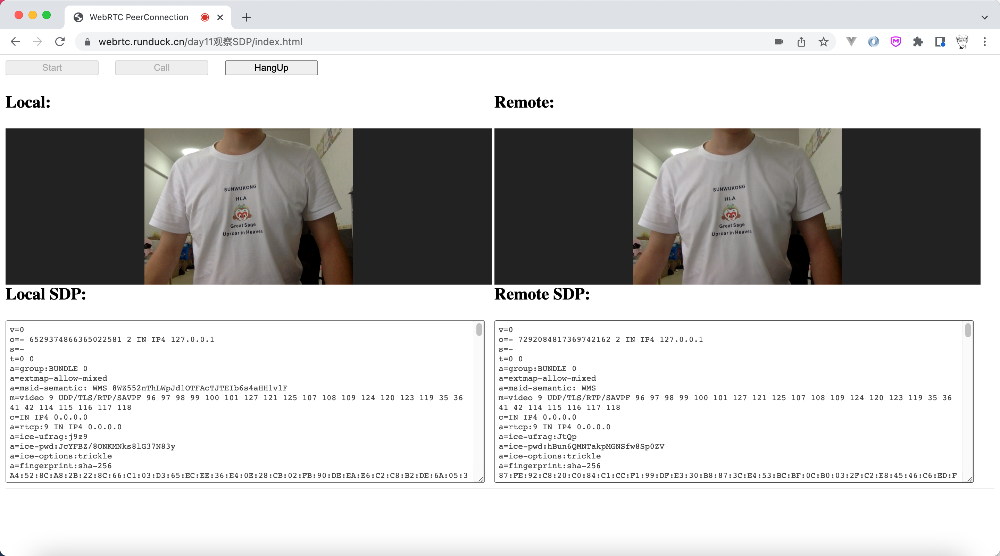

# 一、网络抓包

### 1、SDP在WebRTC中的地位？

- SDP可以说是WebRTC的核心，因为双方进行通信的参数都在其中
- 如使用的编码器是什么，码流是多大，有多少个媒体流等等都在SDP中描述着


### 2、什么是SDP？

- SDP（Session Description Protocol）它只是一种信息格式的描述标准
- 本身不属于传输协议，但是可以被其他传输协议用来交换必要的信息。


### 3、认识WebRTC中的SDP，有个印象就行，后续再倒回来研究。

- 会话层：类似全局变量，是对SDP大而全的信息统计
- 媒体层：类似于局部变量，媒体层的数据会覆盖会话层





### 4、如何获取SDP？

```js
function getAnswer(desc){
	pc2.setLocalDescription(desc);
	answerSdpTextarea.value = desc.sdp

	//send desc to signal
	//receive desc from signal
	
	pc1.setRemoteDescription(desc);
}

function getOffer(desc){
	pc1.setLocalDescription(desc);
	offerSdpTextarea.value = desc.sdp

	//send desc to signal
	//receive desc from signal
	
	pc2.setRemoteDescription(desc);

	pc2.createAnswer()
		.then(getAnswer)
		.catch(handleAnswerError);

}	
```





```xml
v=0
o=- 6529374866365022581 2 IN IP4 127.0.0.1
s=-
t=0 0
a=group:BUNDLE 0
a=extmap-allow-mixed
a=msid-semantic: WMS 8WZ552nThLWpJd1OTFAcTJTEIb6s4aHH1vlF
m=video 9 UDP/TLS/RTP/SAVPF 96 97 98 99 100 101 127 121 125 107 108 109 124 120 123 119 35 36 41 42 114 115 116 117 118
c=IN IP4 0.0.0.0
a=rtcp:9 IN IP4 0.0.0.0
a=ice-ufrag:j9z9
a=ice-pwd:JcYFBZ/8ONKMNks8lG37N83y
a=ice-options:trickle
a=fingerprint:sha-256 A4:52:8C:A8:2B:22:8C:66:C1:03:D3:65:EC:EE:36:E4:0E:28:CB:02:FB:90:DE:EA:E6:C2:C8:B2:DE:6A:05:30
a=setup:actpass
a=mid:0
a=extmap:1 urn:ietf:params:rtp-hdrext:toffset
a=extmap:2 http://www.webrtc.org/experiments/rtp-hdrext/abs-send-time
a=extmap:3 urn:3gpp:video-orientation
a=extmap:4 http://www.ietf.org/id/draft-holmer-rmcat-transport-wide-cc-extensions-01
a=extmap:5 http://www.webrtc.org/experiments/rtp-hdrext/playout-delay
a=extmap:6 http://www.webrtc.org/experiments/rtp-hdrext/video-content-type
a=extmap:7 http://www.webrtc.org/experiments/rtp-hdrext/video-timing
a=extmap:8 http://www.webrtc.org/experiments/rtp-hdrext/color-space
a=extmap:9 urn:ietf:params:rtp-hdrext:sdes:mid
a=extmap:10 urn:ietf:params:rtp-hdrext:sdes:rtp-stream-id
a=extmap:11 urn:ietf:params:rtp-hdrext:sdes:repaired-rtp-stream-id
a=sendrecv
a=msid:8WZ552nThLWpJd1OTFAcTJTEIb6s4aHH1vlF 31751cde-a529-4f04-bd71-ad11336ad20b
a=rtcp-mux
a=rtcp-rsize
a=rtpmap:96 VP8/90000
a=rtcp-fb:96 goog-remb
a=rtcp-fb:96 transport-cc
a=rtcp-fb:96 ccm fir
a=rtcp-fb:96 nack
a=rtcp-fb:96 nack pli
a=rtpmap:97 rtx/90000
a=fmtp:97 apt=96
a=rtpmap:98 VP9/90000
a=rtcp-fb:98 goog-remb
a=rtcp-fb:98 transport-cc
a=rtcp-fb:98 ccm fir
a=rtcp-fb:98 nack
a=rtcp-fb:98 nack pli
a=fmtp:98 profile-id=0
a=rtpmap:99 rtx/90000
a=fmtp:99 apt=98
a=rtpmap:100 VP9/90000
a=rtcp-fb:100 goog-remb
a=rtcp-fb:100 transport-cc
a=rtcp-fb:100 ccm fir
a=rtcp-fb:100 nack
a=rtcp-fb:100 nack pli
a=fmtp:100 profile-id=2
a=rtpmap:101 rtx/90000
a=fmtp:101 apt=100
a=rtpmap:127 H264/90000
a=rtcp-fb:127 goog-remb
a=rtcp-fb:127 transport-cc
a=rtcp-fb:127 ccm fir
a=rtcp-fb:127 nack
a=rtcp-fb:127 nack pli
a=fmtp:127 level-asymmetry-allowed=1;packetization-mode=1;profile-level-id=42001f
a=rtpmap:121 rtx/90000
a=fmtp:121 apt=127
a=rtpmap:125 H264/90000
a=rtcp-fb:125 goog-remb
a=rtcp-fb:125 transport-cc
a=rtcp-fb:125 ccm fir
a=rtcp-fb:125 nack
a=rtcp-fb:125 nack pli
a=fmtp:125 level-asymmetry-allowed=1;packetization-mode=0;profile-level-id=42001f
a=rtpmap:107 rtx/90000
a=fmtp:107 apt=125
a=rtpmap:108 H264/90000
a=rtcp-fb:108 goog-remb
a=rtcp-fb:108 transport-cc
a=rtcp-fb:108 ccm fir
a=rtcp-fb:108 nack
a=rtcp-fb:108 nack pli
a=fmtp:108 level-asymmetry-allowed=1;packetization-mode=1;profile-level-id=42e01f
a=rtpmap:109 rtx/90000
a=fmtp:109 apt=108
a=rtpmap:124 H264/90000
a=rtcp-fb:124 goog-remb
a=rtcp-fb:124 transport-cc
a=rtcp-fb:124 ccm fir
a=rtcp-fb:124 nack
a=rtcp-fb:124 nack pli
a=fmtp:124 level-asymmetry-allowed=1;packetization-mode=0;profile-level-id=42e01f
a=rtpmap:120 rtx/90000
a=fmtp:120 apt=124
a=rtpmap:123 H264/90000
a=rtcp-fb:123 goog-remb
a=rtcp-fb:123 transport-cc
a=rtcp-fb:123 ccm fir
a=rtcp-fb:123 nack
a=rtcp-fb:123 nack pli
a=fmtp:123 level-asymmetry-allowed=1;packetization-mode=1;profile-level-id=4d001f
a=rtpmap:119 rtx/90000
a=fmtp:119 apt=123
a=rtpmap:35 H264/90000
a=rtcp-fb:35 goog-remb
a=rtcp-fb:35 transport-cc
a=rtcp-fb:35 ccm fir
a=rtcp-fb:35 nack
a=rtcp-fb:35 nack pli
a=fmtp:35 level-asymmetry-allowed=1;packetization-mode=0;profile-level-id=4d001f
a=rtpmap:36 rtx/90000
a=fmtp:36 apt=35
a=rtpmap:41 AV1/90000
a=rtcp-fb:41 goog-remb
a=rtcp-fb:41 transport-cc
a=rtcp-fb:41 ccm fir
a=rtcp-fb:41 nack
a=rtcp-fb:41 nack pli
a=rtpmap:42 rtx/90000
a=fmtp:42 apt=41
a=rtpmap:114 H264/90000
a=rtcp-fb:114 goog-remb
a=rtcp-fb:114 transport-cc
a=rtcp-fb:114 ccm fir
a=rtcp-fb:114 nack
a=rtcp-fb:114 nack pli
a=fmtp:114 level-asymmetry-allowed=1;packetization-mode=1;profile-level-id=64001f
a=rtpmap:115 rtx/90000
a=fmtp:115 apt=114
a=rtpmap:116 red/90000
a=rtpmap:117 rtx/90000
a=fmtp:117 apt=116
a=rtpmap:118 ulpfec/90000
a=ssrc-group:FID 436826565 1885894064
a=ssrc:436826565 cname:t+9nyTqxmjVC0Wq9
a=ssrc:436826565 msid:8WZ552nThLWpJd1OTFAcTJTEIb6s4aHH1vlF 31751cde-a529-4f04-bd71-ad11336ad20b
a=ssrc:436826565 mslabel:8WZ552nThLWpJd1OTFAcTJTEIb6s4aHH1vlF
a=ssrc:436826565 label:31751cde-a529-4f04-bd71-ad11336ad20b
a=ssrc:1885894064 cname:t+9nyTqxmjVC0Wq9
a=ssrc:1885894064 msid:8WZ552nThLWpJd1OTFAcTJTEIb6s4aHH1vlF 31751cde-a529-4f04-bd71-ad11336ad20b
a=ssrc:1885894064 mslabel:8WZ552nThLWpJd1OTFAcTJTEIb6s4aHH1vlF
a=ssrc:1885894064 label:31751cde-a529-4f04-bd71-ad11336ad20b
```

