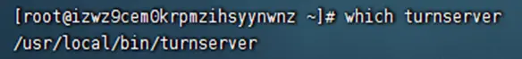
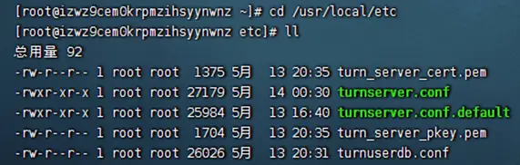
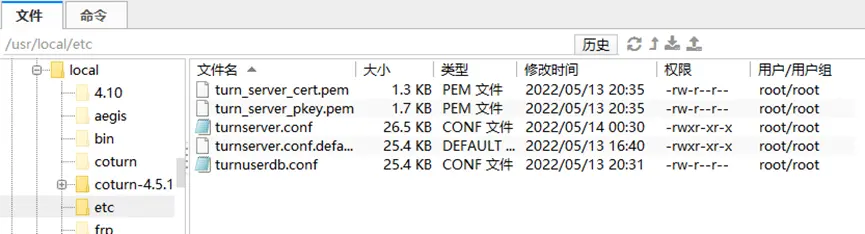
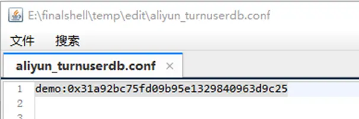
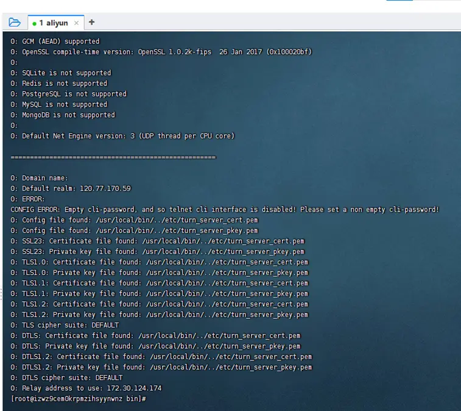
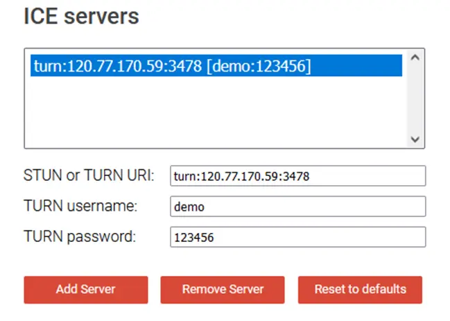
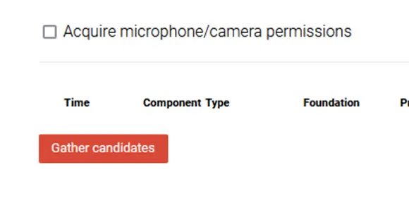
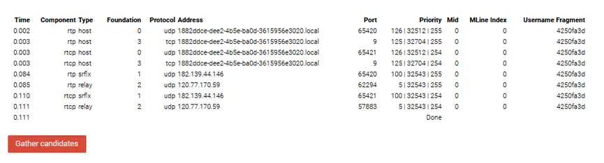
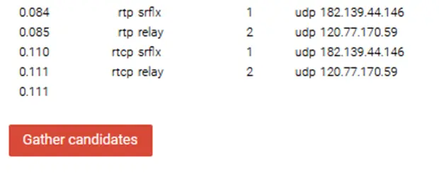
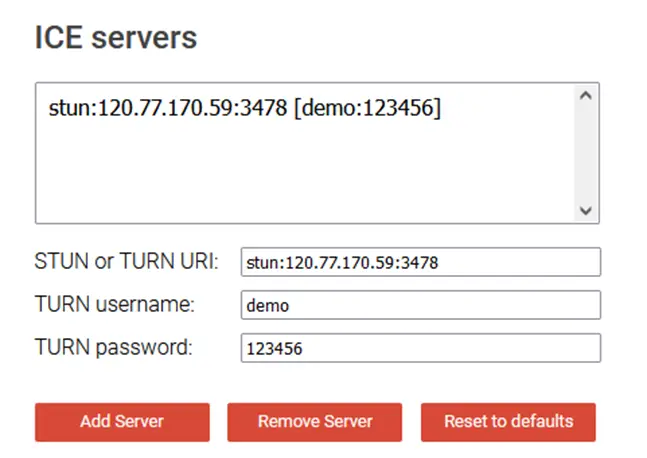

# 一、阿里云服务器环境搭建


**前言：**

**涉及WebRTC内容，绕不开搭建ICE服务器，网上搜索教程无数，没有一个能从头到尾顺利搭建成功，网页开了无数个，进度却原地踏步，欲哭无泪。跟着网上的教程，大多会卡在turnserver.conf配置文件的编辑上，错误的配置文件往往会导致服务器开启失败。**

**总结一份服务器安装步骤，故在此留档，以利后人！**

**如果你卡在配置文件这一块，请直接跳到第三部分，如果你进度颇浅，直接按照我的步骤来一遍吧，让你感到无比丝滑。**

**另外，要注意的是，在本地的虚拟机上搭建coturn服务器是行不通的，必须要在公网服务器上搭建。**


#### 1、准备步骤

准备一台阿里云服务器 系统为 linux centos7.4 打开3478端口，以及一些必要的端口

阿里云服务器公网地址：`120.77.170.59`  内网地址：`172.30.124.174`

主机名称随便取，主机是公网ip地址，端口随便选择，但要在阿里云控制台开放该端口，如果没有登陆上，就去网页端的阿里云服务器先登录一遍。）

首先安装各种依赖和软件

```javascript
yum install git
yum install gcc
yum install gcc-c++
yum install openssl
yum install openssl-devel
yum install libevent-devel
```

遇到的所有选项都选y，一路y下去，

安装完毕后

### 2、手动下载并安装 `libevent2`

```shell
wget https://github.com/downloads/libevent/libevent/libevent-2.0.21-stable.tar.gz
tar zxvf libevent-2.0.21-stable.tar.gz
cd libevent-2.0.21-stable && ./configure
make && make install
```


## 二、Coturn服务器搭建步骤

### 1、下载并安装 coturn

准备安装coturn包。注意，不要直接git clone coturn，会出现编译错误

此处安装稳定的版本，下载压缩包

```javascript
wget https://github.com/coturn/coturn/archive/4.5.1.1.tar.gz
```

然后进行解压，编译，依次执行

```javascript
tar -zxvf 4.5.1.1.tar.gz
cd coturn-4.5.1.1
./configure
make
make install
```

注意，如果cd coturn-4.5.1.1找不到文件夹的话，一般安装包的默认安装位置在阿里云的/usr/local目录下，切换到该目录下继续执行操作即可

如果成功了，可以通过which turnserver验证。如果出现路径即为成功，默认路径为

turnserver所在的默认路径，之后到该路径下开启服务

### 2、配置文件

然后进入文件夹：

cd /usr/local/etc/

输入命令ll

会看到一个叫做 turnserver.conf.default的配置文件。

通过命令将它备份：

```javascript
cp turnserver.conf.default turnserver.conf
```

然后通过命令在当前文件夹生成签名证书（此步似乎可以不用，因为在配置文件中并未用到，不过也可以做一下，以防万一）

```javascript
openssl req -x509 -newkey rsa:2048 -keyout /usr/local/etc/turn_server_pkey.pem -out /usr/local/etc/turn_server_cert.pem -days 99999 -nodes
```

生成证书的时候会让填写国家地区等一些信息，可以随便填写，

第一个country name填写cn

state or province 填写sichuang

Locality name填写chengdu

剩下的随便填，可以都填no，邮箱随便填一个

完成后，可以在当前文件夹下看到turn_server_cert.pem和turn_server_pkey.pem两个文件。

然后在当前文件夹下，通过命令创建一个文件turnuserdb.conf用于存储用户名和信息

```javascript
cp turnserver.conf.default turnuserdb.conf
```

此时整个文件夹中的文件构成为下图所示

文件夹的内容构成

### 3、编辑文件

首先，ipconfig看一下网卡信息，我的阿里云主机网卡是eth0，记住网卡类型。（部分教程的配置文件中要填写网卡信息，本文总结的配置文件中并不需要填写网卡信息）

然后，用命令生成账号密码的md5码，标红的部分分别对应用户名 地区 密码 ，可以自行修改。

```javascript
turnadmin -k -u carrot -p 123456 -r carrtRealm
```

命令执行后会生成一段md5码，记得复制下来！

然后，在finalshell软件的下方，依次选择路径usr/local/etc，可以看到当前文件夹中已经存在如下文件。直接双击文件就可以打开进行编辑

finalshell界面

首先我们双击turnuserdb.conf文件，在其中填入用户名和刚才生成的md5码并保存。



然后到了最重要的一步，网上查找的大部分教程都有错误，经过总结，按照如下的配置文件进行配置，才能真正开启服务并不报错！

我们对配置文件turnserver.conf进行编辑，双击打开文件，输入如下的配置信息

```javascript
#中继服务器监听的IP地址，NAT环境下直接写私网IP地址，可以指定多个IP
listening-ip=172.30.124.174
#中继服务器转发地址(本地IP地址将用于传递数据包的给每个端)，和监听地址一样
#relay-ip=120.77.170.59
#外部IP,NAT环境下直接写：公网IP/私网IP
external-ip=120.77.170.59/172.30.124.174
#cli-password=123456
#打开fingerprint的注释，使用长期证书机制。
fingerprint
#打开密码验证，使用短期证书机制。
lt-cred-mech
#服务器名称,用于OAuth认证,默认和realm相同,直接填公网ip.部分浏览器本段不设可能会引发cors错误。
server-name=120.77.170.59
# TURN REST API的长期凭证机制范围，同样设为ip,同server-name.
realm=120.77.170.59
#移动的ICE(MICE)的规范支持。
mobility
#快捷的添加用户是使用user=XXX:XXXX的方式，可以添加多个。/var/db/turndb也工作，可以使用turnadmin来管理其中用户，可以添加多个。
user=demo:123456
#你设置的密码（防止报错警告）
cli-password=123456
```

保存文件后，我们到usr/local/bin文件夹下，通过如下命令开启服务

```javascript
cd /usr/local/bin
turnserver -v -r 120.77.170.59:3478 -a -o
```

或者通过这条命令开启服务（下面这条命令指定了配置文件，上面的命令应该是默认定位到了我们的配置文件处，如果有修改配置文件位置的话，可以用如下命令，经测试，这两条命令都可以成功打开服务）

```javascript
turnserver -v -r 你的公网ip:3478 -a -o -c /usr/local/etc/turnserver.conf
```

服务开启后，窗口中如下显示则代表服务开启成功

如图所示表示服务开启成功

上图中有一处显示config error的地方，但经过测试，这个error并不影响turnserver服务的正确开启，如果想要消去这条error信息，只需要在上文的turnserver.conf配置文件中加上如下一句即可去掉error报错。

```javascript
cli-password=123456（你设置的密码）
```


### 4、测试coturn服务

接下来我们要测试开启的turnserver服务器能否起作用，我们到测试网址：https://webrtc.github.io/samples/src/content/peerconnection/trickle-ice/

去进行测试，这里建议用火狐浏览器访问网址进行测试，chrome浏览器可能会出错

打开网址后，我们可以看到如下页面，按图中形式填写信息

第一栏是 turn:公网ip:端口号 （经测试，如果不填端口号，默认是3478端口）

第二栏是 之前设置的用户名

第三栏是 之前设置的密码

然后点击Add Server


turn服务器信息填写


然后我们点击页面下方的gather candidates按钮

点这个按钮

如果服务器配置正确的话，很快就可以看到返回的信息，如下图所示

返回的结果



可以看到我们的公网ip

我们可以看到，有我们服务器所在的公网地址120.77.170.59返回的信息，那就说明我们的服务器配置成功了，进行两台设备的直连时，能够通过turn服务器进行中转。如果没有我们公网IP地址，只显示done，并不代表成功。

如果要测试stun服务器，则按下图进行配置

stun服务器的配置

有一种说法是由于stun服务器不承担转发的作用，所以可以不用输入用户名和密码信息，由于我的宿舍网络环境是对称性，无法验证stun服务器的作用情况，在此不做结果展示。但是可以推断，turn服务器成功验证的情况下，stun服务器应该同样能够生效。


### 5、总结

至此，我们已经开启了turnserver服务，turnserver服务是在后台默认开启的，如果重复执行开启服务的命令，会造成多个turnserver服务在后台一起打开，用如下命令可以查看服务是否在后台运行

```javascript
ps -ef|grep turnserver
```

如果有多个turnserver服务同时在后台开启，可以用如下命令杀掉所有turnserver服务

```javascript
killall turnserver
```

一般情况下turnserver服务一直会在后台保持，如果不用了记得杀掉服务。


### 6、一些有用的参考文章

https://www.jianshu.com/p/915eab39476d

https://www.jianshu.com/p/5543dd3e002b

https://www.jianshu.com/p/d65e369f44fb

https://blog.csdn.net/ZSH1205209422/article/details/106637977

https://blog.csdn.net/qq_16042523/article/details/52994785

