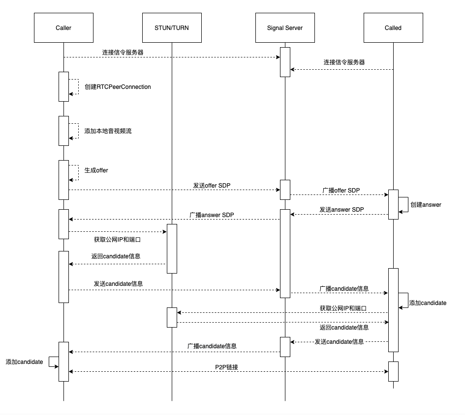

## 一、核心思想

### 1、主要流程图（自己有空多绘制几遍）





## 二、核心代码

#### 1、服务端信令服务器代码

```javascript
'use strict'

var http = require('http');
var serveIndex = require('serve-index');
var express = require('express');
var socketIo = require('socket.io');

var USERSCOUNT = 2; //房间人数上限

var app = express();
//顺序不能换
app.use(serveIndex('./public'));
app.use(express.static('./public'));

var http_server = http.createServer(app);
http_server.listen(9980, '127.0.0.1');

//绑定socket.io到http服务
var io = socketIo.listen(http_server)

io.sockets.on('connection', (socket)=> {
  console.log("有人发起了链接请求111");
  
  socket.on('message', (room, data)=> {
    console.log("message" + room + data);
		socket.to(room).emit('message',room, data);
  });

  socket.on('join', (room)=> {
		socket.join(room);
		var myRoom = io.sockets.adapter.rooms[room];
		var users = Object.keys(myRoom.sockets).length;
    console.log("join" + room);

    if (users <= USERSCOUNT) { //房间人数未超过
      socket.emit('joined', room, socket.id);	 //给自己发
      if (users > 1) { //房间里面已经有其他人了
        socket.to(room).emit('otherjoin', room); //发给除自己之外，房间内的所有人
      }
    } else { //超过2个人了
      socket.emit('full', room, socket.id); //给自己发
      socket.leave(room);
    }
  });

  socket.on('leave', (room)=> {
		var myRoom = io.sockets.adapter.rooms[room];
		var users = Object.keys(myRoom.sockets).length;
		socket.to(room).emit('bye', room, socket.id)//房间内所有人,除自己外
	 	socket.emit('leaved', room, socket.id);	// 给自己发
    socket.leave(room);
	});
});

console.log("webrtc服务启动成功");


```


### 2、输入房间号代码

```html
<html>
	<head>
		<title>really peer connection</title>
		<link rel="stylesheet" href="./css/main.css">
		<script language="javascript" type="text/javascript">
			function gotoNextPage(){
				var roomid = document.querySelector('input#room');
				if(roomid.value === null || roomid.value === ''){
					alert('roomid is null');
				}else {
					window.location.href="room.html?room="+ roomid.value;
				}
			}
		</script>
	</head>
	<body>
		<table align="center">
			<tr><td><div>
					<label>roomid:</label>
					<input type="input" id="room">
			</div></td></tr>
			<tr><td><div>
						<button id="join" onclick="gotoNextPage()">Join</button>
			</div></td></tr>
		</table>
	</body>
</html>

```


### 3、绘制端对端聊天的html代码

```html
<html>
	<head>
		<title>WebRTC PeerConnection</title>
		<link href="./css/main.css" rel="stylesheet" />
	</head>

	<body>
		<div>


			<div>
				<button id="connserver">Connect Sig Server</button>
				<button id="leave" disabled>Leave</button>	
			</div>

			<div>
				<input id="shareDesk" type="checkbox"/><label for="shareDesk">Share Desktop</label>
			</div>


			<div id="preview">
				<div >
					<h2>Local:</h2>
					<video id="localvideo" autoplay playsinline muted></video>
					<h2>Offer SDP:</h2>
					<textarea id="offer"></textarea>
				</div>
				<div>
					<h2>Remote:</h2>
					<video id="remotevideo" autoplay playsinline></video>
					<h2>Answer SDP:</h2>
					<textarea id="answer"></textarea>
				</div>
			</div>
		</div>

		<script src="https://cdnjs.cloudflare.com/ajax/libs/socket.io/2.0.3/socket.io.js"></script>
		<script src="https://webrtc.github.io/adapter/adapter-latest.js"></script>
		<script src="js/main.js"></script>
	</body>
</html>

```


### 4、核心客户端js代码

```javascript
'use strict'

var localVideo = document.querySelector('video#localvideo');
var remoteVideo = document.querySelector('video#remotevideo');

var btnConn =  document.querySelector('button#connserver');
var btnLeave = document.querySelector('button#leave');

var offer = document.querySelector('textarea#offer');
var answer = document.querySelector('textarea#answer');

var shareDeskBox  = document.querySelector('input#shareDesk');

var pcConfig = {
  'iceServers': [{
    'urls': 'stun:47.95.15.179:3478',
    'credential': "123456",
    'username': "carrot"
  }]
};

var localStream = null;
var remoteStream = null;

var pc = null;

var roomid;
var socket = null;

var offerdesc = null;
var state = 'init';

// 以下代码是从网上找的
//=========================================================================================

//如果返回的是false说明当前操作系统是手机端，如果返回的是true则说明当前的操作系统是电脑端
function IsPC() {
	var userAgentInfo = navigator.userAgent;
	var Agents = ["Android", "iPhone","SymbianOS", "Windows Phone","iPad", "iPod"];
	var flag = true;

	for (var v = 0; v < Agents.length; v++) {
		if (userAgentInfo.indexOf(Agents[v]) > 0) {
			flag = false;
			break;
		}
	}

	return flag;
}

//如果返回true 则说明是Android  false是ios
function is_android() {
	var u = navigator.userAgent, app = navigator.appVersion;
	var isAndroid = u.indexOf('Android') > -1 || u.indexOf('Linux') > -1; //g
	var isIOS = !!u.match(/\(i[^;]+;( U;)? CPU.+Mac OS X/); //ios终端
	if (isAndroid) {
		//这个是安卓操作系统
		return true;
	}

	if (isIOS) {
		//这个是ios操作系统
	 	return false;
	}
}

//获取url参数
function getQueryVariable(variable)
{
       var query = window.location.search.substring(1);
       var vars = query.split("&");
       for (var i=0;i<vars.length;i++) {
               var pair = vars[i].split("=");
               if(pair[0] == variable){return pair[1];}
       }
       return(false);
}

//=======================================================================

function sendMessage(roomid, data){

	console.log('send message to other end', roomid, data);
	if(!socket){
		console.log('socket is null');
	}
	socket.emit('message', roomid, data);
}

function conn(){ 

	socket = io.connect();

	socket.on('joined', (roomid, id) => {
		console.log('receive joined message!', roomid, id);
		state = 'joined'

		//如果是多人的话，第一个人不该在这里创建peerConnection
		//都等到收到一个otherjoin时再创建
		//所以，在这个消息里应该带当前房间的用户数
		//
		//create conn and bind media track
		createPeerConnection();

		btnConn.disabled = true;
		btnLeave.disabled = false;
		console.log('receive joined message, state=', state);
	});

	socket.on('otherjoin', (roomid) => {
		console.log('receive otherjoin message:', roomid, state);

		//如果是多人的话，每上来一个人都要创建一个新的 peerConnection
		//
		if(state === 'joined_unbind'){
			createPeerConnection();
		}

		state = 'joined_conn';
		call();

		console.log('receive other_join message, state=', state);
	});

	socket.on('full', (roomid, id) => {
		console.log('receive full message', roomid, id);
		hangup();
		closeLocalMedia();
		state = 'leaved';
		console.log('receive full message, state=', state);
		alert('the room is full!');
	});

	socket.on('leaved', (roomid, id) => {
		console.log('receive leaved message', roomid, id);
		state='leaved'
		socket.disconnect();
		console.log('receive leaved message, state=', state);

		btnConn.disabled = false;
		btnLeave.disabled = true;
	});

	socket.on('bye', (room, id) => {
		console.log('receive bye message', roomid, id);
		//state = 'created';
		//当是多人通话时，应该带上当前房间的用户数
		//如果当前房间用户不小于 2, 则不用修改状态
		//并且，关闭的应该是对应用户的peerconnection
		//在客户端应该维护一张peerconnection表，它是
		//一个key:value的格式，key=userid, value=peerconnection
		state = 'joined_unbind';
		hangup();
		offer.value = '';
		answer.value = '';
		console.log('receive bye message, state=', state);
	});

	socket.on('disconnect', (socket) => {
		console.log('receive disconnect message!', roomid);
		if(!(state === 'leaved')){
			hangup();
			closeLocalMedia();

		}
		state = 'leaved';
	
	});

	socket.on('message', (roomid, data) => {
		console.log('receive message!', roomid, data);

		if(data === null || data === undefined){
			console.error('the message is invalid!');
			return;	
		}

		if(data.hasOwnProperty('type') && data.type === 'offer') {
			
			offer.value = data.sdp;

			pc.setRemoteDescription(new RTCSessionDescription(data));

			//create answer
			pc.createAnswer()
				.then(getAnswer)
				.catch(handleAnswerError);

		}else if(data.hasOwnProperty('type') && data.type == 'answer'){
			answer.value = data.sdp;
			pc.setRemoteDescription(new RTCSessionDescription(data));
		
		}else if (data.hasOwnProperty('type') && data.type === 'candidate'){
			var candidate = new RTCIceCandidate({
				sdpMLineIndex: data.label,
				candidate: data.candidate
			});
			pc.addIceCandidate(candidate);	
		
		}else{
			console.log('the message is invalid!', data);
		
		}
	
	});


	roomid = getQueryVariable('room');
	socket.emit('join', roomid);

	return true;
}

function connSignalServer(){
	
	//开启本地视频
	start();

	return true;
}

function getMediaStream(stream){

	if(localStream){
		stream.getAudioTracks().forEach((track)=>{
			localStream.addTrack(track);	
			stream.removeTrack(track);
		});
	}else{
		localStream = stream;	
	}

	localVideo.srcObject = localStream;

	//这个函数的位置特别重要，
	//一定要放到getMediaStream之后再调用
	//否则就会出现绑定失败的情况
	//
	//setup connection
	conn();

	//btnStart.disabled = true;
	//btnCall.disabled = true;
	//btnHangup.disabled = true;
}

function getDeskStream(stream){
	localStream = stream;
}

function handleError(err){
	console.error('Failed to get Media Stream!', err);
}

function shareDesk(){

	if(IsPC()){
		navigator.mediaDevices.getDisplayMedia({video: true})
			.then(getDeskStream)
			.catch(handleError);

		return true;
	}

	return false;

}

function start(){

	if(!navigator.mediaDevices ||
		!navigator.mediaDevices.getUserMedia){
		console.error('the getUserMedia is not supported!');
		return;
	}else {

		var constraints;

		if( shareDeskBox.checked && shareDesk()){

			constraints = {
				video: false,
				audio:  {
					echoCancellation: true,
					noiseSuppression: true,
					autoGainControl: true
				}
			}

		}else{
			constraints = {
				video: true,
				audio:  {
					echoCancellation: true,
					noiseSuppression: true,
					autoGainControl: true
				}
			}
		}

		navigator.mediaDevices.getUserMedia(constraints)
					.then(getMediaStream)
					.catch(handleError);
	}

}

function getRemoteStream(e){
	remoteStream = e.streams[0];
	remoteVideo.srcObject = e.streams[0];
}

function handleOfferError(err){
	console.error('Failed to create offer:', err);
}

function handleAnswerError(err){
	console.error('Failed to create answer:', err);
}

function getAnswer(desc){
	pc.setLocalDescription(desc);
	answer.value = desc.sdp;

	//send answer sdp
	sendMessage(roomid, desc);
}

function getOffer(desc){
	pc.setLocalDescription(desc);
	offer.value = desc.sdp;
	offerdesc = desc;

	//send offer sdp
	sendMessage(roomid, offerdesc);	

}

function createPeerConnection(){

	//如果是多人的话，在这里要创建一个新的连接.
	//新创建好的要放到一个map表中。
	//key=userid, value=peerconnection
	console.log('create RTCPeerConnection!');
	if(!pc){
		pc = new RTCPeerConnection(pcConfig);

		pc.onicecandidate = (e)=>{

			if(e.candidate) {
				sendMessage(roomid, {
					type: 'candidate',
					label:e.candidate.sdpMLineIndex, 
					id:e.candidate.sdpMid, 
					candidate: e.candidate.candidate
				});
			}else{
				console.log('this is the end candidate');
			}
		}
		pc.ontrack = getRemoteStream;
	}else {
		console.warning('the pc have be created!');
	}

	bindTracks();
	return;	
}

//绑定永远与 peerconnection在一起，
//所以没必要再单独做成一个函数
function bindTracks(){

	console.log('bind tracks into RTCPeerConnection!');

	if( pc === null || pc === undefined) {
		console.error('pc is null or undefined!');
		return;
	}

	if(localStream === null || localStream === undefined) {
		console.error('localstream is null or undefined!');
		return;
	}

	//add all track into peer connection
	localStream.getTracks().forEach((track)=>{
		pc.addTrack(track, localStream);	
	});

}

function call(){
	
	if(state === 'joined_conn'){

		var offerOptions = {
			offerToRecieveAudio: 1,
			offerToRecieveVideo: 1
		}

		pc.createOffer(offerOptions)
			.then(getOffer)
			.catch(handleOfferError);
	}
}

function hangup(){

	if(pc) {

		offerdesc = null;
		
		pc.close();
		pc = null;
	}

}

function closeLocalMedia(){

	if(localStream && localStream.getTracks()){
		localStream.getTracks().forEach((track)=>{
			track.stop();
		});
	}
	localStream = null;
}

function leave() {

	if(socket){
		socket.emit('leave', roomid); //notify server
	}

	hangup();
	closeLocalMedia();

	offer.value = '';
	answer.value = '';
	btnConn.disabled = false;
	btnLeave.disabled = true;
}

btnConn.onclick = connSignalServer
btnLeave.onclick = leave;

```


### 5、客户端一些辅助css代码

```css
/*
 *  Copyright (c) 2015 The WebRTC project authors. All Rights Reserved.
 *
 *  Use of this source code is governed by a BSD-style license
 *  that can be found in the LICENSE file in the root of the source
 *  tree.
 */

button {
  margin: 10px 20px 25px 0;
  vertical-align: top;
  width: 134px;
}

table {
  margin: 200px (50% - 100) 0 0; 
}

textarea {
  color: #444;
  font-size: 0.9em;
  font-weight: 300;
  height: 20.0em;
  padding: 5px;
  width: calc(100% - 10px);
}

div#getUserMedia {
  padding: 0 0 8px 0;
}

div.input {
  display: inline-block;
  margin: 0 4px 0 0;
  vertical-align: top;
  width: 310px;
}

div.input > div {
  margin: 0 0 20px 0;
  vertical-align: top;
}

div.output {
  background-color: #eee;
  display: inline-block;
  font-family: 'Inconsolata', 'Courier New', monospace;
  font-size: 0.9em;
  padding: 10px 10px 10px 25px;
  position: relative;
  top: 10px;
  white-space: pre;
  width: 270px;
}

div#preview {
  border-bottom: 1px solid #eee;
  margin: 0 0 1em 0;
  padding: 0 0 0.5em 0;
}

div#preview > div {
  display: inline-block;
  vertical-align: top;
  width: calc(50% - 12px);
}

section#statistics div {
  display: inline-block;
  font-family: 'Inconsolata', 'Courier New', monospace;
  vertical-align: top;
  width: 308px;
}

section#statistics div#senderStats {
  margin: 0 20px 0 0;
}

section#constraints > div {
  margin: 0 0 20px 0;
}

h2 {
  margin: 0 0 1em 0;
}


section#constraints label {
  display: inline-block;
  width: 156px;
}

section {
  margin: 0 0 20px 0;
  padding: 0 0 15px 0;
}

video {
  background: #222;
  margin: 0 0 0 0;
  --width: 100%;
  width: var(--width);
  height: 225px;
}

@media screen and (max-width: 720px) {
  button {
    font-weight: 500;
    height: 56px;
    line-height: 1.3em;
    width: 90px;
  }

  div#getUserMedia {
    padding: 0 0 40px 0;
  }

  section#statistics div {
    width: calc(50% - 14px);
  }

}

```

