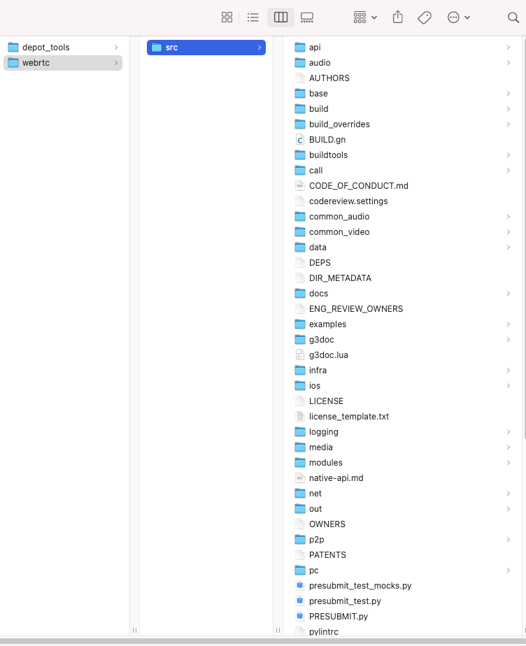
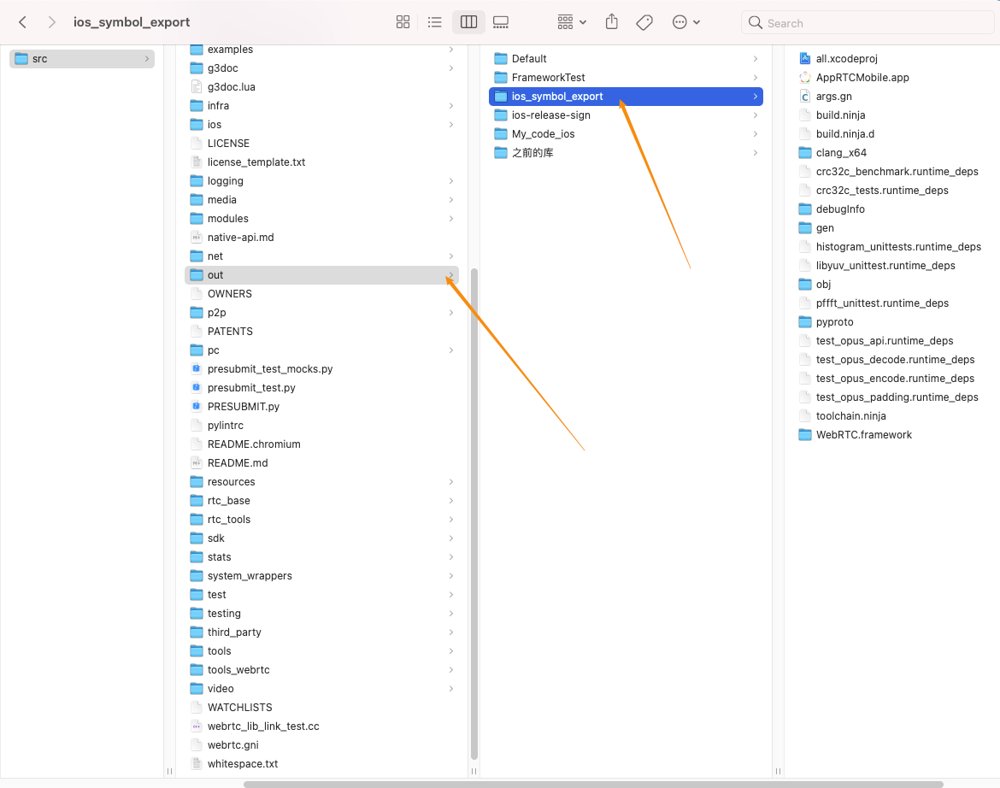
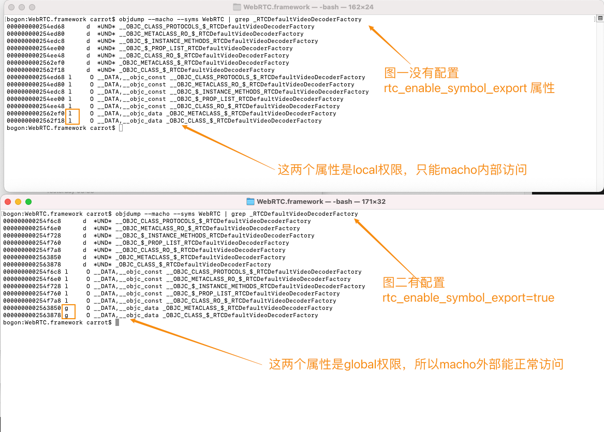
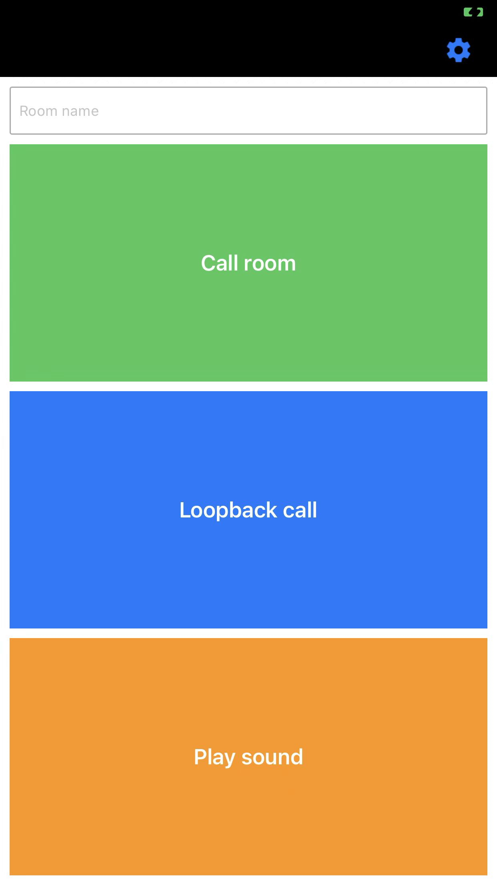
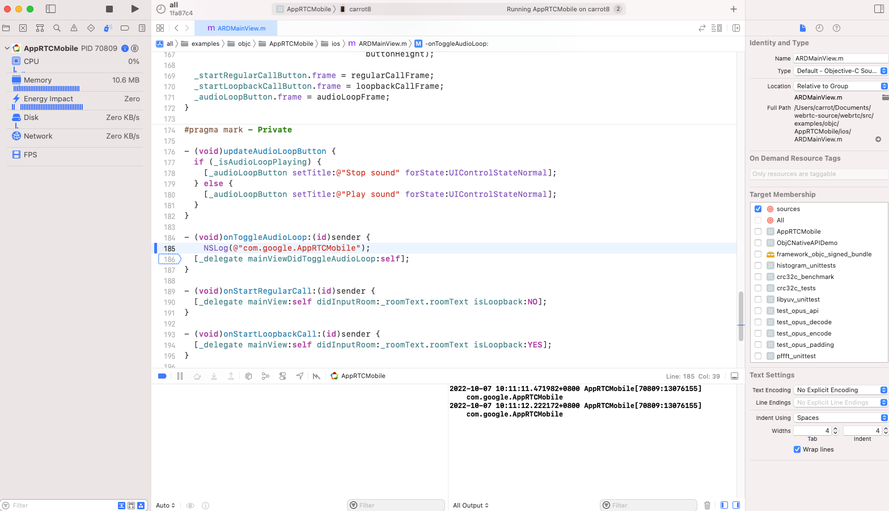
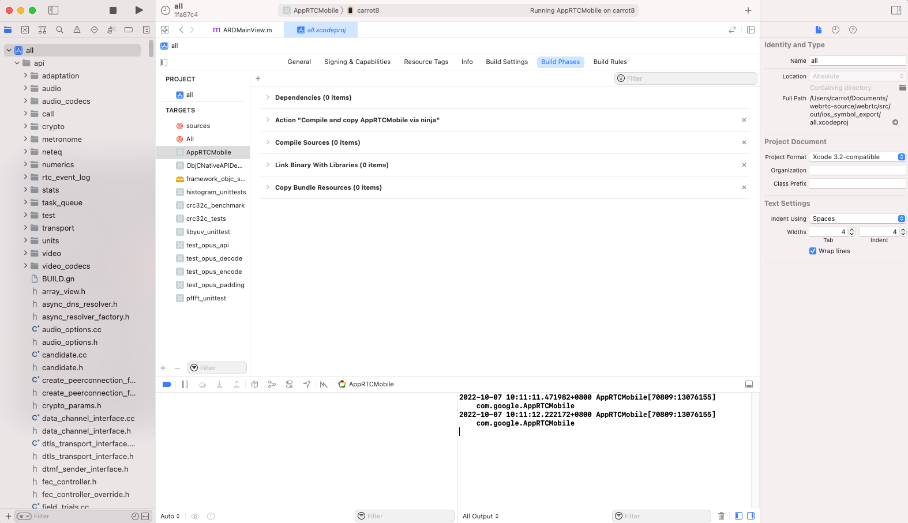
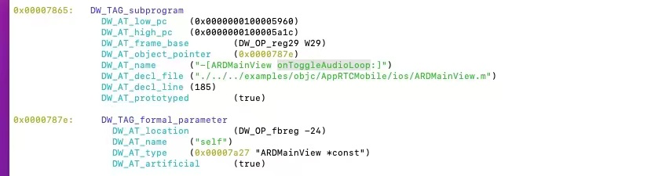
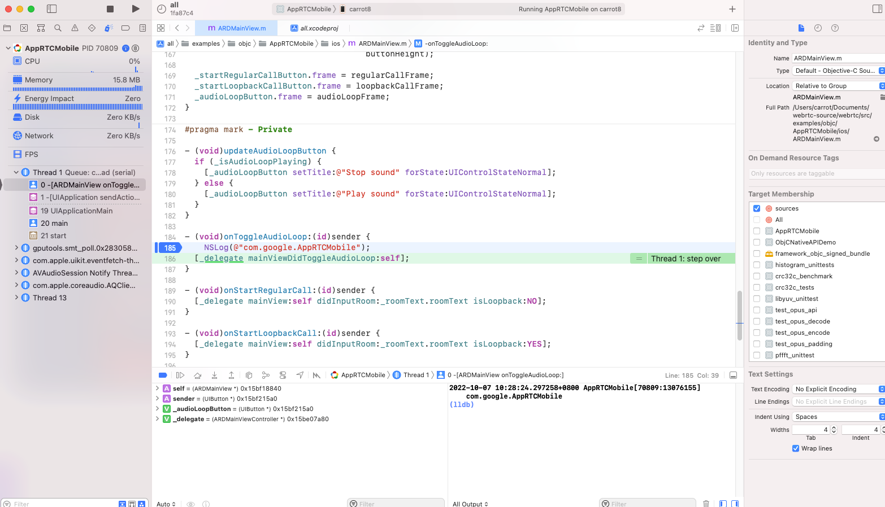
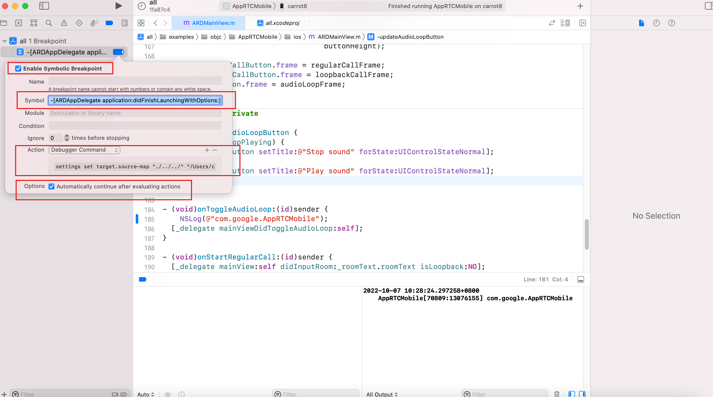

> 环境：Xcode13.2、macOS Big Sur 11.6.1


## 一、源码下载

> 在音视频领域中，WebRTC可以说是一个绕不开的宝库，包括了 <font color="red">音视频采集、编码、传输、解码、渲染</font>的全过程。


### 设置代理

因为众所周知的原因，要下载WebRTC的源码是需要代理工具的。

```shell
export https_proxy=http://127.0.0.1:7890 
http_proxy=http://127.0.0.1:7890 
all_proxy=socks5://127.0.0.1:7890
```

### 安装工具 depot_tools

git clone 获取 depot_tools

```shell
git clone https://chromium.googlesource.com/chromium/tools/depot_tools.git
```

将depot_tools的路径配置到环境变量中(仅单次生效，后续可以加入其它地方，永久生效)

```shell
export PATH=$PWD/depot_tools:$PATH
```

### 下载WebRTC源码

源码比较大，大概需要2小时左右

```shell
mkdir webrtc
cd webrtc
fetch --nohooks webrtc_ios
gclient sync
```

### 切换到指定版本分支（视情况而定）

```shell
# 查看可用版本分支
git branch -r
# 切换到m79分支
git checkout branch-heads/m79
gclient sync
# 或者强制切换到指定commit（b484ec0082948ae086c2ba4142b4d2bf8bc4dd4b是m79最后一次提交的commit id）
gclient sync -r b484ec0082948ae086c2ba4142b4d2bf8bc4dd4b --force
```

### 最终代码结构如下图




## 二、源码编译生成iOS版本的WebRTC.framework

### 编译指令：

```shell
# 编译不带证书版本
gn gen out/ios_symbol_export --args='target_os="ios" target_cpu="arm64" ios_enable_code_signing=false rtc_enable_symbol_export=true rtc_include_tests=false' --ide=xcode
ninja -C out/ios-release

# 获取证书名（暂时保证仅有唯一一个证书，让WebRTC自动选择）
security find-identity -v -p codesigning

# 编译带证书版本
gn gen out/ios_symbol_export --args='target_os="ios" target_cpu="arm64" ios_enable_code_signing=true rtc_enable_symbol_export=true rtc_include_tests=false' --ide=xcode

```

### 最终目录结构如下图：




### 关键参数解读：

`rtc_enable_symbol_export=true`：设置此参数将OC类暴露出来，全局可以访问，不加此参数后续可能会出现错误<font color="red">Undefined Undefined symbol: _OBJC_CLASS_$_RTCDefaultVideoDecoderFactory</font>，从生成的WebRTC.framework中的machO文件分析，可得如下结果，发现是访问作用域问题。




## 三、断点调试AppRTCMobile

### ①运行 `all.xcodeproj` 文件


### ②如下报错：

<font color="red"> The Legacy Build System will be removed in a future release. You can configure the selected build system and this deprecation message in File > Project Settings.</font>

根据提示设置一下即可；


### ③接着运行，报错：

<font color="red">bundleID 错误</font>

根据提示做出下图的修改即可，最终改成 `com.google.AppRTCMobile`


### ④接着运行，成功后手机上效果如下图：




### ⑤demo无法加断点进行单步调试

找到下面代码增加断点，会发现一旦运行，断点不生效，并且断点变成虚颜色。




### ⑥查找断点不生效的原因

虽然能生成 xcode 工程，但是本质上还是用gn编译的，所以如果想用 xcode 源码调试，其实就相当于用 xcode 调试一个从其他地方编译的 app，直接运行加断点，会发现无法走到对应的断点。





无法加断点，大概率是因为 DWARF 有问题。用 dwarfdump 查看一下 `AppRTCMobile` 的二进制文件符号信息

```
cd /Users/carrot/Documents/webrtc-source/webrtc/src/out/ios_symbol_export/AppRTCMobile.app

dsymutil -out=test.dSYM AppRTCMobile
dwarfdump test.dSYM -o test.txt
```





可以看到行号、函数名、文件名都有。不过其中的 `DW_AT_decl_line` 是相对路径，所以猜测这里可能是路径问题，导致xcode找不到源码，所以无法调试。

那么有没有办法将 `DW_AT_decl_line` 改成绝对路径试试呢？其实是可以的，可以使用 `lldb` 设置一下 `source map`

```shell
# 运行 app、然后Debug->Pause 让程序进入进入调试模式；通过下面指令，把相对目录换成绝对路径。
(lldb) settings set target.source-map "./../../" "/Users/carrot/Documents/webrtc-source/webrtc/src"
```

`重新添加`断点，可以发现断点生效了（偶然不生效，可以考虑重启电脑试试） ^_^




### ⑦每次运行断点比较麻烦，可以给xcode添加符号断点

比如在执行 `-[ARDAppDelegate application:didFinishLaunchingWithOptions:]` 时自动设置source-map，`settings set target.source-map "./../../" "/Users/carrot/Documents/webrtc-source/webrtc/src"`就省得每次手动设置了。




## 参考文章：

https://segmentfault.com/a/1190000041179228

https://wxdut.com/16610132450450.html

