> 前面`day01`的文章已经编译生成了WebRTC.framework，如何将它引入到自己的项目中呢？
>
> 首先创建一个全新的 `WebrtcLearnDemo` 的iOS项目，配置好手机证书，然后关闭项目的 `bitcode` 设置。

## 一、项目引入WebRTC库（引入法）

### ① `WebrtcLearnDemo -> General -> Frameworks`

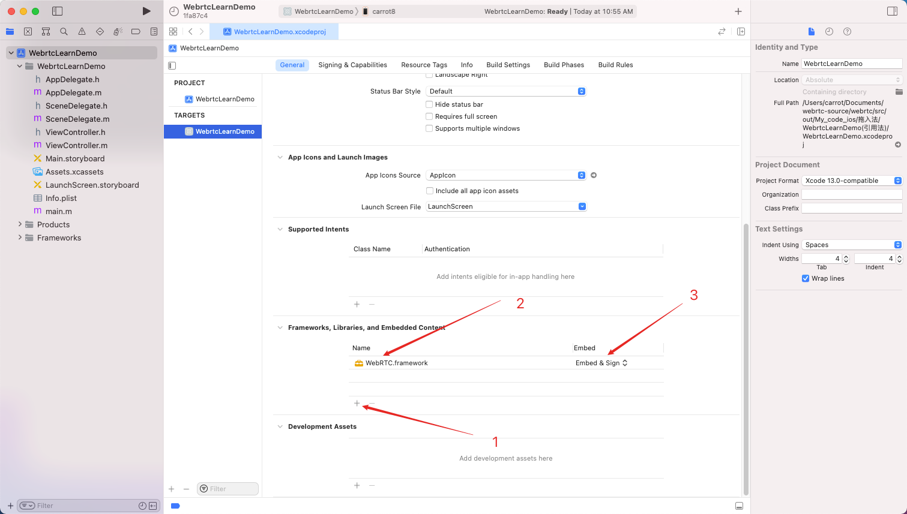

### ② `设置Framework的searchPaths`

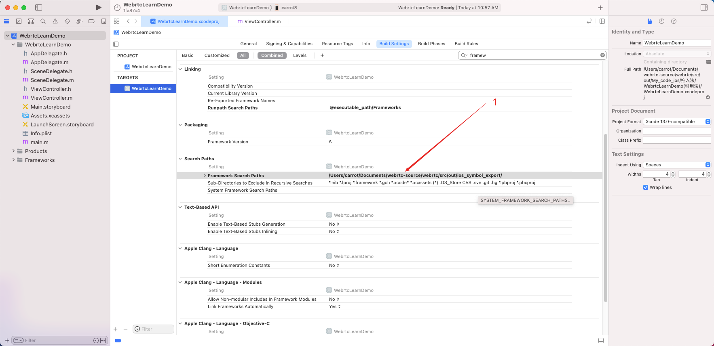

### ③运行成功

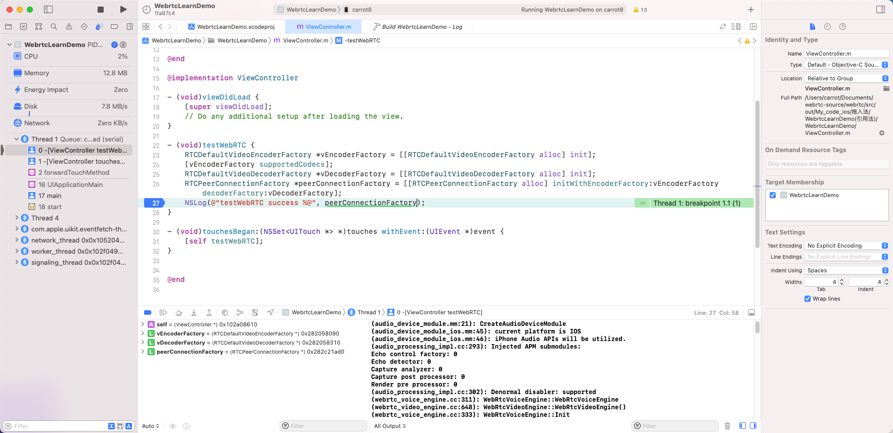

## 二、项目引入WebRTC库（拖入法）

### ①直接把 `WebRTC.framework` 拖入项目中

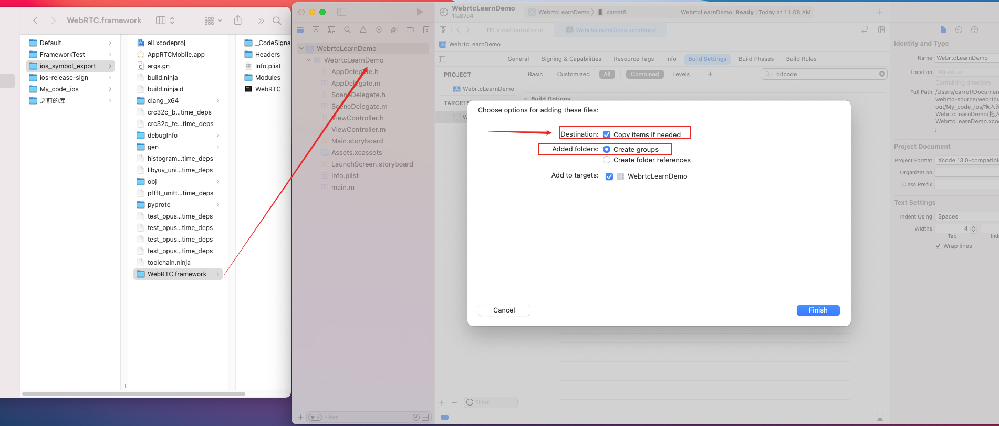

### ②修改Framework的引入和签名方式

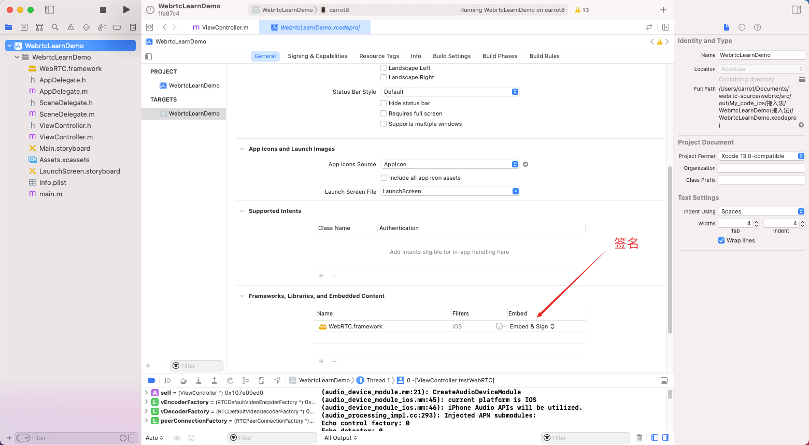

如果没有步操作，将会有如下报错：

 **dyld[71229]: Library not loaded: @rpath/WebRTC.framework/WebRTC**

### ③运行代码成功

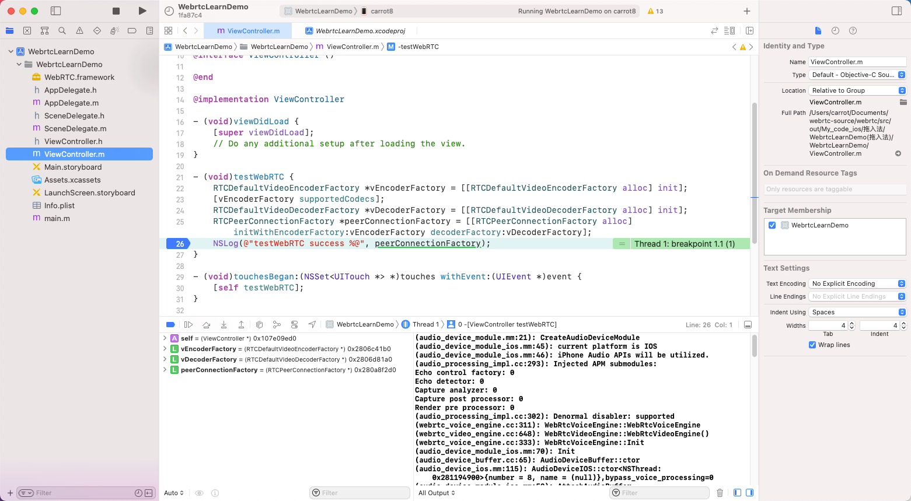

## 三、项目引入WebRTC库（断点法一）

### ①无法WebRTC源码断点

在上面介绍的 `项目引入WebRTC库（引入法）`  实现后，我们发现断点只能在我们自己项目中，无法进入 `WebRTC.framework` 源码进行调试。

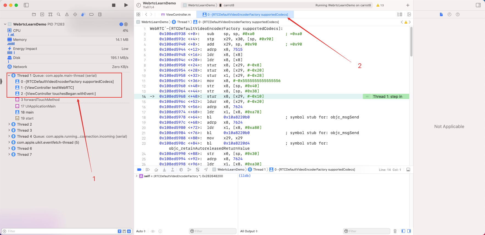

### ②给项目设置`符号断点`，（具体原因在 `day01`中介绍过）

在执行 `-[AppDelegate application:didFinishLaunchingWithOptions:]` 时自动设置source-map，`settings set target.source-map "./../../" "/Users/carrot/Documents/webrtc-source/webrtc/src"`就省得每次手动设置了。

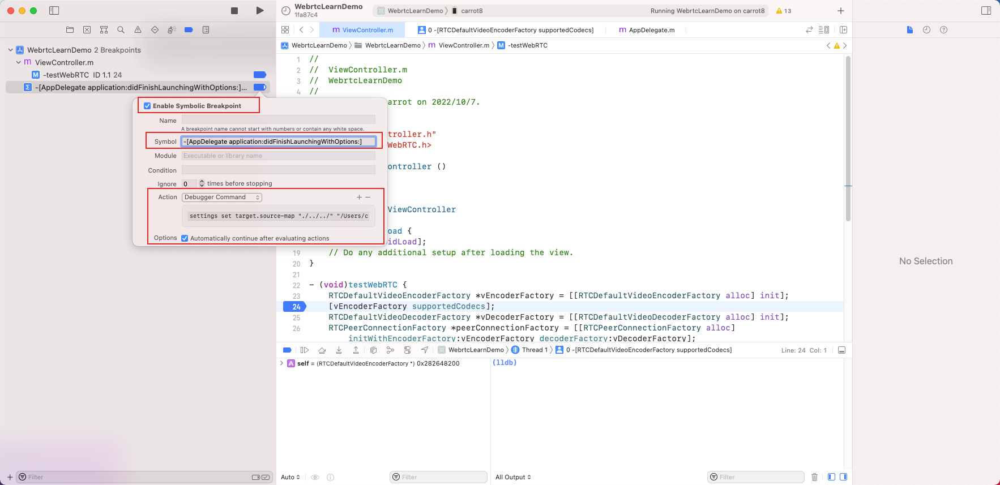

### ③成功源码断点

可以看到，已经可以成功对WebRTC的源码进行单步调试了。

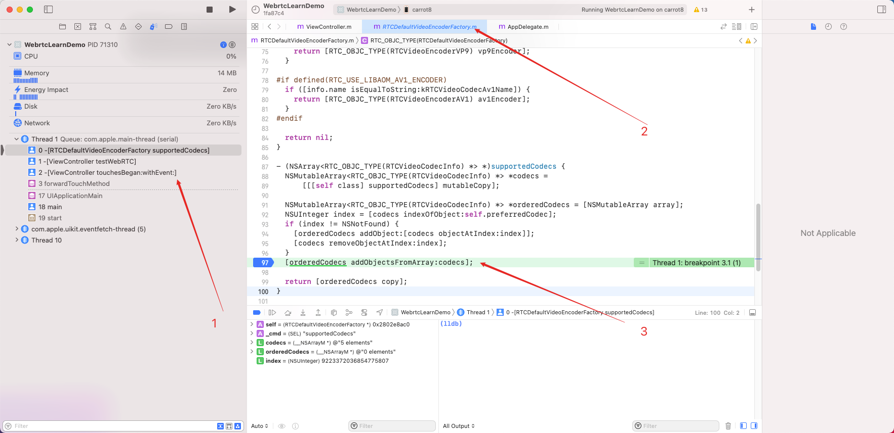

## 四、项目引入WebRTC库（断点法二）

上面的断点法可以源码打断点，但是无法在 xcode 项目之中直接定位的源码文件。

### ①将 `all.xcodeproj` 拖入项目中

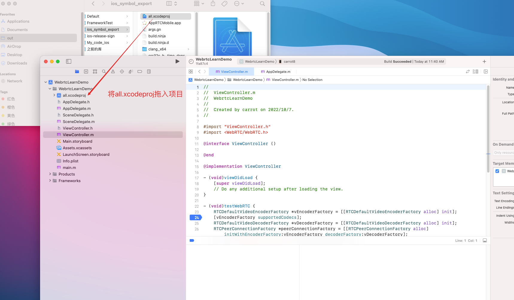

### ②将 `WebRTC.framework` 引入项目中

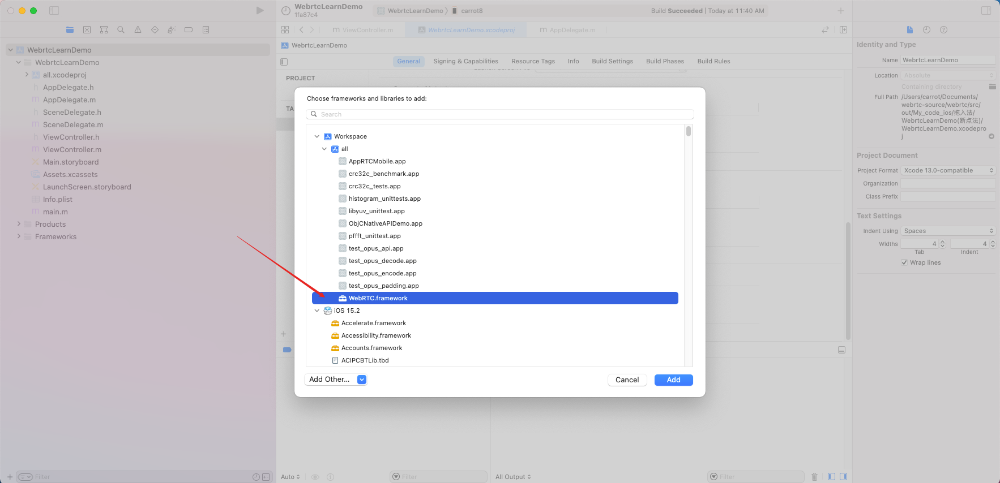

### ③给项目设置`符号断点`，（具体原因在 `day01`中介绍过）

在执行 `-[AppDelegate application:didFinishLaunchingWithOptions:]` 时自动设置source-map，`settings set target.source-map "./../../" "/Users/carrot/Documents/webrtc-source/webrtc/src"`就省得每次手动设置了。

### ④可以看到，我们不仅可以断点源码，并且能在xcode直接显示源码相关文件了

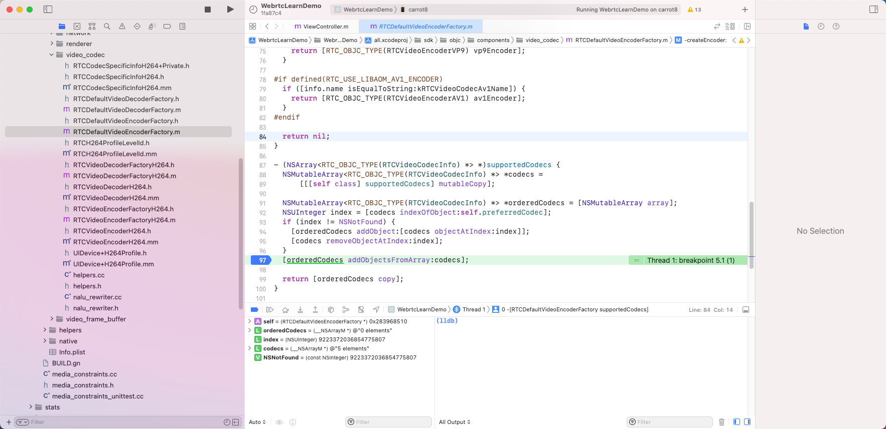

