## 一、WebRTC学习前言

### 1、WebRTC源码的代码量是什么级别？

- WebRTC有 `100多万` 行代码

### 2、音视频的起源？

- 千里眼与顺风耳（想象）
- 1876年贝尔发明了电话（音频的起源）
- 1872年“奔跑的马”（为了证明🐴在奔跑时，四条腿是否出现腾空，借助一组照片，也是视频的起源）

### 3、WebRTC由何而来？

- 缘起GIPS的独门秘籍
- Google收购GIPS，为了实现浏览器直播的宏大愿景，创建了WebRTC
- WebRTC现在就是音视频网络传输界的霸主

### 4、【重要】传统直播和实时互动直播的区别（技术路线、最终形态上分析）？

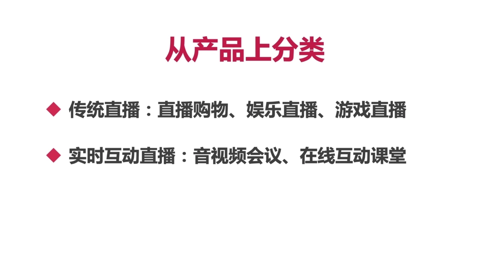

### 5、【重要】两种技术的对比？

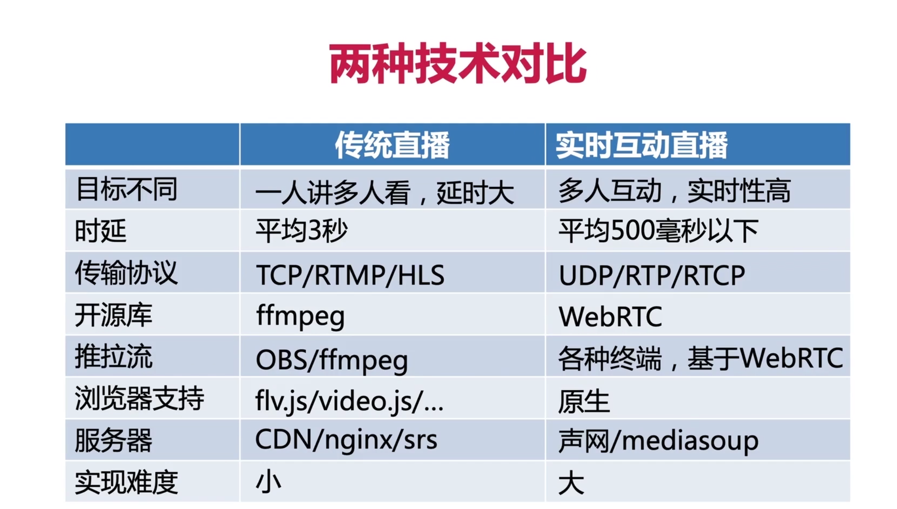

## 二、实时互动直播的难点在哪里？

### 1、对实时要求性高，每个延迟度让用户的体验如何？

- 传统直播：`平均延迟在3秒以上`
- 实时互动直播：`延迟在500毫秒以内`

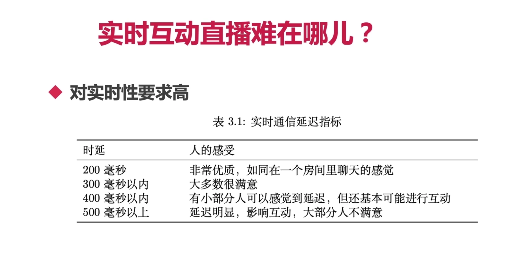

### 2、TCP与UDP之争？

- 如果说UDP做到极致是不是就是自己实现了一套TCP呢？`否`

- tcp的`ack机制和超时重传机制`，就限制了tcp是无法做到500毫秒以下的延迟性的
- 因此实时互动直播都是选择借助 `UDP` 进行包传输

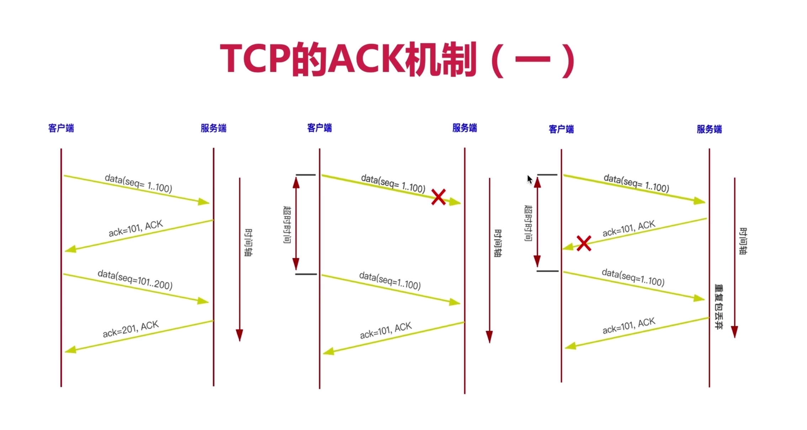

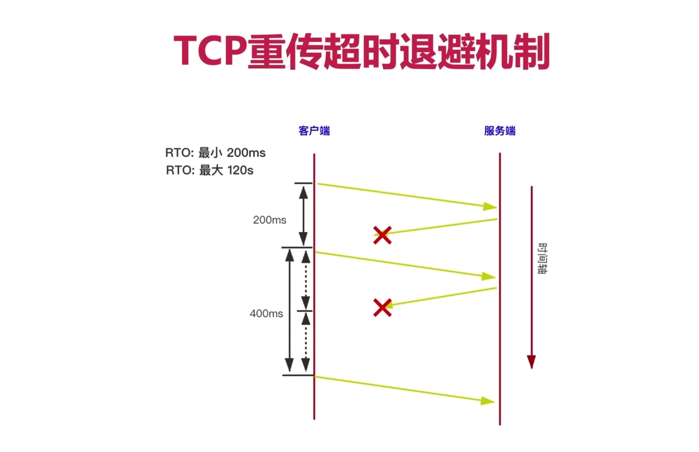

### 3、音视频服务质量与实时性之间的矛盾是什么？

- 如果想要提高音视频服务质量，那么就要保证数据包的完整性和数据足够保真，而就会给实时性带来很大挑战。

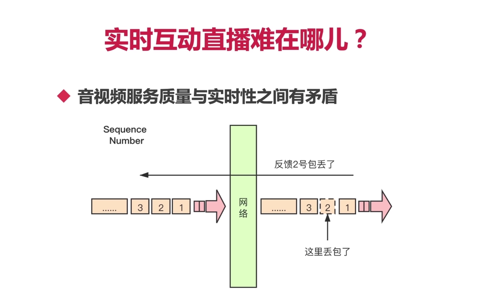

### 4、实时互动直播为什么还要解决回音、噪音等问题？

- 回音消除（之前好像对此认识存在误区）
- 降噪
- 自动增益

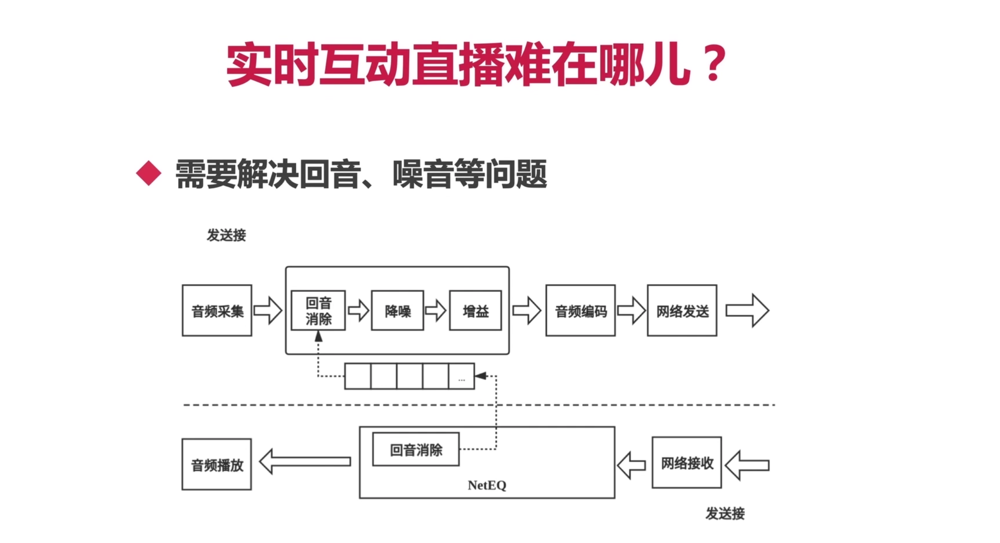

### 5、两种直播的技术要求对比？

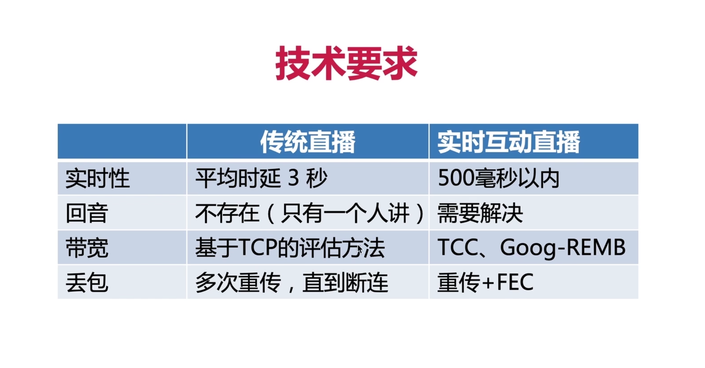

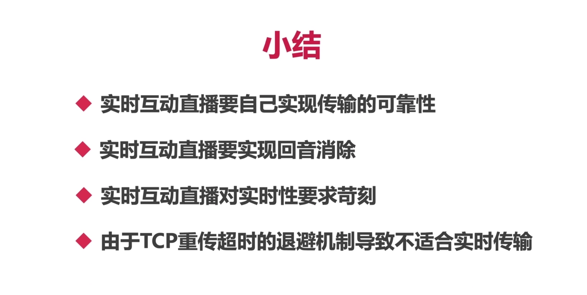

## 三、几个重要指标和评测方法？

### 1、实时互动直播的三个重要指标？

- 实时通信延迟指标
- 音频服务质量评测指标
- 视频服务质量评测指标

### 2、对实时通信延迟指标的理解？

- `谨记：` 实时互动直播，端到端的延迟评估必须小于500毫秒

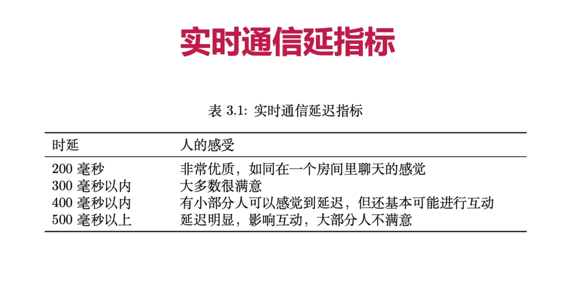

### 3、实时性最简单的评估方案？

- 放一个电子表，对比观看端看到的时间和真实时间的差距，就能大致评估延迟性了。

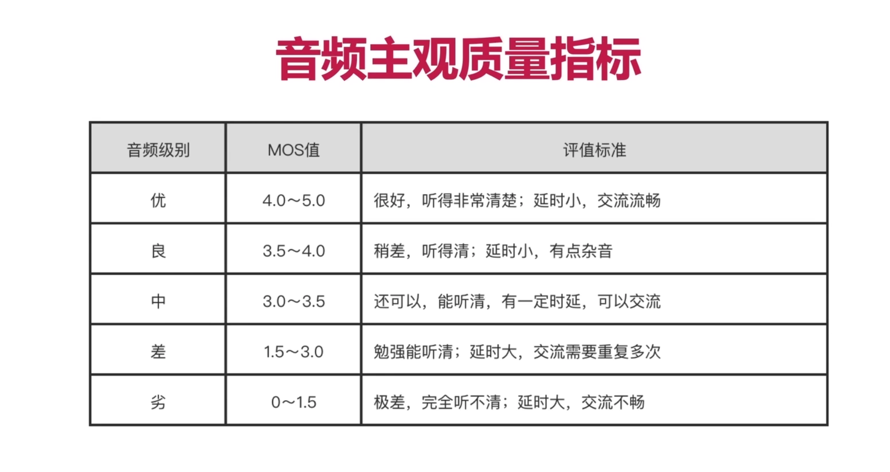

### 4、视频质量评测方案？

- 也是一般始终主观评测，同时可以借助码流大小辅助评估

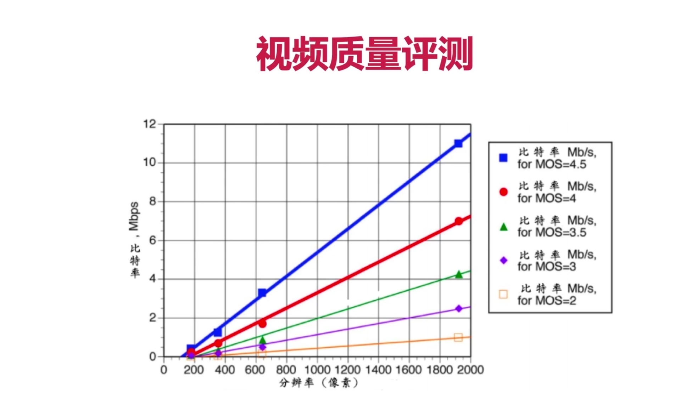

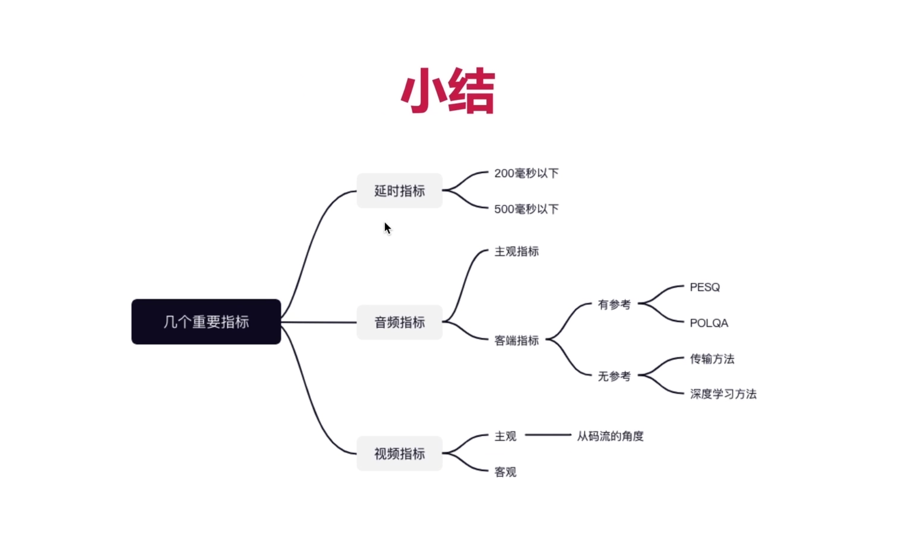

## 四、为什么实时互动直播需要使用WebRTC？

### 1、视频直播架构（大方面）

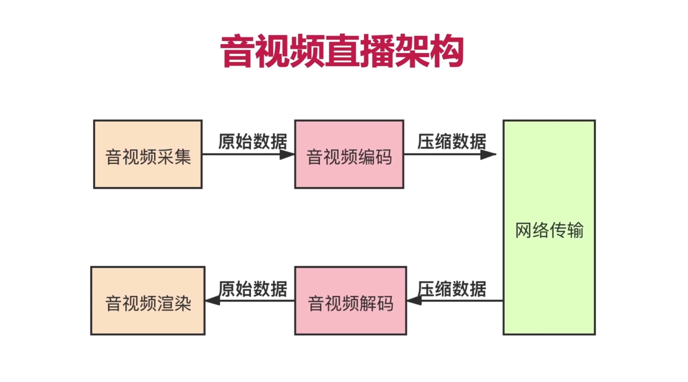

### 2、细化音视频直播架构？

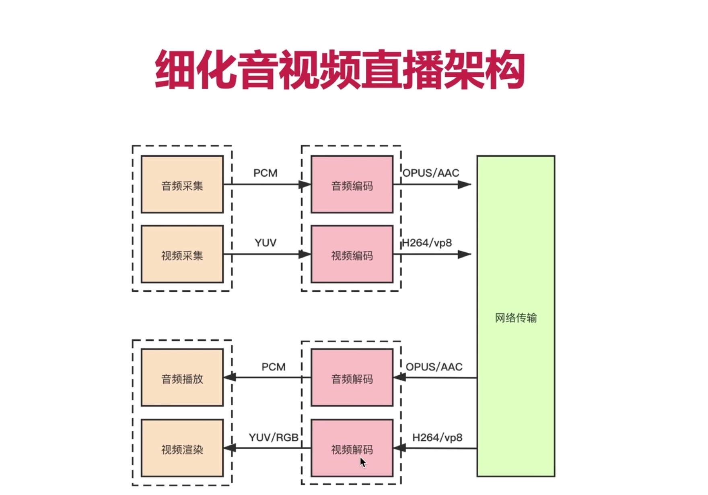

### 3、进一步细化音视频直播架构？

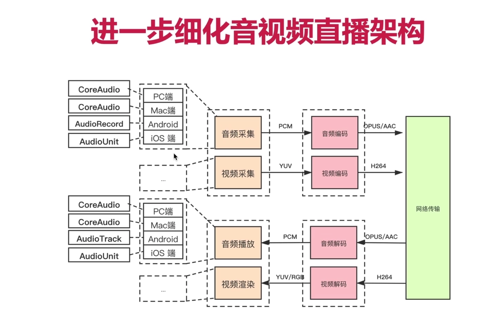

### 4、最终细化后的音视频直播架构？

- `补充`：电话使用的是  g.711 编码

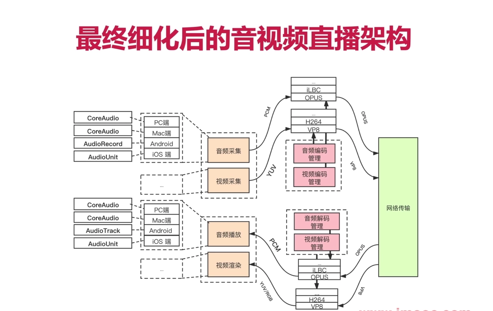

### 5、自研系统与WebRTC的比较？

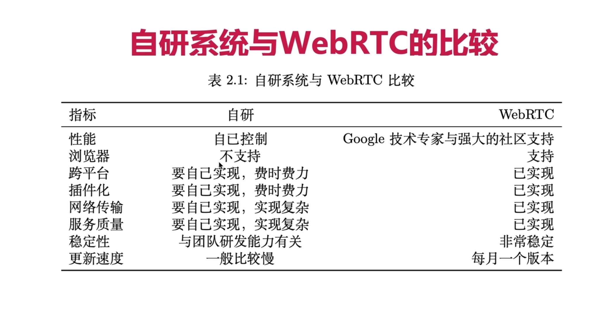
