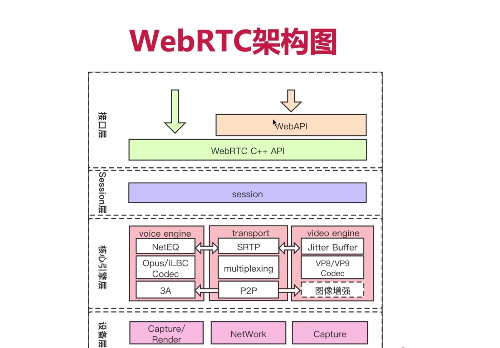
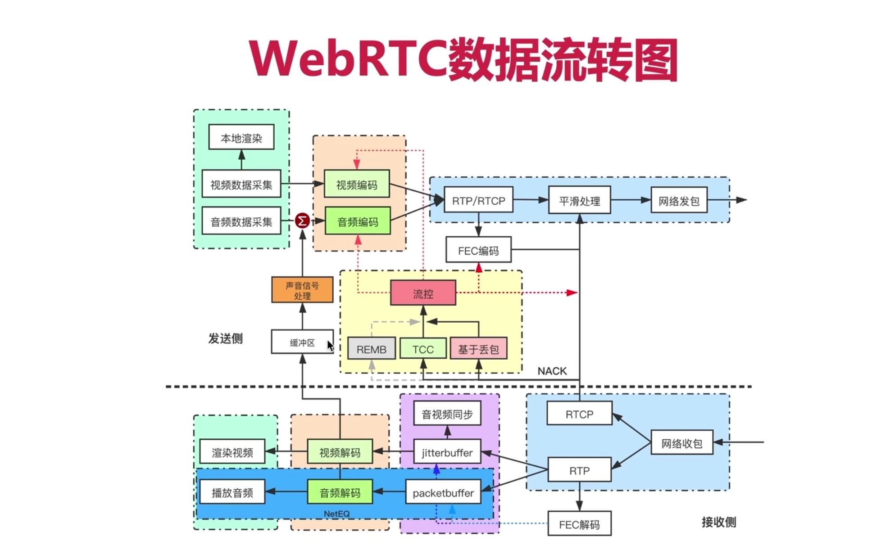
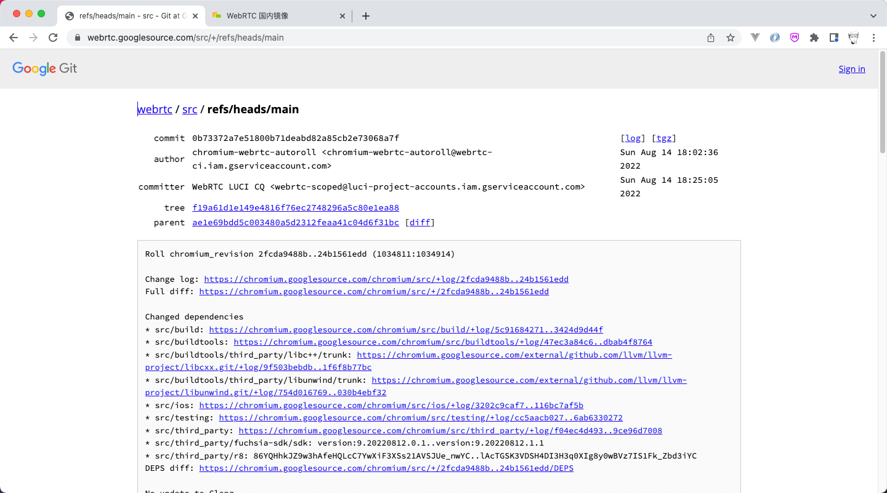
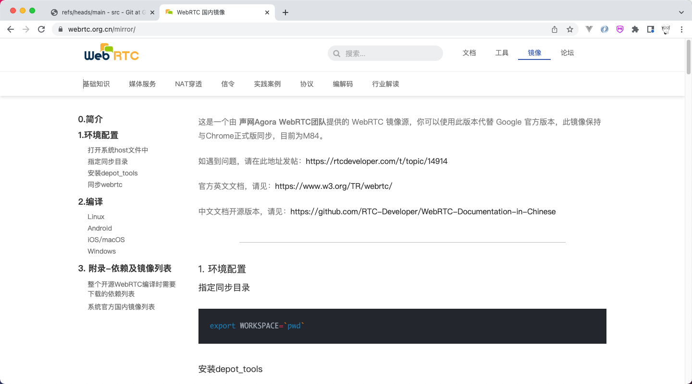
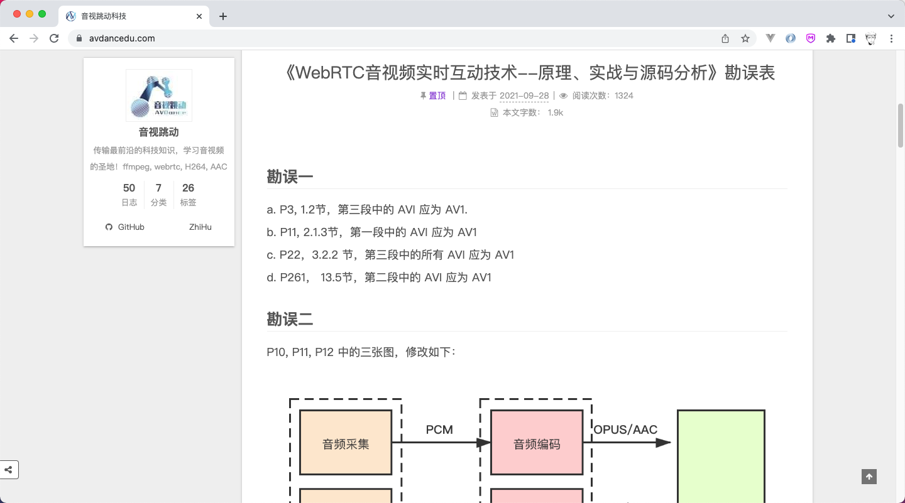
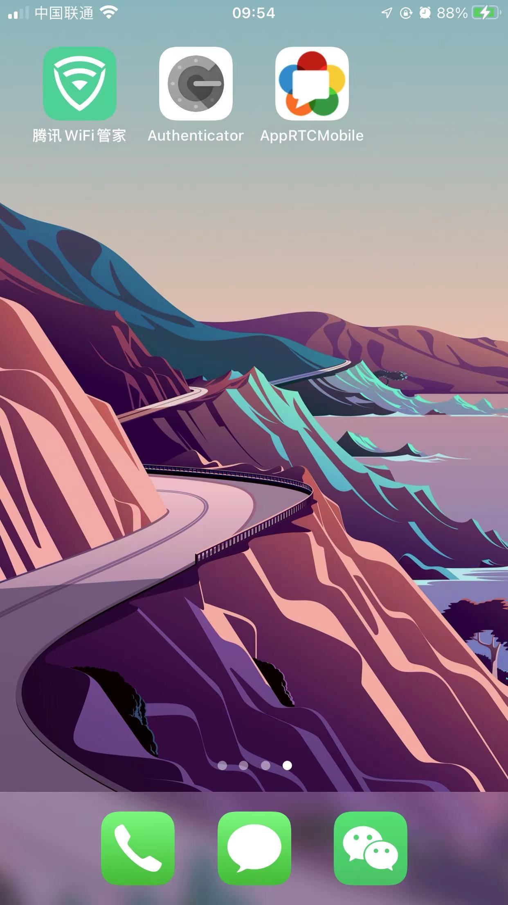

## 一、WebRTC整体架构

### 1、【重要】WebRTC的架构图





### 2、【重要】WebRTC的数据流转图

- RTCP包是用于控制RTP包的
- RTP包里面都是媒体数据




## 二、WebRTC资料路径

### 1、哪里获取WebRTC的源码？

- [通过官网获取](https://webrtc.googlesource.com/src/+/refs/heads/main)
- [通过声网镜像获取](https://webrtc.org.cn/mirror/)








### 2、记一个音视频参考文章

- avdancedu.com




### 3、认识depot_tools 、gn、ninjia（说出大体功能即可）

- depot_tools： Google 官方提供的一个用来 <font color="red">checkout 、 compile 、 run 和 submit</font> 的工具集，可以帮助我们更好的学习和调试 Chromium 代码

- gn：它与cmake功能相同
- ninjia：它与make功能相同

## 三、[Mac下编译WebRTC（Mac和iOS版本）](https://segmentfault.com/a/1190000041179228)

#### 前言

随着新冠疫情的影响，这两年音视频的需求呈爆发式增长。在音视频领域中，WebRTC可以说是一个绕不开宝库，包括了音视频采集、编解码、传输、渲染的全过程。本文主要记录下在Mac平台上编译WebRTC Mac和iOS版本的全过程。

#### 设置代理

因为众所周知的原因，要下载WebRTC的源码是需要代理工具的。

```routeros
export http_porxy="http://127.0.0.1:21087"
export https_porxy="http://127.0.0.1:21087"
```

#### 安装工具depot_tools

git clone获取depot_tools

```awk
git clone https://chromium.googlesource.com/chromium/tools/depot_tools.git
```

将depot_tools的路径配置到环境变量中(只是当次生效)

```routeros
export PATH=$PWD/depot_tools:$PATH
```

#### 下载webrtc源码

```bash
mkdir webrtc
cd webrtc
fetch --nohooks webrtc_ios
gclient sync
```

#### 编译

Mac版本：

```jboss-cli
cd src
gn gen out/mac-release --args='target_os="mac" target_cpu="x64" is_debug=false use_rtti=true is_component_build=false rtc_use_h264=false rtc_include_tests=false' --ide=xcode
ninja -C out/mac-release
```

iOS版本(不带证书)：

```shell
cd src

# 编译不带证书版本
gn gen out/ios-release --args='target_os="ios" target_cpu="arm64" is_debug=false use_rtti=true is_component_build=false ios_enable_code_signing=false proprietary_codecs=false rtc_use_h264=false rtc_include_tests=false' --ide=xcode
ninja -C out/ios-release
```

iOS版本(带证书)：

```shell
cd src
# 获取证书名
security find-identity -v -p codesigning

# 编译带证书版本（我没成功，每次报证书id不对）
gn gen out/ios-release-sign --args='target_os="ios" target_cpu="arm64" is_debug=false use_rtti=true is_component_build=false  ios_code_signing_identity="你的整数id" proprietary_codecs=false rtc_use_h264=false rtc_include_tests=false' --ide=xcode

# 最终成功编译的语句（保证电脑上只有一个证书，去keychian中删除，让它内部自动选择）
gn gen out/ios-release-sign --args='target_os="ios" target_cpu="arm64" ios_enable_code_signing=true rtc_include_tests=false' --ide=xcode

# 运行 APPRTCMobile，需要根据xcode提示，更改一下BundleID
```

编译成功后会在src\out\xxxx\下生成all.xcworkspace文件。打开就可以构建、调试webrtc的项目。其中APPRTCMobile是谷歌提供的示例demo，可以在Mac下直接编译运行。


运行成功，手机上会出现以下app和运行成功的界面：





