## 一、认识官方提供的demo

### 1、学习WebRTC要牢牢抓住哪个demo？为什么？

- 抓住：peerConnection_client 这个demo【只有Windows环境有】
- 原因：因为这个demo几乎囊括了WebRTC所有主要用法

### 2、peerconnection_client 的主要工作流程是什么？

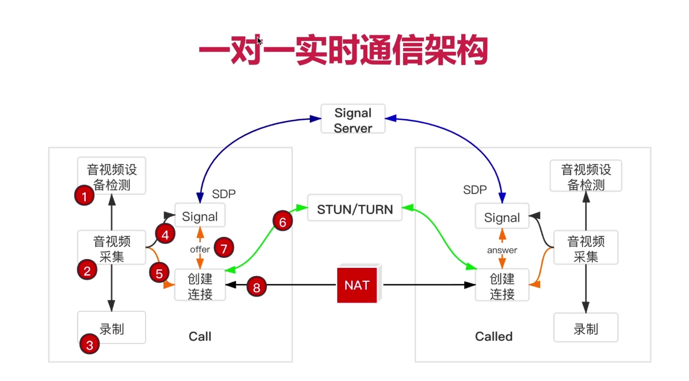

### 3、peerconnection_client 类关系图

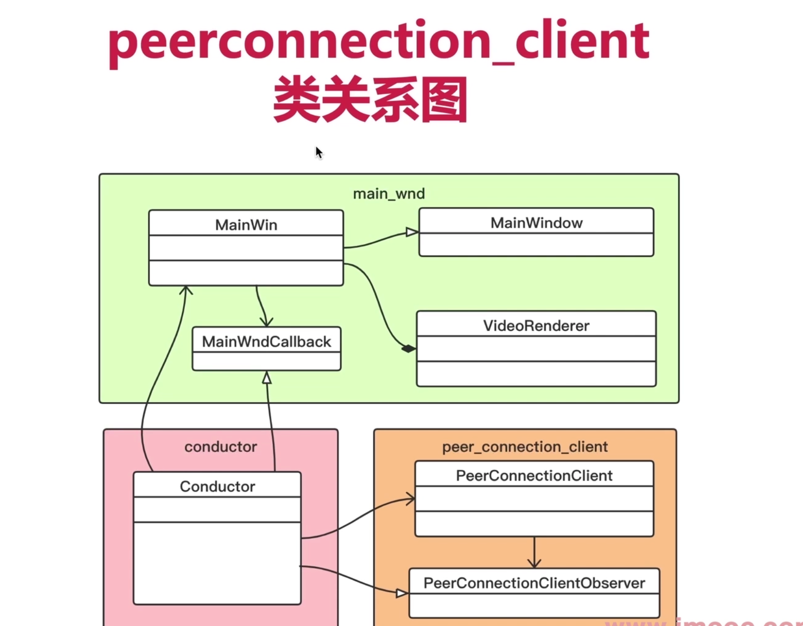

### 4、peerconnection_client 的时序图

- 这些图真的太棒了，很容易帮助理解东西
- 一定要学会来怎么绘制这些图

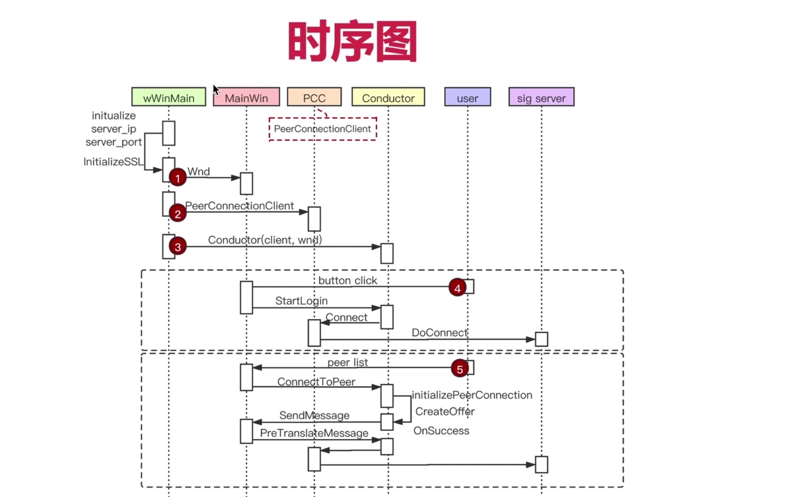

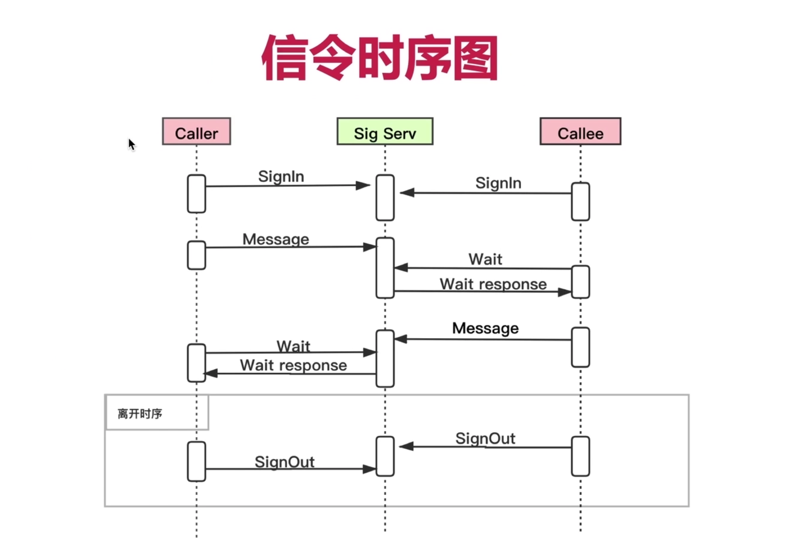

### 5、媒体协商的步骤，一共8个步骤，一定要学会来！

- 下面这两个图也太棒了

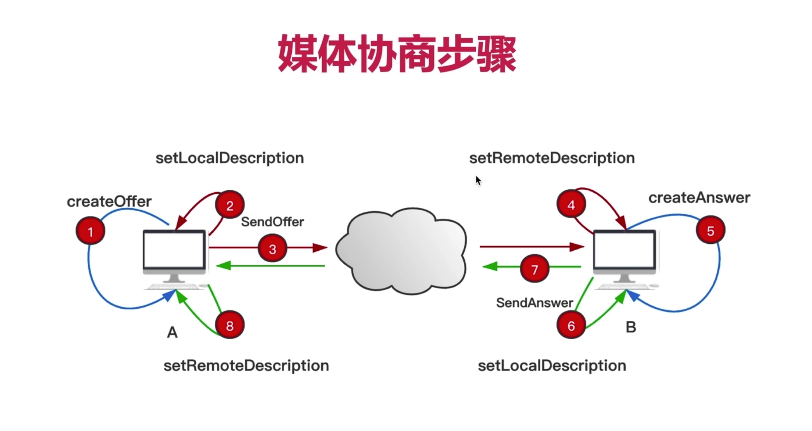

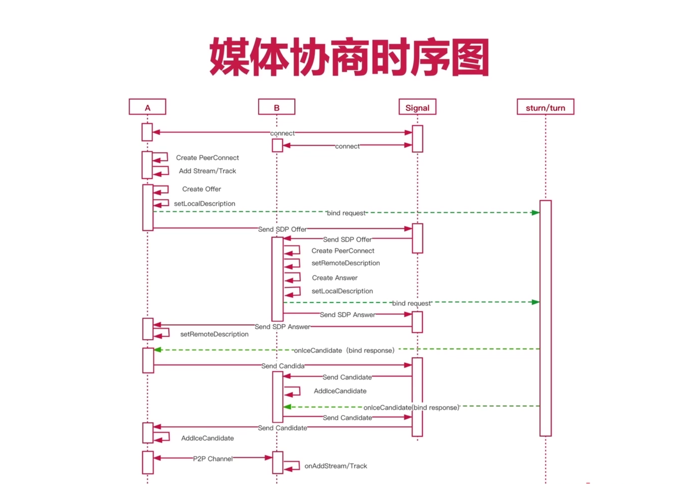

### 6、传统协商存在什么问题？如何解决？（暂时了解吧，好像还没用到）

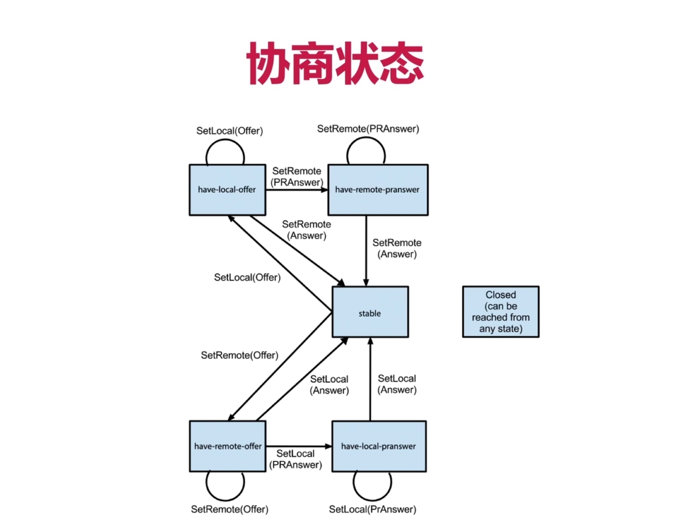

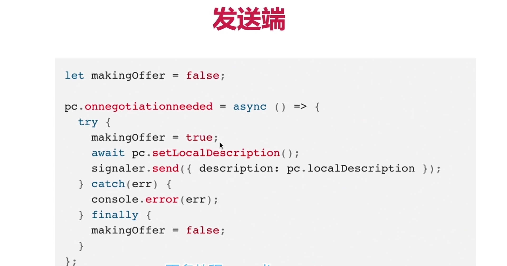

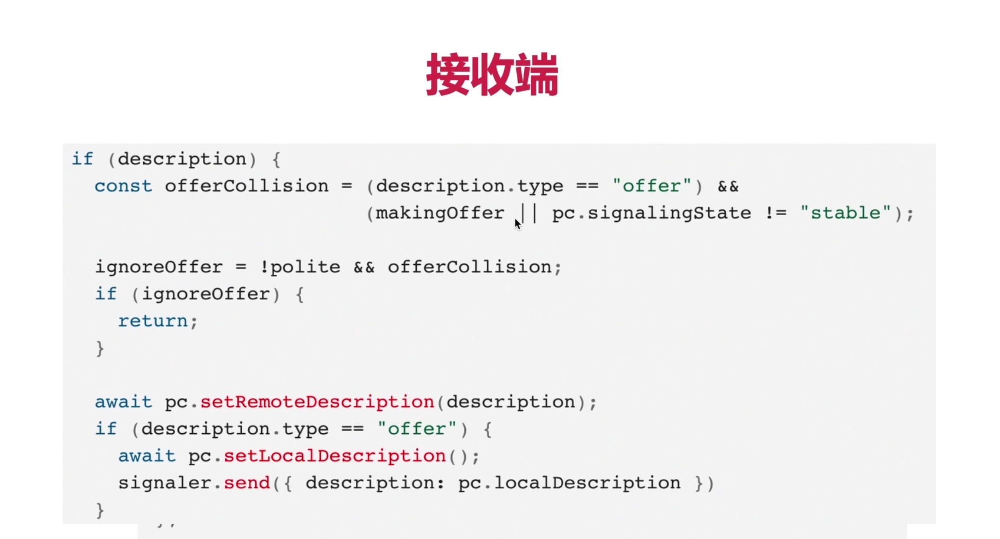

### 7、信令处理时序图

- 图太好了

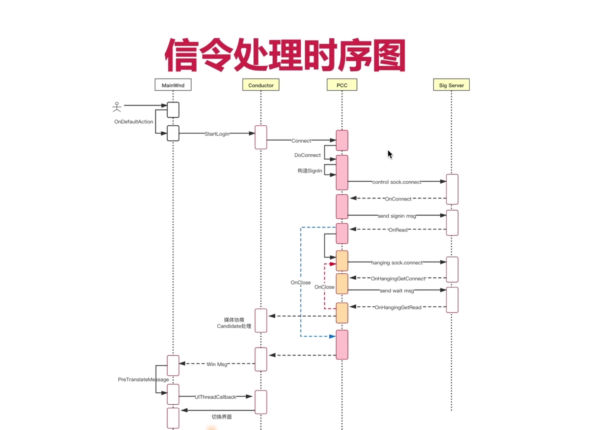

### 8、WebRTC Native 开发过程

- 图也是超级棒

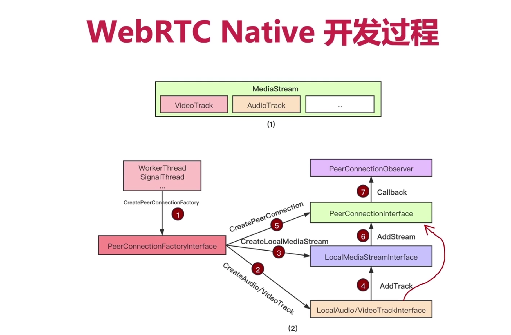
