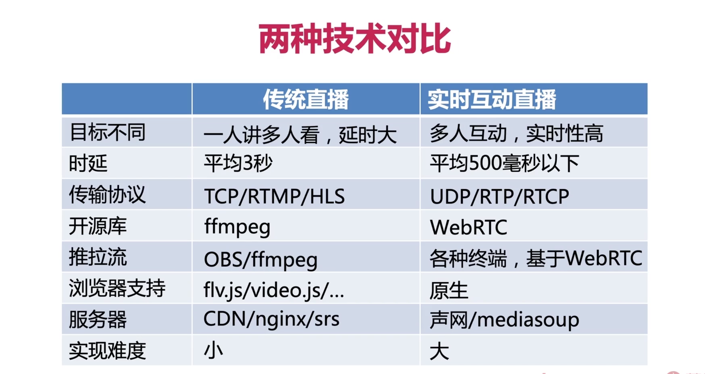
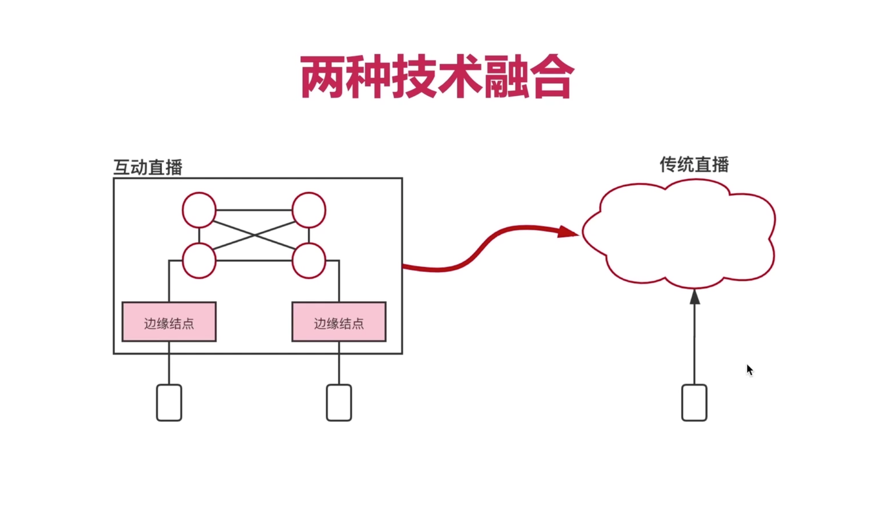
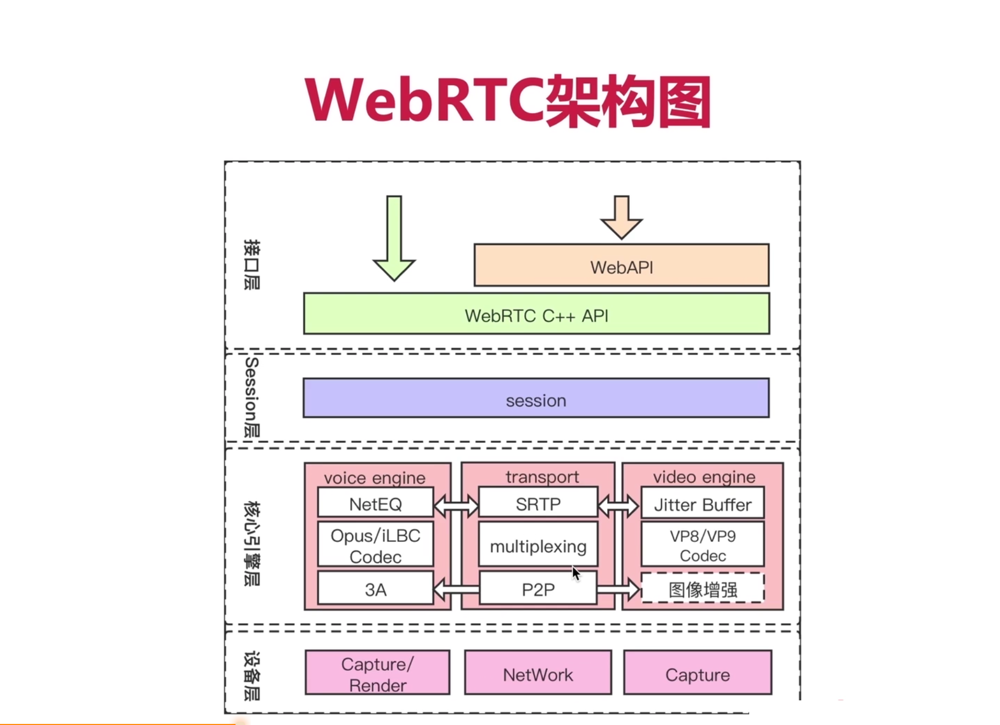
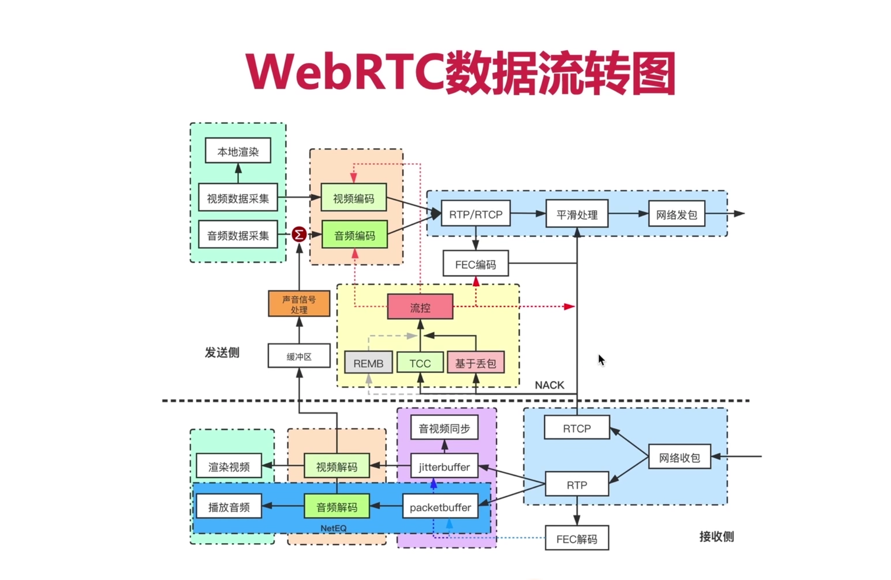

## 一、day01初识WebRTC

### 1、WebRTC的网络模块好在哪里？

- 保障数据的实时性（<500ms）
- 可以实时准确的评估出带宽大小（REMB、TCC）
- 优秀的防拥塞控制算法（GCC）
- 保障网络带宽使用的公平性（TCP、GCC）
- 抗丢包（NACK、FEC）
- 防抖动、防乱序（JitterBuffer、NetEQ）
- 可以传输各种数据（音视频、文本、二进制数据）

### 2、WebRTC的音视频引擎强大在哪里？

- 支持多种音视频编解码器（AV1/VP9/VP8、 OPUS/ISAC）
- 采用了最先进的音视频编解码器（AV1、OPUS）
- 多种音视频格式可以互通（VP8、H264）
- 能够快速集成新的编解码器

### 3、WebRTC的 3A 模块是哪些？

- 自动增益
- 回音消除
- 降噪
- 将传统算法用到了极致，不仅仅支持软件方法还支持硬件方法

### 4、WebRTC的安全性体系在哪些方面？

- 通过动态分配用户名/密码保证用户的有效性
- 通过指纹保证证书的真实性
- 通过DTLS-SRTP对数据进行加密
- 还支持端到端数据加密

## 二、day02 认识WebRTC的架构

### 1、直播一般分哪两种？

- 传统娱乐直播：直播购物、娱乐直播、游戏直播；RTMP/HLS 底层都是基于 ffmpeg 来实现的
- 实时互动直播：音视频会议、在线互动课堂；RTP/STRP 基于 WebRTC 实现的

### 2、两种数据的详细对比？

- 下面这个图，要自己重绘一下

- 至少能从三个方面吧

### 3、实时互动直播难点在哪里（说两点）？

- 对实时性要求高 （< 500ms）
- 音视频服务质量与实时性之间是有矛盾的

### 4、一个UDP大概能带多少数据？TCP在实时性上的致命缺陷是什么？

- 一个UDP包理论上能带1500字节的数据，实际上掐头去尾，也就能带 1400 字节。
- TCP为什么会导致直播延迟大：TCP的重传超时退避机制

### 5、WebRTC的整体架构图？（四层，要能自己手绘出来）

- 灵魂图之一

### 6、WebRTC数据流转图？（灵魂图，必须能手绘）

- 从接收侧的流程？
- 从发送侧的流程
