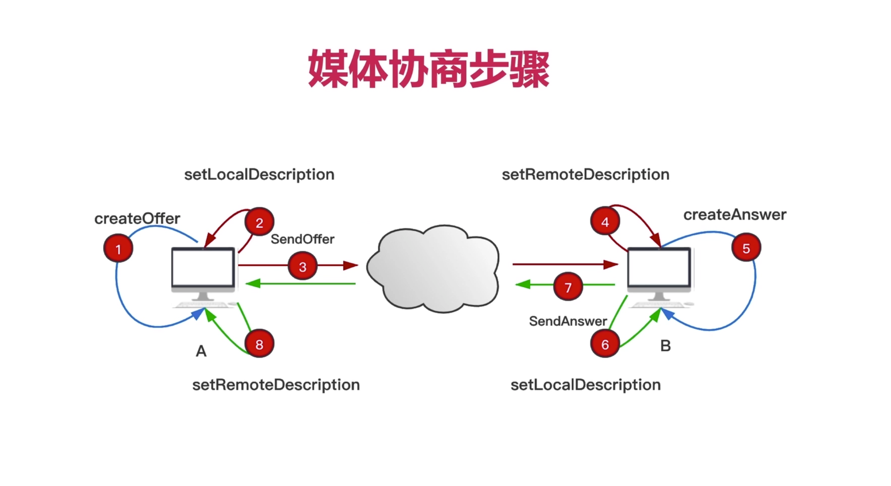
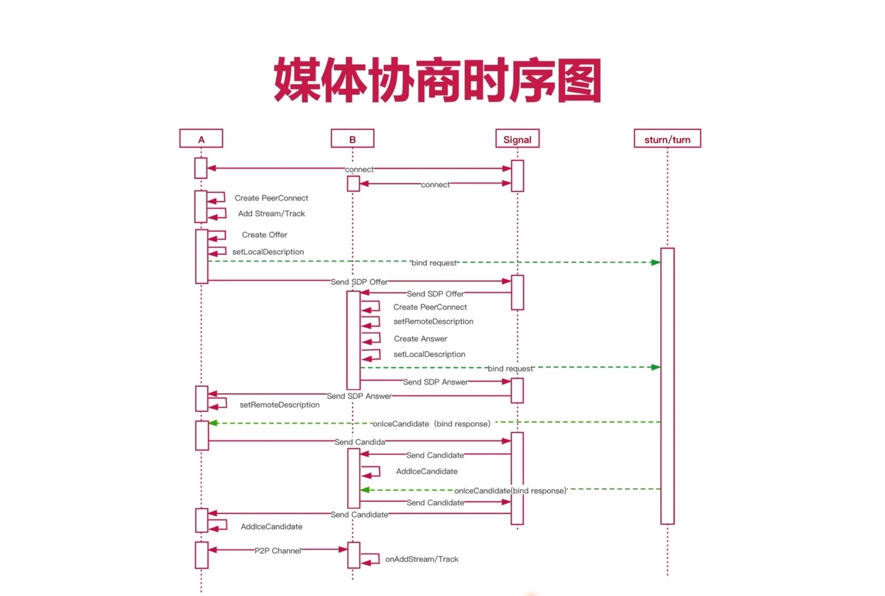
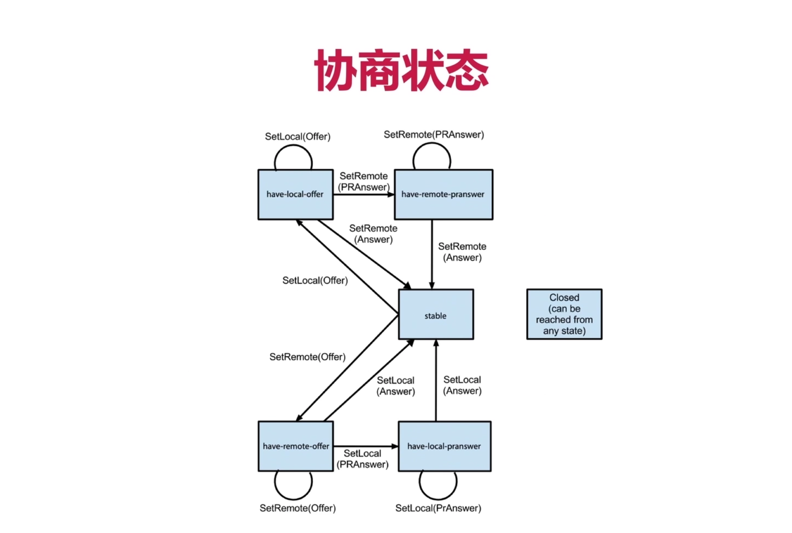
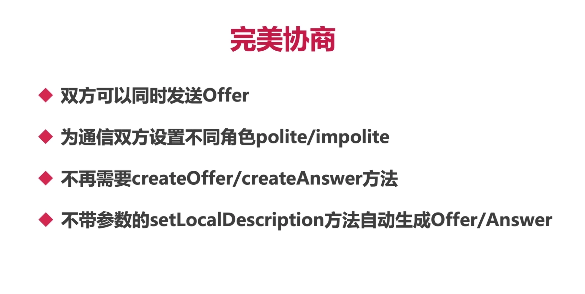

### 1、媒体协商起了主要哪些作用？

- 交换双方的音频编解码器信息、视频编解码器信息
- 音频主要参数：采样大小、采样率、声道数
- 视频主要参数：帧率、分辨率

### 2、媒体协商的步骤？8个步骤，必须要能手绘。

- 目的：找到共同支持的编解码器以及编解码器相关的参数。

### 3、媒体协商的时序图，这个流程必须很清楚。【手绘】

- 四个角色：ClientA、ClientB、Signal、Coturn

### 4、思考和尝试，如何知道WebRTC处于媒体协商的那个阶段呢？（TODO）

- 什么时候是Offer阶段？什么时候是Answer阶段？
- `核心点`：WebRTC媒体协商过程是有状态机的，`状态机不合适的时候进行其他操作，会导致媒体协商失败`。

### 5、传统协商存储什么问题？完美协商是怎么解决的？

- `传统协商`：如果状态不对的时候，进行其他协商操作，会导致整个协商过程失败。
- `举例说明`：如果ClientA处于`have-local-offer`阶段，有收到对端的`Offer`，就会导致协商失败，因为从上图可知，只有在`stable`阶段才能接收对端的`Offer`信息。

