## 一、SDP基础（WebRTC的核心，必须清楚每个元素的含义）

### 1、SDP结构核心图？分为三层？

- 实际上每个SDP都是嵌套的方式进行定义的
- 最外层是会话层、里层是媒体层、媒体层又包括音频层+视频层

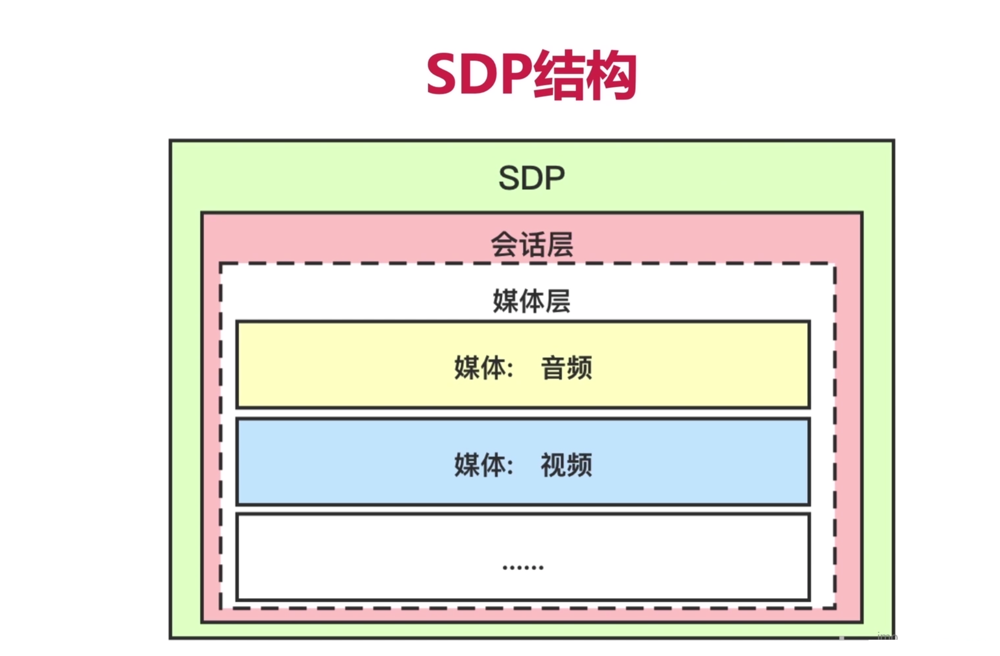

### 2、SDP的数据格式是怎么样的？

- `<key> = <value>` 格式

### 3、`m、a、c、v、s、o` 分别是什么含义？

> m：media，一个m表示一个媒体，可以是`音频` 或 `视频`。

> a：attribute，表示属性，当我们顶一个某个媒体之后，要对某个媒体进行补充说明，那么就通过attribute进行补充描述。

> c：connection，也就是连接。

> v：version，表示当前SDP协议使用的版本，需要通信双方的版本号相同才能进行通信。

> s：session，表示a与b进行通信就是一个会话，会话是全局的。

> o：owner，表示谁有拥有这个会话。

### 4、结合一个具体的例子，进行学习。【必须知道每个字的含义】

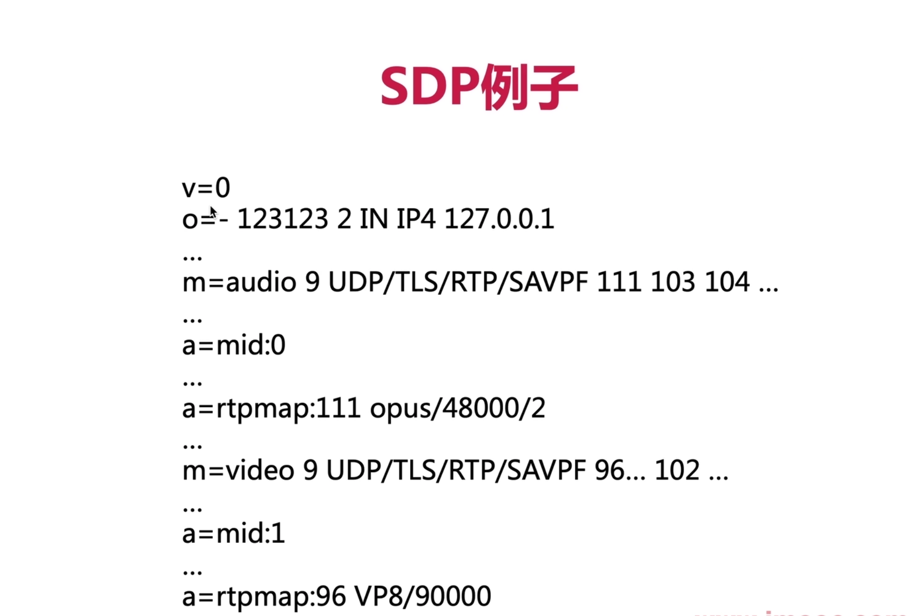

> `v=0`
>
> 表示SDP协议的版本号为0，通信双方需要版本号相同才能进行通信。
>
> 第一次协商是0，那么第二次协商就是1，第三次协商就是2，这个数字是不断累加的。（TODO验证）

>`o=- 123123 2 IN IP4 127.0.0.1`
>
>`o`表示会话的所有者
>
>`-`表示忽略会话所有者的名字
>
>`123123 2`一般用不到，忽略
>
>`IN`表示Internet
>
>`IP4 127.0.0.1`会话拥有者的IP地址

> `m=audio 9 UDP/TLS/TRP/SAVPF 111 103 104`
>
> `m=audio` 表示这是音频媒体数据
>
> `9` 是这个音频媒体的端口号，一般用不到，只要非0就行，如果是0就表示本次媒体协商是失败的。
>
> `UDP/TLS/RTP/SAVPF` 表示媒体所使用的传输协议。
>
> `UDP/TLS/RTP/SAVPF` 底层使用UDP协议，借助TLS进行数据加密，在UDP上跑的是RTP，后面的SAVPF表示支持SRTP协议。
>
> `A`：Audio、`V`：Video、`P`：Protocol、`F`：Feedback
>
> `111 103 104` 这些是 payload type 的值，每个payload type具体代表哪个编解码器，在后面有a进行补充定义。

> `a=mid:0`
>
> 其中a表示attribute，就是对前面的一个m进行扩展说明
>
> `mid`表示media id，也就是前面这个m的id是0

> `a=rtpmap:111 opus/48000/2`
>
> 表示对前面一个m的rtp协议进行扩展
>
> `111`表示对payload type = 111 的进行扩展说明
>
> `opus/48000/2` 表示 采用opus音频编解码器、采样率48000、双声道

### 5、WebRTC是如何确定一个candidate能否与对端进行连通的？

- 一方向另一方发送`Stun request/Stun response`，如何能通，就表示可用。

### 6、ICE-FULL 与 ICE-LITE 有什么区别？

- `区别：`是否双方都发送 stun request/stun response
- a=ice-lite
- 没有a=ice-lite就是ice-full
- webrtc默认使用ice-full，但是目前大部分开发产品都是使用 `ice-lite`

### 7、PlanB 与 UnifiedPlan 的区别？

- `PlanB`：只有一个M行，音视频用 a=ssrc 来区分
- `UnifiedPlan`：多个音视频有多个M行
- 现在的WebRTC基本都是用UnifiedPlan和ICE-LITE。

## 二、从不同角度认识 SDP

### 1、如果对SDP从功能上进行分类，可以如何分类？

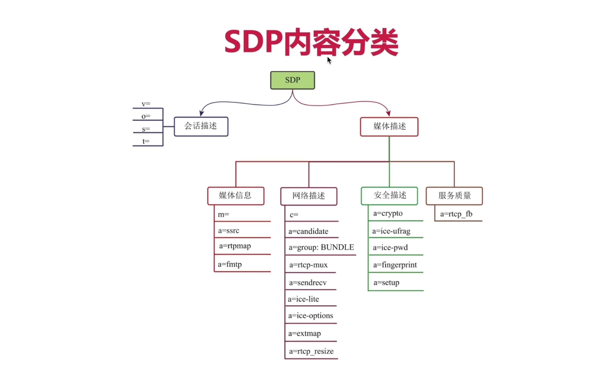

- `a=rtpmap`：是对媒体信息的payload type 做进一步说明的。
- `a=fmtp`：format parameter 是对媒体信息参数的进一步说明。

### 2、如果是从WebRTC的代码上对SDP的分类又是如何的呢？

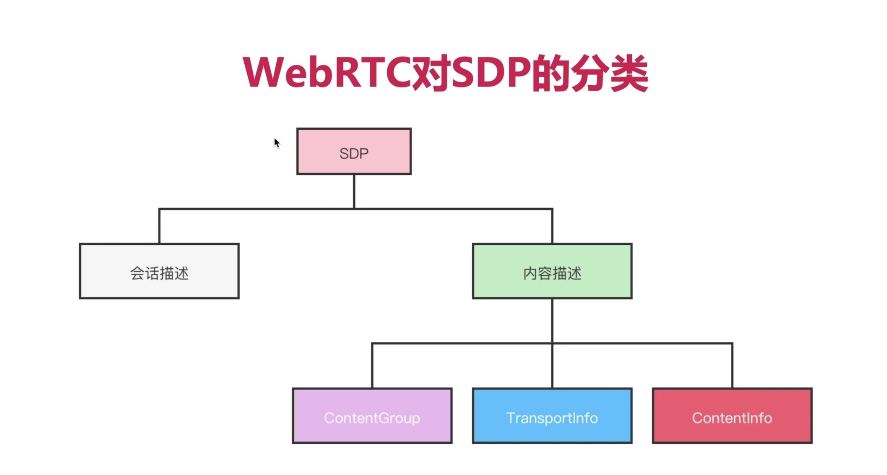

- ContentInfo、TransportInfo、ContentGroups 中都有name，就是通过相同的name，将三个串在一起，形成一个完整的媒体信息。

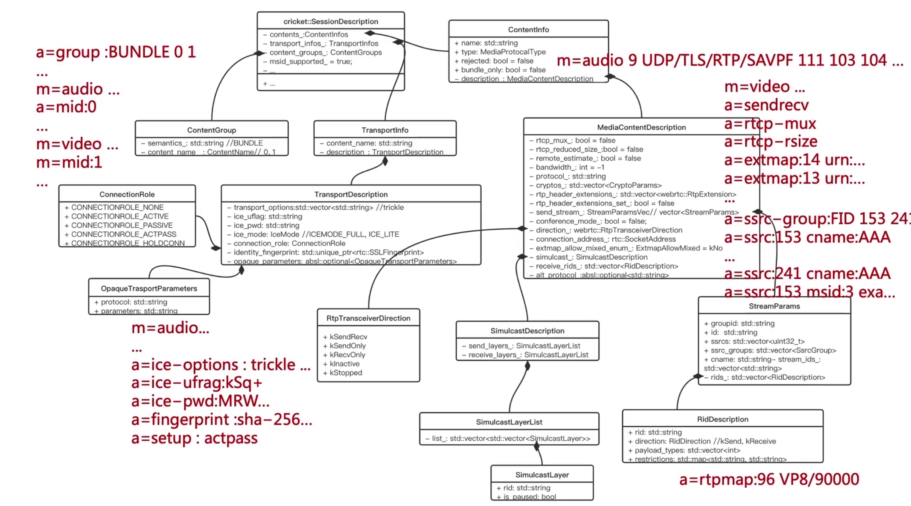

- 由上图可知WebRTC就很容易将SDP文本构造成内存中的WebRTC类结构；
- 也很容易通过WebRTC类结构生成SDP的文本；

### 3、WebRTC如何生成SDP的（需要细细品味）？

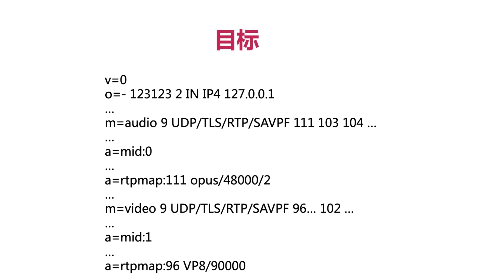

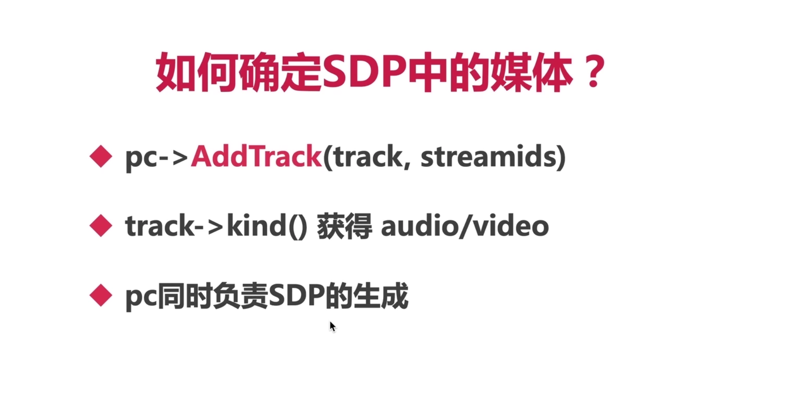

- AddTrack中具体做了什么事情？

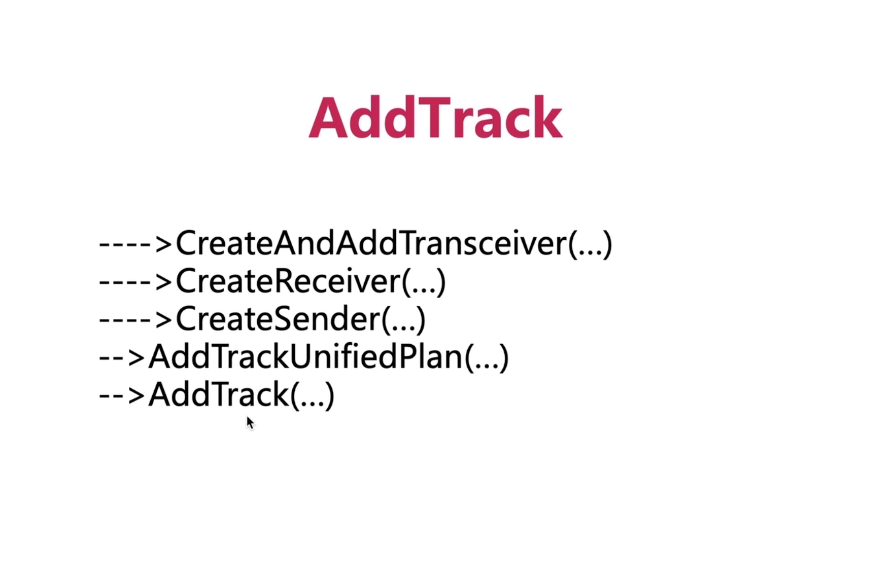

- 从下往上的调用顺序

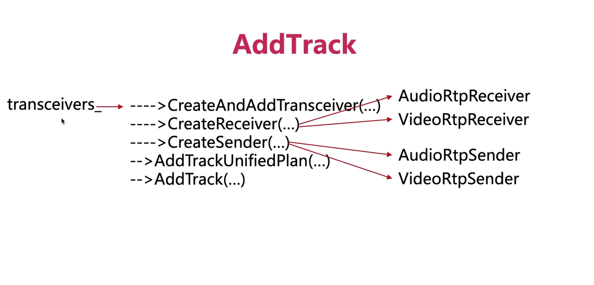

- 核心类

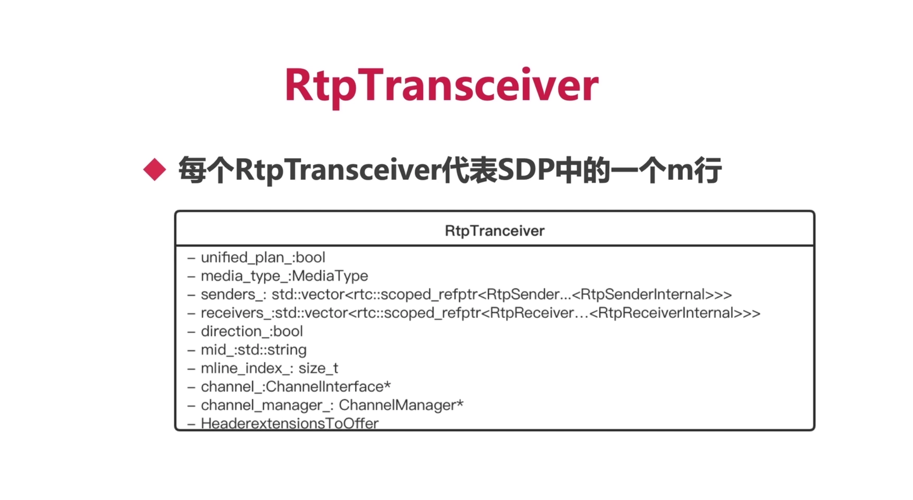

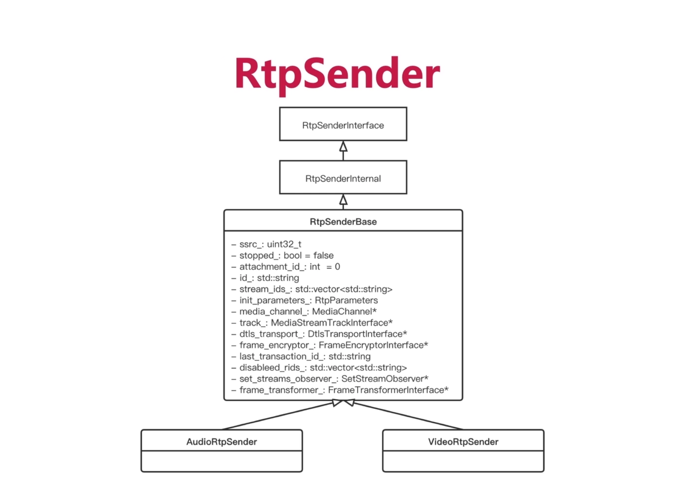

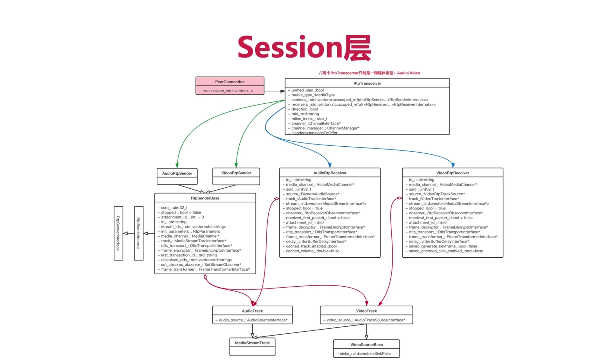

- RtpTransceiver实际上连接了三端：上层的应用、底层的网络传输、中间层的编解码器
- 有了RtpTransceiver就可以生成SDP的类关系图，然后生成SDP文档了。

### 4、梳理上面几个东西的关系？

- `究极目标：生成SDP类关系图`
- 在生成SDP类关系图之前，需要先通过 `AddTrack` 将音频、视频添加到 PeerConnection中；
- 有了这些track之后，在PeerConnection中就可以生成对应的RtpTransceiver；
- RtpTransceiver是连接上层应用、底层网络连接、中间层编解码器的一个核心类，有了这个类，我们在生成SDP的类关系就非常轻松了；

