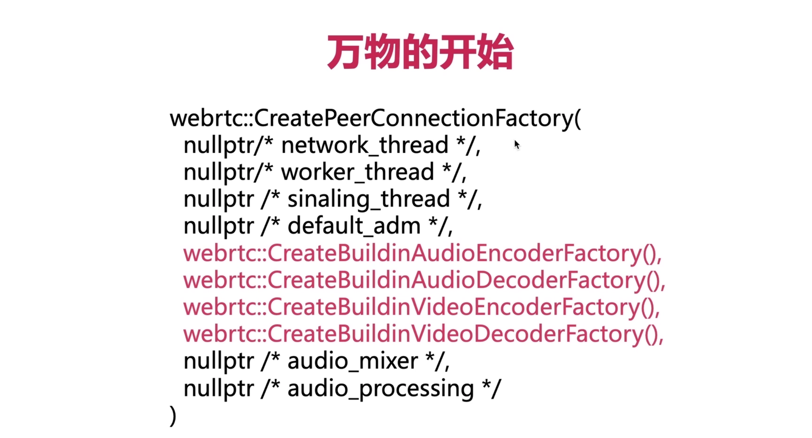
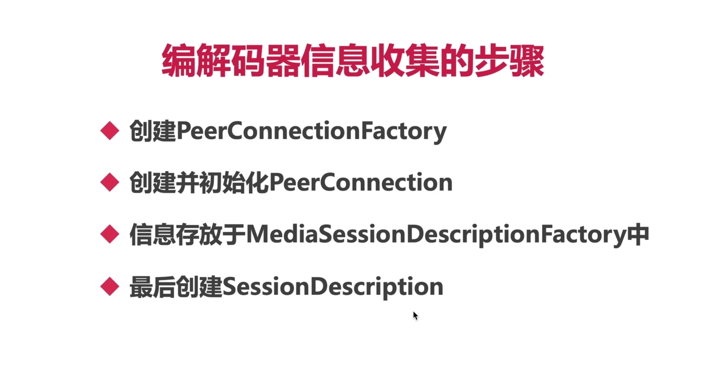
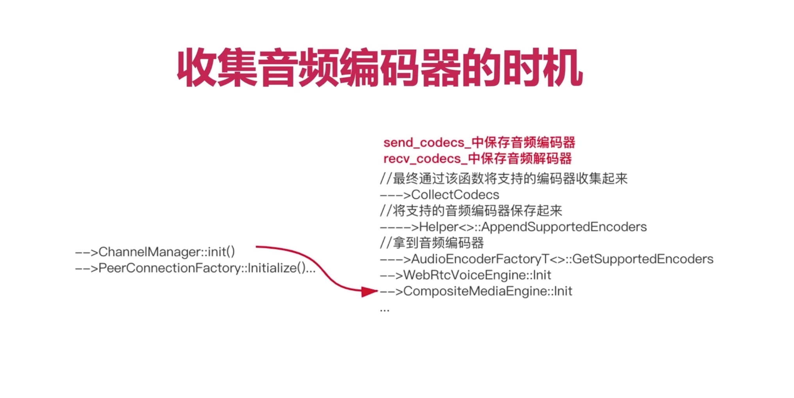
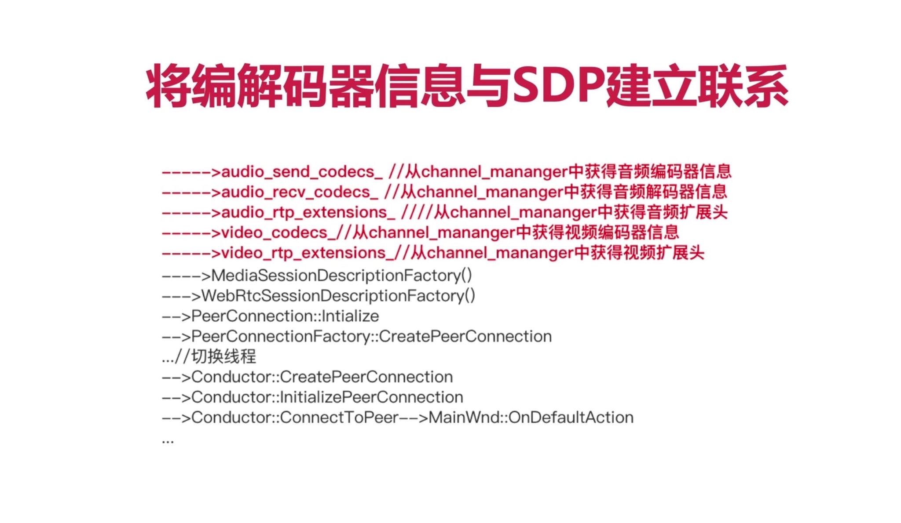
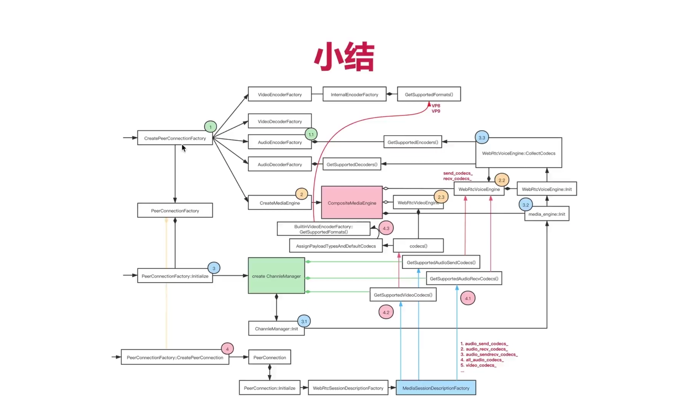

## 一、编解码器信息的收集

### 1、学完本节要能回答以下问题？

- <font color="red">AddTrack</font>如何生成Transceiver？
- <font color="red">payload type</font> 从哪里来？
- 每个 <font color="red">payload type</font> 对应的值从哪儿来？
- 使用的传输协议如何确定？


### 2、webRTC的入口函数是哪个？

- `CreatePeerConnectionFactory`





### 3、以 <font color="red">CreateBuildinAudioEncoderFactory</font> 为例，介绍如何生成对应的 payload type？


- 需要了解C++ 可变参数模板的用法，以及如何使用递归法展开可变参数模板。
- make_ref_counted 是 webRTC 的内存管理体系
- 下面是传入的payload type类型，以可变模板参数的方式传入，从下往上调用栈

```c++

--------> make_ref_counted<audio_encoder_factory_template_impl::AudioEncoderFactoryT<Ts...>>(nullptr)
------> CreateAudioEncoderFactory<AudioEncoderOpus, NotAdvertised<AudioEncoderMultiChannelOpus>,AudioEncoderG711, NotAdvertised<AudioEncoderL16>>()
----> webrtc::CreateBuiltinAudioEncoderFactory()
--> -[RTCPeerConnectionFactory initWithEncoderFactory:decoderFactory:]
```

- 核心之处

```c++
// 这边是外部获取支持的编码器信息的调用函数
	std::vector<AudioCodecSpec> GetSupportedEncoders() override {
    std::vector<AudioCodecSpec> specs;
    Helper<Ts...>::AppendSupportedEncoders(&specs);
    return specs;
  }

// 对具有可变模板参数进行解包
// Inductive case: Called with n + 1 template parameters; calls subroutines
// with n template parameters.
template <typename T, typename... Ts>
struct Helper<T, Ts...> {
  static void AppendSupportedEncoders(std::vector<AudioCodecSpec>* specs) {
    T::AppendSupportedEncoders(specs);
    Helper<Ts...>::AppendSupportedEncoders(specs);
  }
}

// 对0个参数的方法进行重载，终止可变模板参数解包的递归函数
// Base case: 0 template parameters.
template <>
struct Helper<> {
  static void AppendSupportedEncoders(std::vector<AudioCodecSpec>* specs) {}
  static absl::optional<AudioCodecInfo> QueryAudioEncoder(
      const SdpAudioFormat& format) {
    return absl::nullopt;
  }
}

```


### 4、编解码器信息收集的步骤？



- 上面是完整过程，也就是核心步骤，大纲一定要记住


### 5、收集音频编解码器的时机？



- CompositeMediaEngine会创建音频、视频媒体引擎；这两个引擎是WebRTC中最重要的两个引擎。
- 通过 AudioEncoderFactoryT<>::GetSupportedEncoders 来获取支持的音频编解码器
- 此时只是完成了音视频编解码器信息收集的初级阶段。


### 6、如何将上面的收集到的编解码器信息与SDP建立联系呢？



- TODO：按照上面的步骤，结合视频，进行源码解读


### 7、小结



- TODO：上图非常精髓，要自己画几遍
- 也回答MediaEngine是什么时候创建的？就是在CreatePeerConnectionFactory中创建的。
- 为什么音频编解码器是分开的有两个，而视频编解码器是只有一个呢？
- 在 6-6 小节中有对此图的详细讲解，多听几遍吧！！！一定要多听了，讲得太好了


