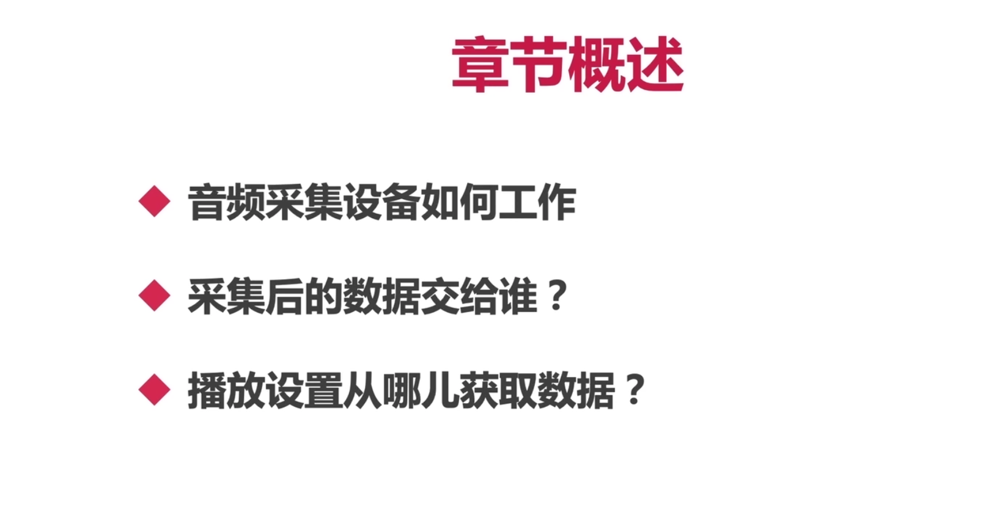
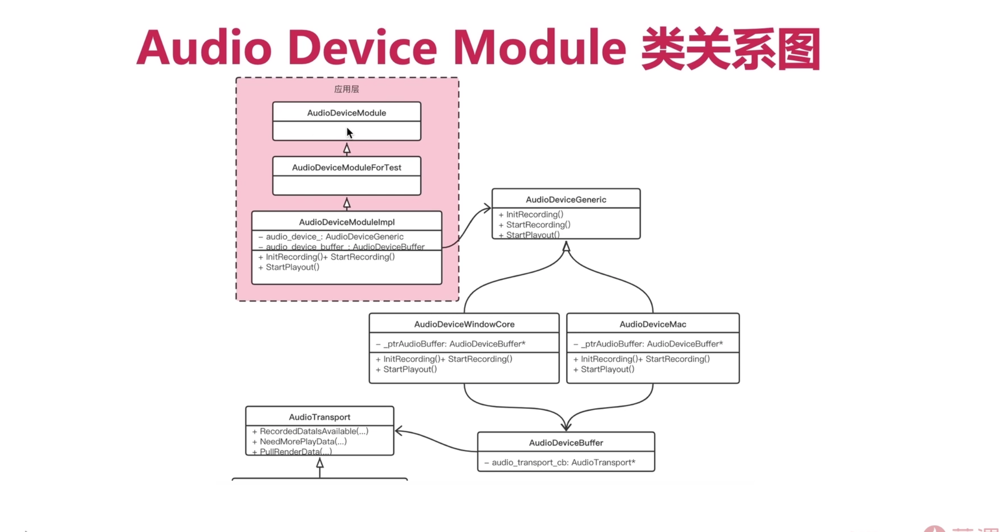
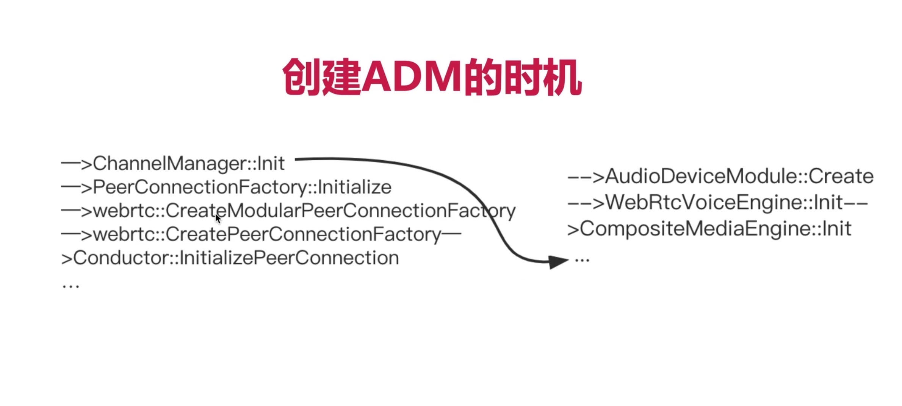

## 一、认识AudioState、ADM

### 1、AudioState是干什么的？

- AudioState看名字，看起来像是对音频状态的管理机，其实并不是。
- AudioState是对整个音频的接口做一层封装，用来管理音频相关的所有模块。

### 2、应用层要调用底层的ADM、APM、混音是比较复杂的，WebRTC为此做了什么封装？

- 封装了 AudioState
- 对于音频来讲，不仅有ADM（Audio Device Module）还有APM（Audio Process Module，是用于音频前后处理的，比如回音消除、降噪、自动增益），还有混音器。
- 这些通过 AudioState 来调用就非常方便了。

### 3、ADM是干什么的？它们之间的类关系是如何的？

- **这幅图的结构非常重要，是框架性的思想，一定要明白这几个类的关系！**
- **ADM（Audio Device Module）：**就是在应用层与设备硬件层中间做了一层转换。通过这层转换，应用层就不需要关心硬件层具体是怎么实现的，应用层只要调用相应的功能就可以了。
- 这就使得应用层与底层硬件层进行了**解耦**。

### 4、AudioDeviceBuffer是干什么的？AudioTransport是干什么的？两者有什么关系？

- AudioDeviceBuffer是存储来自Mac或者Windows采集到的音频数据。
- AudioTransport是用来传输音频数据的。
- 通过底层采集的音频数据会存储在AudioDeviceBuffer中，然后需要通过AudioTransport交给上层播放或者网络传输。
- 而上层从网络读取的音频数据，也要通过AudioTransport才能进入AudioDeviceMac才能进行播放。

### 5、创建ADM的时机，是与哪个关键类创建的

- 实在PeerConnectionFactory初始化的创建的。

