## 一、本章重点、认识NetworkManager

### 1、先介绍本章重点

- ICE规范
- STUN/TURN协议
- RTP协议
- DTLS协议
- 网络设备管理
- Candidate的收集
- 网络连接的建立
- 连通性检测
- Candidate排序
- RTP的封包与解包
- 安全通道的建立
- 数据加密/解密

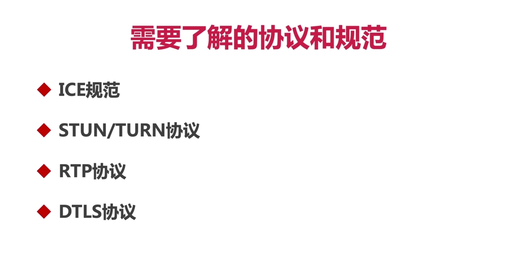

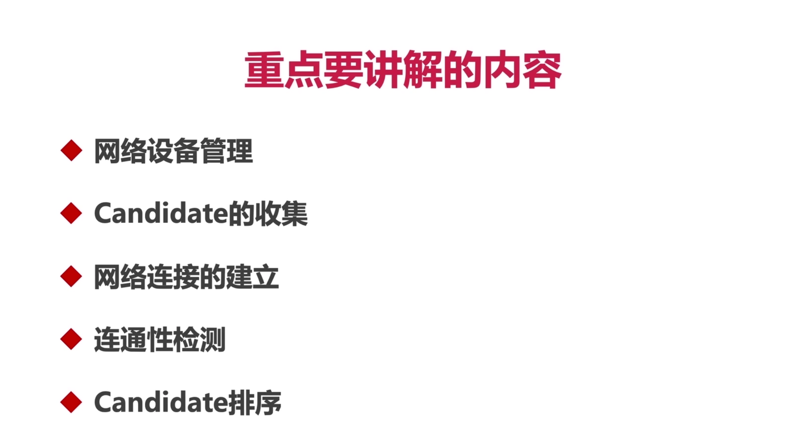

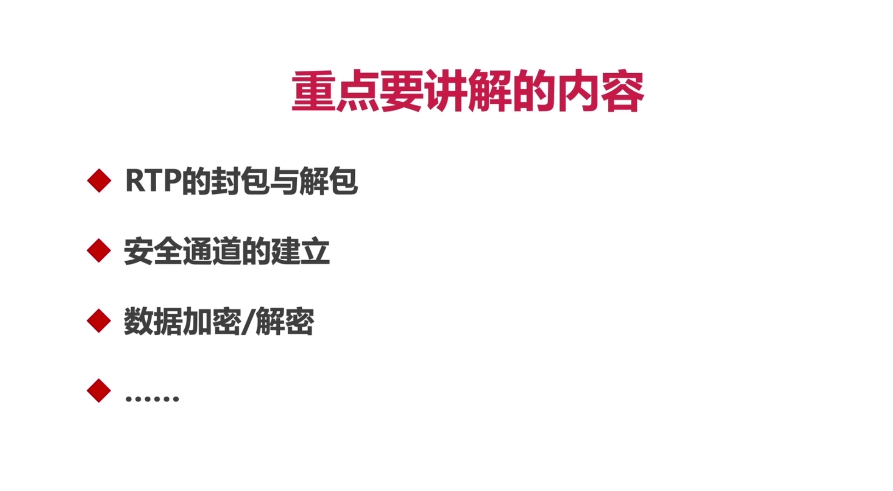

### 2、认识WebRTC网络设备管理之前需要认识 NetworkManager？它起什么作用？

- BasicNetworkManager 里面包含了 createNetwork(...) 方法，该方法可以找出设备上的网卡信息。
- BasicNetworkManager 里面包含了 QueryDefaultLocalAddress(...)方法，该方法可以获取设备的默认IP和端口信息。
- BasicNetworkManager 里面包含了 StartNetworkMonitor(...) 方法，该方法可以监测网络变化，通过这个监控器就可以知道网络变化情况。
- 其他的方法就暂时没那么重要了，上面的三个方法需要掌握。

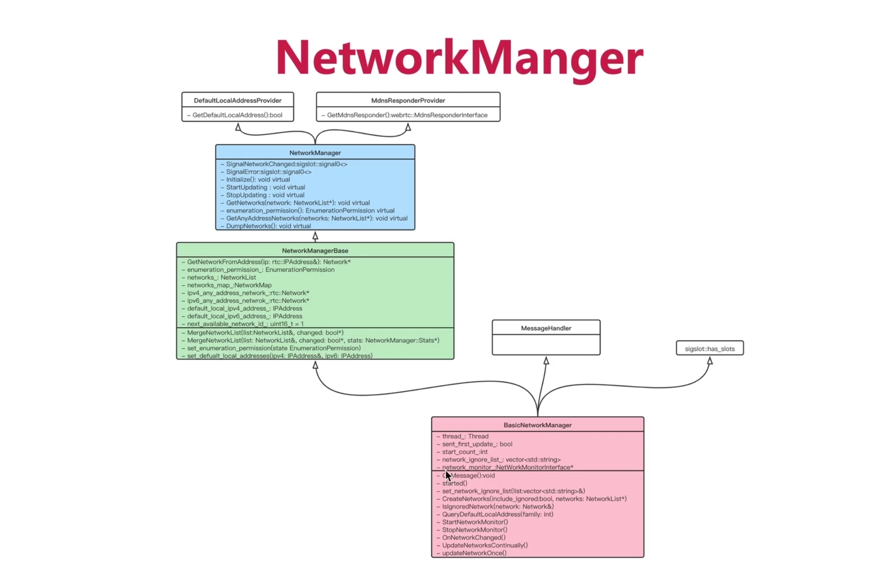

### 3、认识NetworkManagerBase 中的重要成员和方法？

- 成员 networks：所有的网卡信息都会保存在 networkList 这个成员变量中。
- 方法 MergeNetworkList：作用是将可以合并的网卡信息进行合并，这样就减少了对网卡信息的操作。

### 4、认识 NetworkManager 相关的重要信息？

- NetworkManager 是一个纯接口
- 方法 startUpdating()：启动 networkManager
- 方法 dumpNetworks()：将查找到的所有网卡信息将它们输出到控制终端中。我们就能看到设备所有的网卡信息。
- 继承 DefaultLocalAddressProvide：这是用于获取本地地址的
- 继承 MdnsResponderProvider：这个是与 MDNS 相关的，防止 IP 真正的地址暴露。

### 5、从代码上看， 创建Networks过程？

- 一个 Network 等价于 一个网卡

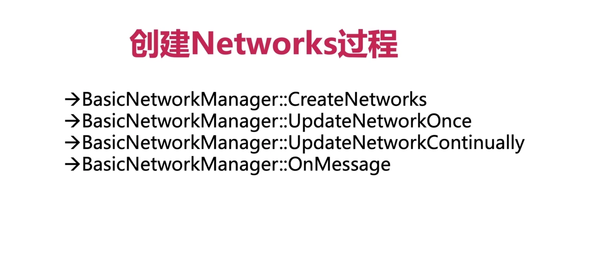

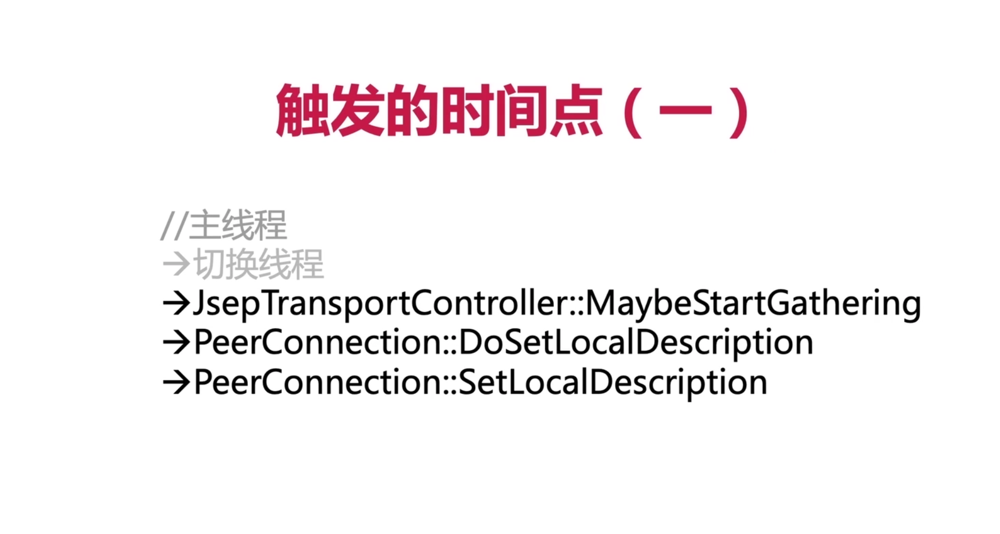

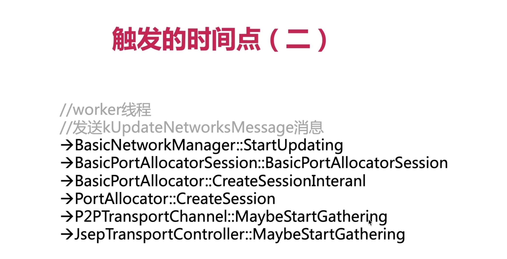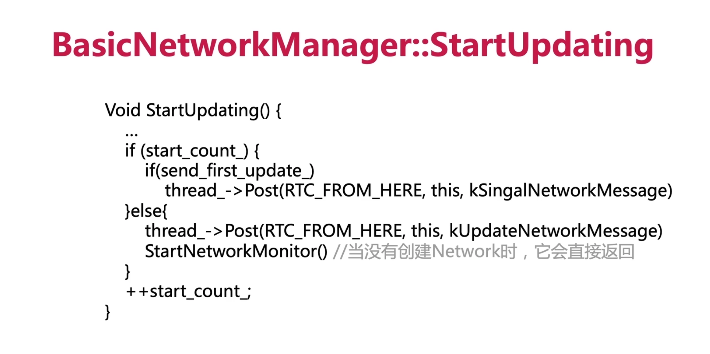

## 二、认识ICE 和 Candidate

### 1、ICE规范的一些相关知识？

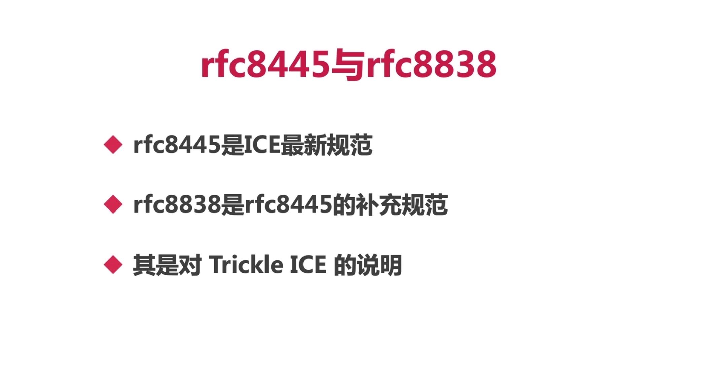

### 2、ICE架构图？经典

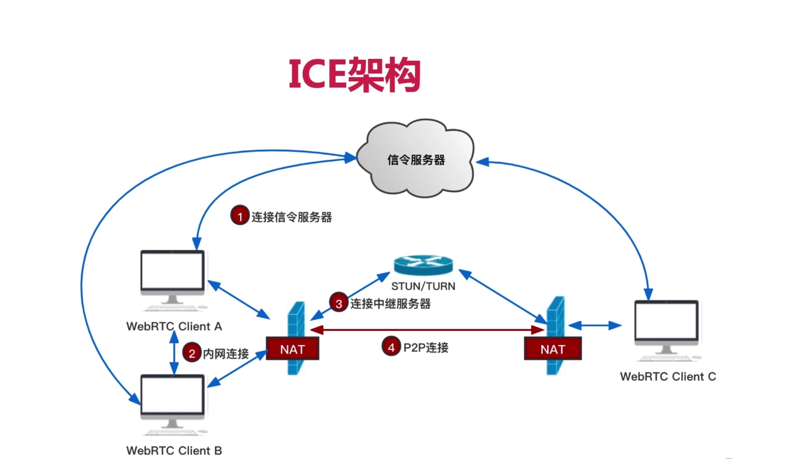

- ICE会将两个Client之间的所有通路找出来，之后选择通信效率最高的那条通路，这就是ICE的作用。

> 连接无非三种：
> ①内网直连
> ②p2p连接
> ③中继服务器中转

### 3、什么是Candidate？

- 每个candidate是一个网络地址信息

- 它包括：协议、IP、端口、类型

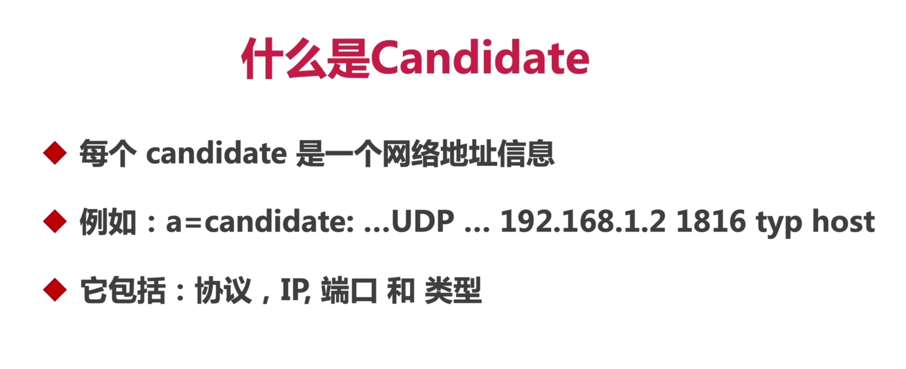

### 4、Candidate的四种类型是哪些？它们的优先级如何？

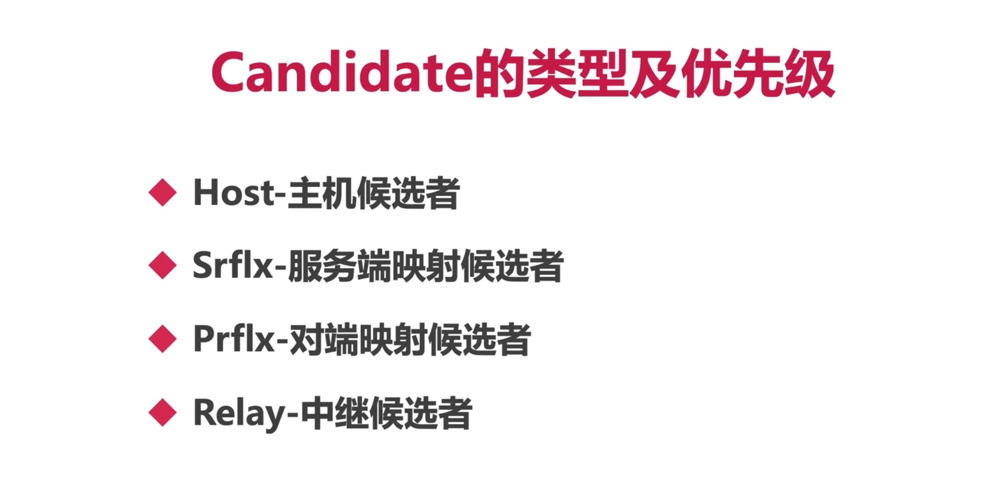

