## day01指针关键知识点

### 1、PortAllocator 类关系图？

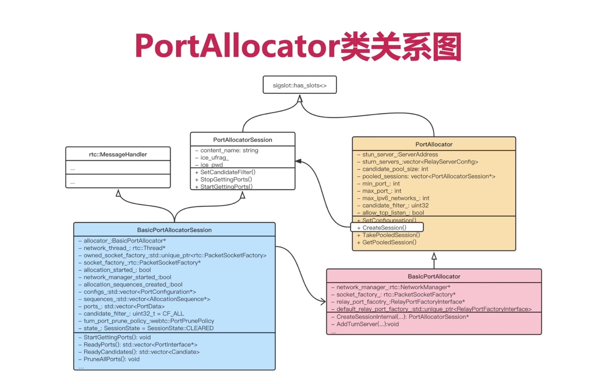

### 2、什么时候创建 BasicProtAllocator对象？

- 在 CreatePeerConnection 的时候，创建 BasicPortAllocator对象。
- 也就是一个 PeerConnection 对应一个 BasicPortAllocator 对象。

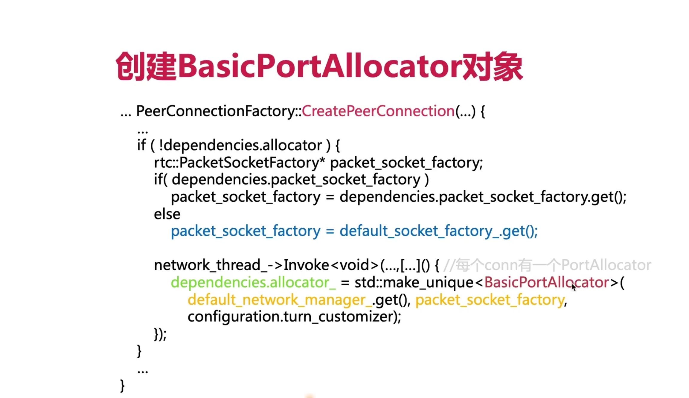

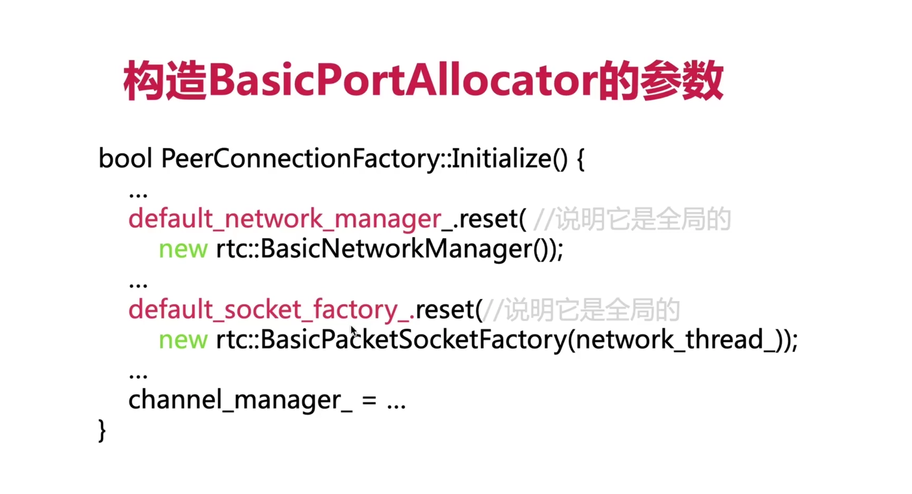

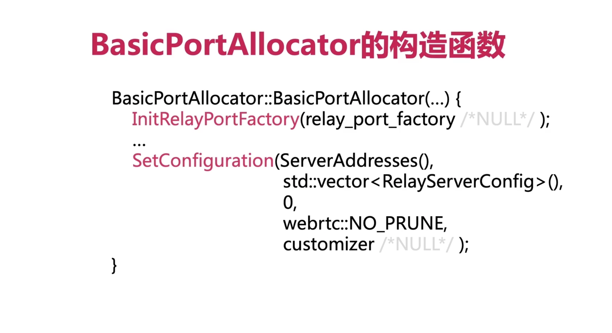

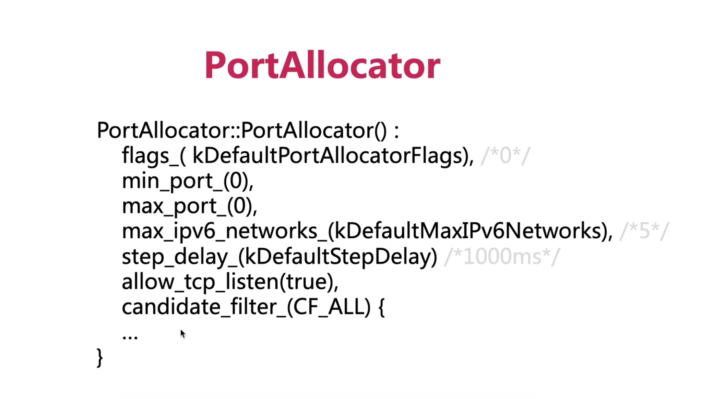

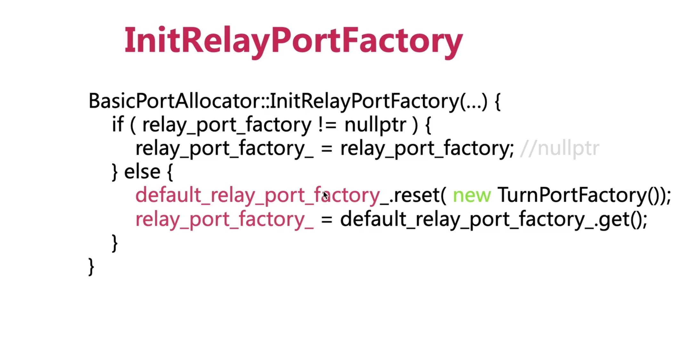

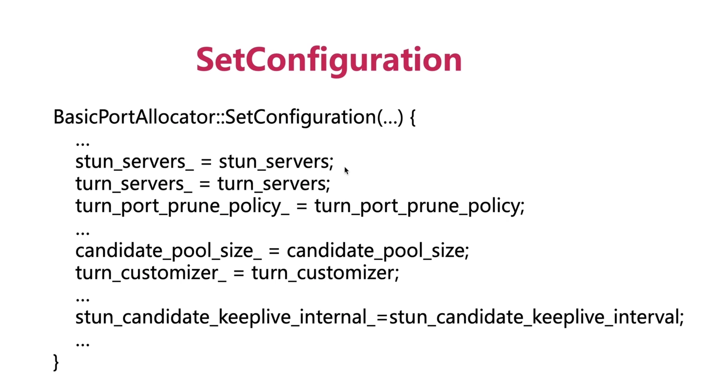

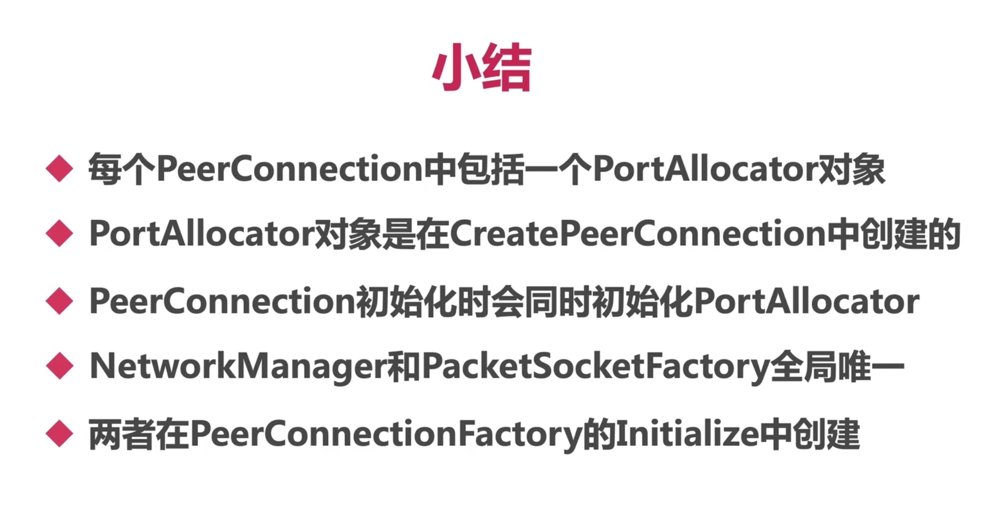

## 二、认识 AllocationSequence

### 1、AllocationSequence 类结构？

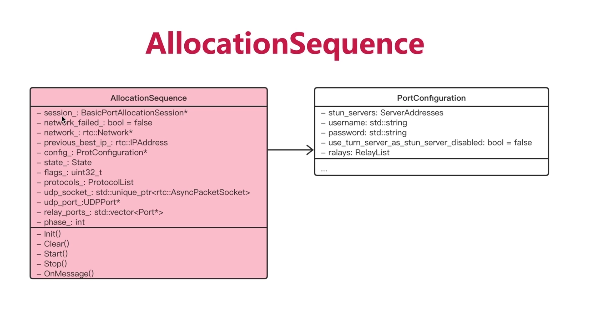

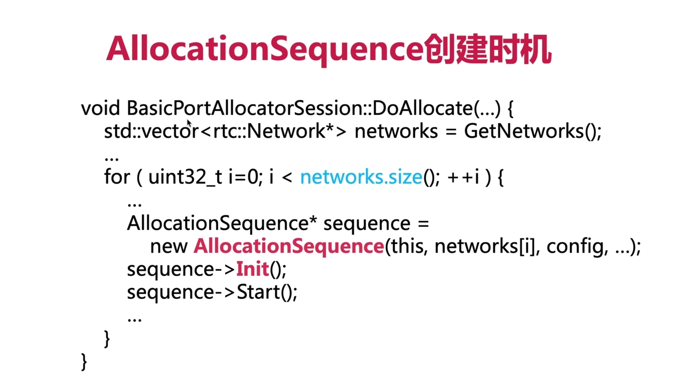

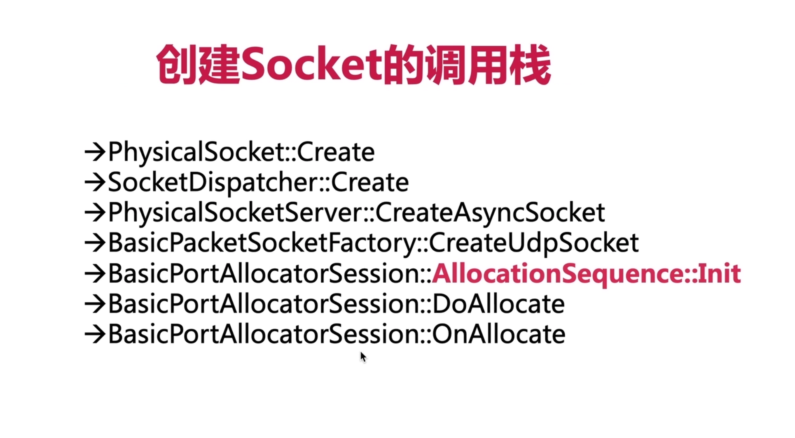

### 2、AllocationSequence 的作用是啥？

- AllocationSequence作用：就是用来创建 candidate 的

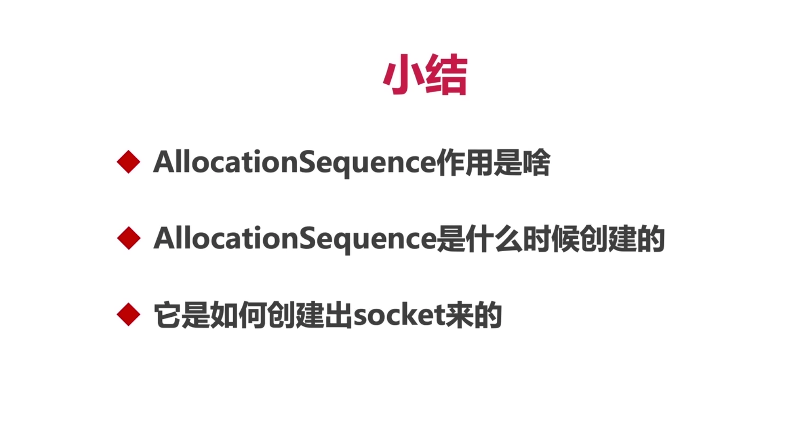

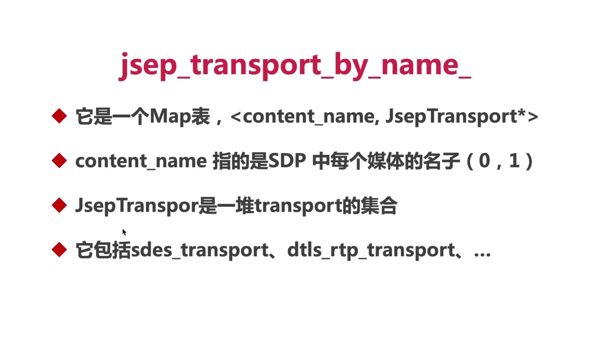

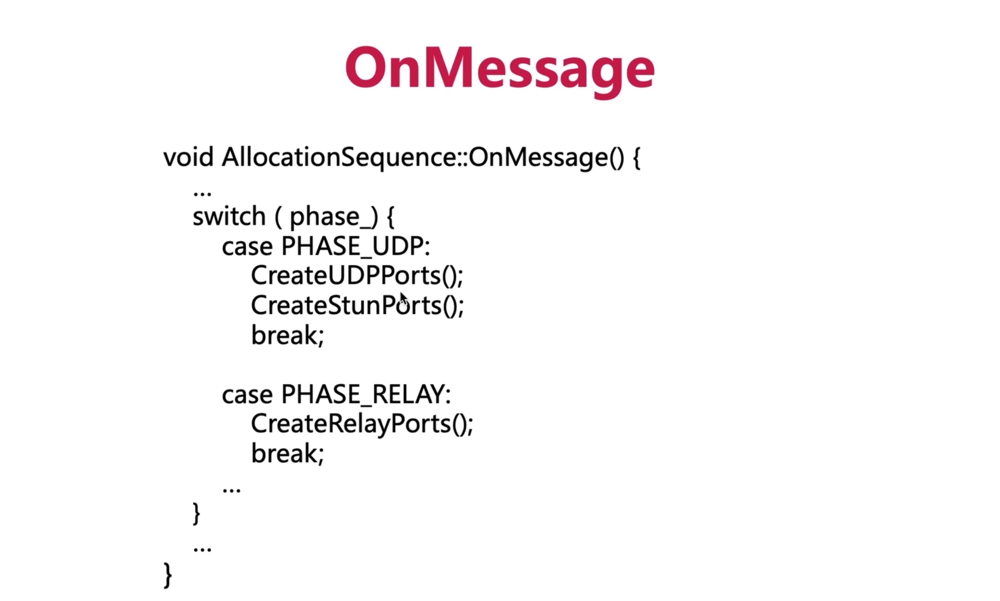

### 3、PeerConnection、PortAllocator、PortAllocationSession之间的数目关系？

- 每个PeerConnection 有一个 PortAllocator
- 每个 PortAllocator 对应一个 PortAllocationSession

### 4、Network、AllocationSequence、UDPPort、RelayPort、Candiate之间的数目关系？【最重要的概念点】

- 每个 Network 对应一个 AllocationSequence
- UDPPort/RelayPort 等都是 AllocationSequence 分配的
- 而 Candidate 又是有 UDPPort/RelayPort生成的

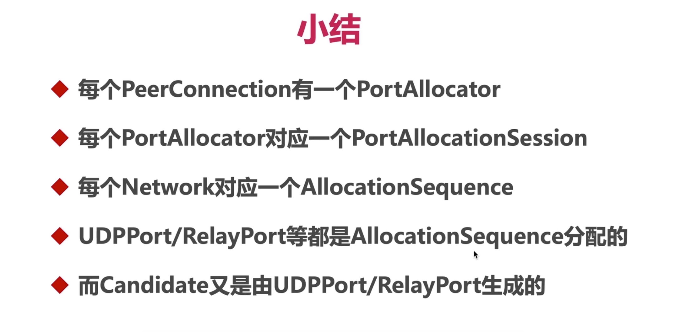

