## 一、Candidate 交给应用层的、Connection生成过程

### 1、WebRTC 为什么要将收集到的各种 Candidate 交给应用层？

- 因为通信的双方，需要获取对方的 Candidate 才能开始尝试与对端进行连接。

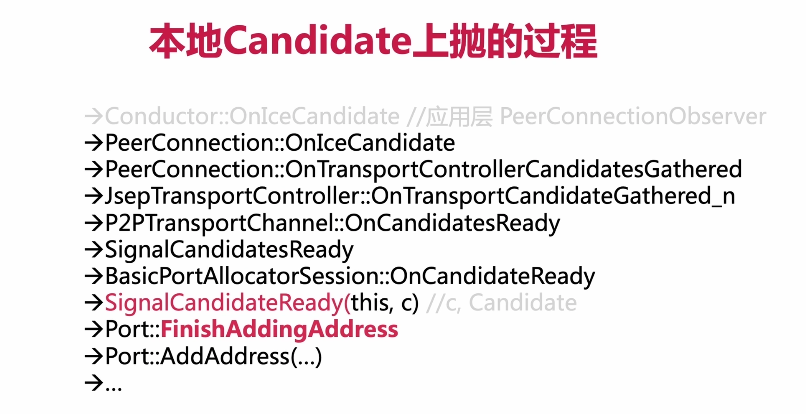

### 2、WebRTC 中的网络连接用什么表示？它由哪两个重要部分构成？

- WebRTC 中用 Connection 表示一个网络连接
- Connection 由本地Port和远端Candidate构成

### 3、WebRTC 创建连接的三种方式是哪三种？

- 控制方，收到对端Candidate后，调用 AddIceCandidate时
- 被控制方，先收到对端Candidate后，生成本地Port时
- 控制方，收到Candidate之前，收到另一端的BindingRequest请求时

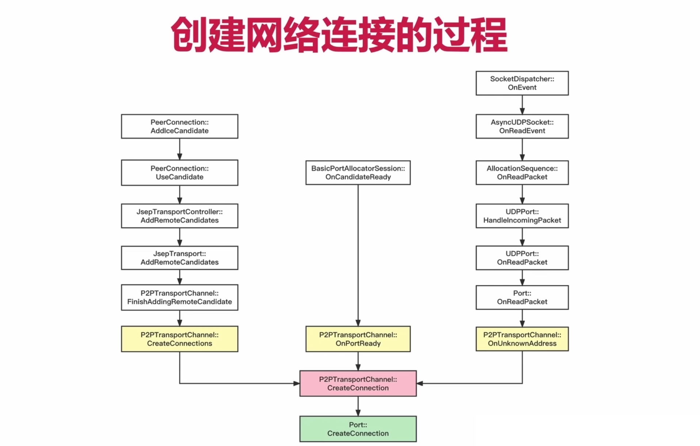

- 由上图中可以知道 WebRTC 创建 Connecton 的方式有很多种，这就导致会创建出很多Connection，但是最终只需要一个Connection，所以后面会对Connection进行裁剪。

- TODO：代码上观察一下，到底生成了多少Connection？

## 二、Connection 排序

### 1、WebRTC 是在什么时机以及什么方法内，对Connection进行排序的？

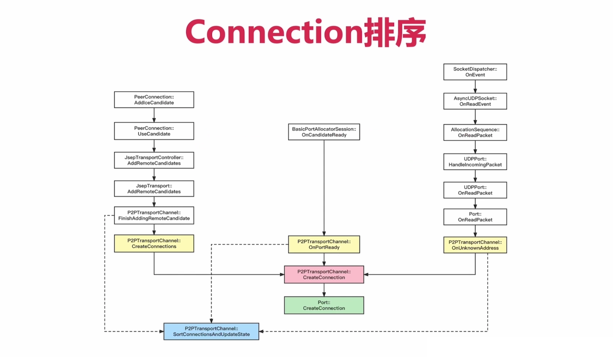

- 上述流程会调用 SortConnectionAndUpdateState 进行Connection的排序。

### 2、一个特别重要的函数 SortAndSwitchConnection，它实现了哪三大功能？

- SortAndSwitchConnection
- 该函数中实现了三大功能：Connection排序、裁剪和连通性检测

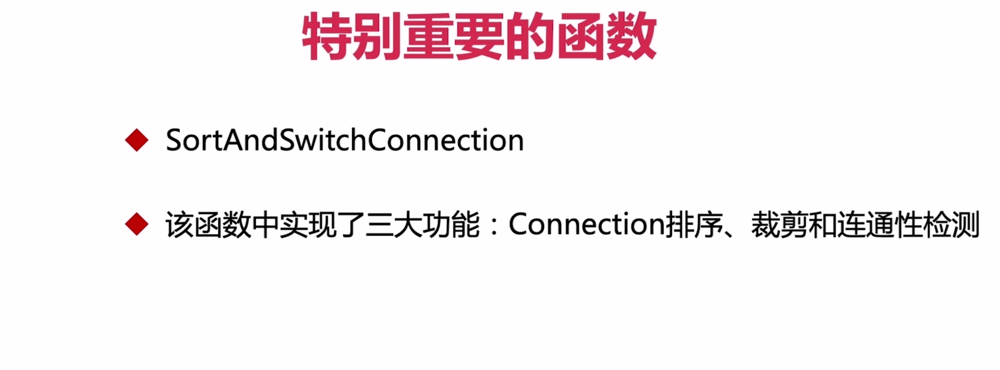

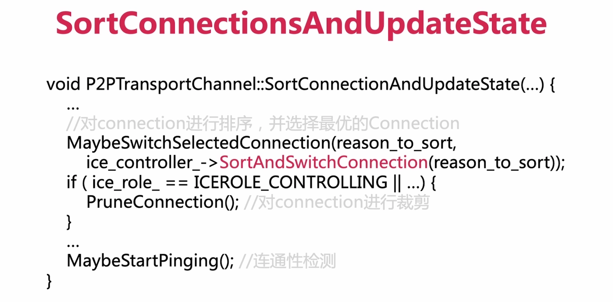

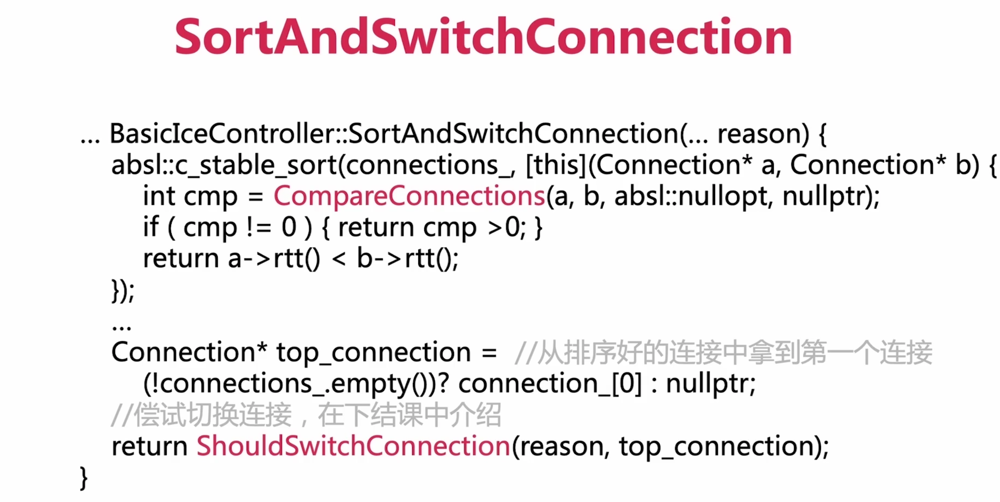

- 上图的Connections，就是之前介绍通过三种方式获取的所有Connection
- 比较方式，先借助 CompareConnections(..)进行比较，如果cmp==0，那么就比较他们的rtt()也就是时延

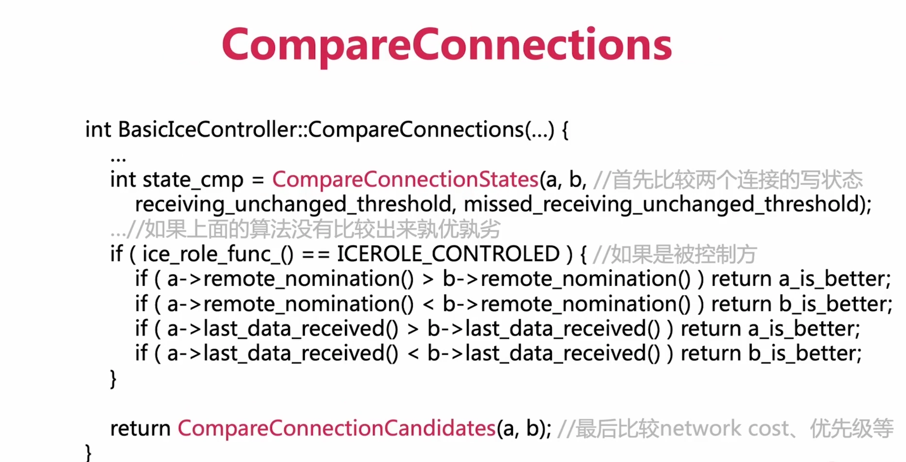

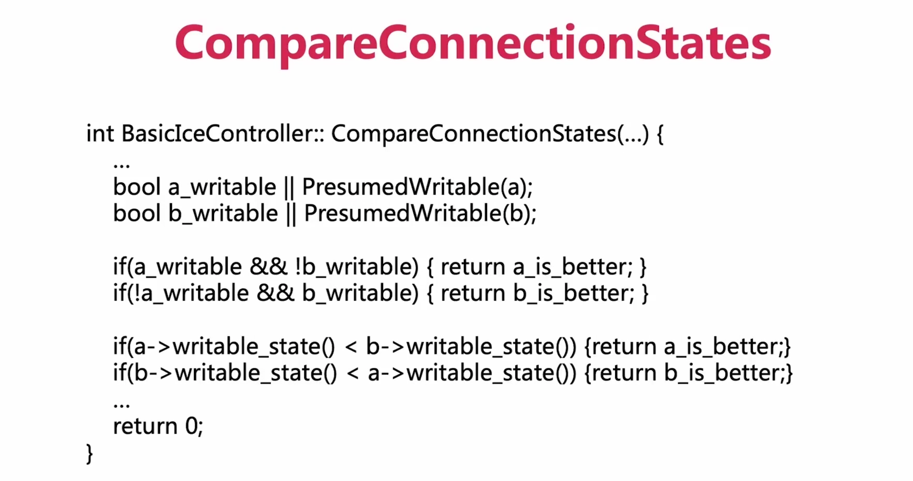

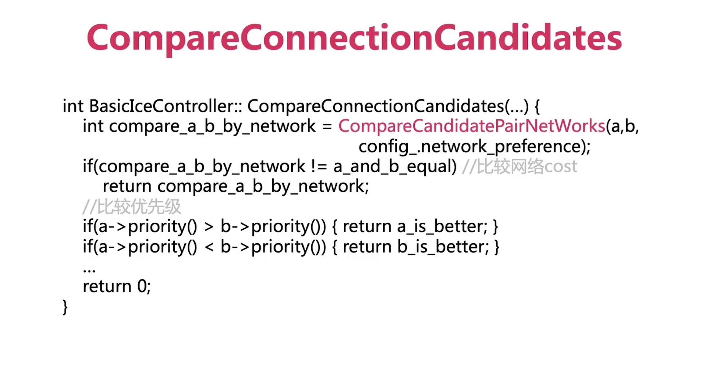

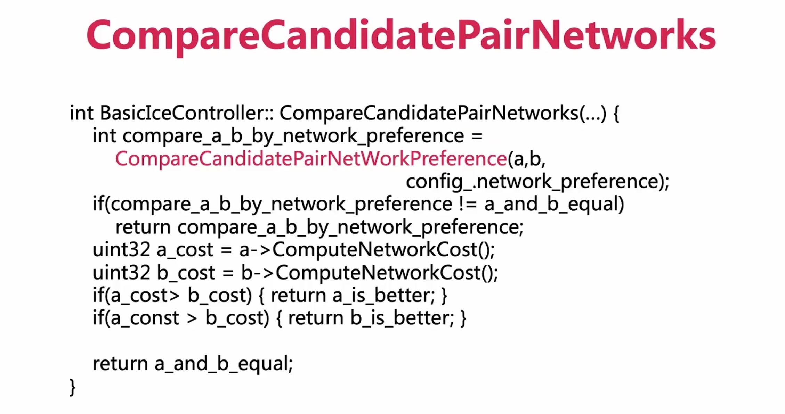

## 三、WebRTC是如何选择Connection的？如何裁剪的呢？

### 1、关键函数 ShouldSwitchConnection

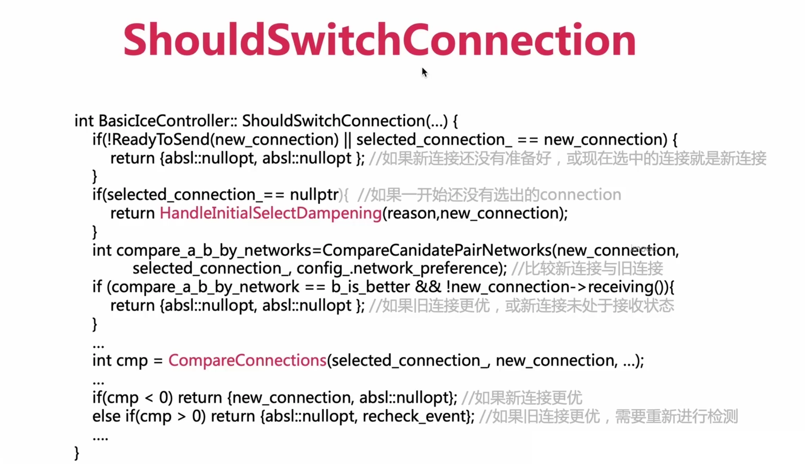

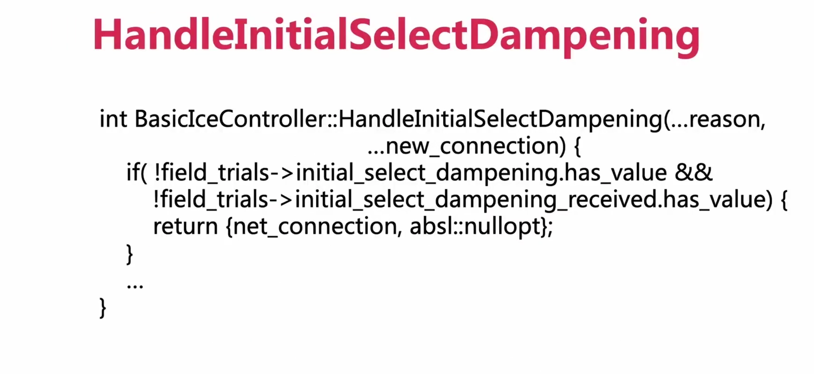

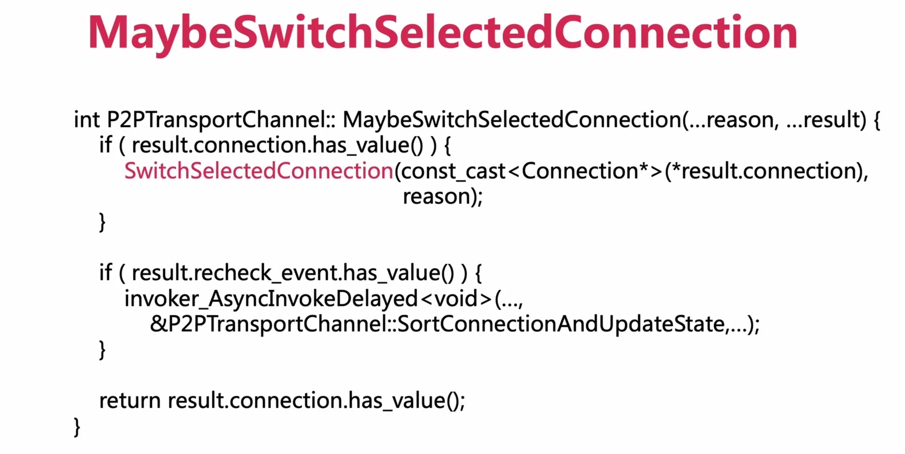

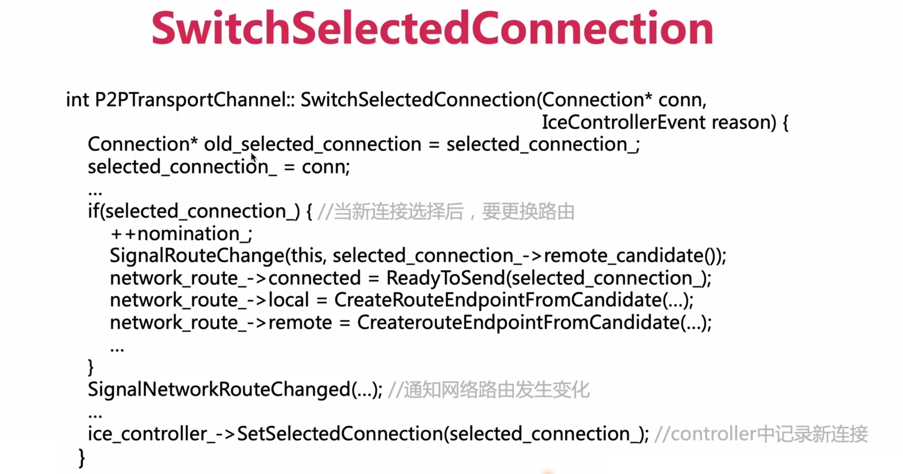

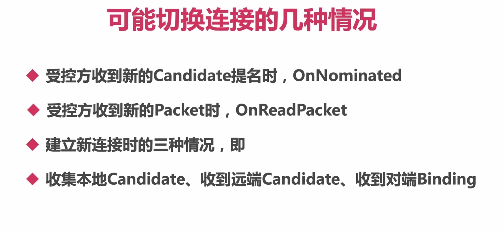

- 上面五种情况，可能导致切换连接。

### 2、选择出来了比较合适的Connection之后，如何对Connection进行裁剪呢？

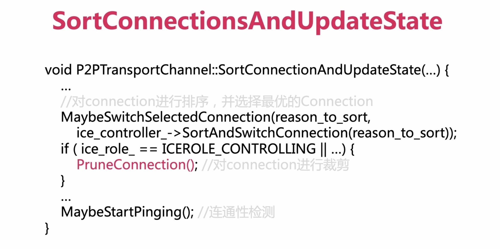

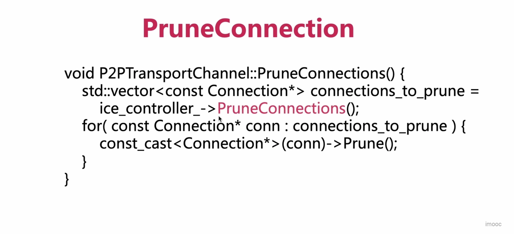

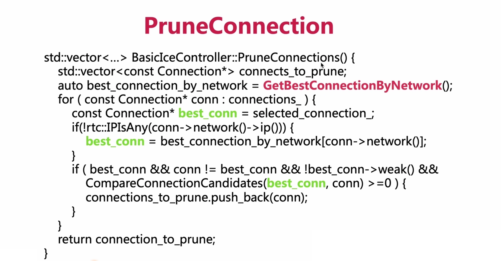

- 我们要知道Connection的裁剪，一定是在Connection选择之后，才进行裁剪的。

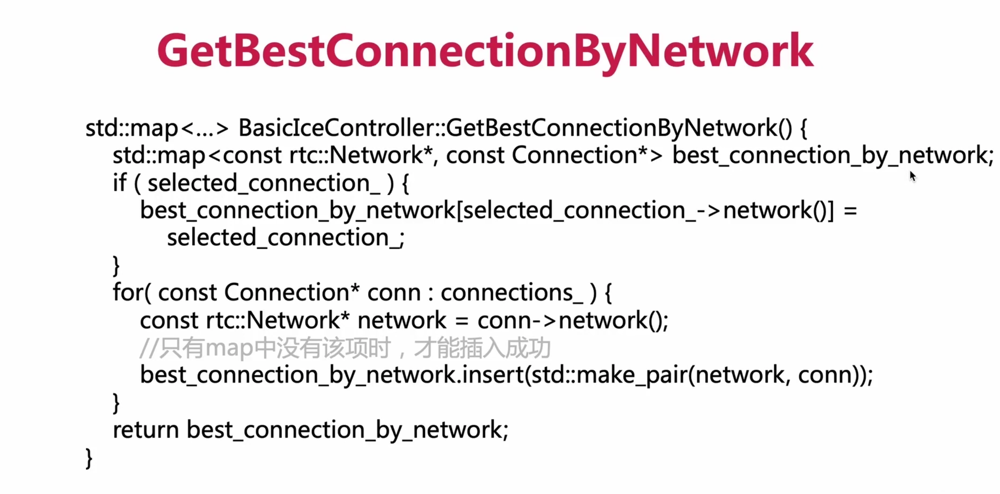

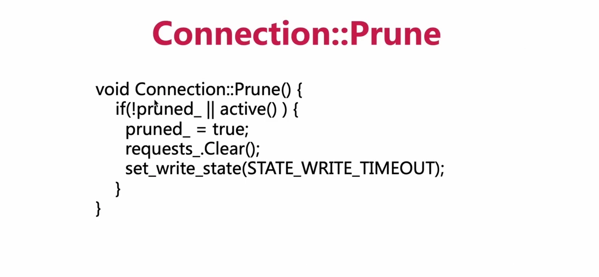

> 核心知识两点：
>
> ①裁剪工作一定是选择出了最优的Connection之后，才能对其他Connection进行裁剪。
>
> ②裁剪的具体流程如上所述。

