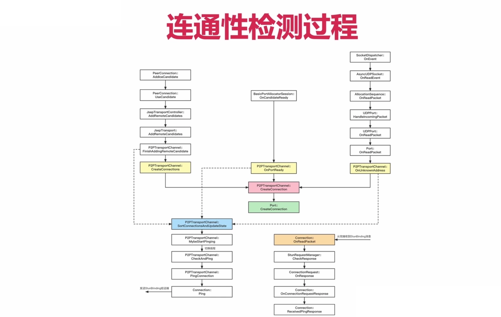
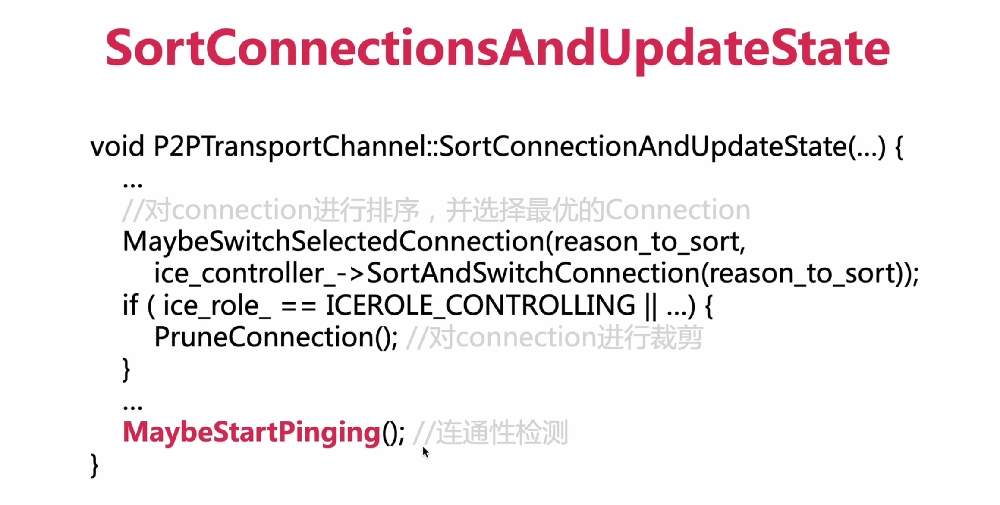
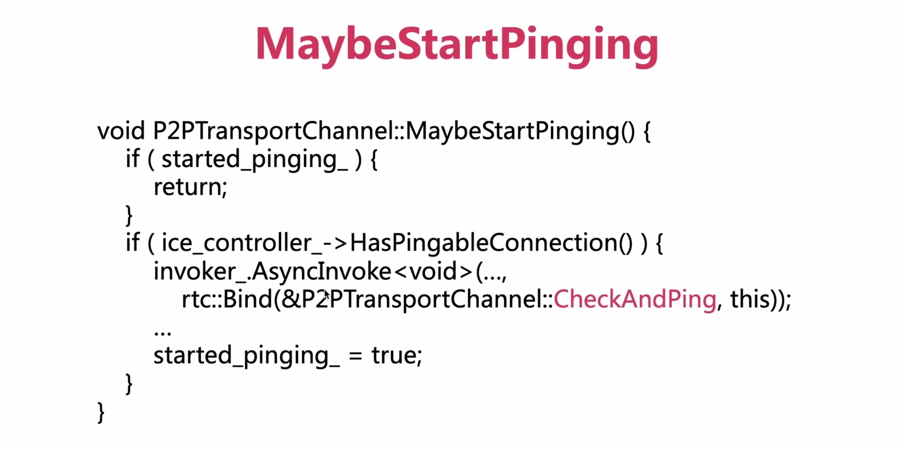
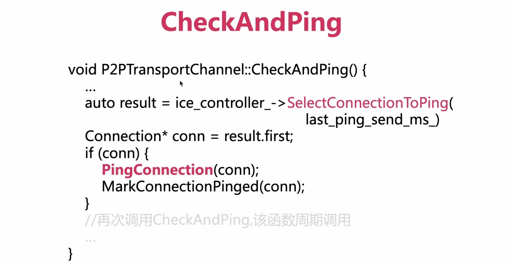
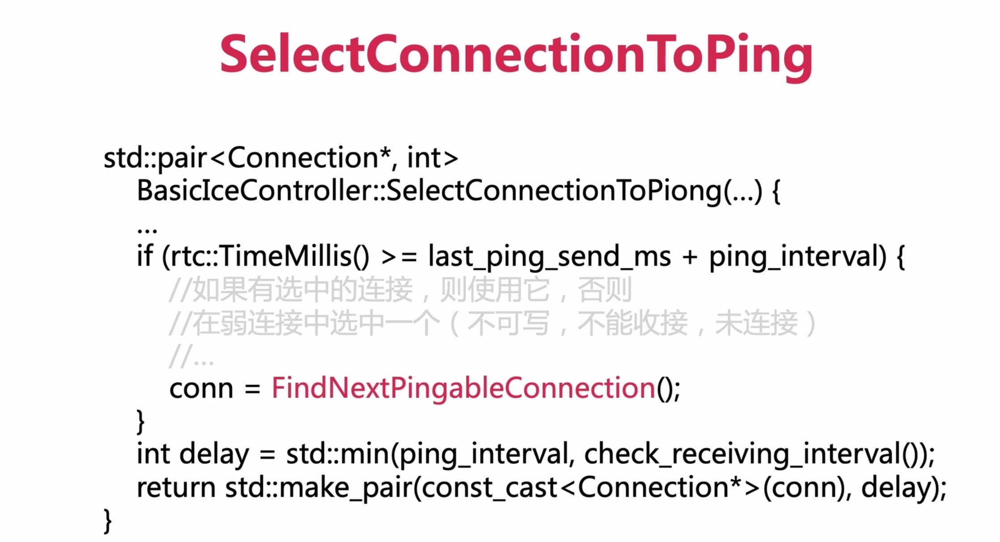
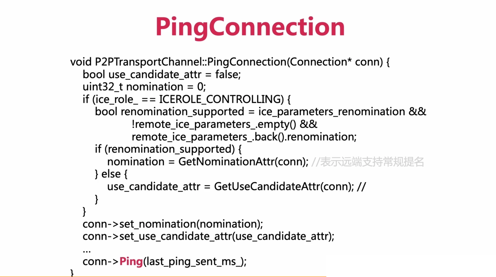
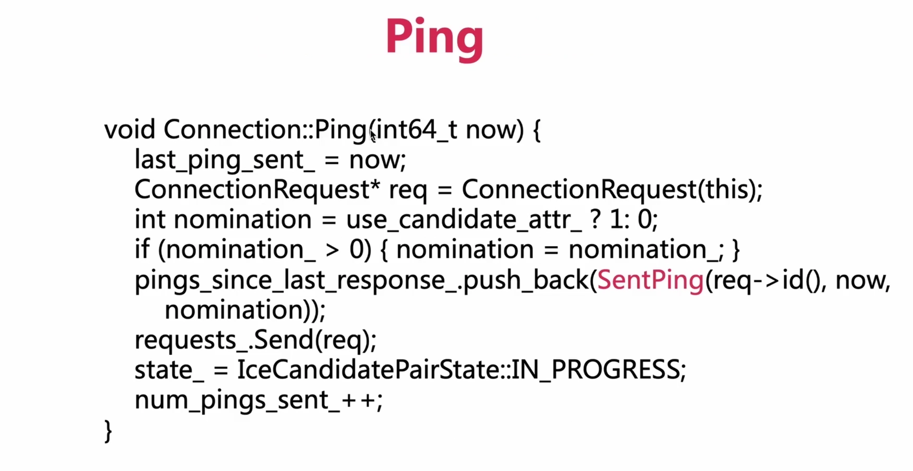
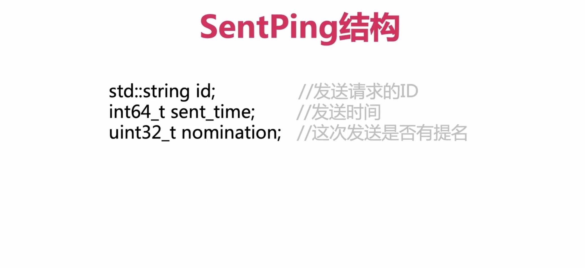

## 一、连通性检测

### 1、连通性检测的过程？

> 情况①：
>
> 在应用层收到Candidate之后，就会调用AddIceCandidate这个方法，然后就按照图中左侧的调用栈，一路调用到核心层；
>
> 在P2PTransportChannel::FinishAddingRemoteCandidate 这个函数中，首先会调用CreateConnections将Connection对象创建出来；之后它会调用SortConnectionsAndUpdateState这个方法，在这个方法中做了三个非常重要的事情；
>
> 第一件事情：对所有的Connection进行排序，在排序后的所有Connection中找出最优的Connection。
>
> 第二件事情：将每个网卡上不重要的Connection裁剪掉。
>
> 第三件事情：就是进行连通性检测，会调用MaybeStartPing来做连通性检测的工作。

> 情况②：
>
> 就是收到本地的OnCandidateReady之后，会触发OnPortReady，在OnPortReady中也是先创建Connection，然后调用SortConnectionsAndUpdateState，后面也会做三件事件；最终调用MaybeStartPing来进行连通性的检测。

> 情况③：
>
> 在我们本端没有创建Connections的情况下，在收到对端发送来的BindRequest请求之后，会通过网络层，层层上次，最终调用OnUnknownAddress；
>
> 在OnUnknownAddress 这个方法也是先创建Connections，然后调用 SortConnectionsAndUpdateState 进行三件事，最终调用 MaybeStartPing 来完成连通性检测；

### 2、所有的连通性检测都是在什么之后进行的？

- 所有的连通性检测，都是在创建Connections之后进行的。

### 3、调用MaybeStartPing之后，只是完成了连通性检测的一半，那么另一半是什么？

- 最终调用Connection::ping 之后，会发出去一个 StunBindingRequest给远端；
- 然后会收到远端来的StunBindingResponse消息，触发Connection::OnReadPacket方法，最终触发Connection::ReceivedPingResponse方法
- 这就完成了整个连通性检测的过程。

### 4、下面对连通性检测一些关键方法做介绍？

总之在FindNextPingableConnection(...)这个方法中，实现了一套非常复杂的选择Connection的逻辑。

