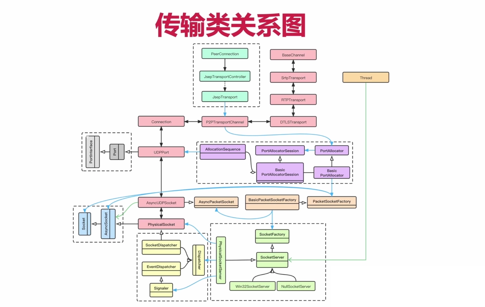

## 一、网络传输类的创建与数据传输

### 1、总纲图：ICE相关的类是如何创建的？本端的音视频数据是如何发送的，对端的音视频数据是如何接收的？

- 此图超级精髓

### 2、来看第一步，WebRTC是如何将网络传输中的这些对象创建出来的？

- 一开始就是创建PeerConnection，也就是途中绿色的部分。
- PeerConnection是由PeerConnectionFactory创建出来的。
- 在我们创建PeerConnection的时候，会创建出JsepTransportController，这个类用于传输的管理与控制。

- 通过JsepTransportController，我们就可以创建出一个个JsepTransport对象，每一个Transport用于传输一种不同类型的媒体数据；比如音频有音频的JsepTransport，视频有视频的JsepTransport，当然如果我们在协商的时候选择了通道复用模式，那么音视频将会复用同一个JsepTransport。
- 默认情况下，WebRTC都是使用通道复用模式，所以我们通常在跟踪代码的情况下，只有一个JsepTransport。

### 

