## 一、WebRTC服务质量综述

### 1、一句话概述试试通信的目标是什么？

- 尽可能逼近或者达到面对面交流的效果。

### 2、如果要达到上面实时通信的目标，我们要看哪三个重要指标？

- 实时通信的延迟指标
- 音频服务质量
- 视频服务质量

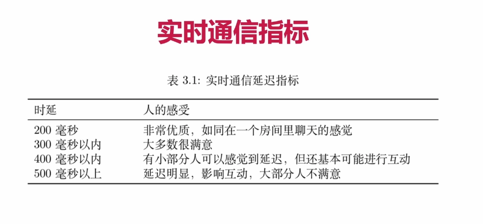

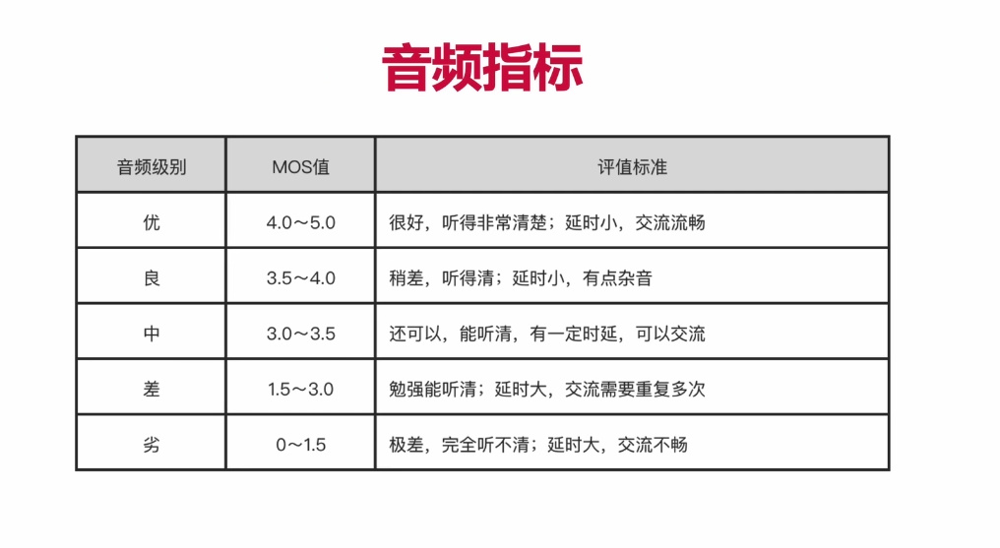

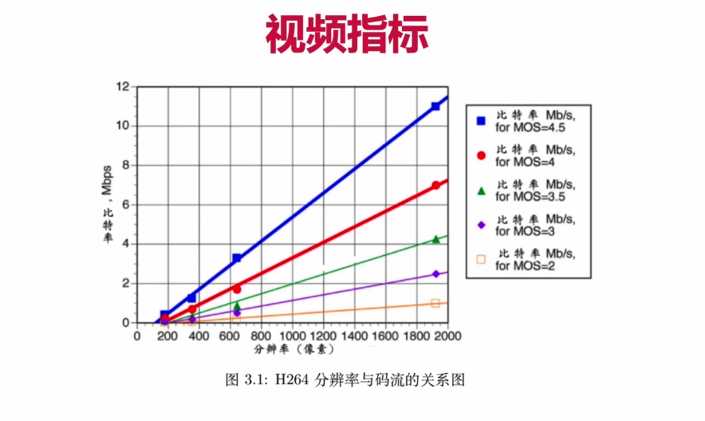

### 3、音视频质量与带宽大小、实时性、网络质量之间有矛盾吗？

- 有矛盾的：一般来说音视频质量要求越高，那么需要的带宽就越大，实时性就会降低，需要更高的网络质量来传输。

### 4、WebRTC是从哪些方面来解决这些矛盾呢？（暂时无法全面理解没关系）

- 这个图，对应1202，可以多听一听。

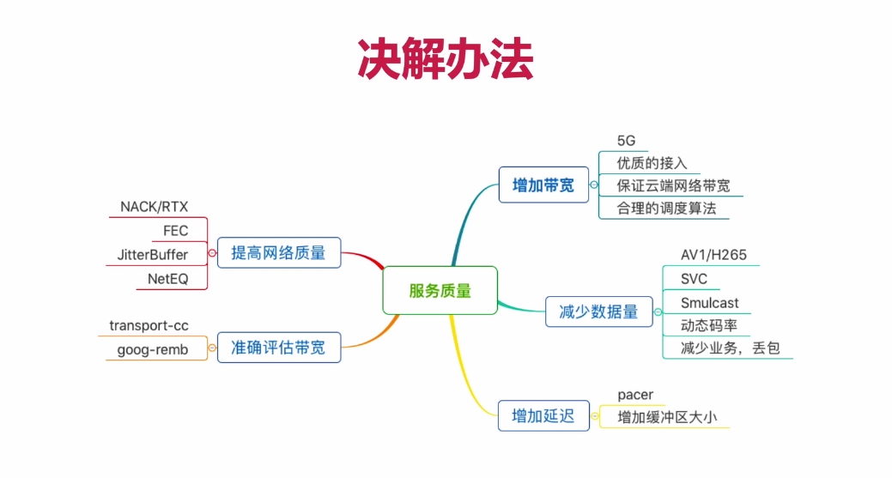

## 二、RTP协议

### 1、RTP/RTCP协议在整个协议栈中的位置？（传输层？应用层？）

- 属于 应用层 协议，基于传输层的UDP协议之上。

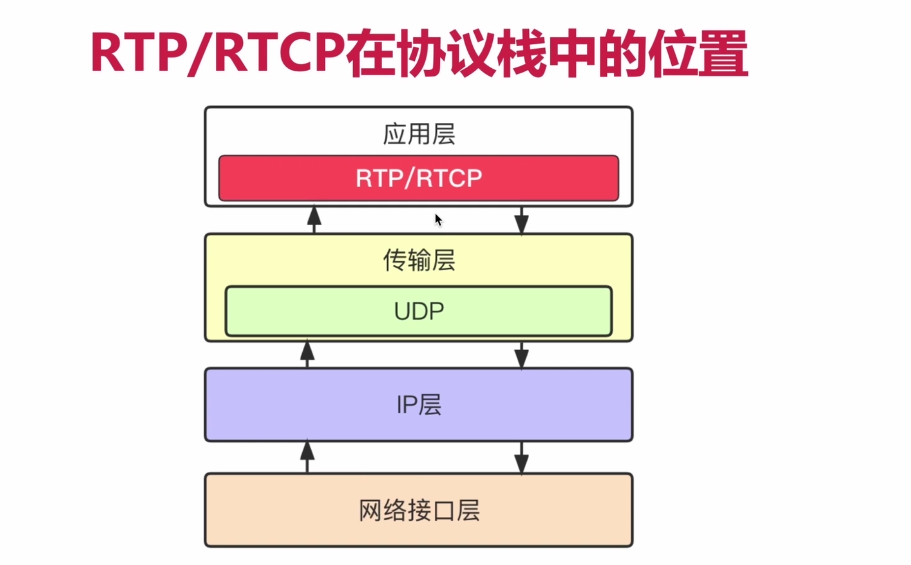

### 2、RTP Header 中的主要字段，要能分别说出下图中字段的含义？

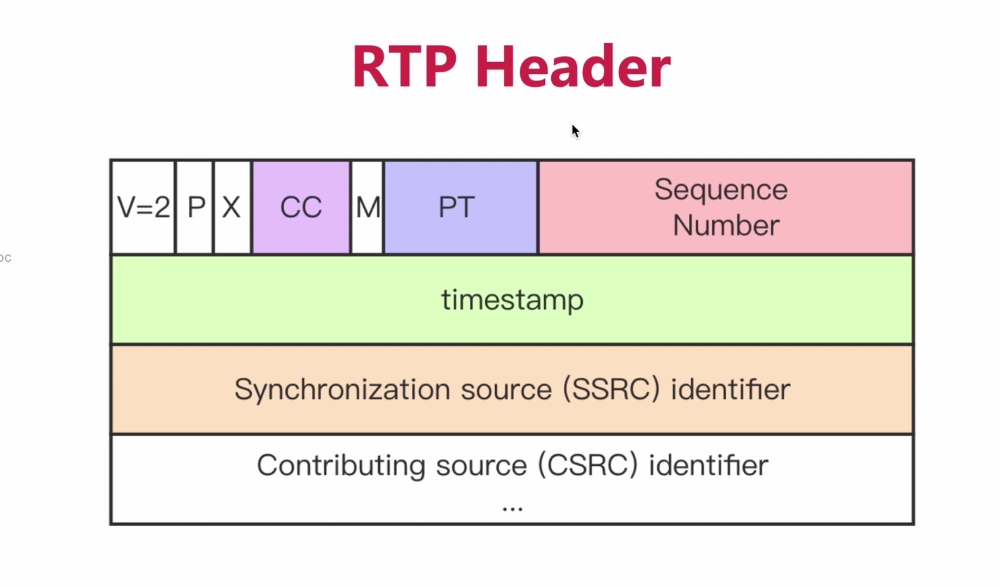

- **V：**Version，代表版本号，默认是2，表示第二版本的RTP头协议。
- **P：**Padding，表示RTP中是否具有填充数据，如果为1代表有填充数据。
- **X：**表示RTP中是否具有扩展头，为1表示有扩展头。
- **CC：**Contribute Source，表示对于这份数据来说，它是由哪些源共同产生的，CC代表贡献值的个数。如果有2个贡献者，那么CC的值就为2。
- **M：**Mark，标记位，值为1时，代表我们视频帧分包之后的最后一个包。
- **PT：**PayloadType，也就是我们这个包的负载数据是什么。比如音频Opus是111，视频是127。
- **Sequence Number：**包序号，主要用于包排序，以及丢包重传机制的依据。
- **Timestamp：**代表我们这个数据源产生的时间戳。对于视频帧来说，同一个帧可能会被分成几十个包，但是这些包产生的时间相同，所以它们的 Timestamp 也是相同的。还有一个特性，Timestamp是随着时间的流逝，递增的。
- **SSRC：**同步源标识符，如果你同时发送了共享桌面流和视频流，这两个流的PT可能是相同的，但是它们的SSRC是独立的，就可以借助SSRC区分。
- **CSRC：**代表我们这个数据，是由哪个贡献者贡献的。

## 三、RTP扩展协议

### 1、在RTP头中的哪个标记位表示RTP是带有扩展头的?

- **X**位置为1，表示带有扩展头

### 2、扩展头中的Profile代表什么含义？

- **Profile表示扩展头的格式**

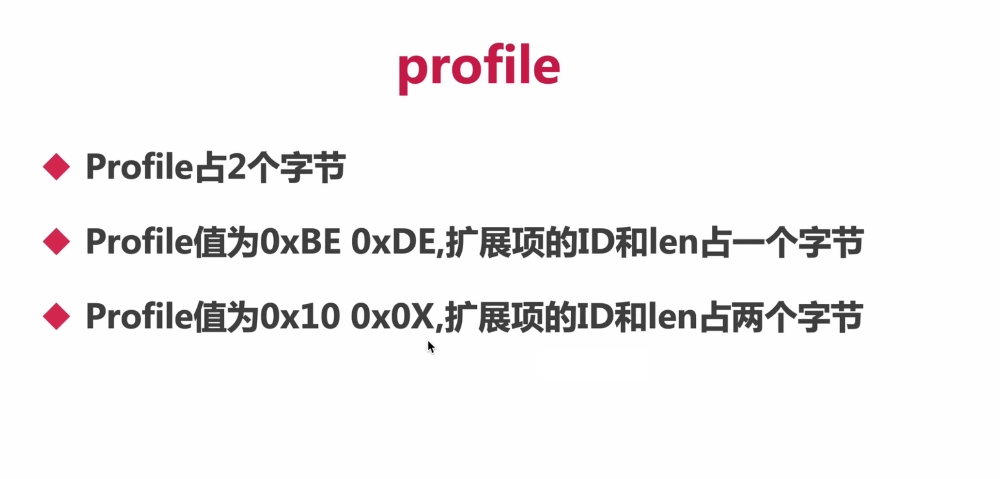

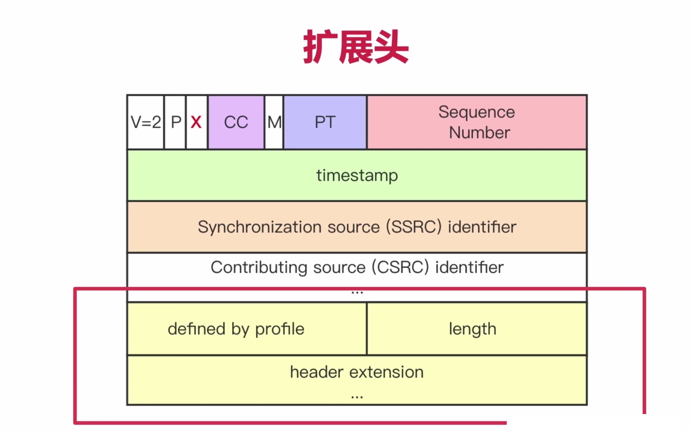

### 3、扩展头中的Length代表什么含义？

- 表示后面跟着的扩展头有几个字节

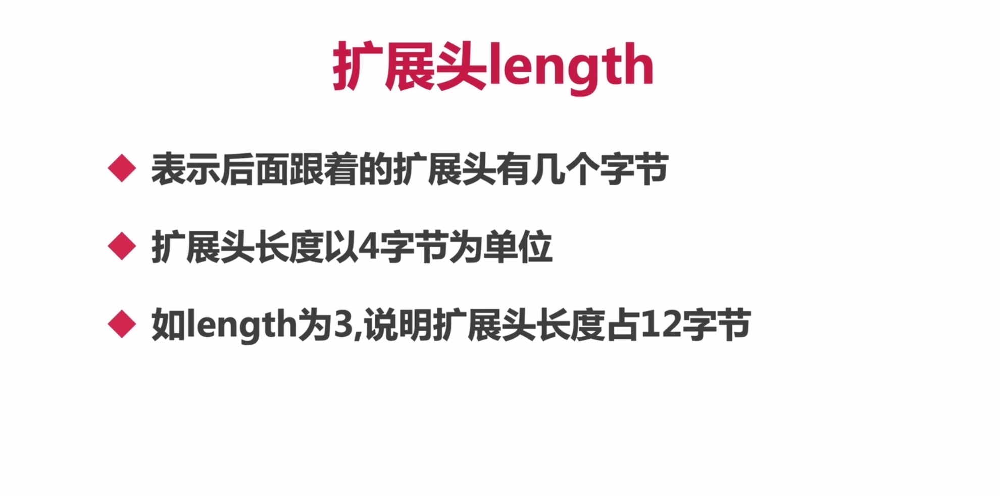

### 4、看图理解什么是一字节的扩展头？什么是两字节的扩展头？

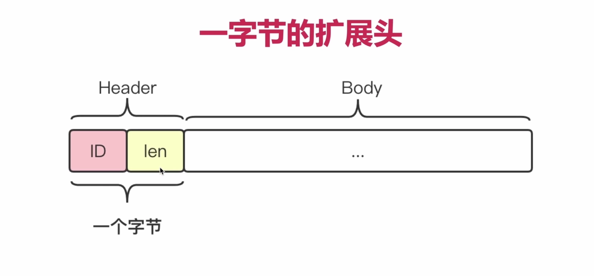

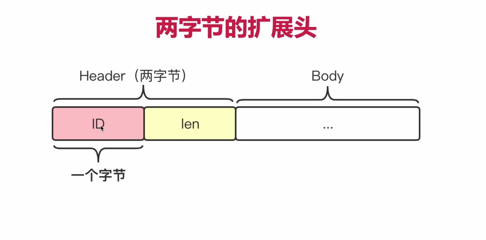

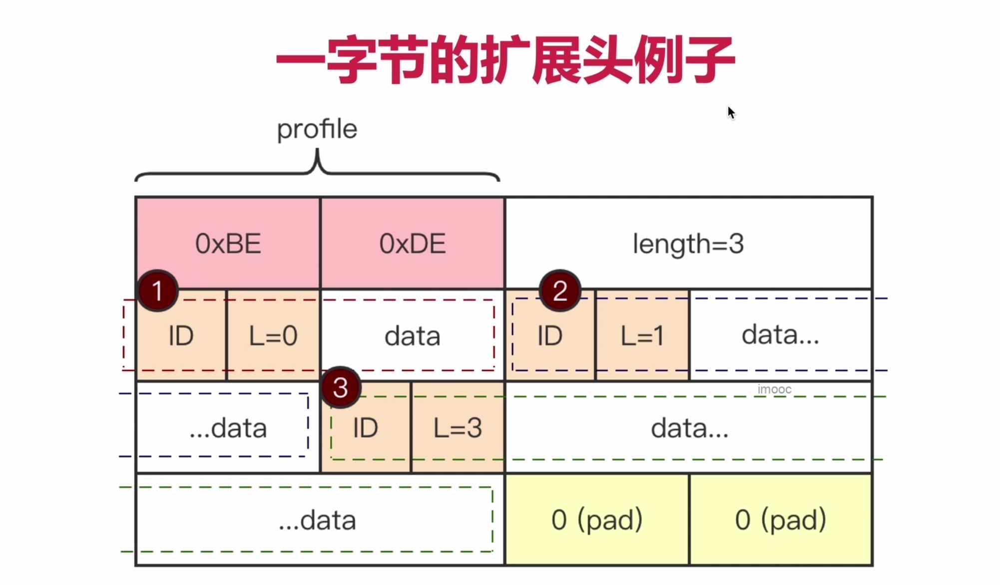

- 【在一字节的扩展头中】上图中紧跟ID后面的L，表示后面的Data部分数据长度是(L+1)字节。

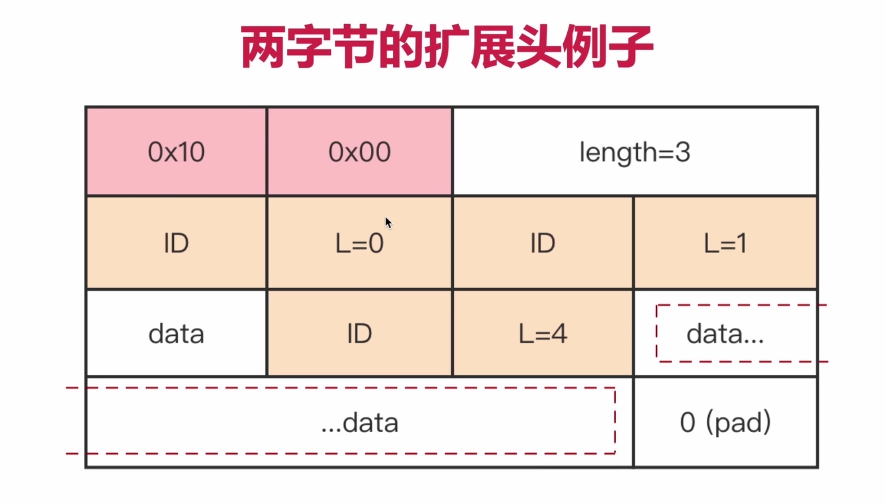

- 【在两字节的扩展头中】上图中紧跟ID后面的L，表示后面的Data部分数据长度是(L)字节，比如L=0，表示后面没有数据。这个与一字节扩展头是不同的。

### 5、在WebRTC中有哪些用到的扩展头(了解即可)

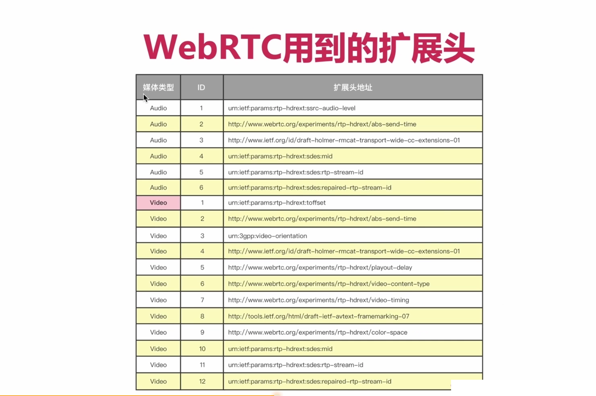

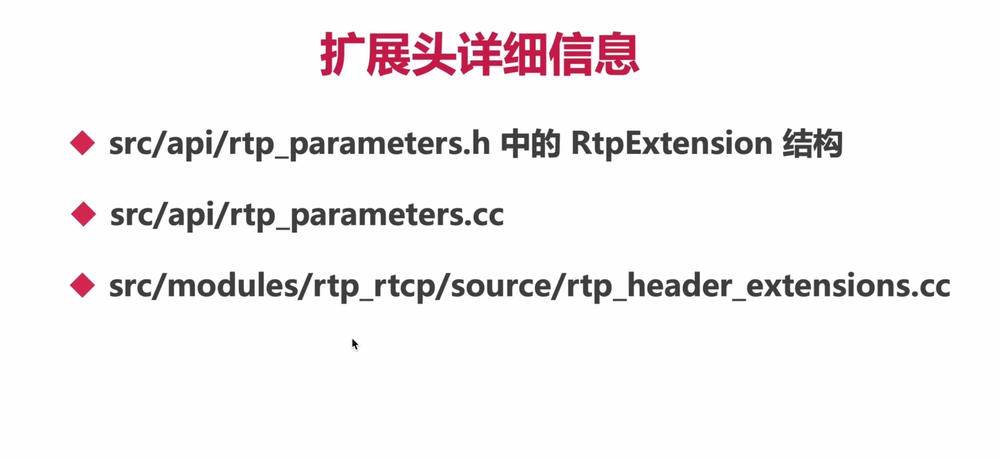

### 6、最后我们认识一个完整RTP头

- 12-4中10分有比较详细，总体的讲解。

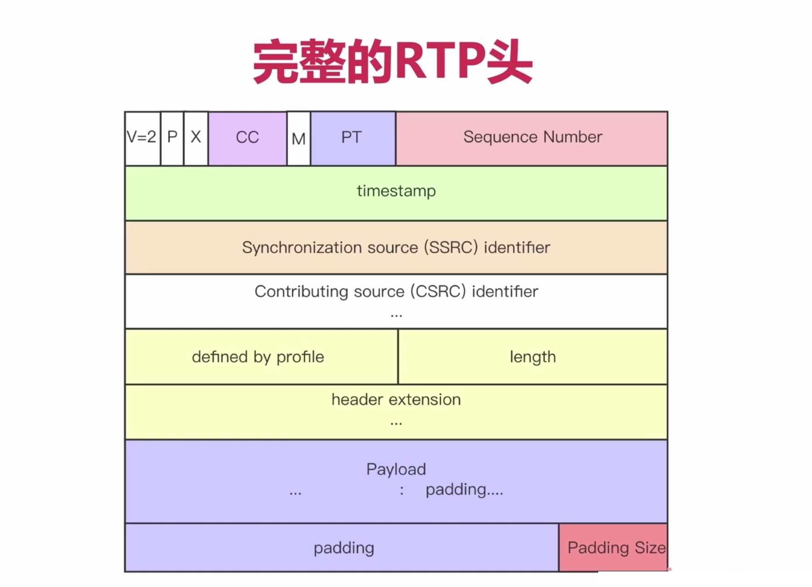

