## 一、RTCP协议

### 1、在以太网中，一个数据包的长度是最长多少字节？RTCP在哪个层？

- 一个数据包的长度 最长是1500 个字节
- RTCP协议在 应用层

### 2、RTCP Header中包括哪些域？（对着图要能解释每个域的含义）

- **Version：** 代表版本号
- **P：** Padding，代表是否有填充位
- **Count：** 代表我们这个RTCP包中包含的 Report Block 有多少个。
- **Type：** 根据功能的将RTCP的类型分成了很多种，比如RR、SR等。
- **Length：** 表示我们这个RTCP数据有多长。

### 3、有哪些常见的RTCP Type？

- **200 SR** Sender Report packet ： 发送报告，就是我一共发了多少个包，需要在发送报告中写明，最终发送给对端。
- **201 RR** Receiver Report packet：接受报告，就是我接收了多少数据，哪些数据丢了，丢失率是多少，最终形成RR类型的RTCP报告，发送给对端。这样发送端就知道，在一段时间内我发送了多少数据，丢失了多少数据。
- **202 SDES** Source Description packet：它表示的是对一个媒体流的描述，比如一个音频的SRC是114455，那么对于这个音频流的具体信息，我们就可以通过SDES了解更多信息。
- **203 BYE** Goobye packet：也就是说我们不需要再传输数据的时候，我们可以向对方发送一个BYE消息，这样双方数据的传输就结束了。
- **204 APP** Application-defined packet：如果我们企业内部向使用自己内部定义的RTCP的时候，就使用APP类型进行自定义。

### 4、另外针对WebRTC还有几种比较常见的RTCP Type？

- **192 FIR** Full INTRA-frame Request：代表向对方请求一个关键帧，比如多人会议中，突然有一个新用户加入，就需要通过FIR报文向其他用户请求一个关键帧，才能正常展示。
- **193 NACK** Negative Acknowledgement：当接收端收到的数据包有丢失的情况下，它会给发送端发送一个NACK，发送端收到NACK之后看看有没有超时，如果没有超时，就会重传接收端丢失的包。

- **205 RTPFB** Generic RTP Feedback. ：表示一般性的RTP Feedback，这种类型的RTCP中又有很多子类型，后面再做详细介绍。
- **206 PSFB** Payload-specific Feedback. ：也就是根据我们的负载情况，返回的一些RTCP信息。留作后续再做介绍。

## 二、SR、RR类型的RTCP

### 1、认识 RTCP SR类型？一个SR中包含多少个Report Block？为什么SR中也包含了接受数据的情况？

- **一个SR中包含多少个Report Block：**一个SR中可以包含多个Report Block，具体多少个取决于有多少路流。
- **为什么SR中也包含了接受数据的情况**：主要是可以节省带宽。

### 2、RTCP 中 Sender Infomation block中的主要数据？区分NTP和Timestamp这两个时间的区别？

- **NTP：** 是真实世界的时间戳，是绝对时间戳，所有RTP包中的NTP标准是相同的。（比如音视频同步）
- **Timestamp：** 是相对时间戳，只针对单当前流的。不同流的RTP之间的Timestamp没有关系。

### 3、RTCP 中 Receiver Infomation block中的主要数据？

### 4、RTCP中的RR报文？

## 三、SDES 类型的RTCP(暂时了解作用即可)

### 1、WebRTC中使用SDES干啥？

- SDES 全称是 Source Description 报文。它属于RTCP协议的一部分，用于描述RTP流的发送者(源)信息。
- 例如 ：
- CNAME: Sources的唯一名字,通常是一个域名,用于唯一标识一个发送者。
- NAME: 发送者的名字,可选。 

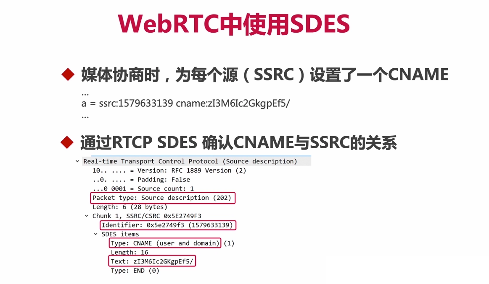

### 2、SDES的报文格式是怎么样的？

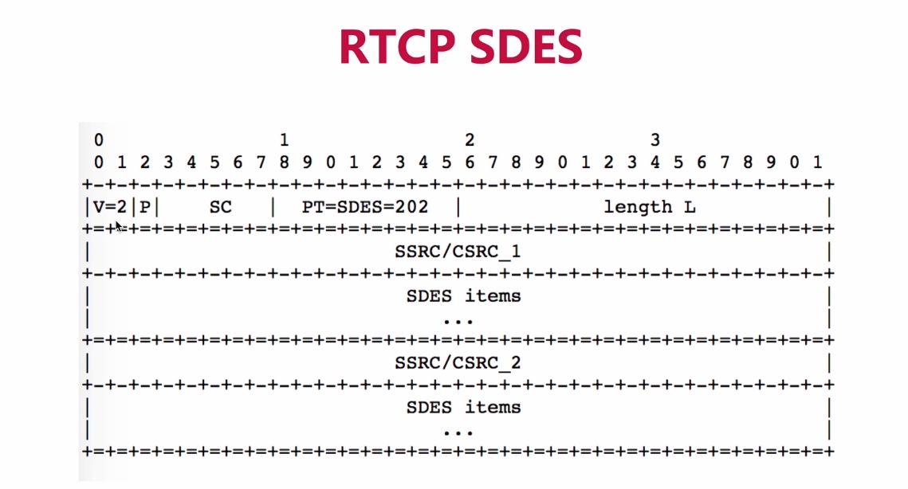

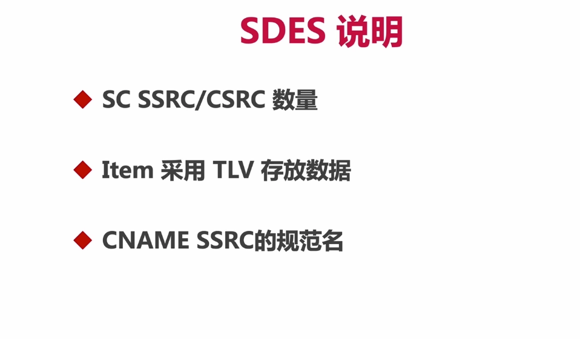

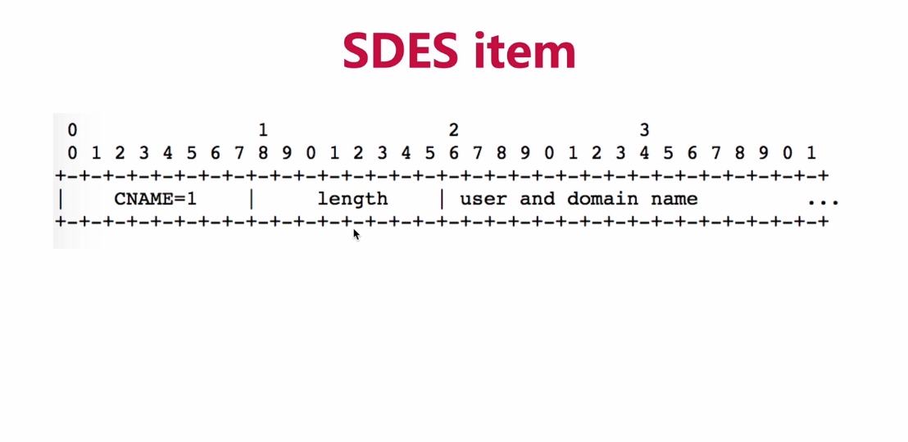

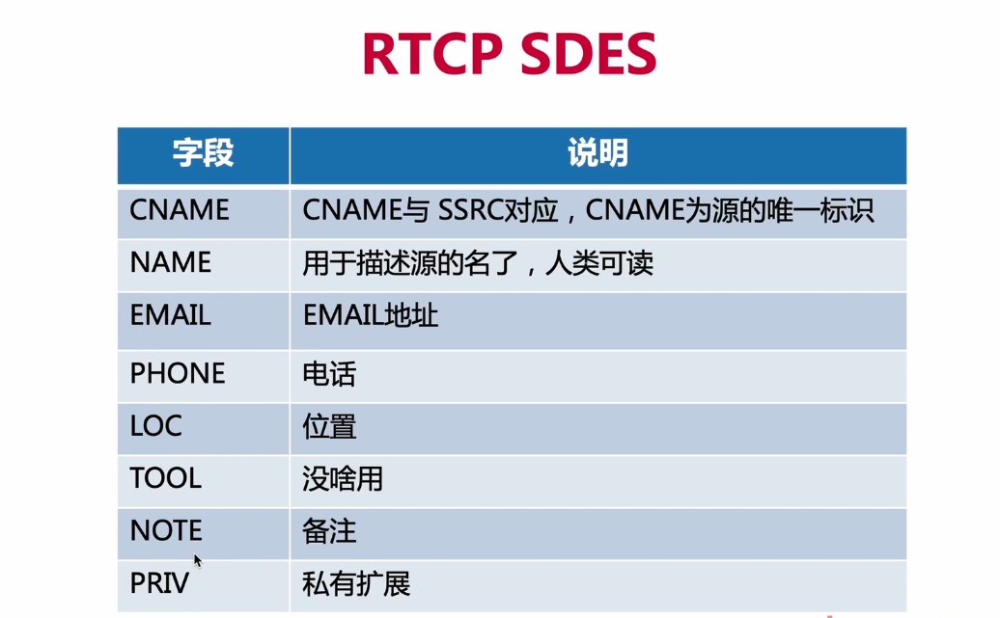

## 四、BYE 、APP类型的RTCP报文

### 1、BYE报文的作用？

- **作用：如果想让哪个SSRC不要再传输数据了，就向该SSRC发送BYE报文即可。**

### 2、BYE报文的格式？

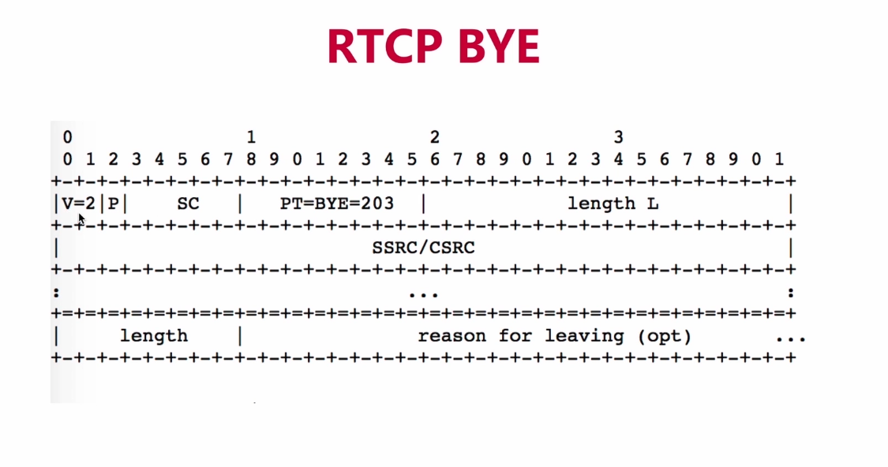

### 3、APP类型的报文作用？

- 可以自定义RTCP消息，做到私有协议的效果。

### 4、APP类型的报文结构？

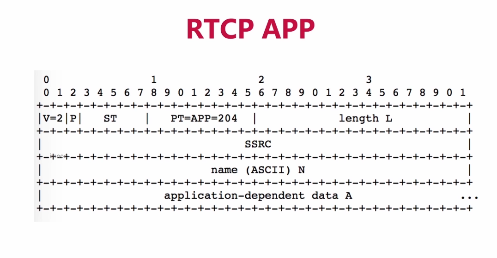

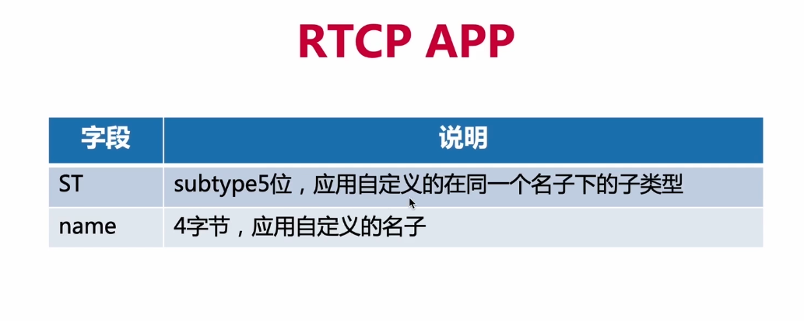

## 四、RTCP FB Type 类型的RTCP报文

### 1、认识 RTCP FB Type的报文有哪些？

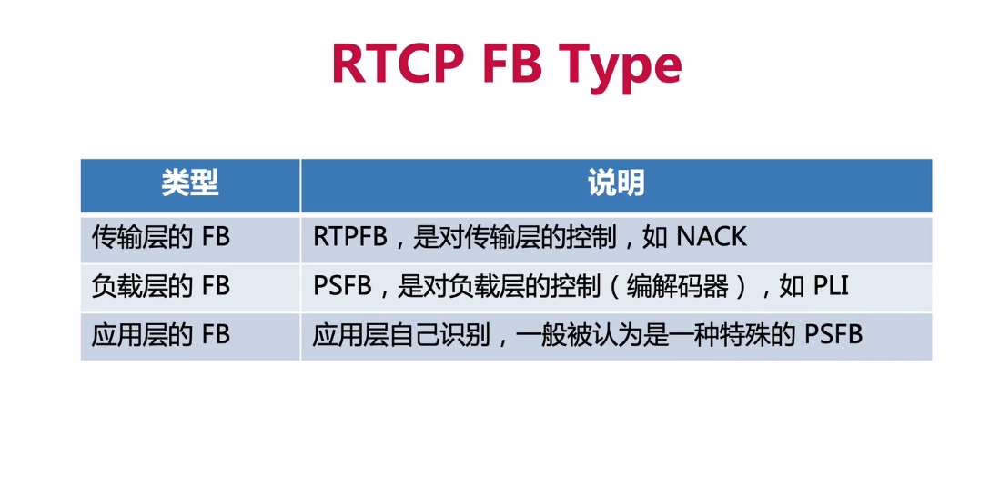

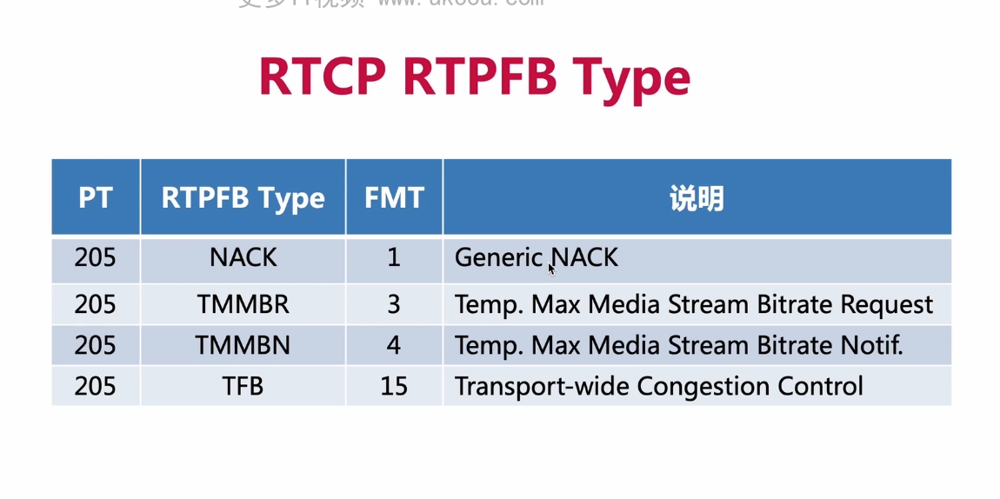

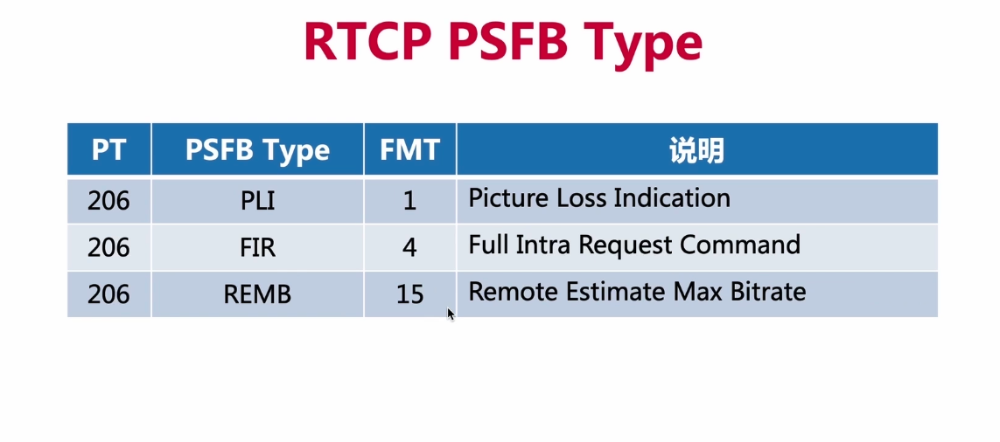

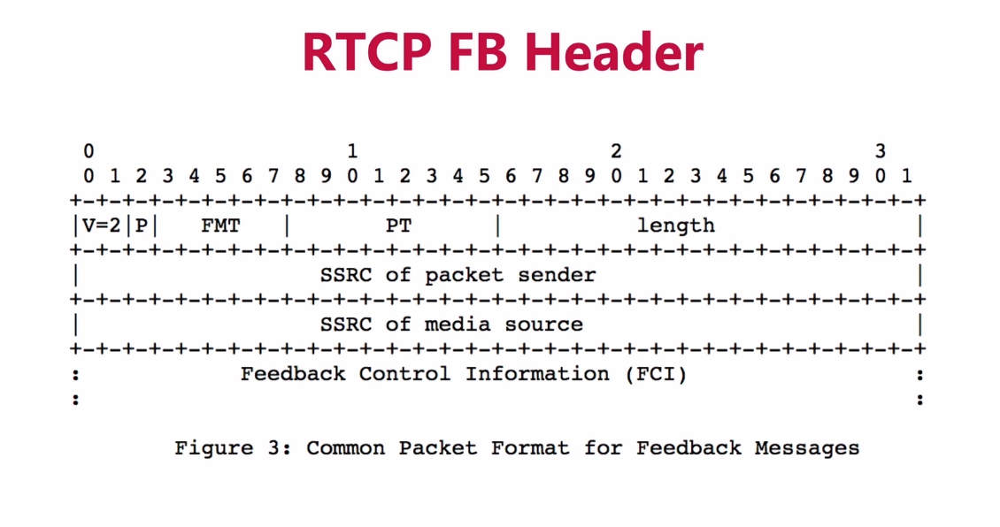

## 四、认识Compound RTCP

### 1、什么是 Compound RTCP呢？

- 将多个RTCP包放到同一个UDP包中发送
- 它们像栈一样存放，一个放在另一个后面，串联在一起
- 每个RTCP包之间，不需要明确的分割

### 2、Compound RTCP的规则？

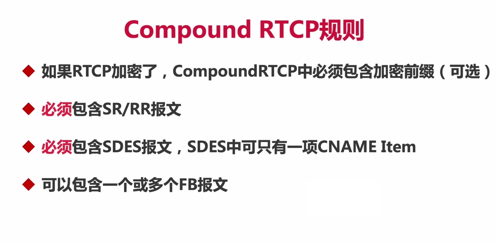

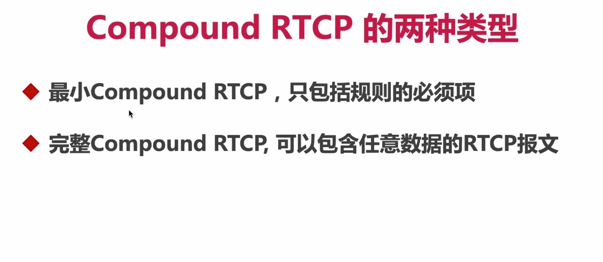

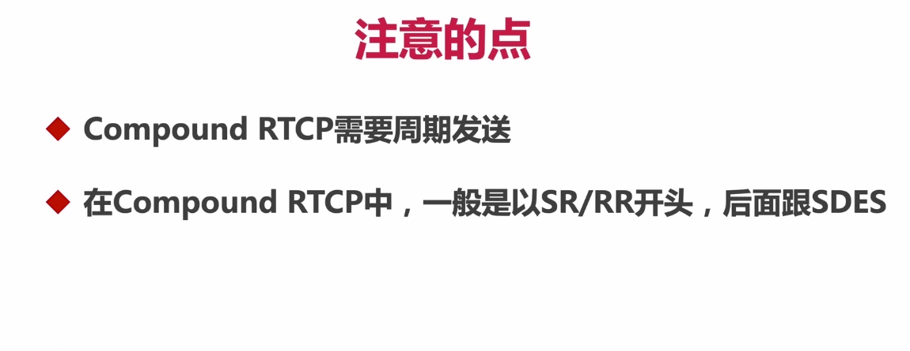

### 3、一个具体的抓包例子

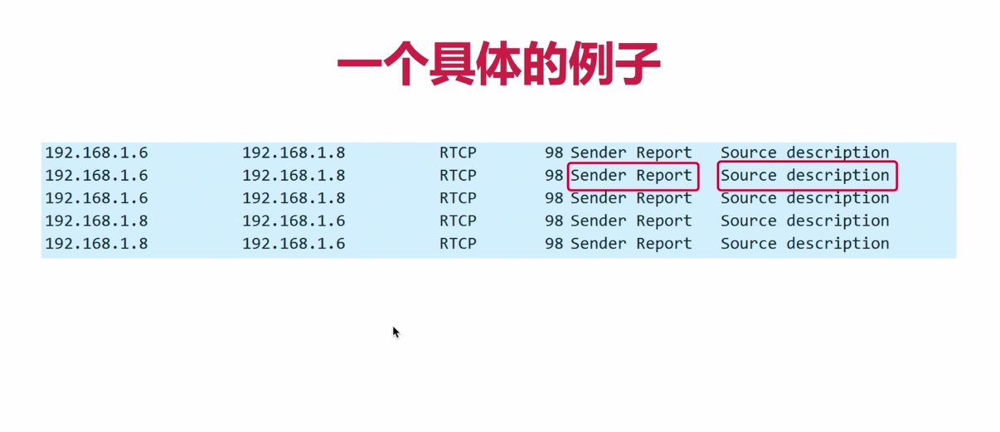

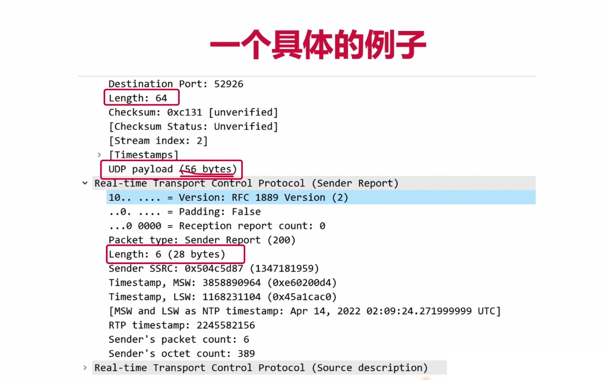

