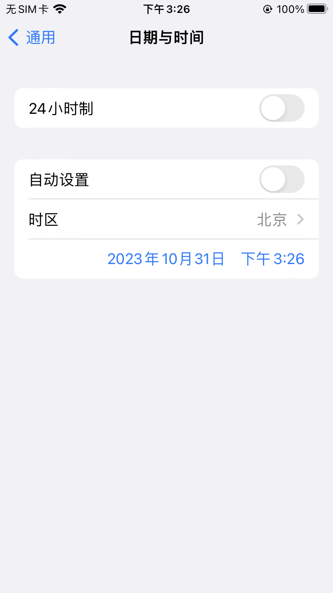
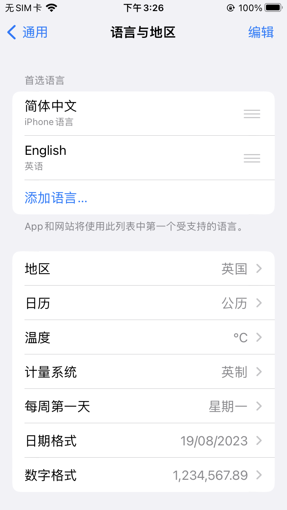

## 一、iOS设备选择12小时[NSDateFormatter dateFromString:] 返回 nil 问题

```objective-c
	NSDateFormatter *formatter = [[NSDateFormatter alloc] init];
	formatter.dateFormat = @"yyyy-MM-dd HH:mm:ss";
  NSString *dateStr = @"2023-10-31 07:18:28";
  NSDate *startDate = [formatter dateFromString:dateStr];
```

- 代码如上，在手机设置**【语言与地区 -> 地区：英国】+【日期与时间 -> 24小时关闭】**这种组合下，startDate将会是nil值。


解决方案：

```
formatter.locale = [NSLocale localeWithLocaleIdentifier:@"en_US_POSIX"];
```


- 因为地区原因，12小时制的情况下，每个国家的格式化时间不一致，这会导致formatter表现异常。所以我们给它固定一个美国地区即可。






## 二、每个国家得到周一不一致问题，导致日期和星期无法对其的问题


解决方案：

```
formatter.locale = [NSLocale localeWithLocaleIdentifier:@"en_US_POSIX"];
```


- 因为地区原因，12小时制的情况下，每个国家的格式化时间不一致，这会导致formatter表现异常。所以我们给它固定一个美国地区即可。
