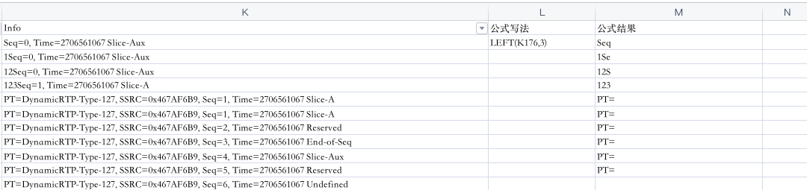
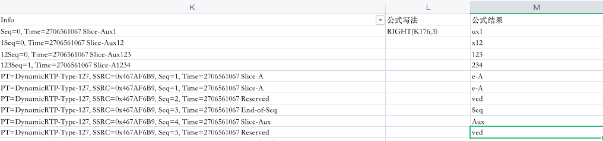
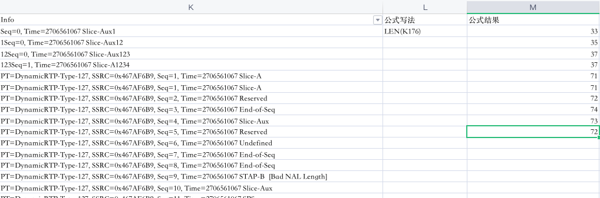
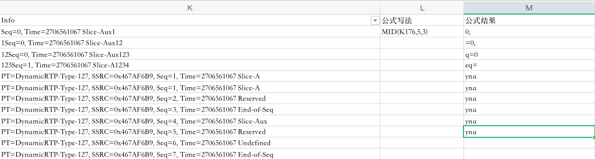
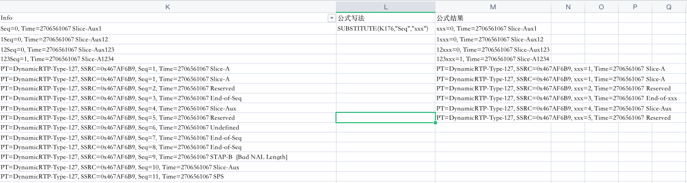
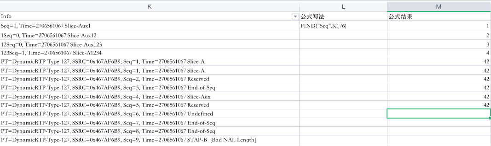
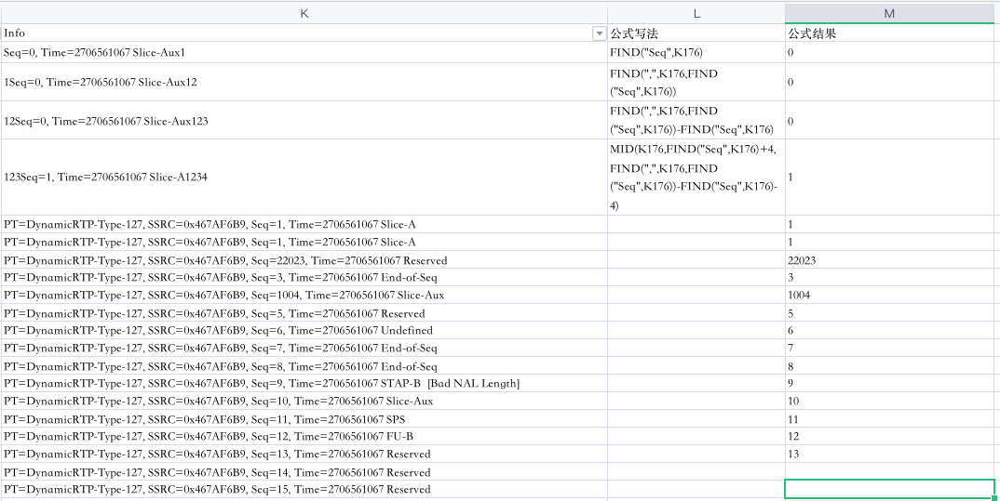

> EXCEL/WPS中文本函数LEFT、RIGHT、LEN、MID、SUBSTITUTE、FIND用法总结如下 

## 一、Left函数用法

- 从左侧开始取特定长度的字符串。




## 二、Right函数用法

- 从右侧开始取特定长度的字符串。




## 三、Len函数用法

- 一个字符串的总长度




## 四、Mid函数用法

- 从一个字符串中间特定位置开始查找特定字符长度。




## 五、Substitute函数用法

- 将一个字符串中的特定字符串替换成另一个字符串。




## 六、Find函数用法

- 找一个**目标字符串**在**原始字符串**中的位置



## 七、一道综合题目，从上面的列中提取出seq的值




```shell
#具体公式如下
=MID(K176,FIND("Seq",K176)+4,FIND(",",K176,FIND("Seq",K176))-FIND("Seq",K176)-4)

#FIND("Seq",K176) 找出seq的位置
#FIND(",",K176,FIND("Seq",K176)) 找出seq后面第一个逗号的位置
#FIND(",",K176,FIND("Seq",K176))-FIND("Seq",K176)-4 用逗号的位置减去seq=的位置，再-4，最终得到数字的长度
#最终用MID函数根据前面获得起始位置+字符串长度，截取出数值。完成提取
```

