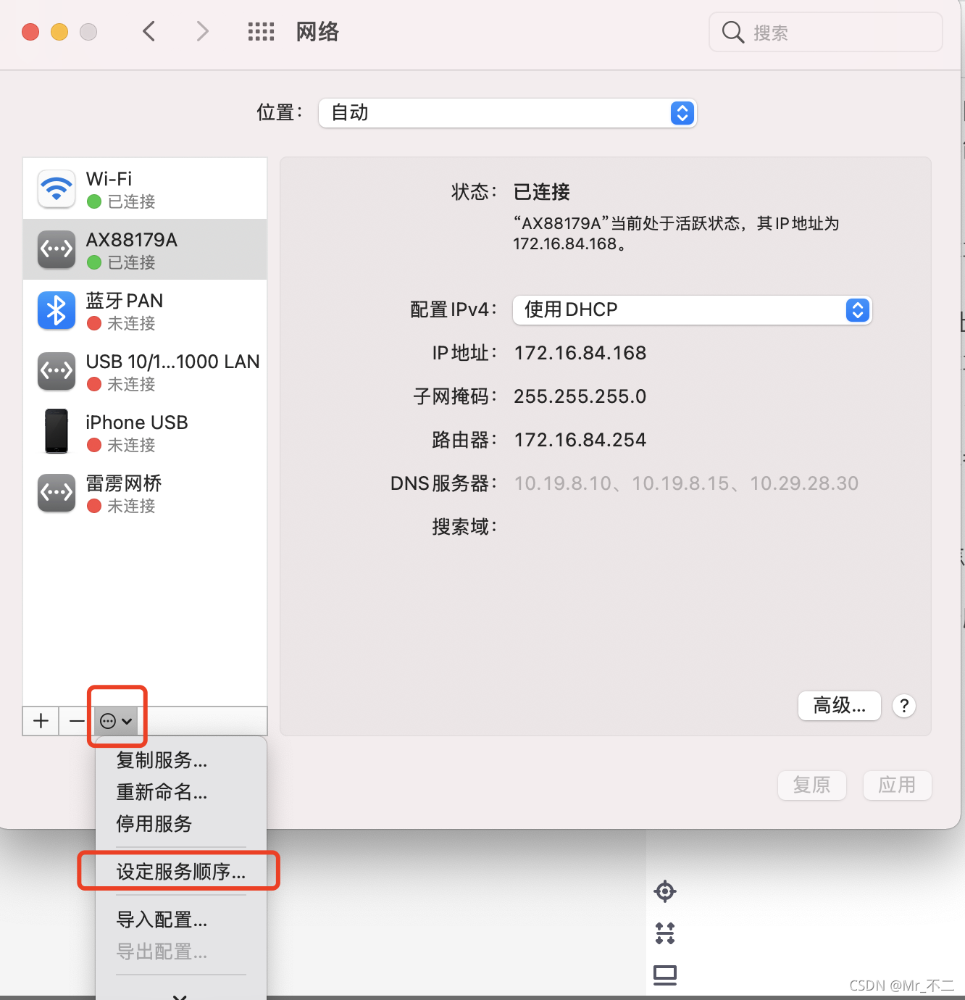
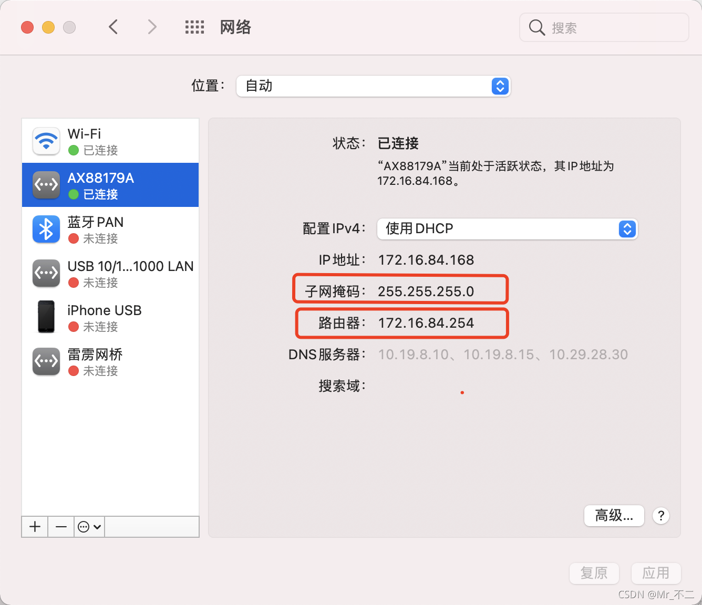

在公司办公通常都会连内网，而连内网最大的限制就是不可以使用外网，那遇到问题也就不能google，而当连接无线的时候，内网的东西就不可以访问，也就不能正常办公，对于我这种小白来说，工作中遇到的问题数不胜数，又不能什么事都请教同事，这可真是让人头大~~~~


那我们是不是可以内外网同时访问呢，答案当然是可以的，解决方法本质上就是 由于**内网网段的个数是有限个的，所以内网网段设置本地静态路由，即添加内网网段指向对应内网的网关，让内网网段全部走对应内网路由，默认网段全部走默认外网路由**
**简单说就是 访问内网网站使用内网，其余所有网站默认使用外网**，这样你的电脑就可以内外网均可访问了。

这边总结一下关于mac怎么配置同时使用内网和外网，以下双网卡配置方法是针对外网用WIFI，内网用有线，但是要注意的是双网卡也可以都是有线或者都是无线，其配置思路本质也是一样的。

话不多说，请**严格按照以下步骤**设置：

**第一步：设置正确的网卡服务顺序**

进入 系统偏好设置 - 网络 - 设定服务顺序，拖动来进行网络优先级设置。使连接外网的网卡位于内网网卡之上。此时可以正常访问外网





**第二步：查看内网网卡的网关地址**

路由器IP即为下一步设置需要用到的[网关地址](https://so.csdn.net/so/search?q=网关地址&spm=1001.2101.3001.7020)
子网掩码下一步设置也需要用到





**第三步：设置本地静态路由，添加内网网段指向对应内网的网关**

（这一步需要在MacOS的终端内执行命令，打开终端的方式参考 MacOS如何打开终端）
先介绍2条关于添加和删除的命令，下面有具体例子
添加：

```
sudo route add -net 10.0.0.0 -netmask 255.0.0.0 10.0.2.1
sudo route add -net 30.1.0.0 -netmask 255.255.0.0 10.0.2.1
```


删除：

```
sudo route delete -net 10.0.0.0 -netmask 255.0.0.0 10.0.2.1
sudo route delete -net 30.1.0.0 -netmask 255.255.0.0 10.0.2.1
```


net参数对应网段IP，netmask是子网掩码。最后的IP是内网网关，即上一步看到的路由器IP地址

比如内网想访问的网址是 http://10.90.20.27/fh，内网网关也就是刚才看到的路由器IP地址为 172.16.84.254，则使用以下命令添加和删除
添加

```
sudo route add -net 10.90.20.0 -netmask 255.255.255.0 172.16.84.254
```


删除

```
sudo route delete -net 10.90.20.0 -netmask 255.255.255.0 172.16.84.254
```


其实不妨把10网段的全部网址都设置一下，（主要就是注意一下网段(10.0.0.0)和子网掩码(255.0.0.0)对应关系就好），用以下命令添加

```
sudo route add -net 10.0.0.0 -netmask 255.0.0.0 172.16.84.254
```


至此内外网路由是已经配置好了。

第四步：配置内网域名和内网DNS解析

在MacOS系统中，不支持同时添加内网和外网DNS服务器地址到外网网卡来起到解析内网地址的作用，因此我们要把内网域名和对应的ip地址写到/etc/hosts文件中进行本地解析。

较为方便的方法是：先关闭外网网卡，进入纯内网模式，ping内网域名得到内网IP地址，再将IP地址和域名写入到hosts中，操作步骤如下。

通过ping命令，获取对应域名的IP地址

```
MacBook-Pro:root# ping aaa.bbb.com
PING aaa.bbb.com (10.12.8.25): 56 data bytes
64 bytes from 10.12.8.25: icmp_seq=0 ttl=61 time=15.934 ms
64 bytes from 10.12.8.25: icmp_seq=1 ttl=61 time=16.219 ms
64 bytes from 10.12.8.25: icmp_seq=2 ttl=61 time=15.713 ms
64 bytes from 10.12.8.25: icmp_seq=3 ttl=61 time=15.755 ms
```

将IP地址和对应的域名写入 /etc/hosts 文件中

```
MacBook-Pro:root# echo "10.12.8.25 aaa.bbb.com" >>/etc/hosts	
```


细心一点，一定要注意不要写错了！！

至此，就已经完成配置完成啦，此时你的mac就可以内外网均可访问了，但是要注意重启后，需要重新设置。

————————————————
版权声明：本文为CSDN博主「ni_darling」的原创文章，遵循CC 4.0 BY-SA版权协议，转载请附上原文出处链接及本声明。
原文链接：https://blog.csdn.net/weixin_44637703/article/details/121626312
