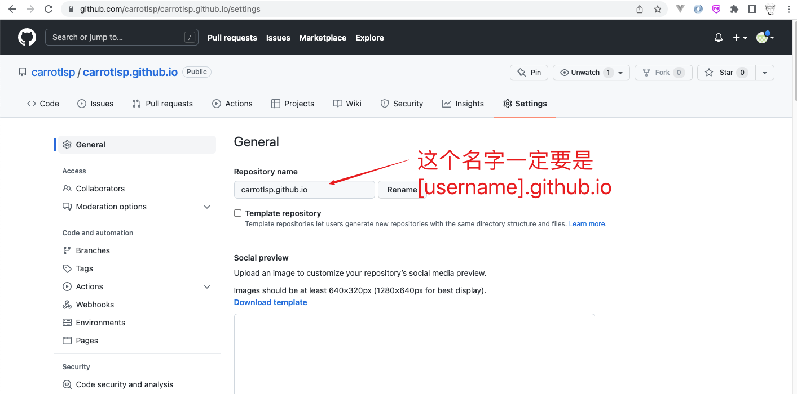
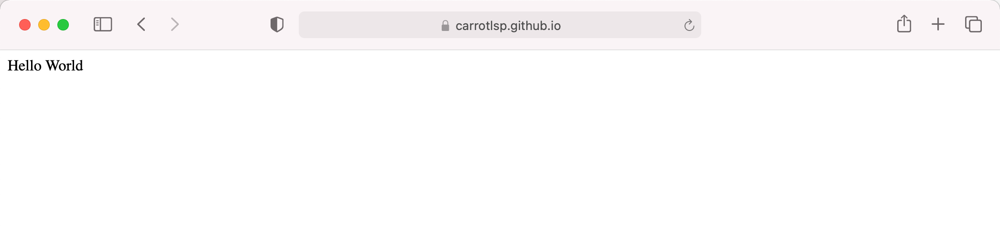
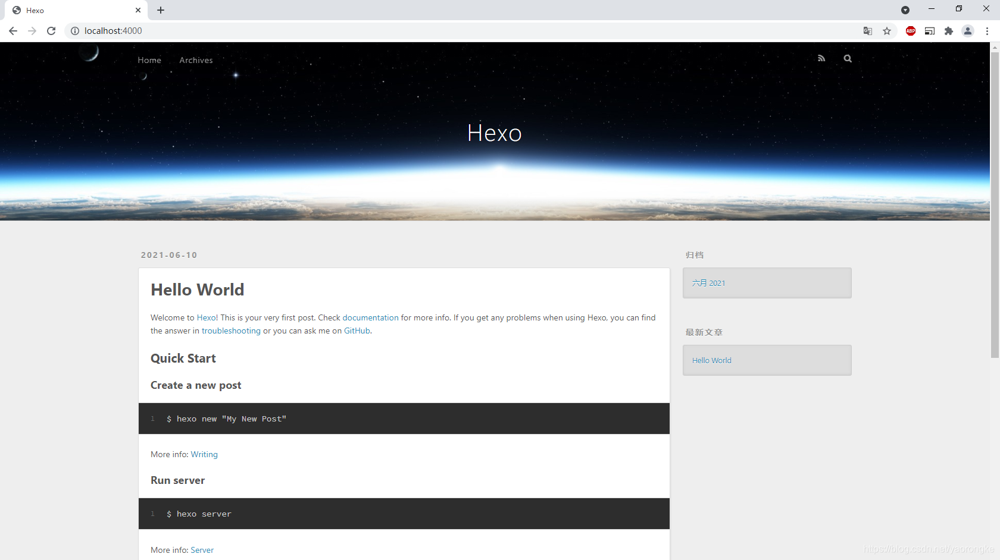
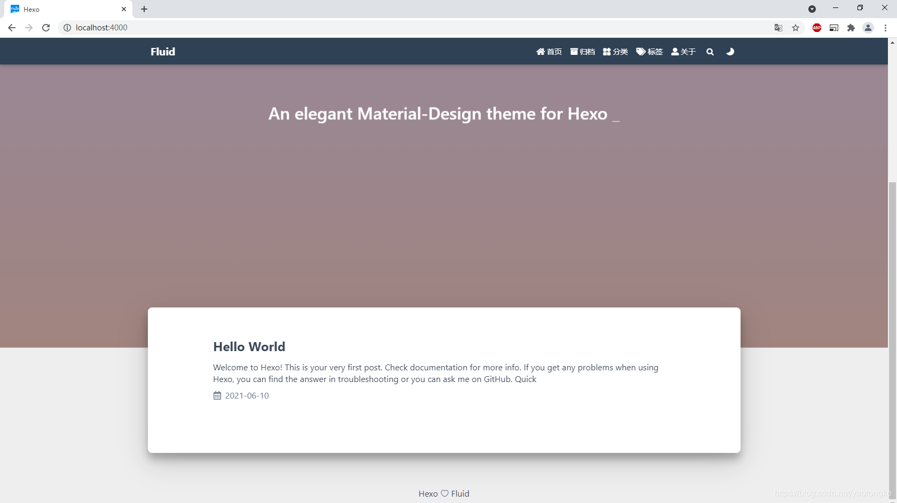
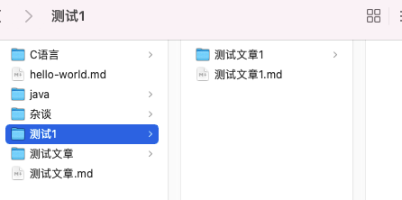
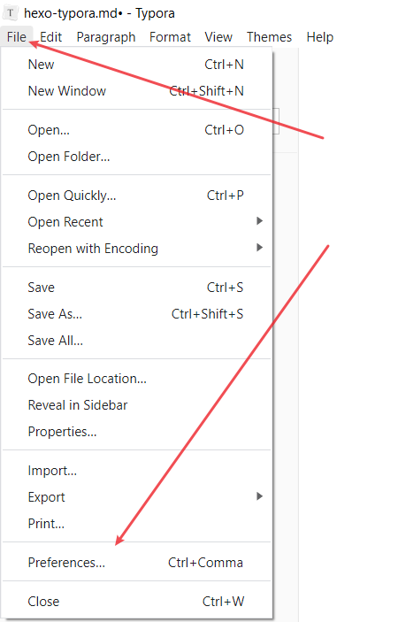
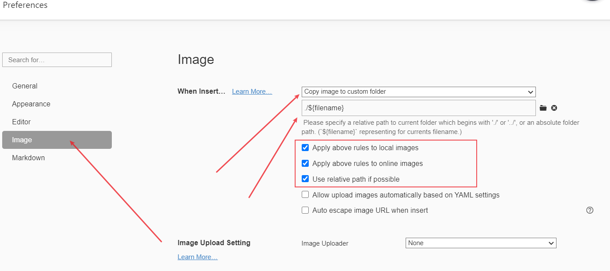
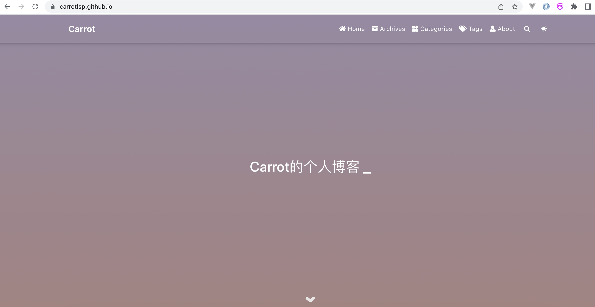
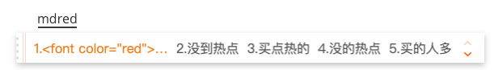

## 一、开启GitHub的homepage功能


### 1、注册GitHub账号，并创建一个项目，对仓库名字有严格要求。





### 2、在项目中创建一个 `index.html` 文件，并填入以下内容。

```html
<!DOCTYPE html>
<html lang="en">
  <head>
    <meta charset="UTF-8" />
    <meta http-equiv="X-UA-Compatible" content="IE=edge" />
    <meta name="viewport" content="width=device-width, initial-scale=1.0" />
    <title>Document</title>
  </head>
  <body>
    Hello World
  </body>
</html>
```


### 3、访问页面，表示这个阶段成功了。




### 二、本地搭建hexo博客


#### 1、安装Hexo（依赖nodejs环境，自行安装）

 [Hexo 官方安装文档](https://hexo.io/zh-cn/docs/) 

```shell
npm install -g hexo-cli
```

查看版本

```shell
hexo -v
```

创建一个 `hexo-blog` 并初始化

```shell
hexo init hexo-blog
cd hexo-blog
npm install
```

本地启动

```
hexo g
hexo server
```

浏览器访问 http://localhost:4000 ，页面默认主图风格如下



 

### 2、更换hexo主题（个人比较喜欢Fluid）

[官方安装文档](https://github.com/fluid-dev/hexo-theme-fluid)

#### 1、**方式一：**

Hexo 5.0.0 版本以上，推荐通过 npm 直接安装，进入博客目录执行命令：

```
npm install --save hexo-theme-fluid
```

然后在博客目录下创建 `_config.fluid.yml`，将主题的 [_config.yml](https://github.com/fluid-dev/hexo-theme-fluid/blob/master/_config.yml) 内容复制进去。

#### 2、**方式二：**

下载 [最新 release 版本](https://github.com/fluid-dev/hexo-theme-fluid/releases) 解压到 themes 目录，并将解压出的文件夹重命名为 `fluid`。

如下修改 Hexo 博客目录中的 `_config.yml`：

```
theme: fluid  # 指定主题

language: zh-CN  # 指定语言，会影响主题显示的语言，按需修改
```

#### 3、**创建「关于页」**

首次使用主题的「关于页」需要手动创建：

```shell
hexo new page about
```

创建成功后，编辑博客目录下 `/source/about/index.md`，添加 `layout` 属性。

修改后的文件示例如下：

```markdown
---
title: about
date: 2020-02-23 19:20:33
layout: about
---

这里写关于页的正文，支持 Markdown, HTML
```

#### 4、启动测试

**本地启动**

```shell
hexo g -d
hexo s
```

浏览器访问 http://localhost:4000，`Fluid`主题风格页面如下





#### 5、创建文章

如下修改 Hexo 博客目录中的 `_config.yml`，打开这个配置是为了在生成文章的时候生成一个同名的资源目录用于存放图片文件。

```sh
post_asset_folder: true
```

执行如下命令创建一篇新文章，名为《测试文章》

```
hexo new post --path 测试1/测试文章1
```

执行完成后在`source\_posts`目录下生成了一个md文件和一个同名的资源目录(用于存放图片)



#### 6、借助 Typora 软件编写文章

对于图片资源的管理比较麻烦，这里 [推荐方案](https://moeci.com/posts/hexo-typora/)


配置typora，图片文件保存路径: `./${filename}` 即保存到与 当前正在编辑的文件名 相同的同级文件夹下






配置给hexo-blog项目配置插件

```
npm install hexo-asset-img --save
```


### 三、发布到GitHub Pages


#### 1、安装  `hexo-deployer-git` 发布插件

```sh
npm install hexo-deployer-git --save
```

### 2、修改根目录下的 `_config.yml`，配置 `GitHub` 相关信息

```json
# Deployment
## Docs: https://hexo.io/docs/one-command-deployment
deploy:
  type: git
  repo: git@github.com:carrotlsp/carrotlsp.github.io.git
  branch: main
```

#### 3、配置建立本地电脑和GitHub的ssh-key连接

就是把自己 `cd ~/.ssh/ ` 目录下的公钥给到GitHub配置中


#### 4、发布

```
hexo g
hexo d
```

访问 `https://carrotlsp.github.io/` 即可看到效果




### 四、一些小技巧


#### 1、如何把关键字标红？

```markdown
<font color="red">红色字体</font>
```

但是每次敲这个HTML语法过于繁杂，我们可以借助 `输入法` 的快捷指令即可，如下图



