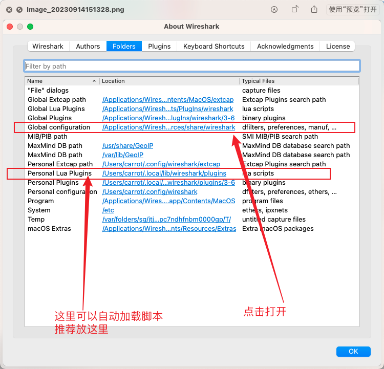
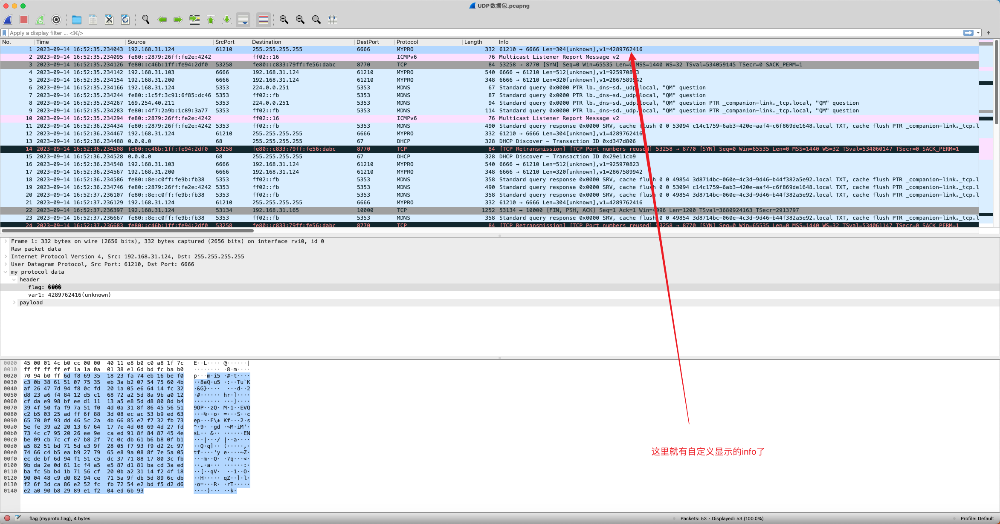

## 一、找到脚本放置的路径

旧版本的wireshark需要手动引入，而新的会自动加载。我的版本是 3.4.4，会自动加载。

先找到wireshark的安装目录： **帮助–>关于Wireshark –>文件夹** 可以查看所有的路径
重新加载各种lua脚本快捷键是： **ctrl+shift+L**


- 自动加载：
  - 将自定义的lua脚本放到 xxx \ Wireshark \ plugins 下就可以了，这个目录下的子目录也都会扫描，按一下快捷键看有没有加载就知道了。没有就要手动引入
- 手动加载
  - 自定义的脚本可以就放在 plugins，随意。在安装目录下找到 **init.lua**文件，这是脚本的入口。在文件的**最后**引入你的文件

```
	--DATA_DIR是 init.lua所在路径，..是字符串连接符
	--也可以用绝对路径，只要找得到就行
	dofile(DATA_DIR.."mylua/mypro.lua")
```





## 二、编写lua脚本代码

```lua
do    
    -- 定义自己的协议，name 和 description，未添加字段
    my_proto = Proto("MYPRO", "MY Protocol")

    -- 第一个参数用于过滤器的字段，第二个是数据显示时的名称，第三个是数据类型
    flag = ProtoField.string("myproto.flag", "flag", base.UNICODE)
    v1 = ProtoField.uint32("myproto.v1", "var1", base.DEC)
    data = ProtoField.none("myproto.data", "data", base.unicode)

    -- 声明协议的字段
    my_proto.fields = {
        flag,
        v1,
        data
    }

    -- buffer: 包的数据
    -- pinfo: 显示的信息
    -- tree: 包结构的关系
    function my_proto.dissector(buffer, pinfo, tree)
        if buffer:len() == 0 then return end

        pinfo.cols.protocol = my_proto.name -- 显示在protocol列的名字
        local subtree = tree:add(my_proto, buffer(), "my protocol data") -- 显示在数据查看

        -- 解析成两个分支
        local head_st = subtree:add(my_proto, buffer(), "header")
        local payload_st = subtree:add(my_proto, buffer(), "payload")

        -- tag解析：根据字段大小，添加到子树
        head_st:add_le(flag, buffer(0,4)) --little-endian，从0位置解析4个字节

        --v1解析：解析成具体的类型提示追加在字段后面
        local type = buffer(4,4):le_uint() -- 要复用的可以定义成变量
        head_st:add(v1, type):append_text("("..get_type_name(type)..")") -- 用add就可以了

        -- 剩下的字节为payload
        payload_st:add_le(data, buffer(8,buffer:len()-8))

        -- 按需要显示到Info列上
        local v1_str = buffer(4,4):le_uint()
        local att1_str = get_type_name(type)
        local info_str = "["..att1_str.."]"..",v1="..v1_str
        pinfo.cols.info:append(info_str)
    end
    
    local udp_prot = DissectorTable.get("udp.port") -- 如果获取tcp就是tcp.port
    udp_prot:add(6666, my_proto) -- 抓到的6666端口的数据，按my_proto的规则来解析
end

function get_type_name(type)
	local name = "unknown"
	if type == 0 then name = "att1"
	elseif type == 1 then name = "att2" end	
	return name
end
```


最终效果图如下👇🏻




## 三、如果基于UDP或者TCP的数据，又经过AES加密，wireshark抓到数据之后，如何解密呢？


理论上来讲，用上面的自定义加密方式可以处理，但是笔者在mac没找到lua的AES加解密库，所以只能手动解密。

找到wireshark中tcp的数据包，copy下来，到在线AES解密网站，进行相应的解密即可。

AES在线加密解密工具：https://www.mklab.cn/utils/aes


文章参考链接：https://blog.csdn.net/quniyade0/article/details/115266774

