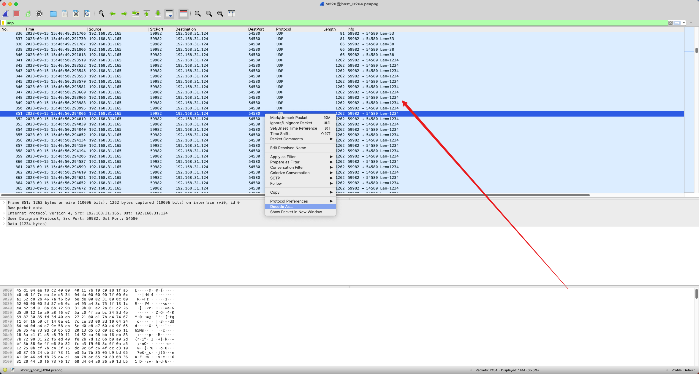
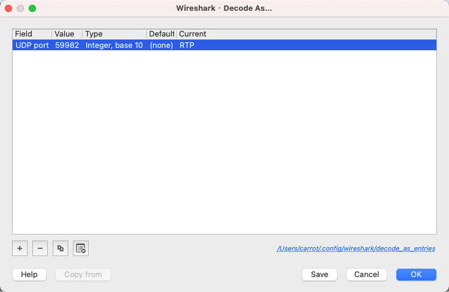
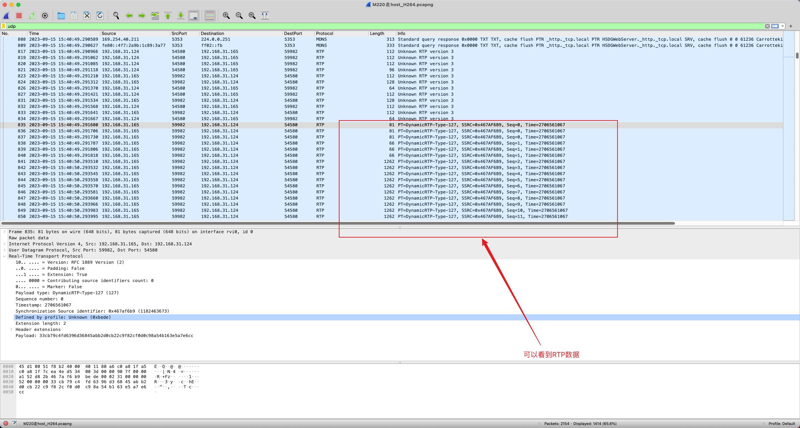
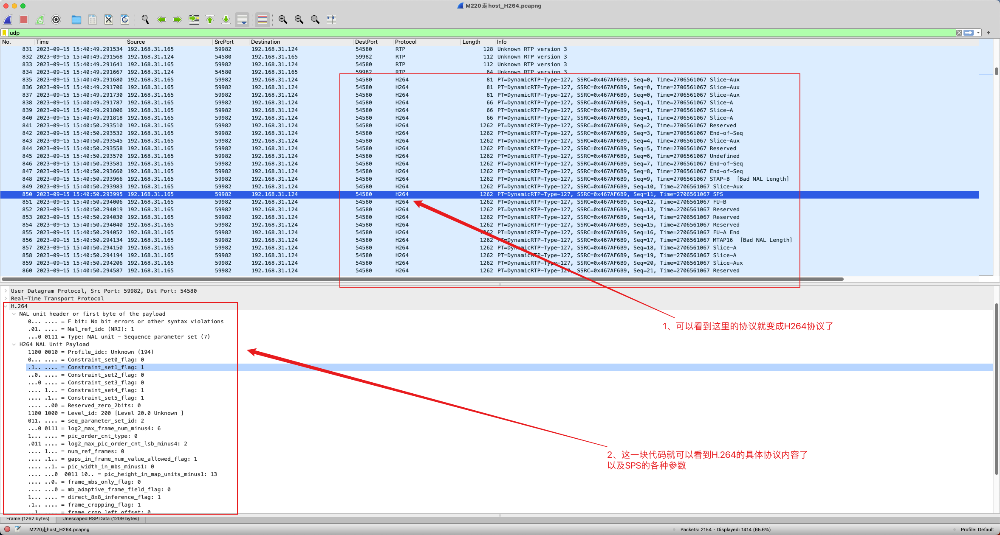
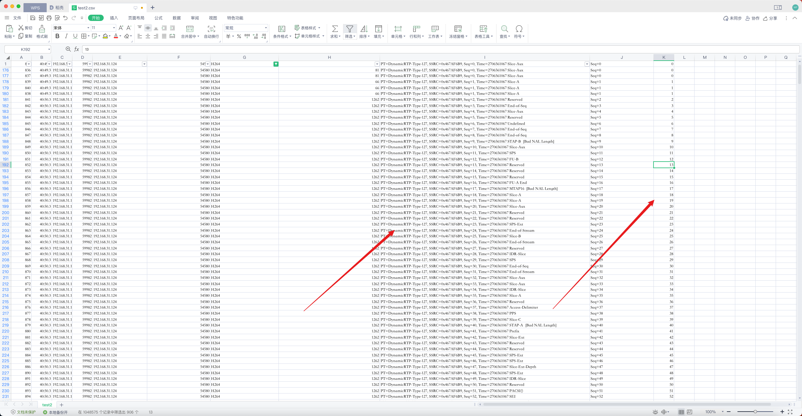

## 一、找到脚本放置的路径

### ①使用前面介绍的抓包方式，抓取数据包。

### ②找到连续的UDP大片数据，大概率就是I帧数据。

右键 —> DecodeAs -> 把current中的值改成RTP

### ③我们可以看到PT=127

然后在 WireShark 工具栏中选择 Edit –> preferences –> protocols –> H264，把“H264 dynamic payload types”设成 127，点击 OK。

### ④在wireshark如果发生丢包，怎么查看

将数据导出车csv格式的数据，用excel打开，提取seq进行排序。

