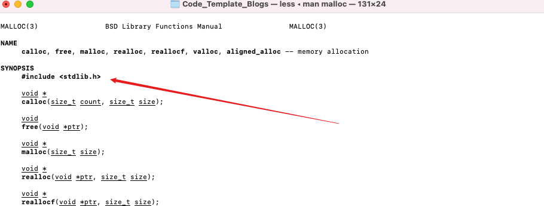

## 一、Mac终端命令


### 1、如果电脑上有多个ffmpeg，如何知道当前执行的ffmpeg命令是哪个安装包下的？

- 借助 <font color="red">which</font> 命令

```sh
$ which ffmpeg
/usr/local/ffmpeg/bin/ffmpeg
```


### 2、借助命令行如何知道C语言的函数，比如 <font color="red">malloc</font> 函数属于哪个库？

```sh
$ man malloc
```





### 3、`env` 命令有什么用？

- 可以查看当前mac电脑的环境变量

```sh
$ env | grep PATH
MANPATH=/usr/local/share/man:
PATH=/usr/local/ffmpeg/bin:/usr/local/bin:/usr/local/sbin:/usr/local/bin:/usr/bin:/bin:/usr/sbin:/sbin:/Library/Apple/usr/bin
INFOPATH=/usr/local/share/info:
```


## 二、C语言回顾


### 1、C语言中的<font color="red">数组长度</font>与其他高级语言有什么不同？

- C语言中的数组长度，必须指定，无法自动扩容。
- C语言中的数组存储数据的长度，需要开发者自己维护，不可直接对数组进行获取。


### 2、指针的实际作用？

- ①在参数传递时，不需要真的带着一大堆的数据，可以传递指针，提高程序执行效率。
- ②指针可以指向任何地址，所以灵活性很高


### 3、指针的定义？

- 指向内存所在地址的变量，就是指针。


### 4、对指针的操作可以分为哪两大方向？

- 对指针本身进行操作
- 对指针指向的内容操作


### 5、借助以下代码，思考为什么要养成指针释放后需要置空的编码好习惯？

```c
#include <stdio.h>
#include <stdlib.h>

int main(int argc, const char * argv[]) {
    // insert code here...
    
    char *p = (char*)malloc(10);
    *p = 'a';
    *(p+1) = 'b';
    *(p+2) = 'c';
    free(p);
//    p = NULL; (如果没有这句代码的保护，接下来对p的使用就是野指针，容易造成不可预知的错误)
    *p = 'd';
    printf("%s\n", p);
    return 0;
}
```


### 6、什么是函数？什么是函数指针？最好自己先代码练一下。

```C
#include <stdio.h>
int main(int argc, const char * argv[]) {
    int sum(int, int);          //函数声明
    int (*func)(int, int);      //函数指针
    func = sum;
    int result = func(1, 2);
    printf("%i\n", result);
    
    return 0;
}
int sum(int a, int b) {
    return a + b;
}
```


### 7、<font color="red">usleep</font>函数的作用是什么？单位是什么？

- usleep的函数是让线程阻塞一段时间
- usleep的单位是<font color="red">微秒</font>
- `usleep(1000000); ` 就是阻塞1s钟

```C
#include <stdio.h>
#include <unistd.h>
int main(int argc, const char * argv[]) {
    static int count = 0;
    while (count < 10) {
        usleep(1000000);
        count ++;
        printf("%i \n", count);
    }
    return 0;
}
```


### 8、C语言中如何打开一个文件，如何读取文件，如何关闭文件？（一定要多代码练习）

```c
#include <stdio.h>

void writeFile(const char* filePath) {
    FILE *file = fopen(filePath, "w");
    if (file == NULL) {
        printf("打开文件失败(%s)\n", filePath);
        return;
    }
    size_t wLen = fwrite("0123456789", 1, 10, file);
    if (wLen < 0) {
        printf("写入文件失败(%zu)\n", wLen);
        return;
    }
    fclose(file);
    printf("写入成功\n");
}

void readFile(const char* filePath) {
    FILE *file = fopen(filePath, "r");
    if (file == NULL) {
        printf("打开文件失败(%s)\n", filePath);
        return;
    }
    char data[20];
    size_t rLen = fread(data, sizeof(char), 10, file);
    if (rLen < 0) {
        printf("读取文件失败(%zu)\n", rLen);
        return;
    }
    fclose(file);
    printf("读取成功（%s）\n", data);
}

int main(int argc, const char * argv[]) {
    const char* filePath = "/Users/carrot/Documents/Code_Template_iOS/01_音视频/10_李超/01_第一季/CDemo/Data/readFileName.txt";
    writeFile(filePath);
    readFile(filePath);
    return 0;
}
```


