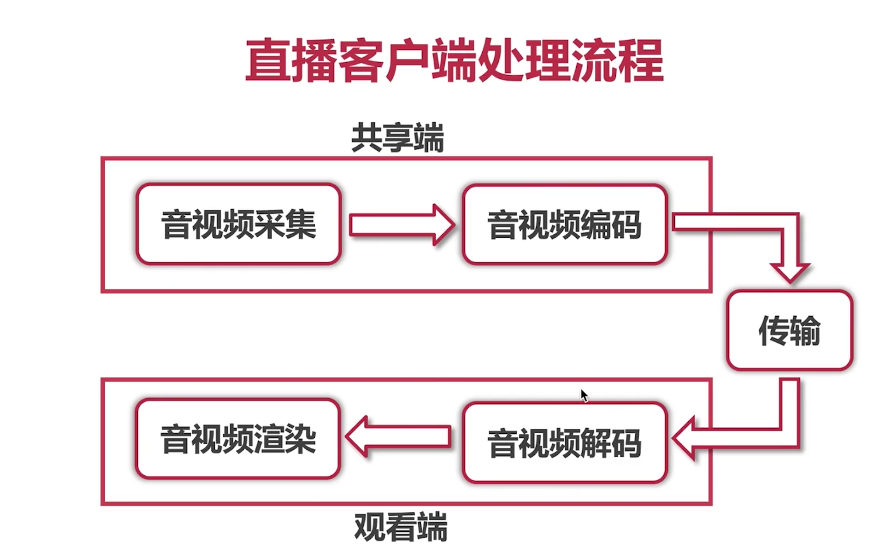
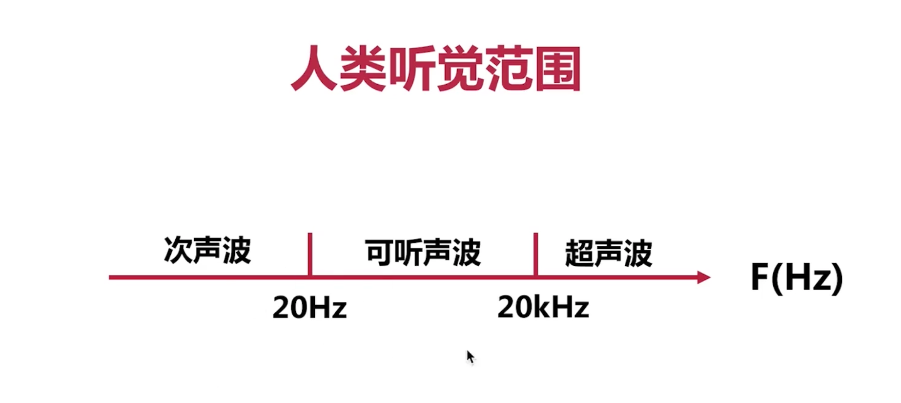
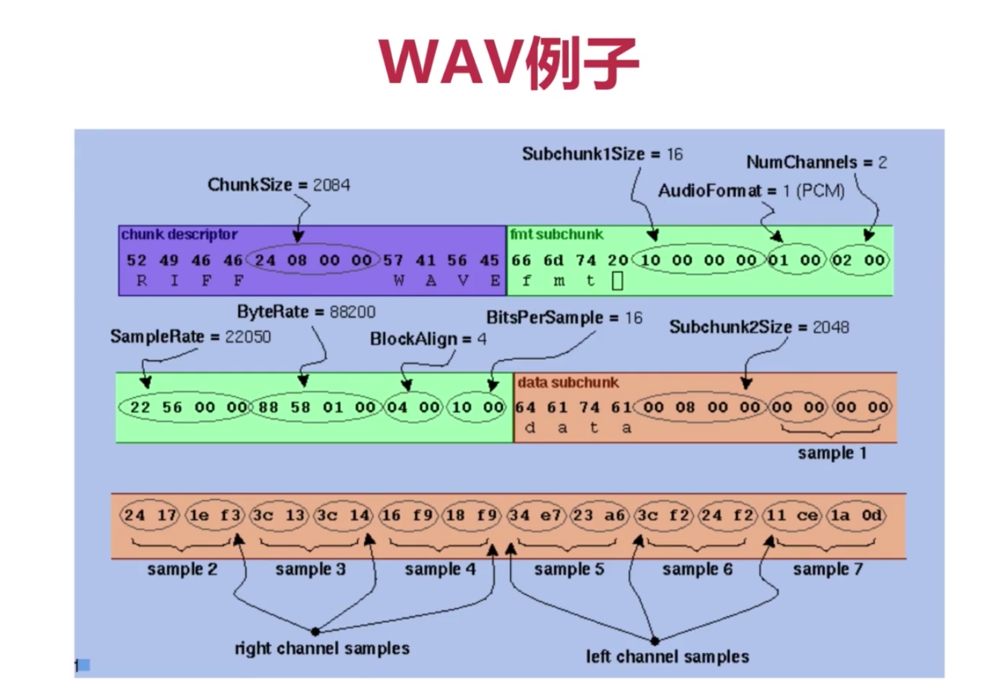
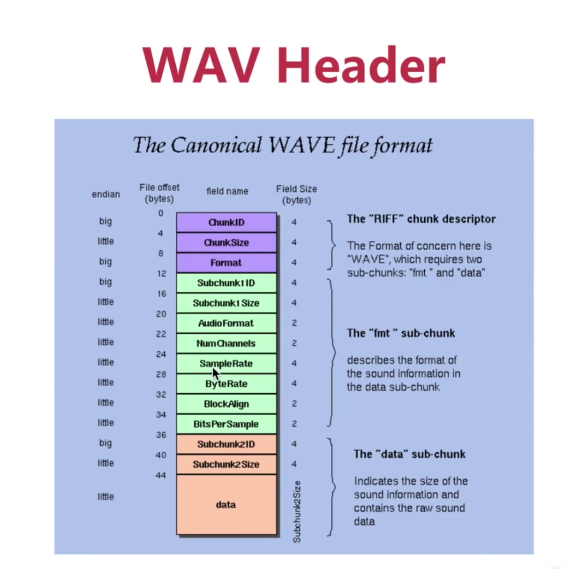

## 一、音频基础知识

### 1、从共享端和观看端来大致分析直播流程？

### 2、什么是赫兹？人类听觉范围是多少？

- 声音一秒振动的次数叫做赫兹，英文简称 Hz
- 20Hz ~ 20000Hz

### 3、分别解释音调、音量、音色分别由什么决定？

- 音调：声音频率的高低
- 音量：声音振幅的大小
- 音色：谐波组合而成

### 4、音频播放的三要素是什么？

- 采样率：采样频率8k、16k、32k、44.1k、48k
- 采样格式：一个采样用多少bit存放。通常是16bit
- 声道数：单声道、双声道、多声道

### 5、WAV头部信息分析？（TODO后面有空在回看）

