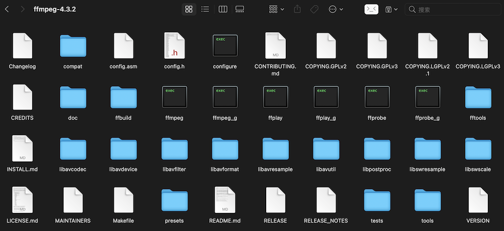
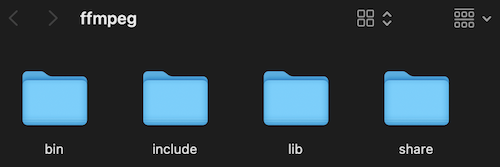

## 一、手动编译ffmpeg


### 1、目标

这里先提前说明一下，最后希望达到的效果：

- 编译出ffmpeg、ffprobe、ffplay三个命令行工具
- 只产生动态库，不产生静态库
- 将 fdk-aac、x264、x265集成到FFmpeg中

### 2、下载源码

下载源码[ffmpeg-4.3.2.tar.xz](https://ffmpeg.org/releases/ffmpeg-4.3.2.tar.xz)，然后解压。




### 3、安装依赖库

- brew install yasm
  - ffmpeg的编译过程依赖yasm
  - 若未安装yasm会出现错误：nasm/yasm not found or too old. Use --disable-x86asm for a crippled build.
- brew install sdl2
  - ffplay依赖于sdl2
  - 如果缺少sdl2，就无法编译出ffplay
- brew install fdk-aac
  - 不然会出现错误：ERROR: libfdk_aac not found
- brew install x264
  - 不然会出现错误：ERROR: libx264 not found
- brew install x265
  - 不然会出现错误：ERROR: libx265 not found

其实x264、x265、sdl2都在曾经执行*brew install ffmpeg*的时候安装过了。

- 可以通过 brew list 的结果查看是否安装过
  - *brew list | grep fdk*
  - *brew list | grep x26*
  - *brew list | grep -E 'fdk|x26'*
- 如果已经安装过，可以不用再执行*brew install*


#### 4、configure

首先进入源码目录。

```SH
# 我的源码放在了Downloads目录下
cd ~/Downloads/ffmpeg-4.3.2
```

然后执行源码目录下的`configure`脚本，设置一些编译参数，做一些编译前的准备工作。

```sh
./configure --prefix=/usr/local/ffmpeg --enable-shared --disable-static --enable-gpl  --enable-nonfree --enable-libfdk-aac --enable-libx264 --enable-libx265
```

- *--prefix*
  - 用以指定编译好的FFmpeg安装到哪个目录
  - 一般放到/usr/local/ffmpeg中即可
- *--enable-shared*
  - 生成动态库
- *--disable-static*
  - 不生成静态库
- *--enable-libfdk-aac*
  - 将fdk-aac内置到FFmpeg中
- *--enable-libx264*
  - 将x264内置到FFmpeg中
- *--enable-libx265*
  - 将x265内置到FFmpeg中
- *--enable-gpl*
  - x264、x265要求开启[GPL License](https://www.gnu.org/licenses/gpl-3.0.html)
- *--enable-nonfree*
  - [fdk-aac与GPL不兼容](https://github.com/FFmpeg/FFmpeg/blob/master/LICENSE.md)，需要通过开启nonfree进行配置

你可以通过*configure --help*命令查看每一个配置项的作用。

```sh
./configure --help | grep static 

# 结果如下所示
--disable-static         do not build static libraries [no]
```


### 5、编译

接下来开始解析源代码目录中的Makefile文件，进行编译。*-j8*表示允许同时执行8个编译任务。

```
make -j8
```

对于经常在类Unix系统下接触C/C++开发的小伙伴来说，Makefile必然是不陌生的。这里给不了解Makefile的小伙伴简单科普一下：

- Makefile描述了整个项目的编译和链接等规则
  - 比如哪些文件需要编译？哪些文件不需要编译？哪些文件需要先编译？哪些文件需要后编译？等等
- Makefile可以使项目的编译变得自动化，不需要每次都手动输入一堆源文件和参数
  - 比如原来需要这么写：*gcc test1.c test2.c test3.c -o test*


### 6、安装

将编译好的库安装到指定的位置：/usr/local/ffmpeg。

```
make install
```

安装完毕后，/usr/local/ffmpeg的目录结构如下所示。





### 7、配置PATH

为了让bin目录中的ffmpeg、ffprobe、ffplay在任意位置都能够使用，需要先将bin目录配置到环境变量PATH中。

```sh
# 编辑.zprofile
vim ~/.zprofile 

# .zprofile文件中写入以下内容
export PATH=/usr/local/ffmpeg/bin:$PATH 

# 让.zprofile生效
source ~/.zprofile
```

如果你用的是bash，而不是zsh，只需要将上面的.zprofile换成.bash_profile。


### 8、验证

接下来，在命令行上进行验证。

```sh
ffmpeg -version 

# 结果如下所示

ffmpeg version 4.3.2 Copyright (c) 2000-2021 the FFmpeg developers
built with Apple clang version 12.0.0 (clang-1200.0.32.29)
configuration: --prefix=/usr/local/ffmpeg --enable-shared --disable-static --enable-gpl --enable-nonfree --enable-libfdk-aac --enable-libx264 --enable-libx265
libavutil      56. 51.100 / 56. 51.100
libavcodec     58. 91.100 / 58. 91.100
libavformat    58. 45.100 / 58. 45.100
libavdevice    58. 10.100 / 58. 10.100
libavfilter     7. 85.100 /  7. 85.100
libswscale      5.  7.100 /  5.  7.100
libswresample   3.  7.100 /  3.  7.100
libpostproc    55.  7.100 / 55.  7.100
```

此时，你完全可以通过`brew uninstall ffmpeg`卸载以前安装的FFmpeg。

