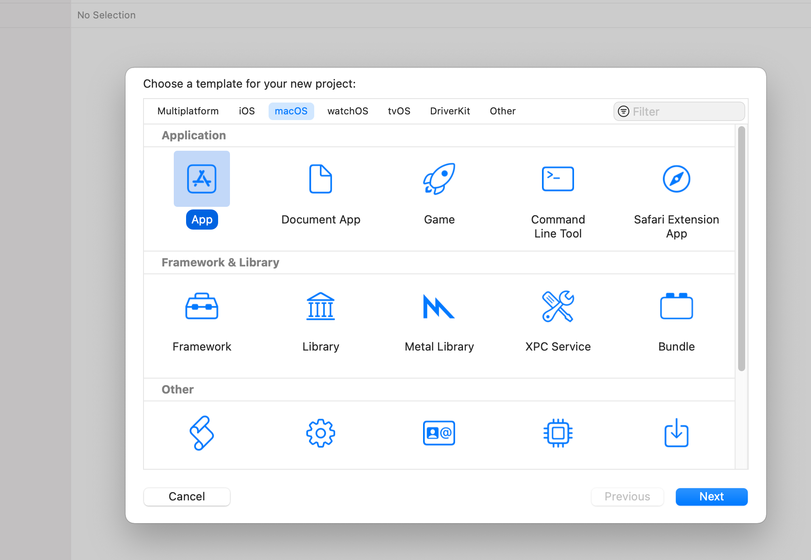
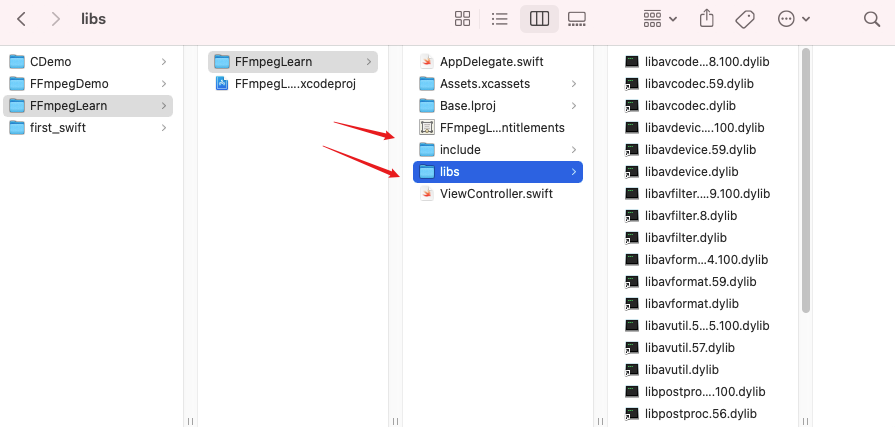
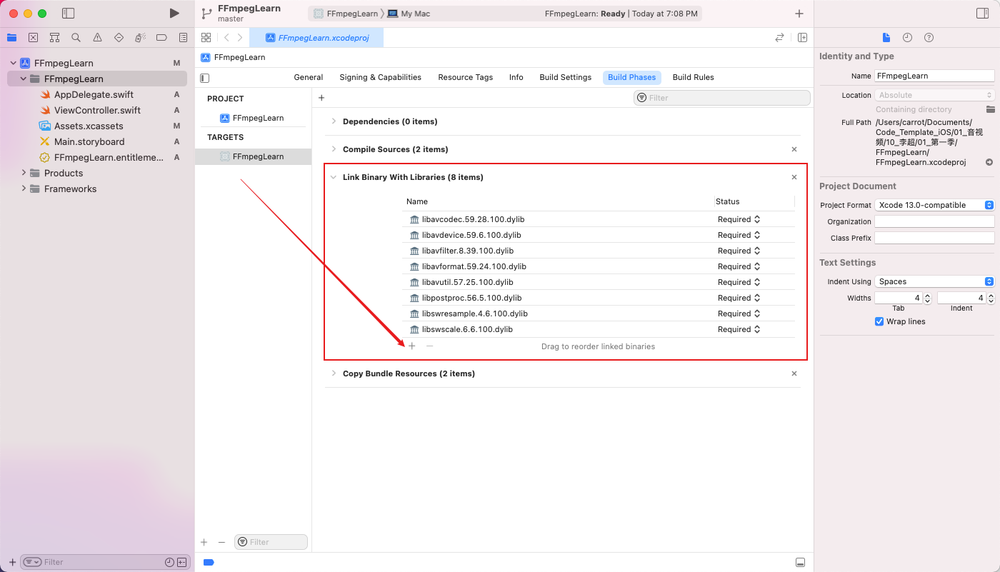
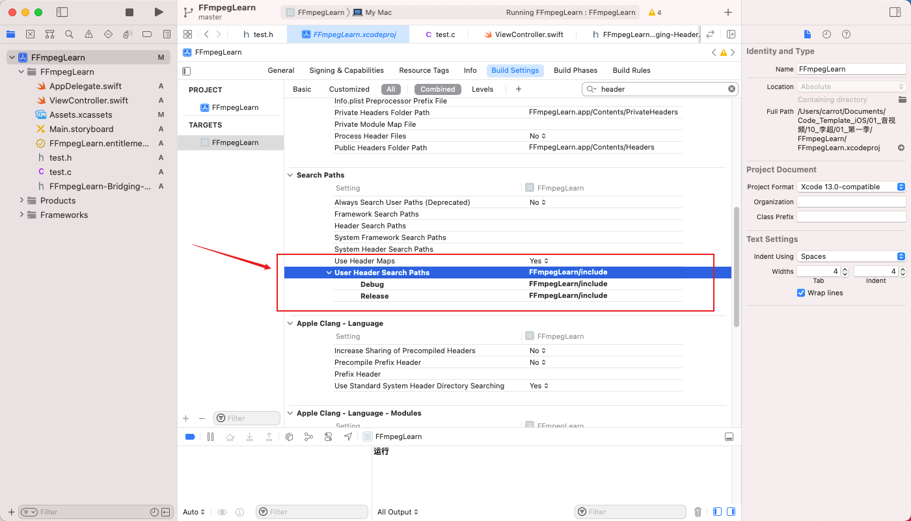
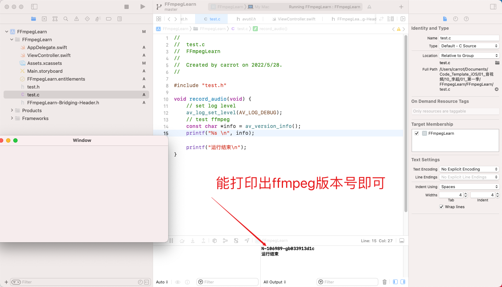
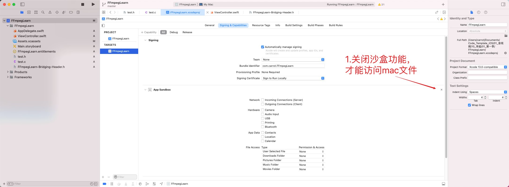

## 一、集成FFmpeg到MacApp项目

### 1、创建一个mac的App应用，语言选择swift。




### 2、将ffmpeg目录下的 `lib` 和 `include` 拷贝到项目中。





### 3、将ffmpeg库引入项目中





### 4、引入ffmpeg头文件




### 5、加入代码测试

- test.h

```C
#ifndef test_h
#define test_h

#include <stdio.h>
#include "include/libavutil/avutil.h"

void record_audio(void);

#endif /* test_h */
```

- test.c

```c
#include "test.h"

void record_audio(void) {
    // set log level
    av_log_set_level(AV_LOG_DEBUG);
    // test ffmpeg
    const char *info = av_version_info();
    printf("%s \n", info);
    
    printf("运行结束\n");
}
```

- ViewController.swift

```swift
import Cocoa

class ViewController: NSViewController {

    override func viewDidLoad() {
        super.viewDidLoad()

        // Do any additional setup after loading the view.
        self.startRecordAudio();
    }

    override var representedObject: Any? {
        didSet {
        // Update the view, if already loaded.
        }
    }

    @objc func startRecordAudio() {
        record_audio()
    }
}
```

- FFmpegLearn-Bridging-Header.h 桥接c和swift的文件

```C
#import "test.h"
```

- 打印出ffmpeg版本号




## 二、通过代码采集音频

### 1、如何通过ffmpeg命令采集音频？

```shell
ffmpeg -f avfoundation -i :0 out.wav
ffplay out.wav
```


### 2、通过ffmpeg代码采集音频的关键三个步骤是什么？

- ```sh
  # 注册所有设备
  avdevice_register_all(); 
  ```

- ```sh
  # 打开指定设备
  ret = avformat_open_input(&fmt_ctx, devicename, iformat, &options);
  ```

- ```sh
  # 循环从打开设备的上下文中读取数据
  while ((ret = av_read_frame(fmt_ctx, &pkt)) == 0)
  ```


### 3、在通过写代码采集音频之前，需要对macApp项目做如下两个配置

- 关闭沙箱`App Sanbox`功能，才能读取mac本地目录
- 在 `info.plist` 文件夹中，配置麦克风访问权限说明，才能打开麦克风




### 4、完整代码

```c
#include "test.h"
#include <unistd.h>
#include "include/libavutil/avutil.h"
#include "include/libavdevice/avdevice.h"
#include "include/libavcodec/avcodec.h"

void record_audio(void) {
    int ret = 0;
    char errors[1024];
    
    //ctx
    AVFormatContext *fmt_ctx = NULL;
    AVDictionary *options = NULL;
    
    //packet
    int count = 0;
    AVPacket pkt;
    
    // [video device]:[aduio device]
    char *devicename = ":0";
    
    //register audio device
    avdevice_register_all();
    
    //get format
    const AVInputFormat *iformat = av_find_input_format("avfoundation");
    
    //open device
    ret = avformat_open_input(&fmt_ctx, devicename, iformat, &options);
    if (ret < 0) {
        av_strerror(ret, errors, 1024);
        printf("avformat_open_input error");
        return;
    }
    
    //crate file
    char *outPath = "/Users/carrot/Desktop/MyCode/audio.pcm";
    FILE *outFile = fopen(outPath, "wb+");
    if (outFile == NULL) {
        printf("outFile fopen failed");
        return;
    }
    
    //read data from device
    while ((ret = av_read_frame(fmt_ctx, &pkt)) == 0 || count++ < 50000) {
        usleep(100);
        printf("ret %d", ret);
        if (pkt.size > 0) {
            fwrite(pkt.data, pkt.size, 1, outFile);
            fflush(outFile);
            printf("packet size is %d(%p), count=%d \n", pkt.size, pkt.data, count);
            av_packet_unref(&pkt);
        }
    }
    
    //close device and release ctx
    avformat_close_input(&fmt_ctx);
    
    printf("运行结束\n");
}
```


### 5、播放录制的pcm文件(MacBook Pro (Retina, 15-inch, Mid 2015))

```c
ffplay -ar 44100 -f f32le -ac 2 audio.pcm 
```

