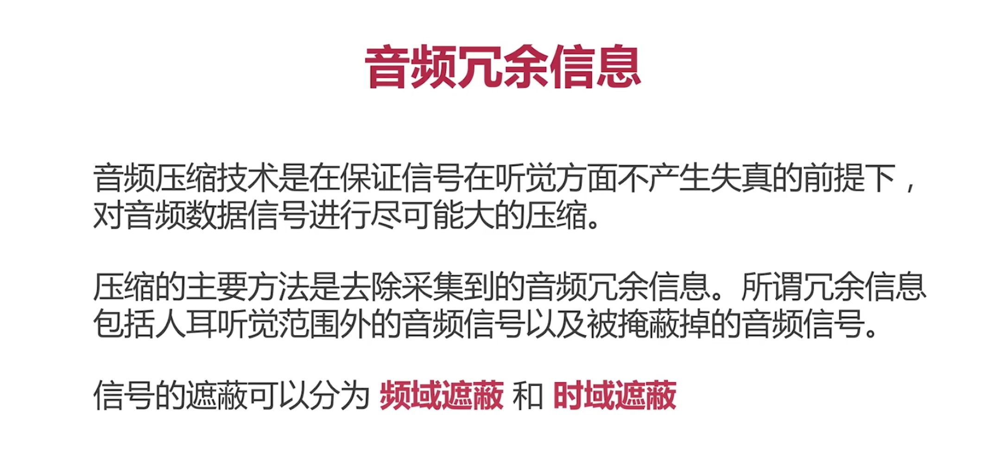
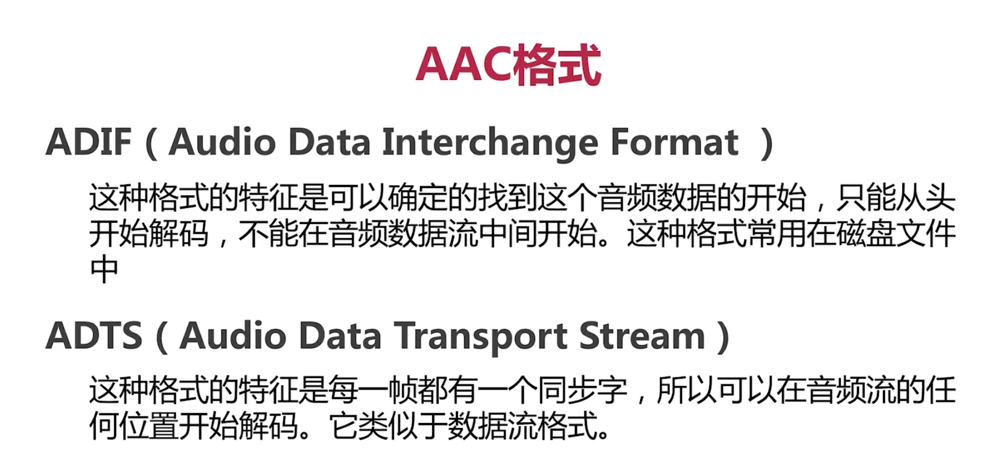
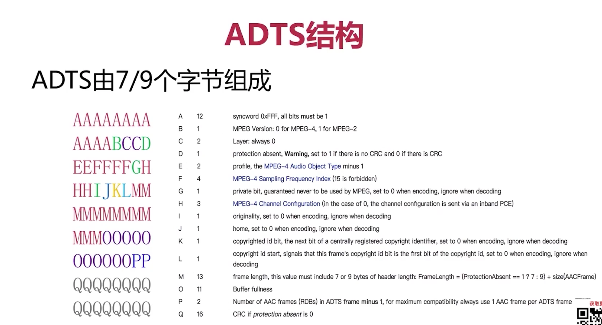
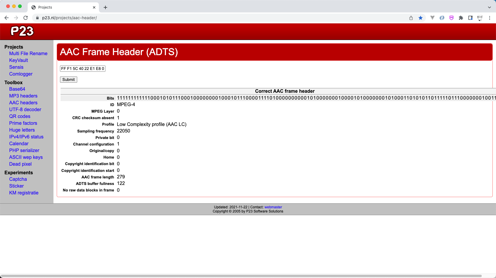

## 一、音频编码理论基础

### 1、音频`有损压缩`主要从哪些方面进行压缩？

- 时域遮蔽、频域遮蔽



### 2、音频`无损压缩`有哪些有名的算法？

- 哈夫曼算法
- 香农算法


### 3、常见的音频编码器？（例举三个）

- AAC：在直播系统中应用比较广泛
- OPUS：是较新的音频编码器，WebRTC默认使用OPUS
- G.711：一般在固话中使用


### 4、AAC有哪三种常见规格，简单描述下？

- AAC LC：<font color="red">(Low Complexity)</font> 低复杂度规格，<font color="blue">码流是128k左右</font>，音质好。
- AAC HE：<font color="red">等于 AAC LC + SBR(Spectral Band Replication)</font>。其核心思想是按频谱保存。低频编码保存主要成分，高频单独放大编码保存音质。<font color="blue">码流在64k左右</font>。
- AAC HE V2：等于<font color="red">AAC LC + SBR + PS(Parametric Stereo)</font>。其核心思想是双声道中的声音才在某种相似性，只需要存储一个声道的全部信息，然后花很少的字节用参数描述另一个声道和它不同的地方。<font color="blue">码流在48k左右。</font>


### 5、AAC保存数据有两种格式，分别是什么？

- ADIF
- ADTS




### 6、ADTS结构详解？



### 7、通过ffmpeg命令生成aa文件

```sh
ffmpeg -i raw_xxx.mp4 -vn -c:a libfdk_aac -ar 44100 -channels 2 -profile:a aac_he dst_xxx.aac
```


### 8、借助网站分析生成的aac文件

- https://www.p23.nl/projects/aac-header/



